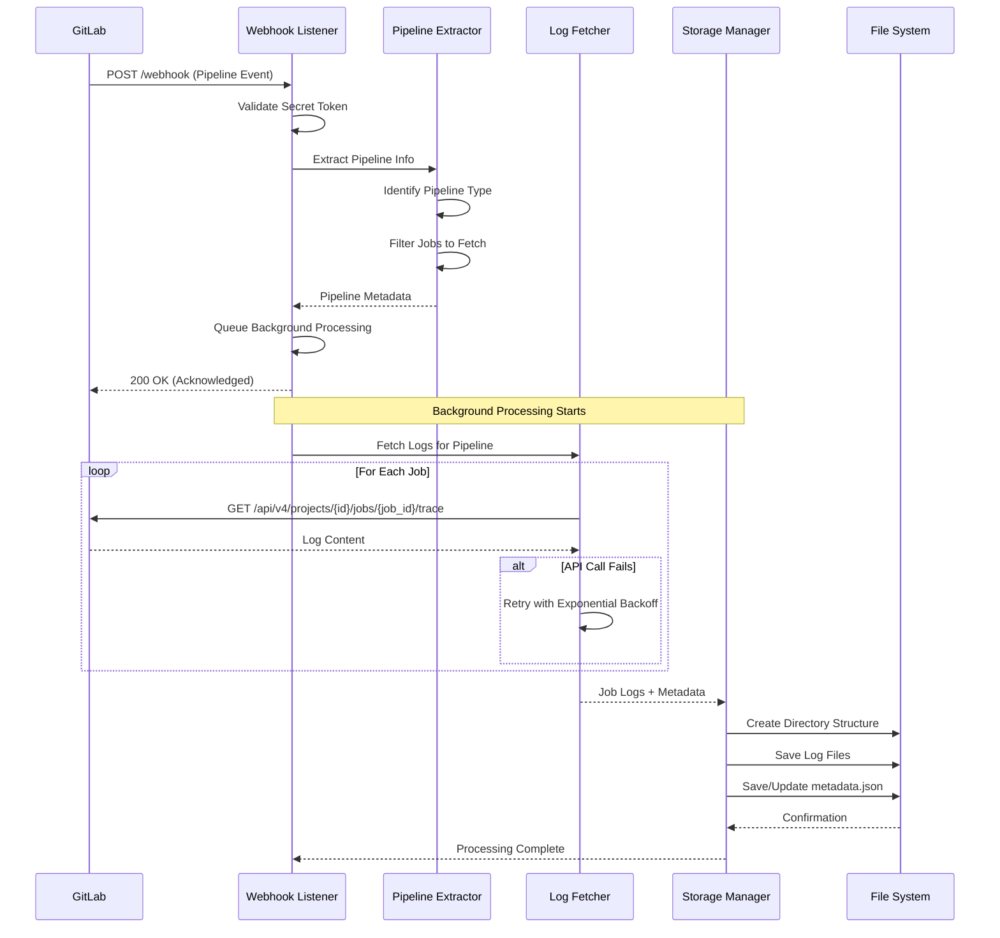
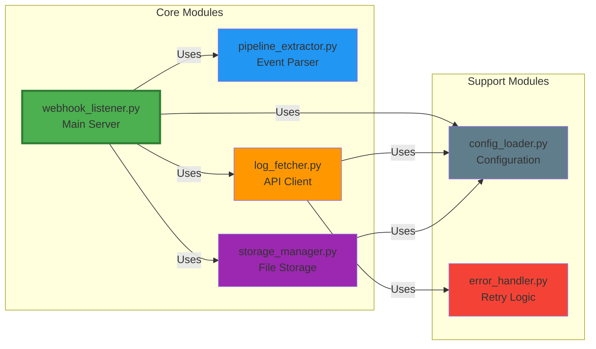

# GitLab Pipeline Log Extraction System

A production-ready webhook server that automatically extracts and stores GitLab pipeline logs with comprehensive error handling, retry logic, and structured metadata.

## 📋 Table of Contents

- [Overview](#overview)
- [Architecture](#architecture)
  - [System Architecture Diagram](#system-architecture-diagram)
  - [Data Flow Diagram](#data-flow-diagram)
- [Features](#features)
- [Project Structure](#project-structure)
  - [Directory Structure After Processing](#directory-structure-after-processing)
- [Module Documentation](#module-documentation)
  - [Module Connection Diagram](#module-connection-diagram)
  - [Files & Folder Structure](#files--folder-structure)
  - [Module Functions & Data Flow](#module-functions--data-flow)
- [Data Flow](#data-flow)
  - [Complete Event Processing Flow](#complete-event-processing-flow)
  - [Data Transformations](#data-transformations)
- [Installation](#installation)
  - [Prerequisites](#prerequisites)
  - [Step-by-Step Setup](#step-by-step-setup)
- [Configuration](#configuration)
  - [Environment Variables](#environment-variables)
  - [GitLab Webhook Setup](#gitlab-webhook-setup)
- [Usage](#usage)
  - [Start the Server](#start-the-server)
  - [Verify Server is Running](#verify-server-is-running)
  - [Access API Documentation](#access-api-documentation)
  - [Monitor Logs](#monitor-logs)
  - [View Storage Statistics](#view-storage-statistics)
- [Monitoring & Tracking](#monitoring--tracking)
  - [Quick Start](#quick-start-1)
  - [What is Tracked](#what-is-tracked)
  - [Monitoring API Endpoints](#monitoring-api-endpoints)
  - [Database Location](#database-location)
- [API Documentation](#api-documentation)
  - [Webhook Events](#webhook-events)
  - [Health & Stats Endpoints](#health--stats-endpoints)
- [Testing](#testing)
  - [Run All Tests](#run-all-tests)
  - [Manual Testing](#manual-testing-1)
- [Troubleshooting](#troubleshooting)
  - [Common Problems](#common-problems)
  - [Getting Help](#getting-help)
- [Development](#development)
- [Contributing](#contributing)

## 🎯 Overview

This system provides a complete solution for:
- Receiving GitLab webhook events for pipeline completion
- Automatically extracting logs from all pipeline jobs
- Storing logs with structured metadata for easy retrieval
- Handling failures with exponential backoff retry logic
- Supporting multiple pipeline types (main, child, merge request)

## 🏗️ Architecture

### System Architecture Diagram


### Data Flow Diagram



## ✨ Features

- **Modern Async Server**: FastAPI-based async server with automatic API documentation
- **Interactive API Docs**: Automatic Swagger UI and ReDoc documentation at `/docs` and `/redoc`
- **Event Processing**: Identifies and processes different pipeline types (main, child, merge request)
- **Smart Filtering**: Only processes completed pipelines (success/failed)
- **Log Extraction**: Fetches logs for all jobs in a pipeline via GitLab API
- **Error Handling**:
  - Automatic retry with exponential backoff
  - Circuit breaker pattern for cascade failure prevention
  - Comprehensive error logging
- **Structured Storage**: Organized directory structure with metadata files
- **Security**: Optional webhook secret token validation
- **Background Processing**: Non-blocking webhook responses with FastAPI BackgroundTasks
- **Health Monitoring**: Health check and statistics endpoints
- **High Performance**: Async/await support for better concurrency

## 📁 Project Structure

```
extract-build-logs/
│
├── src/                          # Main application code
│   ├── __init__.py              # Package initialization
│   ├── webhook_listener.py     # FastAPI server and main entry point
│   ├── pipeline_extractor.py   # Pipeline event parsing and analysis
│   ├── log_fetcher.py           # GitLab API client for log retrieval
│   ├── storage_manager.py       # File system storage management
│   ├── config_loader.py         # Configuration and environment variables
│   └── error_handler.py         # Retry logic and error handling
│
├── tests/                        # Test suite
│   ├── __init__.py
│   ├── test_pipeline_extractor.py
│   ├── test_storage_manager.py
│   └── test_error_handler.py
│
├── logs/                         # Output directory for extracted logs
│   └── project_{id}/            # Organized by project
│       └── pipeline_{id}/       # Then by pipeline
│           ├── metadata.json    # Pipeline and job metadata
│           └── job_{id}_{name}.log  # Individual job logs
│
├── config/                       # Configuration templates
│   └── webhook_setup.md         # GitLab webhook setup guide
│
├── .env.example                  # Environment variable template
├── requirements.txt              # Python dependencies
├── .gitignore                    # Git ignore rules
└── README.md                     # This file
```

### Directory Structure After Processing

```
logs/
├── project_123/
│   ├── pipeline_789/
│   │   ├── metadata.json
│   │   ├── job_456_build.log
│   │   ├── job_457_test_unit.log
│   │   └── job_458_deploy_production.log
│   └── pipeline_790/
│       ├── metadata.json
│       └── job_459_build.log
└── project_124/
    └── pipeline_791/
        ├── metadata.json
        └── job_460_test.log
```

## 📚 Module Documentation

### Module Connection Diagram



### Files & Folder Structure

#### Core Application Files

| File | Purpose | Key Responsibilities |
|------|---------|---------------------|
| `src/webhook_listener.py` | Main server entry point | - FastAPI async web server<br>- Webhook endpoint handling<br>- Background task processing<br>- Health & stats endpoints |
| `src/pipeline_extractor.py` | Event parsing | - Parse webhook payloads<br>- Identify pipeline types<br>- Filter jobs to process<br>- Generate summaries |
| `src/log_fetcher.py` | GitLab API client | - Fetch job logs<br>- Retrieve job/pipeline metadata<br>- Handle API authentication<br>- Manage API rate limits |
| `src/storage_manager.py` | File system storage | - Create directory structures<br>- Save log files<br>- Manage metadata<br>- Storage statistics |
| `src/config_loader.py` | Configuration management | - Load environment variables<br>- Validate settings<br>- Provide defaults<br>- Configuration object |
| `src/error_handler.py` | Error handling & retry | - Exponential backoff retry<br>- Circuit breaker pattern<br>- Custom exceptions<br>- Decorator utilities |

#### Test Files

| File | Tests For | Coverage |
|------|-----------|----------|
| `tests/test_pipeline_extractor.py` | Pipeline extraction logic | - Type identification<br>- Job filtering<br>- Summary generation |
| `tests/test_storage_manager.py` | Storage operations | - File creation<br>- Metadata handling<br>- Statistics |
| `tests/test_error_handler.py` | Error handling | - Retry logic<br>- Backoff calculation<br>- Circuit breaker |

### Module Functions & Data Flow

#### 1. webhook_listener.py (Main Server)

**Purpose**: Receives webhooks and orchestrates log extraction

**Key Functions**:

```python
def init_app():
    """
    Initialize all application components.

    Data Flow: Environment → ConfigLoader → Component Initialization
    """

async def webhook_handler():
    """
    Process incoming webhook POST requests.

    Input: FastAPI Request with GitLab webhook payload
    Output: JSON response (200/401/400/500)

    Data Flow:
    Request → Validate Token → Extract Pipeline Info →
    Queue Processing → Return Response
    """

def process_pipeline_event(pipeline_info: Dict):
    """
    Background processing of pipeline logs.

    Input: Extracted pipeline information
    Output: Saved logs and metadata

    Data Flow:
    Pipeline Info → Fetch Jobs → For Each Job:
    (Fetch Log → Save Log) → Update Metadata
    """
```

**Dependencies**:
- `config_loader.Config`: Application configuration
- `pipeline_extractor.PipelineExtractor`: Event parsing
- `log_fetcher.LogFetcher`: API interactions
- `storage_manager.StorageManager`: File operations

#### 2. pipeline_extractor.py (Event Parser)

**Purpose**: Analyzes webhook events and identifies what to process

**Key Functions**:

```python
def extract_pipeline_info(webhook_payload: Dict) -> Dict:
    """
    Extract structured information from webhook.

    Input: Raw GitLab webhook JSON payload
    Output: Structured pipeline metadata dictionary

    Data Flow:
    Webhook JSON → Parse Attributes → Determine Type →
    Extract Jobs → Build Info Dictionary

    Output Format:
    {
        "pipeline_id": int,
        "project_id": int,
        "pipeline_type": str,  # main/child/merge_request
        "status": str,
        "builds": List[Dict]
    }
    """

def should_process_pipeline(pipeline_info: Dict) -> bool:
    """
    Business logic: determine if logs should be fetched.

    Input: Pipeline information
    Output: Boolean decision

    Logic:
    - Process if status in ["success", "failed"]
    - Skip if status in ["running", "pending"]
    """
```

**Dependencies**: None (pure logic)

#### 3. log_fetcher.py (API Client)

**Purpose**: Communicates with GitLab API to retrieve logs

**Key Functions**:

```python
@retry_on_failure(max_retries=3)
def fetch_job_log(project_id: int, job_id: int) -> str:
    """
    Fetch log content for specific job.

    Input: Project ID, Job ID
    Output: Raw log text

    API Call:
    GET /api/v4/projects/{project_id}/jobs/{job_id}/trace

    Error Handling:
    - 404: Return "[Log not available]"
    - 401/403: Raise authentication error
    - Other: Retry with exponential backoff
    """

def fetch_all_logs_for_pipeline(project_id: int,
                                 pipeline_id: int) -> Dict:
    """
    Fetch all logs for a pipeline.

    Input: Project ID, Pipeline ID
    Output: Dictionary mapping job_id to {details, log}

    Data Flow:
    Fetch Job List → For Each Job:
    (Fetch Details + Fetch Log) → Combine Results
    """
```

**Dependencies**:
- `config_loader.Config`: GitLab URL and token
- `error_handler.retry_on_failure`: Automatic retry

#### 4. storage_manager.py (File Storage)

**Purpose**: Persists logs and metadata to disk

**Key Functions**:

```python
def save_log(project_id: int, pipeline_id: int,
             job_id: int, job_name: str,
             log_content: str, job_details: Dict) -> Path:
    """
    Save job log to file system.

    Input: IDs, job name, log content, metadata
    Output: Path to saved file

    Data Flow:
    Create Pipeline Dir → Sanitize Filename →
    Write Log File → Update Metadata

    File Path:
    logs/project_{id}/pipeline_{id}/job_{id}_{name}.log
    """

def get_storage_stats() -> Dict:
    """
    Calculate storage statistics.

    Output:
    {
        "total_projects": int,
        "total_pipelines": int,
        "total_jobs": int,
        "total_size_mb": float
    }
    """
```

**Dependencies**: None (pure I/O)

#### 5. config_loader.py (Configuration)

**Purpose**: Centralized configuration management

**Key Functions**:

```python
@staticmethod
def load() -> Config:
    """
    Load configuration from environment.

    Input: Environment variables
    Output: Config dataclass object

    Required:
    - GITLAB_URL
    - GITLAB_TOKEN

    Optional (with defaults):
    - WEBHOOK_PORT (8000)
    - LOG_OUTPUT_DIR (./logs)
    - RETRY_ATTEMPTS (3)
    """
```

**Dependencies**: None

#### 6. error_handler.py (Retry Logic)

**Purpose**: Robust error handling with retries

**Key Functions**:

```python
def retry_with_backoff(func: Callable, *args, **kwargs) -> Any:
    """
    Execute function with exponential backoff retry.

    Input: Function to execute + arguments
    Output: Function result or RetryExhaustedError

    Retry Strategy:
    Attempt 1: Immediate
    Attempt 2: Wait base_delay (2s)
    Attempt 3: Wait base_delay * 2 (4s)
    Attempt 4: Wait base_delay * 4 (8s)
    """

@decorator
def retry_on_failure(max_retries=3, base_delay=2.0):
    """
    Decorator for automatic retry.

    Usage:
    @retry_on_failure(max_retries=3)
    def my_function():
        # May fail transiently
        pass
    """
```

**Dependencies**: None

## 🔄 Data Flow

### Complete Event Processing Flow


### Data Transformations

```
GitLab Webhook Payload
         ↓
pipeline_extractor.extract_pipeline_info()
         ↓
Structured Pipeline Info
{
  pipeline_id: 789,
  project_id: 123,
  pipeline_type: "main",
  status: "success",
  builds: [...]
}
         ↓
log_fetcher.fetch_all_logs_for_pipeline()
         ↓
Logs Dictionary
{
  456: {
    details: {name: "build", status: "success"},
    log: "Build started...\nBuild complete"
  }
}
         ↓
storage_manager.save_log()
         ↓
File System
logs/project_123/pipeline_789/job_456_build.log
logs/project_123/pipeline_789/metadata.json
```

## 🚀 Installation

### Prerequisites

- Python 3.8 or higher
- GitLab instance (GitLab.com or self-hosted)
- GitLab Personal Access Token with `api` scope
- Network connectivity to GitLab API

### Step 1: Clone Repository

```bash
git clone <repository-url>
cd extract-build-logs
```

### Step 2: Create Virtual Environment

```bash
# Create virtual environment
python3 -m venv venv

# Activate virtual environment
# On Linux/Mac:
source venv/bin/activate
# On Windows:
venv\Scripts\activate
```

### Step 3: Install Dependencies

```bash
pip install -r requirements.txt
```

### Step 4: Configure Environment

```bash
# Copy environment template
cp .env.example .env

# Edit .env with your settings
nano .env  # or your preferred editor
```

### Step 5: Create GitLab Access Token

1. Go to GitLab → Profile → Access Tokens
2. Create a new token with `api` scope
3. Copy the token and add it to `.env`

## ⚙️ Configuration

### Environment Variables

Edit `.env` file:

```bash
# Required
GITLAB_URL=https://gitlab.com
GITLAB_TOKEN=your_gitlab_token_here

# Optional
WEBHOOK_PORT=8000
WEBHOOK_SECRET=your_webhook_secret
LOG_OUTPUT_DIR=./logs
RETRY_ATTEMPTS=3
RETRY_DELAY=2
LOG_LEVEL=INFO
```

### GitLab Webhook Setup

1. Navigate to your GitLab project
2. Go to **Settings → Webhooks**
3. Add webhook URL: `http://your-server:8000/webhook`
4. Set secret token (same as `WEBHOOK_SECRET` in `.env`)
5. Enable **Pipeline events** only
6. Click **Add webhook**
7. Test with **Test → Pipeline events**

See [config/webhook_setup.md](config/webhook_setup.md) for detailed instructions.

## 📖 Usage

### Start the Server

```bash
# Method 1: Using the main script (recommended)
python src/webhook_listener.py

# Method 2: Using uvicorn directly (more control)
uvicorn src.webhook_listener:app --host 0.0.0.0 --port 8000

# Method 3: With auto-reload for development
uvicorn src.webhook_listener:app --reload --host 0.0.0.0 --port 8000
```

### Verify Server is Running

```bash
# Check health endpoint
curl http://localhost:8000/health

# Expected response:
# {"status":"healthy","service":"gitlab-log-extractor","version":"1.0.0"}
```

### Access API Documentation

FastAPI automatically generates interactive API documentation:

```bash
# Swagger UI (interactive)
http://localhost:8000/docs

# ReDoc (alternative documentation)
http://localhost:8000/redoc
```

### Monitor Logs

```bash
# Watch server logs
tail -f webhook_server.log

# Watch extracted logs directory
watch -n 5 'ls -lah logs/'
```

### View Storage Statistics

```bash
curl http://localhost:8000/stats
```

## 📊 Monitoring & Tracking

The system automatically tracks **every webhook request** and processing status. See [OPERATIONS.md](OPERATIONS.md) (Part 2: Monitoring & Tracking) for complete documentation.

### Quick Start

```bash
# View monitoring dashboard
python monitor_dashboard.py

# Show recent 100 requests
python monitor_dashboard.py --recent 100

# Export to CSV
python monitor_dashboard.py --export pipeline_data.csv
```

### What is Tracked

- ✅ Total requests received
- ✅ Processing status (queued, processing, completed, failed, skipped)
- ✅ Success/failure rates
- ✅ Processing times
- ✅ Job counts per pipeline
- ✅ Error messages
- ✅ Pipeline types

### Monitoring API Endpoints

```bash
# Get summary statistics
curl http://localhost:8000/monitor/summary?hours=24

# Get recent requests
curl http://localhost:8000/monitor/recent?limit=50

# Get specific pipeline details
curl http://localhost:8000/monitor/pipeline/12345

# Download CSV export
curl -O http://localhost:8000/monitor/export/csv?hours=24
```

### Database Location

All monitoring data is stored in: `logs/monitoring.db`

You can query it directly with SQL or use the provided CLI dashboard.

**For complete debugging, monitoring documentation, and examples, see [OPERATIONS.md](OPERATIONS.md)**

## 📡 API Documentation

### Webhook Events

#### POST /webhook

Receives GitLab pipeline webhook events.

**Headers**:
- `X-Gitlab-Event`: Event type (must be "Pipeline Hook")
- `X-Gitlab-Token`: Webhook secret token
- `Content-Type`: application/json

**Request Body**: GitLab pipeline webhook payload

**Responses**:
- `200 OK`: Successfully processed or queued
- `400 Bad Request`: Invalid JSON payload
- `401 Unauthorized`: Invalid secret token
- `500 Internal Server Error`: Processing error

**Example Response**:
```json
{
  "status": "success",
  "message": "Pipeline logs queued for extraction",
  "pipeline_id": 12345,
  "project_id": 123
}
```

#### GET /health

Health check endpoint.

**Response**:
```json
{
  "status": "healthy",
  "service": "gitlab-log-extractor",
  "version": "1.0.0"
}
```

#### GET /stats

Get storage statistics.

**Response**:
```json
{
  "total_projects": 5,
  "total_pipelines": 23,
  "total_jobs": 156,
  "total_size_bytes": 45678901,
  "total_size_mb": 43.56
}
```

## 🧪 Testing

### Run All Tests

```bash
# Run tests with pytest
pytest tests/

# Run with coverage
pytest --cov=src tests/

# Run specific test file
pytest tests/test_pipeline_extractor.py

# Run with verbose output
pytest -v tests/
```

### Manual Testing

```bash
# Test webhook endpoint with curl
curl -X POST http://localhost:8000/webhook \
  -H "Content-Type: application/json" \
  -H "X-Gitlab-Event: Pipeline Hook" \
  -H "X-Gitlab-Token: your_secret" \
  -d '{"object_kind":"pipeline","object_attributes":{"id":123,"status":"success"}}'
```

## 🔧 Troubleshooting

### Server Won't Start

**Problem**: Port already in use

**Solution**:
```bash
# Check what's using the port
lsof -i :8000

# Kill the process or change WEBHOOK_PORT in .env
```

### Webhook Returns 401

**Problem**: Secret token mismatch

**Solution**:
- Verify `WEBHOOK_SECRET` in `.env` matches GitLab webhook secret
- Check for extra spaces or newlines

### Logs Not Being Saved

**Problem**: Permission denied

**Solution**:
```bash
# Check directory permissions
ls -la logs/

# Create directory with proper permissions
mkdir -p logs
chmod 755 logs
```

### API Calls Failing

**Problem**: Invalid GitLab token

**Solution**:
- Verify token has `api` scope
- Check token hasn't expired
- Ensure `GITLAB_URL` is correct

## 📝 Development

### Adding New Features

1. Create new module in `src/`
2. Add tests in `tests/`
3. Update module documentation in README
4. Update architecture diagrams if needed

## 🤝 Contributing

1. Fork the repository
2. Create feature branch
3. Commit changes
4. Push to branch
5. Open Pull Request

---

**Built with ❤️ for reliable GitLab pipeline log extraction**