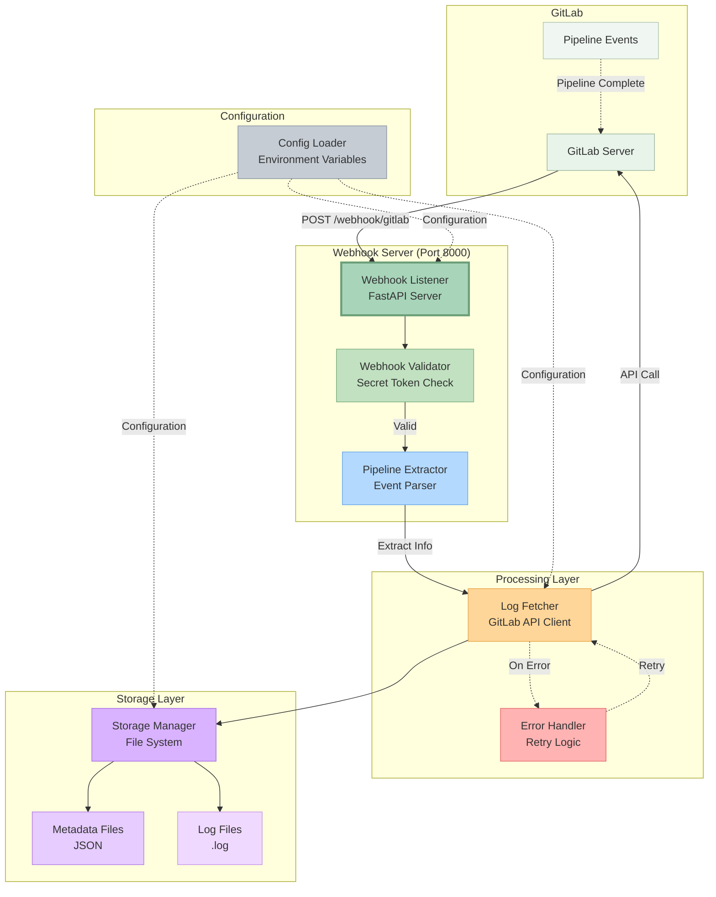
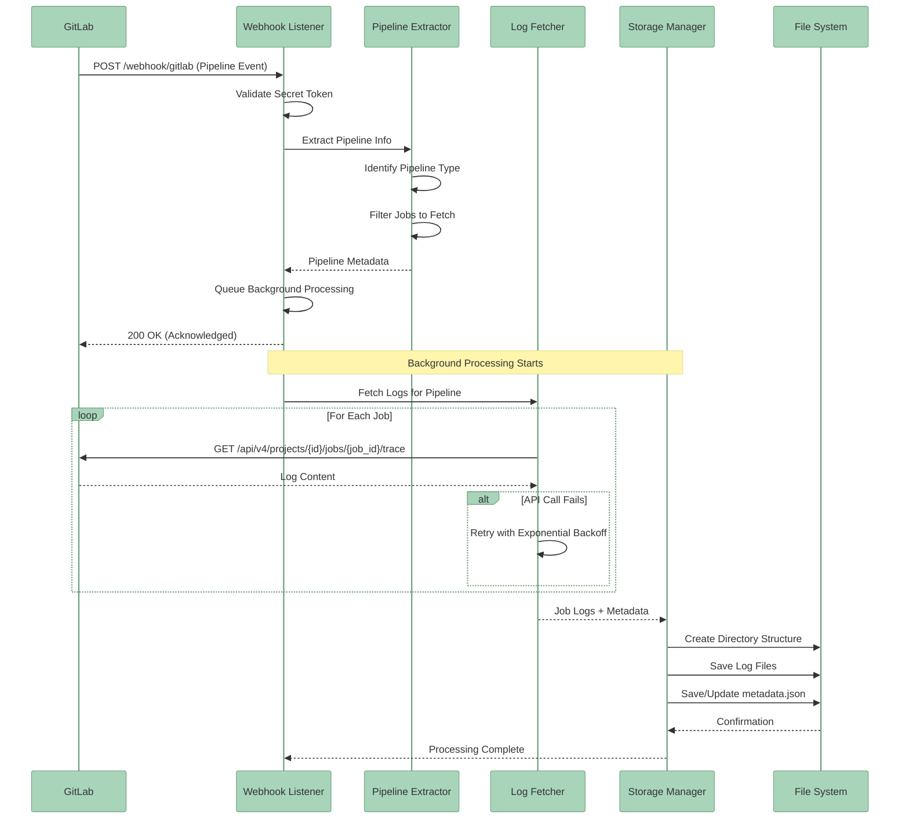

# GitLab & Jenkins Pipeline Log Extraction System

A production-ready webhook server that automatically extracts and stores pipeline logs from GitLab and Jenkins with comprehensive error handling, retry logic, and structured metadata. Supports parallel execution blocks and API posting.

## Table of Contents

- [Overview](#overview)
- [Architecture](#architecture)
  - [System Architecture Diagram](#system-architecture-diagram)
  - [Data Flow Diagram](#data-flow-diagram)
- [Quick Setup](#quick-setup)
  - [Prerequisites](#prerequisites)
  - [Docker Deployment (Recommended)](#docker-deployment-recommended)
  - [Manual Installation](#manual-installation)
- [Configuration](#configuration)
- [Complete Documentation](#complete-documentation)

## Overview

This system provides a complete solution for:
- **GitLab Integration**: Receiving webhook events for pipeline completion
- **Jenkins Integration**: Extracting build logs with parallel stage support
- Automatically extracting logs from all pipeline jobs/stages
- **API Posting**: Send structured logs to external API endpoints
- Storing logs with structured metadata for easy retrieval
- Handling failures with exponential backoff retry logic
- Supporting multiple pipeline types (main, child, merge request)
- **Parallel Execution**: Parse and extract parallel stage logs (Jenkins)

**Key Benefits:**
- Production-ready with Docker containerization
- Comprehensive monitoring and tracking
- Advanced logging with request ID correlation
- Flexible log filtering (by status, project, job)
- Dual-mode storage (API + files or either)
- Automatic retry and error handling

## Recent Improvements (January 2026)

### Jenkins Log Extraction Enhancements

**Memory-Efficient Large Log Handling:**
- **Tail + Streaming approach** for processing million+ line logs without memory overflow
- **Hybrid fetching strategy**: Tries tail first (fast, 99% of cases), falls back to streaming if needed
- **Configurable limits**: `MAX_LOG_LINES`, `TAIL_LOG_LINES`, `STREAM_CHUNK_SIZE`
- **Safety guarantees**: Prevents OOM crashes on massive builds

**Performance Optimizations:**
- **Eliminated per-stage API calls**: Removed 7+ failing HTTP requests per build
- **Simplified stage processing**: Direct use of full console log with error extraction
- **68% code reduction**: From 112 lines to 36 lines in core processing logic
- **Faster processing**: Removed failed marker extraction and complex fallback chains

**Configuration Example:**
```bash
# Memory-efficient log handling (optional, has sensible defaults)
MAX_LOG_LINES=100000        # Maximum lines to process
TAIL_LOG_LINES=5000         # Tail lines to try first
STREAM_CHUNK_SIZE=8192      # Streaming chunk size in bytes
```

## Architecture

### System Architecture Diagram



### Data Flow Diagram



## Quick Setup

### Prerequisites

- **Python 3.8+** or **Docker** (Docker recommended for production)
- GitLab instance (GitLab.com)
- GitLab Personal Access Token with `api` scope

### Docker Deployment (Recommended)

**1. Create configuration file:**
```bash
cp .env.example .env
vi .env  # Edit GITLAB_URL and GITLAB_TOKEN
```

**2. Build and start container:**
```bash
./manage_container.py build
./manage_container.py start
```

**3. Verify it's running:**
```bash
./manage_container.py status
curl http://localhost:8000/health
```

Your webhook is now available at: `http://your-server:8000/webhook/gitlab`

**Complete Docker guide:** [DOCUMENTATION.md - Docker Operations](DOCUMENTATION.md#23-docker-operations)

<details>
<summary><b>Manual Installation</b></summary>

**1. Clone and setup:**
```bash
git clone <repository-url>
cd extract-build-logs
python3 -m venv venv
source venv/bin/activate
pip install -r requirements.txt
```

**2. Configure environment:**
```bash
cp .env.example .env
vi .env  # Edit with your settings
```

**3. Start the server:**
```bash
python src/webhook_listener.py
```

**4. Verify:**
```bash
curl http://localhost:8000/health
```

</details>

## Configuration

**Minimum required configuration (.env file):**

```bash
# Required
GITLAB_URL=https://gitlab.com
GITLAB_TOKEN=your_gitlab_token_here

# Optional (with defaults)
WEBHOOK_PORT=8000
WEBHOOK_SECRET=your_webhook_secret
LOG_OUTPUT_DIR=./logs
LOG_LEVEL=INFO
```

**Common configurations:**

**1. Save only failed pipeline logs:**
```bash
LOG_SAVE_PIPELINE_STATUS=failed,canceled
LOG_SAVE_METADATA_ALWAYS=true
```

**2. Enable API posting:**
```bash
BFA_HOST=bfa-server.example.com
BFA_SECRET_KEY=your_bfa_secret_key
API_POST_ENABLED=true
API_POST_SAVE_TO_FILE=false  # API only, no file storage
```

**3. Jenkins integration:**
```bash
JENKINS_ENABLED=true
JENKINS_URL=https://jenkins.example.com
JENKINS_USER=your_username
JENKINS_API_TOKEN=your_jenkins_token
```

## Complete Documentation

For detailed documentation on all features, configuration options, operations, and troubleshooting:

**[→ Read Complete Documentation (DOCUMENTATION.md)](DOCUMENTATION.md)**

### Documentation Sections

| Section | Description |
|---------|-------------|
| **[Features & Capabilities](DOCUMENTATION.md#features)** | Complete feature list with examples |
| **[Module Documentation](DOCUMENTATION.md#module-documentation)** | Detailed module architecture and connections |
| **[Installation & Setup](DOCUMENTATION.md#21-initial-setup)** | Complete installation guide |
| **[Docker Operations](DOCUMENTATION.md#23-docker-operations)** | Full Docker deployment guide |
| **[Configuration Guide](DOCUMENTATION.md#configuration)** | All configuration options explained |
| **[GitLab Webhook Setup](DOCUMENTATION.md#31-webhook-configuration)** | Step-by-step webhook configuration |
| **[Jenkins Integration](DOCUMENTATION.md#4-jenkins-integration)** | Complete Jenkins setup guide |
| **[API Posting](DOCUMENTATION.md#5-api-posting)** | API integration documentation |
| **[Monitoring & Operations](DOCUMENTATION.md#6-operations--monitoring)** | Monitoring, logging, and tracking |
| **[Testing](DOCUMENTATION.md#61-testing)** | Test suite and CI/CD |
| **[Troubleshooting](DOCUMENTATION.md#64-common-issues--solutions)** | Common issues and solutions |
| **[Database Maintenance](DOCUMENTATION.md#7-database-maintenance)** | Backup and maintenance procedures |

---

**Quick Links:**
- [Health Check](http://localhost:8000/health) - Server health status
- [API Docs (Swagger)](http://localhost:8000/docs) - Interactive API documentation
- [Monitoring Dashboard](http://localhost:8000/monitor/summary) - Statistics and metrics
