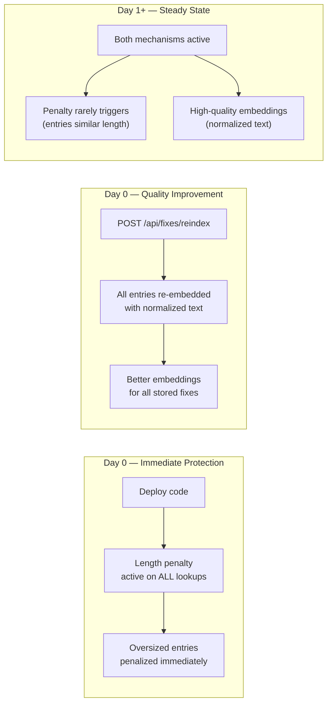
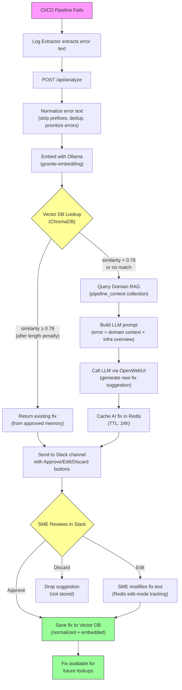
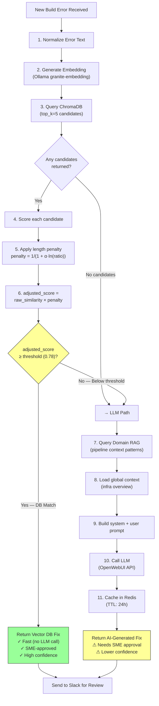

# Build Failure Analyzer (RAG-Powered, Human-in-the-Loop)

The **Build Failure Analyzer (BFA)** is an AI-assisted system that automatically analyzes CI/CD build or pipeline failures, retrieves known fixes using **Retrieval-Augmented Generation (RAG)**, and generates new remediation suggestions when needed.

What makes BFA different is its **self-curating memory**:

- SME-approved fixes are persisted
- Slack is used as a **human-in-the-loop approval layer**
- The system continuously improves without retraining models

---

## Table of Contents

- [High-Level Architecture](#high-level-architecture)
- [RAG Workflow (How It Thinks)](#rag-workflow-how-it-thinks)
- [Key Features](#key-features)
  - [RAG-Based Fix Recommendation](#rag-based-fix-recommendation)
  - [Human-in-the-Loop via Slack](#human-in-the-loop-via-slack)
  - [Continuous Learning](#continuous-learning)
  - [Pipeline Domain Context (RAG Extension)](#pipeline-domain-context-rag-extension)
  - [Securing API with Authentication](#securing-api-with-authentication)
  - [Management Utilities](#management-utilities)
  - [Centralized Logging](#centralized-logging)
- [Project Structure](#project-structure)
- [How It Works](#how-it-works)
  - [Pipeline Log Analysis](#1-pipeline-log-analysis)
  - [Slack Review Workflow](#2-slack-review-workflow)
  - [Systemd Service](#3-created-systemd-service)
- [Authentication & Security](#authentication--security)
- [Slack Error & Fix Handling](#slack-error--fix-handling)
- [Vector Database (RAG Memory)](#vector-database-rag-memory)
- [Enhanced Vector DB — Normalization & Fix Management](#enhanced-vector-db--normalization--fix-management)
  - [Problem: Oversized Error Logs Dominating Matches](#problem-oversized-error-logs-dominating-matches)
  - [Root Cause Analysis](#root-cause-analysis)
  - [Solution 1: Text Normalization](#solution-1-text-normalization-embedding-quality-fix)
  - [Solution 2: Length-Penalized Similarity Scoring](#solution-2-length-penalized-similarity-scoring)
  - [How Normalization and Penalty Work Together](#how-normalization-and-penalty-work-together)
  - [Concrete Examples with Before/After Comparisons](#concrete-examples-with-beforeafter-comparisons)
  - [Vector DB Environment Variables](#vector-db-environment-variables)
  - [Fix Management API](#fix-management-api)
  - [Vector Helper CLI Tool](#vector-helper-cli-tool)
  - [Deployment Steps for Vector DB Enhancements](#deployment-steps-for-vector-db-enhancements)
  - [Architecture Decision: Why Logarithmic Penalty](#architecture-decision-why-logarithmic-penalty)
  - [Tuning Guide for Similarity and Normalization](#tuning-guide-for-similarity-and-normalization)
  - [Monitoring and Observability for Vector DB](#monitoring-and-observability-for-vector-db)
- [Unit Test Coverage](#unit-test-coverage)
  - [Test Categories & Coverage Details](#test-categories--coverage-details)
  - [Testing Philosophy](#testing-philosophy)
  - [Running Tests](#running-tests)
  - [CI/CD Safety](#cicd-safety)
- [Environment Setup](#environment-setup)
- [Running the System](#running-the-system)
- [Tech Stack](#tech-stack)
- [RAG Workflow Diagram](#rag-workflow-diagram)
  - [When Does It Use Vector DB vs LLM?](#when-does-it-use-vector-db-vs-llm)
- [Example Output](#example-output)
- [Configuration & Startup Validation](#configuration--startup-validation)
  - [Required Variables by Mode](#required-variables-by-mode)
  - [Startup Error Example](#startup-error-example)
- [LLM Prompts & Prompt Engineering](#llm-prompts--prompt-engineering)
  - [System Prompt (Build Error Analysis)](#system-prompt-build-error-analysis)
  - [Fine-Tuning the Prompts](#fine-tuning-the-prompts)
  - [Domain Context Patterns](#domain-context-patterns-contextdomain_context_patternsjson)
- [Script Usage Reference](#script-usage-reference)
  - [scripts/vector_helper.py — Vector DB Management CLI](#scriptsvector_helperpy--vector-db-management-cli)
  - [scripts/jwt_dmz_issuer.py — JWT Token Generator (DMZ-side)](#scriptsjwt_dmz_issuerpy--jwt-token-generator-dmz-side)
  - [scripts/jwt_sign_helper.py — JWT Token Generator (Corp-side)](#scriptsjwt_sign_helperpy--jwt-token-generator-corp-side)
- [API Reference](#api-reference)
  - [Build Analysis](#build-analysis)
  - [Fix Management](#fix-management)
  - [Slack Integration](#slack-integration)
  - [Health & Diagnostics](#health--diagnostics)
- [Fine-Tuning Guide](#fine-tuning-guide)
  - [Similarity Threshold Tuning](#similarity-threshold-tuning)
  - [Length Penalty Alpha Tuning](#length-penalty-alpha-tuning)
  - [Normalization Tuning](#normalization-tuning)
  - [LLM Tuning](#llm-tuning)
- [Future Enhancements](#future-enhancements)
- [Summary](#summary)

---

## High-Level Architecture

BFA combines:

- **Vector search (ChromaDB)** for known error -> fix pairs
- **LLM reasoning (CrewAI + Ollama)** when no good match exists
- **Slack workflows** for SME approval
- **JWT-secured APIs** for CI/CD agents
- **RAG domain context** for pipeline-specific heuristics
- **Centralized logging** with sensitive data masking and request correlation

This results in **fast, explainable, and consistent fixes** with controlled learning.

---

## RAG Workflow (How It Thinks)

### Retrieve

When a build error occurs:

- Error text is embedded
- Vector DB (Chroma) is queried
- If similarity >= threshold -> reuse approved fix

### Augment

If no match (or low confidence):

- Domain-specific context (pipeline patterns) is retrieved
- Context + error is passed to LLM prompt
- SME-safe prompt structure is enforced

### Generate

- LLM generates a suggested fix
- Suggestion is sent to Slack
- SME can **Approve**, **Edit**, or **Discard**

Approved fixes are **stored back into the vector DB**.
The system gets smarter every time.

---

## Key Features

### RAG-Based Fix Recommendation

- ChromaDB vector search with embeddings
- Threshold-based similarity filtering
- Deterministic retrieval before LLM calls

### Human-in-the-Loop via Slack

- Slack interactive buttons:
  - Approve
  - Edit
  - Discard
- Edit mode tracked using Redis
- Slack thread-safe workflows
- DM notifications to reviewers

### Continuous Learning

- Only SME-approved fixes are persisted
- Prevents hallucinations from polluting memory
- Supports future analytics on fix reuse

### Pipeline Domain Context (RAG Extension)

- Separate vector collection (pipeline_context)
- Stores failure -> solution heuristics
- Used to enrich LLM prompts before generation

### Securing API with Authentication

- JWT tokens signed using **DMZ-side RSA private key**
- No shared secrets in pipelines
- Analyzer APIs verify issuer

### Management Utilities

- CLI tools to:
  - List vector DB entries
  - Preview deletions
  - Delete by ID or error substring
- Safe preview mode supported

### Centralized Logging

BFA uses a centralized logging module (`src/logging_config.py`) adapted from the log-extractor service pattern:

- **Pipe-delimited format**: `timestamp | level | logger | request_id | message | context`
- **Request ID correlation**: Traces a single build analysis across analyzer, resolver, vector DB, and Slack
- **Sensitive data masking**: Automatically masks Slack tokens (`xoxb-*`, `xoxp-*`), API keys, JWT tokens, passwords, and Redis credentials
- **Log rotation**: 50MB max file size with 5 backup files
- **Dual output**: Console (stdout) and `bfa-service.log` file

---

## Project Structure

```
bfa-service/
│
├── src/                              # Application source code
│   ├── __init__.py
│   ├── analyzer_service.py           # FastAPI service (main entrypoint)
│   ├── error_notifier.py             # Slack + Email internal error alerts
│   ├── llm_openwebui_client.py       # Querying to chat-internal.com
│   ├── logging_config.py             # Centralized logging configuration
│   ├── pipeline_context_rag.py       # Domain context RAG logic
│   ├── resolver_agent.py             # Normalize error text, query Redis + Vector + LLM
│   ├── slack_helper.py               # Slack message formatting and Redis fix storage
│   ├── slack_reviewer.py             # Flask Slack webhook listener (approve/edit/discard)
│   └── vector_db.py                  # Vector DB + embeddings abstraction
│
├── scripts/                          # CLI tools and utilities
│   ├── jwt_dmz_issuer.py             # JWT token issuer for CI/CD agents
│   ├── jwt_sign_helper.py            # JWT signing utility for CI agents
│   └── vector_helper.py              # CLI for vector DB management
│
├── tests/                            # Full unit test suite
│   ├── conftest.py                   # Shared pytest fixtures
│   ├── test_analyze_api.py
│   ├── test_context_rag_handler.py
│   ├── test_error_notifier.py
│   ├── test_jwt_auth_handler.py
│   ├── test_llm_client.py
│   ├── test_logging_config.py
│   ├── test_rate_my_mr_api.py
│   ├── test_resolver_agent.py
│   ├── test_slack_actions.py
│   ├── test_slack_helper.py
│   ├── test_vector_db.py
│   └── test_vector_helper.py
│
├── context/                          # Domain context data files
│   └── domain_context_patterns.json
│
├── .env.example                      # Environment variable template
├── .flake8                           # Flake8 configuration
├── .gitlab-ci.yml                    # CI/CD pipeline
├── .python-version                   # Python version pin
├── build-failure-analyzer.service    # systemd unit file
├── pyproject.toml                    # Project configuration
└── uv.lock                          # Dependency lock file
```

---

## How It Works

### 1. Pipeline Log Analysis

When `analyzer_service.py` runs, it:
- Extracts unique error strings from build logs.
- For each error:
  1. Queries the **vector DB** for a similar fix.
  2. If a close match is found -> recommends it directly.
  3. Otherwise -> triggers an **LLM call** to generate a new fix.

### 2. Slack Review Workflow

AI-generated fixes are sent to a designated Slack channel via `slack_helper.py`.
Each fix comes with action buttons:

- **Approve** -> Saves fix to vector DB (via `save_fix_to_db`)
- **Edit** -> SME can modify fix text
- **Discard** -> Ignores suggestion

API handlers were added in `analyzer_service.py` (Unified version holding all API routes) to handle slack actions using the Slack SDK.

### 3. Created systemd service
```bash
User build-failure-analyzer may run the following commands on slack-server-1:
    (ALL) NOPASSWD: sudo /usr/bin/systemctl restart build-failure-analyzer,
                    sudo /usr/bin/systemctl stop build-failure-analyzer,
                    sudo /usr/bin/systemctl start build-failure-analyzer,
                    sudo /usr/bin/systemctl status build-failure-analyzer,
                    sudo /usr/bin/journalctl -u build-failure-analyzer -> to view the logs

build-failure-analyzer@slack-server-1:~/build-failure-analyzer$ systemctl status build-failure-analyzer
● build-failure-analyzer.service - Build Failure Analyzer (FastAPI)
     Loaded: loaded (/mount/systemd/system/build-failure-analyzer.service; enabled; preset: enabled)
     Active: active (running) since Fri 2026-01-16 09:10:03 EST; 5min ago
```

## Authentication & Security

### JWT Authentication

- Tokens are issued using **RSA private key** in DMZ
- Analyzer verifies:
  - iss (issuer)
  - aud (audience)
  - exp (expiry)

No shared secrets. CI/CD agents only receive signed tokens.

---

## Slack Error & Fix Handling

### Slack Actions

- Approve -> Save fix to vector DB
- Edit -> Enter edit mode (Redis-tracked)
- Discard -> Drop suggestion safely

### Error Notifications

- Any internal exception triggers:
  - Slack DM alert
  - Optional SMTP email
- Fail-safe design:
  - Slack/email failures never crash the app

## Vector Database (RAG Memory)

The app uses **ChromaDB** as its vector store to persist embeddings and SME-approved fixes.

- **Embedding Model:** `granite-embedding` (or configurable via `OLLAMA_EMBED_MODEL`)
- **Persistence Directory:** Configurable via `CHROMA_DB_PATH`
- **Delete/Query Utilities:**
  - `python3 scripts/vector_helper.py` -- Query existing entries
  - `python3 scripts/vector_helper.py --id <doc-id>` -- Delete unwanted entry

---

## Enhanced Vector DB — Normalization & Fix Management

### Problem: Oversized Error Logs Dominating Matches

After storing SME-approved fixes in ChromaDB for a week, a very large error log was approved. Its embedding became semantically "generic" — covering many topics shallowly — causing it to match above the 0.78 similarity threshold for nearly all incoming queries. Every new failure, regardless of type, returned the same fix from that oversized entry.

### Root Cause Analysis

1. **No text normalization**: The full `error_text` (potentially thousands of lines with `Line NNN:` prefixes, duplicate lines, and build output noise) was embedded as-is. This meant embedding models had to compress thousands of tokens of noise into a single vector, diluting the semantic signal.

2. **No length awareness in scoring**: The similarity scoring treated a 15,000-char stored entry the same as a 100-char entry. ChromaDB returns raw cosine similarity without considering the structural mismatch between entries of vastly different lengths.

3. **Generic embeddings from large inputs**: Large text inputs produce embeddings that sit near the "center" of the vector space. This happens because the embedding model averages across many diverse tokens, resulting in a vector that has moderate similarity (~0.82) with almost any query — a phenomenon known as the "hub effect" in high-dimensional spaces.

4. **Cascading false positives**: Once a generic embedding exceeds the similarity threshold, it monopolizes all lookups. New errors that should have triggered LLM-generated fixes instead received the same irrelevant fix, degrading trust in the system.

### Solution 1: Text Normalization (Embedding Quality Fix)

A `_normalize_error_text()` method processes error text before embedding on **both save and lookup** sides to ensure consistent, high-quality embeddings:

| Step | What it does | Why | Implementation Detail |
|------|-------------|-----|----------------------|
| Strip `Line NNN:` prefixes | Removes log-extraction line number markers via regex `r'^Line\s+\d+:\s*'` | Not semantically useful for matching; adds noise to embeddings | Applied per-line using `re.sub()` |
| Remove empty lines | Drops whitespace-only lines after stripping | Reduces noise and embedding token waste | `line.strip()` filter |
| Deduplicate | Keeps first occurrence of duplicate lines using `seen` set | Build logs often repeat errors hundreds of times (e.g., compilation warnings) | Order-preserving dedup via `set()` |
| Prioritize error signals | Lines containing error keywords sorted to top of text | Ensures embedding is driven by actual errors, not build context noise | Two-pass split: error lines first, then remaining lines |
| Cap length | `MAX_ERROR_LINES` (default 80) and `MAX_ERROR_CHARS` (default 4000) | Prevents generic embeddings from oversized text; keeps within embedding model's effective token window | Applied after dedup and prioritization |

**Error-signal keywords detected (case-insensitive matching):**

| Category | Keywords |
|----------|----------|
| Error levels | `ERROR`, `ERR!`, `FAIL`, `FATAL`, `CRITICAL` |
| Exceptions | `Exception`, `Traceback`, `SyntaxError`, `ImportError`, `ModuleNotFoundError`, `KeyError`, `TypeError`, `ValueError`, `AttributeError`, `RuntimeError` |
| System failures | `panic`, `killed`, `OOM`, `segfault`, `abort`, `coredump`, `signal`, `NullPointer`, `OutOfMemory`, `stacktrace` |
| Access errors | `denied`, `timeout`, `refused`, `permission`, `not found` |
| Build errors | `undefined reference`, `cannot find`, `no such file`, `exit code`, `compilation error`, `build failed`, `npm ERR` |

**Normalization flow (step by step):**

```
Input: 500-line build log with Line NNN: prefixes
  ↓
Step 1: Strip "Line 123: " prefix from each line
  → 500 lines without prefixes
  ↓
Step 2: Remove empty/whitespace-only lines
  → ~350 non-empty lines
  ↓
Step 3: Deduplicate (keep first occurrence)
  → ~120 unique lines
  ↓
Step 4: Split into error_lines + context_lines
  → 8 error lines (contain ERROR/FAIL/etc.)
  → 112 context lines
  ↓
Step 5: Concatenate error_lines + context_lines (errors first)
  → Error-signal-driven ordering
  ↓
Step 6: Cap to MAX_ERROR_LINES (80 lines)
  → 80 lines max
  ↓
Step 7: Cap to MAX_ERROR_CHARS (4000 chars)
  → Final normalized text ≤ 4000 chars
```

### Solution 2: Length-Penalized Similarity Scoring

During lookup, a logarithmic penalty is applied when the stored entry's `error_text` is much longer than the query:

```
length_ratio = max(stored_len, query_len) / min(stored_len, query_len)
penalty = 1 / (1 + ALPHA * ln(length_ratio))
adjusted_similarity = raw_similarity * penalty
```

Where `ALPHA = 0.15` (configurable via `LENGTH_PENALTY_ALPHA` env var).

#### Penalty Table (Reference)

| Length Ratio | ln(ratio) | Penalty (ALPHA=0.15) | Effect on 0.82 raw similarity |
|-------------|-----------|----------------------|-------------------------------|
| 1x (same length) | 0.00 | 1.000 | 0.820 — no change |
| 1.5x | 0.41 | 0.942 | 0.773 |
| 2x | 0.69 | 0.906 | 0.743 |
| 3x | 1.10 | 0.858 | 0.704 |
| 5x | 1.61 | 0.806 | 0.661 |
| 10x | 2.30 | 0.743 | 0.609 — below 0.78 threshold |
| 20x | 3.00 | 0.690 | 0.566 |
| 50x | 3.91 | 0.630 | 0.517 |
| 100x | 4.61 | 0.591 | 0.485 |
| 150x | 5.01 | 0.571 | 0.468 |

#### Penalty Behavior by ALPHA Value

| ALPHA | 2x ratio penalty | 10x ratio penalty | Use case |
|-------|-----------------|-------------------|----------|
| 0.05 | 0.97 | 0.90 | Very lenient — only extreme mismatches penalized |
| 0.10 | 0.94 | 0.81 | Moderate — good for well-normalized data |
| **0.15** | **0.91** | **0.74** | **Default — balanced for mixed-quality data** |
| 0.25 | 0.85 | 0.63 | Aggressive — strict length matching required |
| 0.50 | 0.74 | 0.47 | Very aggressive — rarely appropriate |

### How Normalization and Penalty Work Together

The two mechanisms complement each other and solve different parts of the problem:

- **Length penalty** = immediate safety net (works on day 1, no migration needed)
- **Normalization** = long-term quality fix (better embeddings going forward + after re-index)

```
Timeline:
  Day 0: Deploy code → length penalty protects immediately
  Day 0: Run /api/fixes/reindex → normalization improves embedding quality
  Day 1+: Both mechanisms active, penalty rarely triggers (entries are similar length)
```



### Concrete Examples with Before/After Comparisons

#### Example 1: The Problem — Huge Log Dominating

**Stored in ChromaDB** (approved by SME last week):

| Field | Value |
|-------|-------|
| ID | `fix-abc123` |
| error_text | `"Line 1: Starting build...\nLine 2: npm install...\n...(500 lines)...\nLine 450: FATAL ERROR: heap out of memory\nLine 451: Build failed\n...(200 more lines of stack trace + cleanup output)"` |
| fix_text | `"Increase Node memory: NODE_OPTIONS=--max-old-space-size=4096"` |
| error_text length | ~15,000 chars |

**Also stored** (approved earlier):

| Field | Value |
|-------|-------|
| ID | `fix-def456` |
| error_text | `"ERROR: gcc compilation failed\n/src/main.c:42: undefined reference to 'pthread_create'"` |
| fix_text | `"Add -lpthread to LDFLAGS"` |
| error_text length | ~120 chars |

**New error comes in:**
```
query: "ERROR: gcc compilation failed\n/src/utils.c:15: undefined reference to 'sqrt'"
query length: ~100 chars
```

**Today (broken) — The huge log's embedding is so broad that it has moderate similarity (0.82) to almost anything:**

| Entry | Raw Similarity | Result |
|-------|---------------|--------|
| fix-abc123 (huge log) | 0.82 | **WINS** (above 0.78 threshold) |
| fix-def456 (gcc error) | 0.80 | Loses to abc123 |

Result: User gets "Increase Node memory" for a gcc linker error. **WRONG FIX!**

**After the fix — Step 1: Normalization strips the query to its core:**
```
"ERROR: gcc compilation failed"
"/src/utils.c:15: undefined reference to 'sqrt'"
```
(Line number prefixes removed, only ~80 chars)

**Step 2: Length penalty on the huge entry:**

| Entry | Raw Sim | Length Ratio | Penalty | Adjusted Sim | Above 0.78? |
|-------|---------|-------------|---------|-------------|-------------|
| fix-abc123 (15000 chars) | 0.82 | 15000/100 = 150x | 0.57 | 0.82 × 0.57 = **0.47** | **NO** |
| fix-def456 (120 chars) | 0.80 | 120/100 = 1.2x | 0.97 | 0.80 × 0.97 = **0.78** | **YES** (borderline) |

Result: User correctly gets "Add -lpthread to LDFLAGS" (or similar linker fix). **CORRECT!**

#### Example 2: Same-Length Matches — No Impact

**Stored:**
```
error_text: "docker: Error response from daemon: pull access denied for myapp"
fix_text: "Run docker login registry.internal.com"
length: ~70 chars
```

**Query:**
```
"docker: Error response from daemon: pull access denied for backend-api"
length: ~75 chars
```

| Raw Sim | Length Ratio | Penalty | Adjusted Sim |
|---------|-------------|---------|-------------|
| 0.92 | 75/70 = 1.07x | 0.99 | **0.91** |

Result: Works exactly as before — penalty is negligible (~1%) for similar-length entries. **No false negatives introduced.**

#### Example 3: Normalization Improving Match Quality

**Stored (after normalization on save):**

| Stage | Text |
|-------|------|
| Original | `"Line 1: Starting pipeline...\nLine 2: Cloning repo...\n...\nLine 80: FATAL: OOM killed\nLine 81: Process exited with code 137\nLine 80: FATAL: OOM killed"` (duplicate) |
| Normalized | `"FATAL: OOM killed\nProcess exited with code 137\nStarting pipeline...\nCloning repo..."` (deduped, error lines first, line prefixes stripped) |

**Query (after normalization on lookup):**

| Stage | Text |
|-------|------|
| Original | `"Line 200: Building image...\nLine 250: FATAL: OOM killed\nLine 251: Process exited with code 137"` |
| Normalized | `"FATAL: OOM killed\nProcess exited with code 137\nBuilding image..."` |

Both normalized forms now focus on the actual error signal (`FATAL: OOM killed`, `exit code 137`). The irrelevant context (Starting pipeline, Cloning repo, Building image) is still present but ranked lower. The embeddings are now driven by the same diagnostic content.

| Metric | Behavior |
|--------|---------|
| Length ratio | ~1x (both ~200 chars after normalization) |
| Penalty | 1.0 (no impact) |
| Embedding quality | High (both normalized to error signal) |
| Result | **Correct match — normalization eliminated noise from both sides** |

#### Example 4: Error Buried in Test Output

**Stored entry** (300 chars — clean, targeted):
```
"ImportError: No module named 'numpy'\nModuleNotFoundError: 'numpy'"
fix_text: "Add numpy to requirements.txt: pip install numpy"
```

**Query** (8000 chars — large test output with the same error buried in noise):
```
Running test suite...
Test 1: PASSED
Test 2: PASSED
... (200 lines of test output) ...
Test 195: FAILED - ImportError: No module named 'numpy'
... (more output) ...
```

| Metric | Without normalization | With normalization |
|--------|----------------------|-------------------|
| Query effective text | 8000 chars of noise | ~100 chars: `"ImportError: No module named 'numpy'"` |
| Raw similarity | 0.71 (diluted by test output) | 0.95 (error signal matched precisely) |
| Length penalty | 0.66 (26x ratio) | 0.97 (3x ratio after normalization) |
| Adjusted score | **0.47 (MISSED)** | **0.92 (MATCHED — correct!)** |

#### Example 5: The Re-index Migration

- **Before re-index**: Old entries have embeddings computed from raw 15,000-char text. The length penalty alone protects against false matches (Example 1).
- **After running `POST /api/fixes/reindex`**: The same entry's embedding is now computed from the normalized ~2000-char version (just the error-signal lines). Now it matches correctly against related OOM errors AND the length penalty is minimal because both stored and query text are similar length after normalization.

#### Summary Table

| Scenario | Today (broken) | After Fix |
|----------|---------------|-----------|
| Short query vs huge stored entry | False match (wrong fix) | Rejected by length penalty |
| Short query vs correct short entry | Correct match | Correct match (unchanged) |
| Similar errors, different context lines | May mismatch on context | Normalization focuses on error signal |
| Error buried in test/build output | Missed (diluted embedding) | Matched (normalization extracts error) |
| After re-index of old data | N/A | Old entries match properly with new normalized embeddings |

### Vector DB Environment Variables

| Variable | Default | Description | Tuning Notes |
|----------|---------|-------------|--------------|
| `MAX_ERROR_LINES` | `80` | Max lines to keep after normalization | Increase if your errors span many lines; decrease for faster embedding |
| `MAX_ERROR_CHARS` | `4000` | Hard character cap after normalization | Should not exceed embedding model's effective context (typically 512 tokens ≈ 2000-4000 chars) |
| `LENGTH_PENALTY_ALPHA` | `0.15` | Penalty aggressiveness (higher = stricter) | Start with 0.15; increase to 0.25 if you still see false positives from length mismatch |
| `SIMILARITY_THRESHOLD` | `0.78` | Minimum adjusted similarity for a match | Lower = more permissive (more false positives); Higher = stricter (more LLM calls) |
| `VECTOR_TOP_K` | `3` | Number of candidates to retrieve before scoring | Higher values find more candidates but increase latency |
| `CHROMA_DB_PATH` | `/home/build-failure-analyzer/data/chroma` | ChromaDB persistence directory | Must be on persistent storage; avoid tmpfs |
| `CHROMA_COLLECTION` | `build_fixes` | ChromaDB collection name | Change when testing; separate production/staging collections |
| `OLLAMA_EMBED_MODEL` | `granite-embedding` | Embedding model for vectorization | Must match model used during initial indexing |
| `OLLAMA_HTTP_URL` | `http://localhost:11434` | Ollama HTTP API endpoint | Point to your Ollama instance |
| `OLLAMA_TIMEOUT` | `30` | Timeout in seconds for Ollama API calls | Increase for slow networks or large models |

### Fix Management API

All endpoints require JWT authentication (same as `/api/analyze`).

#### List Fixes
```
GET /api/fixes?page=1&page_size=20&search=gcc&status=approved&approver=alice
```

Returns paginated, filterable list of all stored fixes. Sorted by `error_text_length` descending.

**Query Parameters:**
| Parameter | Type | Default | Description |
|-----------|------|---------|-------------|
| `page` | int | 1 | Page number (1-indexed) |
| `page_size` | int | 20 | Results per page (max 100) |
| `search` | string | — | Filter by error_text substring (case-insensitive) |
| `status` | string | — | Filter by fix status (approved, edited, etc.) |
| `approver` | string | — | Filter by approver username |

**Response:**
```json
{
  "total": 42,
  "page": 1,
  "page_size": 20,
  "fixes": [
    {
      "id": "fix-abc123...",
      "error_text": "ERROR: gcc compilation failed...",
      "error_text_length": 150,
      "fix_text": "Add -lpthread to LDFLAGS",
      "status": "approved",
      "approved_by": "alice",
      "normalized": "true",
      "metadata": { ... }
    }
  ]
}
```

#### Get Single Fix
```
GET /api/fixes/{fix_id}
```

Returns full details of a specific fix entry including metadata, timestamps, and normalization status.

#### Update Fix
```
PUT /api/fixes/{fix_id}
Content-Type: application/json

{
  "fix_text": "Updated solution text",
  "metadata": {"status": "edited"}
}
```
Re-embeds with normalized error text automatically. The old embedding is replaced with a new one based on the normalized error text plus updated fix text.

#### Delete Fix
```
DELETE /api/fixes/{fix_id}
```

Permanently removes the fix entry and its embedding from ChromaDB. This action is irreversible.

#### Audit Oversized Entries
```
GET /api/fixes/audit?max_chars=4000
```

Returns entries where `error_text` exceeds the threshold. Use this to identify problematic entries before/after reindexing.

**Response:**
```json
{
  "threshold": 4000,
  "oversized_count": 3,
  "entries": [
    {
      "id": "fix-abc...",
      "error_text_length": 15000,
      "error_text_preview": "Line 1: Starting build...(first 200 chars)...",
      "fix_text_preview": "Increase Node memory...",
      "status": "approved",
      "normalized": "false"
    }
  ]
}
```

#### Reindex All Entries
```
POST /api/fixes/reindex
```

Re-embeds all entries using normalized error text. Run this once after deploying to fix existing oversized entries.

**Response:**
```json
{
  "status": "ok",
  "total": 42,
  "reindexed": 40,
  "failed": 1,
  "skipped": 1
}
```

**Reindex behavior:**
- Each entry's `error_text` is normalized using `_normalize_error_text()`
- A new embedding is generated from the normalized text
- The entry's metadata is updated with `normalized: "true"` and new `error_text_length`
- Entries that fail during re-embedding are counted as `failed` but don't stop the process
- Entries already marked as normalized are counted as `skipped`

### Vector Helper CLI Tool

The `scripts/vector_helper.py` CLI provides direct database management:

```bash
# List all fixes
python3 scripts/vector_helper.py

# Delete by ID
python3 scripts/vector_helper.py --id fix-abc123 --preview

# Delete by error text
python3 scripts/vector_helper.py --error "gcc" --preview

# Edit a fix
python3 scripts/vector_helper.py --edit fix-abc123 --fix "New solution"

# Delete all
python3 scripts/vector_helper.py --delete-all --preview
```

**Important flags:**
| Flag | Description |
|------|-------------|
| `--preview` | Show what would be deleted without actually deleting (dry run) |
| `--id` | Target specific fix IDs (space-separated) |
| `--error` | Match entries by error text substring |
| `--edit` | Enter edit mode for a specific fix ID |
| `--fix` | Provide new fix text inline (use with `--edit`) |
| `--delete-all` | Delete all entries (requires `--preview` first for safety) |

### Deployment Steps for Vector DB Enhancements

1. **Deploy the updated code** — length penalty takes effect immediately for all lookups
2. **Audit existing entries**: `GET /api/fixes/audit` — identify oversized entries
3. **Reindex**: `POST /api/fixes/reindex` — re-embed all entries with normalized text
4. **Verify**: `GET /api/fixes` — browse entries and check `normalized` field is `"true"`

No database migration or schema changes required. Backward compatible with existing data.

### Architecture Decision: Why Logarithmic Penalty

Several penalty functions were considered:

| Function | Formula | Problem |
|----------|---------|---------|
| **Linear** | `1 / ratio` | Too aggressive: a 2x length difference would halve the score, causing many false negatives |
| **Square root** | `1 / sqrt(ratio)` | Still too aggressive for moderate differences |
| **Logarithmic** | `1 / (1 + α * ln(ratio))` | Gentle curve: barely affects 1-3x differences, significantly penalizes 10x+ |
| **Step function** | `1 if ratio < T else 0` | Binary — no gradual degradation, hard to tune threshold |

The logarithmic function was chosen because:
- **2-3x length differences are normal** (different log verbosity between CI systems)
- **10x+ differences are almost always problematic** (oversized entry dominating)
- The curve provides smooth, predictable degradation
- ALPHA parameter allows fine-tuning without changing the function

### Tuning Guide for Similarity and Normalization

**Symptom → Adjustment mapping:**

| Symptom | Root cause | Adjustment |
|---------|-----------|------------|
| Too many false positives (wrong fixes returned) | Threshold too low or penalty too lenient | Increase `SIMILARITY_THRESHOLD` to 0.82+ or increase `LENGTH_PENALTY_ALPHA` to 0.20+ |
| Too many misses (LLM called when fix exists) | Threshold too high or penalty too aggressive | Decrease `SIMILARITY_THRESHOLD` to 0.75 or decrease `LENGTH_PENALTY_ALPHA` to 0.10 |
| Errors at end of logs not matching | Important error lines not reaching top during normalization | Add missing keywords to error-signal list in `_normalize_error_text()` |
| Very short queries matching everything | Short text produces overfit embeddings | Increase `SIMILARITY_THRESHOLD` or add minimum query length validation |
| Reindex takes too long | Too many entries or slow Ollama | Increase `OLLAMA_TIMEOUT`; consider batch reindexing during off-hours |

### Monitoring and Observability for Vector DB

Key metrics to track:

| Metric | How to observe | Healthy range |
|--------|---------------|---------------|
| Adjusted similarity scores | Analyzer service logs (`similarity_score` field) | 0.80-0.95 for matches; below 0.78 for non-matches |
| Length penalty activations | Look for penalty < 0.95 in logs | Rare after reindexing; frequent = old entries need reindex |
| Oversized entry count | `GET /api/fixes/audit` | 0 after reindex; > 0 means new oversized entries approved |
| Normalization coverage | `GET /api/fixes` and count `normalized: "true"` | 100% after reindex |
| Average error_text_length | `GET /api/fixes` statistics | 200-2000 chars post-normalization |
| Fix reuse rate | Count vector DB matches vs LLM calls in logs | Higher is better (system is learning) |

#### Files Modified for Vector DB Enhancements

| File | Changes |
|------|---------|
| `src/vector_db.py` | Added `_normalize_error_text()`, length penalty in `lookup_existing_fix()`, normalization in `save_fix_to_db()`, management methods |
| `src/analyzer_service.py` | Added 6 REST API endpoints under `/api/fixes/` |
| `tests/test_vector_db.py` | Added 20 tests for normalization, penalty, and management |

---

## Unit Test Coverage

All critical components are fully unit-tested:

| **Component** | **Test File** | **Coverage** |
|---------------|---------------|--------------|
| Analyzer Service | `test_analyze_api.py` | API routing, dependencies, safety |
| Slack Actions | `test_slack_actions.py` | Approve/Edit/Discard flows |
| Slack Helper | `test_slack_helper.py` | Message formatting, Redis ops |
| Error Notifier | `test_error_notifier.py` | Slack/email safety |
| JWT Issuer | `test_jwt_auth_handler.py` | Claims, expiry, CLI |
| Pipeline RAG | `test_context_rag_handler.py` | Indexing, querying, thresholds |
| Vector Helper | `test_vector_helper.py` | List / preview / delete logic |
| LLM Client | `test_llm_client.py` | API calls, retries, errors |
| Resolver Agent | `test_resolver_agent.py` | Error analysis, LLM reasoning |
| Rate My MR | `test_rate_my_mr_api.py` | MR review API |
| Vector DB | `test_vector_db.py` | Normalization, penalty, CRUD |
| Logging Config | `test_logging_config.py` | Formatter, filters, masking |

### Test Categories & Coverage Details

#### Analyzer Service (`src/analyzer_service.py`)
- API endpoints initialization
- Dependency wiring (Redis, Slack, VectorDB)
- Slack action/event routing logic
- Error handling paths
- **Approach**: Mock FastAPI deps, Redis, Slack client, VectorDB; validate side effects

#### Slack Actions & Events
- Slack signature validation
- Approve / Edit / Discard flows
- Thread validation logic
- Redis edit-mode tracking
- Developer DM notifications
- **Approach**: No real Slack API; full Slack SDK mocking; thread safety verified

#### Error Notifier (`src/error_notifier.py`)
- Slack DM alerts on internal errors
- Email alerts (SMTP)
- Graceful degradation when Slack or SMTP is down
- **Guarantee**: `notify_global_error()` is fail-safe — never crashes the app

#### JWT DMZ Issuer (`scripts/jwt_dmz_issuer.py`)
- JWT creation using RSA private key
- Claim validation (iss, aud, sub, iat, exp)
- Custom expiry handling
- CLI execution (`__main__` path)
- **Approach**: RSA signing mocked; no real cryptographic material

#### Pipeline Context RAG (`src/pipeline_context_rag.py`)
- `load_domain_context`, `init_context_collection`, `index_domain_patterns`, `lookup_domain_matches`
- Missing domain context file handling, embedding failures, threshold filtering
- **Approach**: No real Chroma DB or embeddings; pure logic validation

#### Vector Helper CLI (`scripts/vector_helper.py`)
- `list_docs`, `delete_docs_by_id`, `delete_docs_by_error`, `preview_docs_by_error`
- Business logic tested independently (argparse CLI parsing intentionally not tested)

#### Vector DB (`src/vector_db.py`)
- Text normalization (stripping, dedup, prioritization, capping)
- Length-penalized similarity scoring
- Save/lookup/update/delete operations
- Reindex and audit functionality

#### Logging Config (`src/logging_config.py`)
- PipeDelimitedFormatter output format and alignment
- SensitiveDataFilter masking (Slack tokens, API keys, JWT, Redis URLs)
- RequestIdFilter context propagation
- LoggingConfig setup, rotation, and singleton behavior
- Convenience functions (get_logger, set_request_id, mask_token)

### Testing Philosophy

**What we DON'T use:**
- No real Slack, Redis, SMTP, Chroma DB
- No network calls or filesystem writes
- No real cryptographic material

**What we DO instead:**
- Everything is mocked
- Side effects are asserted
- Failures are predictable
- Tests are CI-friendly

### Running Tests

```bash
# Run all tests
pytest -v

# Run a single test file
pytest tests/test_error_notifier.py -v

# Run with coverage report
pytest tests/ -v --tb=short --cov=src --cov=scripts --cov-report=term-missing

# Run with shorter output
pytest -q
```

### CI/CD Safety

All tests are:
- Deterministic
- Stateless
- Parallel-safe
- Suitable for GitHub Actions / GitLab CI / Jenkins

No secrets are required to run tests.

---

## Environment Setup

Copy the `.env.example` file to `.env` and fill in the required values:

```bash
cp .env.example .env
# Edit .env and set SLACK_BOT_TOKEN, OPENWEBUI_API_KEY, etc.
```

See `.env.example` for the full list of configurable variables.

## Running the System

1. **Start the Slack Reviewer App**

   This Flask service listens for Slack button interactions.

   ```bash
   python3 src/slack_reviewer.py
   ```

   Runs on port 5001 by default (configurable via `FLASK_PORT`).
   Make sure it's reachable via ngrok or your Kubernetes ingress.

2. **Run the Analyzer**

   Run the main analyzer that processes build logs and sends results to Slack.

   ```bash
   python3 src/analyzer_service.py
   ```

3. **Query or Clean the Vector Store**

   ```bash
   # List all documents
   python3 scripts/vector_helper.py

   # Preview and confirm before deleting by ID
   python3 scripts/vector_helper.py --id abc123 xyz789 --preview

   # Delete by error text
   python3 scripts/vector_helper.py --error "cmake" --preview

   # Delete all documents
   python3 scripts/vector_helper.py --delete-all

   # Edit fix interactively
   python3 scripts/vector_helper.py --edit abc123

   # Edit fix with inline text
   python3 scripts/vector_helper.py --edit abc123 --fix "Run: sudo apt-get install cmake"
   ```


## Tech Stack

| Component | Purpose |
|-----------|---------|
| Python 3.13+ | Core language |
| ChromaDB | Vector storage & retrieval |
| Ollama Embeddings | Semantic understanding |
| Flask | Slack webhook listener |
| Slack SDK | Message sending & interactive review |
| Redis | In-Memory store for caching and exchange data between flask and analyzer |

## RAG Workflow Diagram



### When Does It Use Vector DB vs LLM?



## Example Output

```
Found 2 unique error(s):
1. Caused by: missing semicolon
2. make: *** [build] Error 2

Generated AI fix for error:
Caused by: missing semicolon
--
1. Locate the pipeline script...
...
Fix approved by @sme_user and saved to memory.
```

## Configuration & Startup Validation

BFA uses a centralized `config_loader.py` that loads all environment variables from `.env` at startup and validates them before the service starts. If any required variable is missing, the service exits with a clear error message.

### Required Variables by Mode

| Variable | Analyzer | Reviewer | Script |
|----------|----------|----------|--------|
| `SLACK_BOT_TOKEN` | Required | Required | Required |
| `SLACK_CHANNEL` | Required | — | — |
| `OPENWEBUI_API_KEY` | Required | — | — |
| `OPENWEBUI_BASE_URL` | Required | — | — |
| `JWT_PUBLIC_KEY_PATH` | Required | — | — |
| `REDIS_URL` or `REDIS_HOST` | Required | Required | — |
| `CHROMA_DB_PATH` | Required | Required | — |
| `OLLAMA_HTTP_URL` | Required | — | — |
| `OLLAMA_EMBED_MODEL` | Required | — | — |

### Startup Error Example
```
======================================================================
CONFIGURATION ERROR — Cannot start BFA service
======================================================================
  - SLACK_BOT_TOKEN is required
  - OPENWEBUI_API_KEY is required
  - JWT_PUBLIC_KEY_PATH file not found: /home/build-failure-analyzer/public.pem
======================================================================

Please check your .env file. See .env.example for reference.
```

---

## LLM Prompts & Prompt Engineering

### System Prompt (Build Error Analysis)

The resolver agent constructs a two-part prompt:

**System prompt** (sent as system message to LLM):
```
You are a CI/CD build failure expert. Analyze the following build error
and provide a clear, actionable fix.

Rules:
- Be specific and actionable
- Include exact commands or config changes
- Reference file paths when relevant
- Keep fixes under 500 characters
- Do not suggest "contact support" or vague advice

{global_context}         ← Enterprise CI/CD infra overview (from file)
{domain_context}         ← Domain RAG matches (from pipeline_context collection)
```

**User prompt** (the actual error):
```
Build error from project "{project_name}":

{normalized_error_text}

Provide a fix for this error. Return JSON:
{
  "fix": "the actionable fix text",
  "confidence": 0.0-1.0,
  "category": "build|deploy|test|infra|dependency"
}
```

### Fine-Tuning the Prompts

| What to change | Where | Effect |
|---------------|-------|--------|
| System prompt template | `src/resolver_agent.py` → `_build_prompts()` | Changes overall LLM behavior and response format |
| Global context file | `GLOBAL_CONTEXT_PATH` env var → points to `.md` file | Adds enterprise-specific CI/CD knowledge |
| Domain patterns | `context/domain_context_patterns.json` | Adds pipeline-specific heuristics via RAG |
| Response format | `src/resolver_agent.py` → JSON schema in prompt | Changes structure of LLM output |
| Temperature | `LLM_DEFAULT_TEMPERATURE` in `.env` | Higher = more creative; Lower = more deterministic |
| Max tokens | `LLM_ANALYZE_MAX_TOKENS` in `.env` | Limits response length |

### Domain Context Patterns (`context/domain_context_patterns.json`)

This file contains pipeline-specific failure → solution heuristics that are indexed into a separate ChromaDB collection (`pipeline_context`). When a build error comes in, the system queries this collection for relevant domain knowledge and includes matches in the LLM prompt.

```json
{
  "patterns": [
    {
      "failure": "npm ERR! peer dependency conflict",
      "solution": "Use --legacy-peer-deps flag or update package.json to resolve version conflicts",
      "category": "dependency"
    },
    {
      "failure": "docker: permission denied while trying to connect to Docker daemon",
      "solution": "Add user to docker group: sudo usermod -aG docker $USER",
      "category": "infra"
    }
  ]
}
```

---

## Script Usage Reference

### `scripts/vector_helper.py` — Vector DB Management CLI

```bash
# List all stored fixes
python3 scripts/vector_helper.py

# List with details (shows error_text preview, fix_text, metadata)
python3 scripts/vector_helper.py --verbose

# Delete fixes by ID (with safety preview)
python3 scripts/vector_helper.py --id fix-abc123 fix-def456 --preview
python3 scripts/vector_helper.py --id fix-abc123 fix-def456  # actual delete

# Delete fixes by error text substring
python3 scripts/vector_helper.py --error "gcc" --preview
python3 scripts/vector_helper.py --error "gcc"  # actual delete

# Edit a fix (interactive — prompts for new text)
python3 scripts/vector_helper.py --edit fix-abc123

# Edit a fix (inline — no prompt)
python3 scripts/vector_helper.py --edit fix-abc123 --fix "Updated fix: run cmake with -DPTHREAD=ON"

# Delete ALL entries (requires preview first for safety)
python3 scripts/vector_helper.py --delete-all --preview
python3 scripts/vector_helper.py --delete-all
```

### `scripts/jwt_dmz_issuer.py` — JWT Token Generator (DMZ-side)

```bash
# Generate JWT for a CI agent (default subject: jenkins-runner-01)
python3 scripts/jwt_dmz_issuer.py

# Generate JWT for specific subject
python3 scripts/jwt_dmz_issuer.py my-ci-agent

# Output: eyJhbGciOiJSUzI1NiIsInR5cCI6IkpXVCJ9...
```

### `scripts/jwt_sign_helper.py` — JWT Token Generator (Corp-side)

```bash
# Generate JWT with default subject and TTL
python3 scripts/jwt_sign_helper.py

# Generate JWT with custom subject and TTL
python3 scripts/jwt_sign_helper.py --subject jenkins-runner-1 --ttl 120
```

---

## API Reference

### Build Analysis

| Method | Endpoint | Description | Auth |
|--------|----------|-------------|------|
| POST | `/api/analyze` | Analyze build errors and get fix suggestions | JWT |
| POST | `/api/rate-my-mr` | Rate a merge request for quality | JWT |

### Fix Management

| Method | Endpoint | Description | Auth |
|--------|----------|-------------|------|
| GET | `/api/fixes` | List all fixes (paginated, filterable) | JWT |
| GET | `/api/fixes/{id}` | Get single fix details | JWT |
| PUT | `/api/fixes/{id}` | Update fix text (re-embeds automatically) | JWT |
| DELETE | `/api/fixes/{id}` | Delete fix permanently | JWT |
| GET | `/api/fixes/audit` | List oversized entries needing attention | JWT |
| POST | `/api/fixes/reindex` | Re-embed all entries with normalized text | JWT |

### Slack Integration

| Method | Endpoint | Description | Auth |
|--------|----------|-------------|------|
| POST | `/api/slack/actions` | Handle Slack button interactions | Slack Signature |
| POST | `/api/slack/events` | Handle Slack thread messages | Slack Signature |

### Health & Diagnostics

| Method | Endpoint | Description | Auth |
|--------|----------|-------------|------|
| GET | `/health` | Health check | None |
| POST | `/api/test-alert` | Test error notification (DM + email) | JWT |

### Example: Analyze Build Error

```bash
# Generate JWT token
TOKEN=$(python3 scripts/jwt_dmz_issuer.py my-agent)

# Analyze a build error
curl -X POST http://localhost:8000/api/analyze \
  -H "Authorization: Bearer $TOKEN" \
  -H "Content-Type: application/json" \
  -d '{
    "project_name": "my-service",
    "pipeline_id": 12345,
    "failed_steps": [
      {
        "step_name": "build",
        "error_text": "ERROR: gcc compilation failed\nundefined reference to '\''sqrt'\''"
      }
    ]
  }'
```

### Example: List and Manage Fixes

```bash
# List all fixes (paginated)
curl -H "Authorization: Bearer $TOKEN" \
  "http://localhost:8000/api/fixes?page=1&page_size=20"

# Search fixes by error text
curl -H "Authorization: Bearer $TOKEN" \
  "http://localhost:8000/api/fixes?search=gcc&status=approved"

# Audit oversized entries
curl -H "Authorization: Bearer $TOKEN" \
  "http://localhost:8000/api/fixes/audit?max_chars=4000"

# Reindex all entries (run once after deploying normalization)
curl -X POST -H "Authorization: Bearer $TOKEN" \
  "http://localhost:8000/api/fixes/reindex"
```

---

## Fine-Tuning Guide

### Similarity Threshold Tuning

| SIMILARITY_THRESHOLD | Behavior | When to use |
|---------------------|----------|-------------|
| 0.70 | Very permissive — more DB matches, fewer LLM calls | Early stages with few stored fixes |
| 0.75 | Permissive — good balance for growing DB | Medium-sized fix collection |
| **0.78** | **Default — balanced for production** | **Recommended starting point** |
| 0.82 | Strict — only high-confidence matches | Large DB with many similar entries |
| 0.90 | Very strict — almost exact match only | When false positives are costly |

### Length Penalty Alpha Tuning

| LENGTH_PENALTY_ALPHA | 2x ratio | 10x ratio | When to use |
|---------------------|----------|-----------|-------------|
| 0.05 | 0.97 | 0.90 | Well-normalized data, minimal length variance |
| 0.10 | 0.94 | 0.81 | Mostly normalized, some old entries |
| **0.15** | **0.91** | **0.74** | **Default — mixed old and new data** |
| 0.25 | 0.85 | 0.63 | Lots of old oversized entries not yet reindexed |
| 0.50 | 0.74 | 0.47 | Emergency — severe false positive problem |

### Normalization Tuning

| Parameter | Default | Increase when | Decrease when |
|-----------|---------|--------------|---------------|
| `MAX_ERROR_LINES` | 80 | Errors span many files/lines | Embedding model has small context |
| `MAX_ERROR_CHARS` | 4000 | Using large-context embedding model | Getting generic embeddings |

### LLM Tuning

| Parameter | Default | Description |
|-----------|---------|-------------|
| `OPENWEBUI_MODEL` | `anthropic.claude-sonnet-4-20250514-v1:0` | LLM model for fix generation |
| `OPENWEBUI_TIMEOUT` | 60 | Request timeout (seconds) |
| `OPENWEBUI_RETRIES` | 2 | Number of retry attempts |
| `OPENWEBUI_BACKOFF` | 0.5 | Backoff multiplier between retries |
| `LLM_GENERATED_CONFIDENCE` | 0.6 | Default confidence for AI-generated fixes |

---

## Future Enhancements

1. Auto-linting and pre-save validation for SME edits.
2. Web dashboard to visualize frequently recurring errors.
3. Fine-tuned embeddings for better semantic similarity.
4. Integration with Jira for ticket linking.
5. SLA-based auto-approval.

## Summary

The Build Failure Analyzer is:

- A production-grade RAG system
- With human-verified memory
- Designed for CI/CD reliability
- Secure, test-driven, and extensible

It doesn't just generate fixes -- it learns responsibly.
