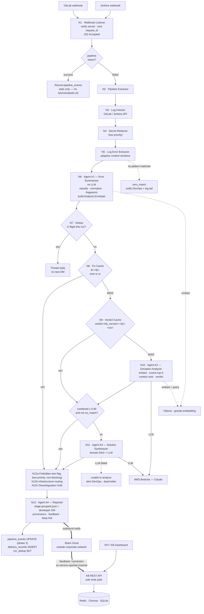

# BFA MVP-2 System Design

**Project:** Build Failure Analyzer — MVP-2 Full Architecture  
**Date:** 2026-08-10  
**Author:** Vignesh Palanivel  
**Status:** Draft v2 — Requirements-driven, flow-corrected  
**Requirements covered:** All 106 (BFA-PP through BFA-FMR)

---

## Table of Contents

1. [Architecture Overview](#1-architecture-overview)
   - 1.1 Component Inventory · 1.2 Flow Step Table · 1.3 Flow Diagram
   - 1.4 Stores at a Glance · 1.5 Boundaries and Trust · 1.6 Analysis Envelope
2. [Configuration Files](#2-configuration-files)
3. [Node-by-Node Analysis](#3-node-by-node-analysis)
4. [Data Schemas](#4-data-schemas)
   - 4.1 SQLite `bfa_kb.db` · 4.2 SQLite `bfa_stats.db` · 4.3 Chroma · 4.4 Redis · 4.5 Relationships
   - **4A. Database Access by Flow Phase** · **4B. Per-Store Access Matrix**
5. [API Specifications](#5-api-specifications)
6. [Security Design](#6-security-design)
7. [Resilience and Operations](#7-resilience-and-operations)
8. [Logging and Observability](#8-logging-and-observability)
9. [Test Architecture](#9-test-architecture) — including the Replay Harness
10. [Agent Detail Specifications](#10-agent-detail-specifications)
    - 10.1 A1 Error Summarizer · **10.1.1 Why the fingerprint normalises repo and branch**
    - 10.2 A2 Deviation Analyzer · 10.3 A3 Solution Synthesizer · 10.4 A4 Reporter
11. [UI and Dashboard Flows](#11-ui-and-dashboard-flows)
    - **11A. Dashboard Pages — Column Specifications**
12. [Master Flow Chain Audit Table](#12-master-flow-chain-audit-table)
13. [Design Decisions Log](#13-design-decisions-log)

> **Revision note.** This document is the single canonical design. It supersedes
> `LLD.md` (§13.12) and incorporates: the single-service merge, Slack as an outbound
> notification channel plus a narrow feedback/correction channel, ingestion of successful
> pipelines for KPI reporting, `request_id` as the one identifier, two caches instead of
> three, and repo/branch normalisation in the fingerprint.

---

## 1. Architecture Overview

BFA MVP-2 runs as **one service, one process, one port, one repository**. Extraction and
analysis are separated by a Python function call, not an HTTP hop. Slack sits outside the
corporate network and is limited to outbound notification plus a narrow inbound channel for
feedback and solution correction. Every write to every store is performed by this single
process.

### 1.1 Component Inventory

| Node | Component | Responsibility | Input | Output | Stores touched |
|---|---|---|---|---|---|
| N1 | Webhook Listener | Verify shared secret; mint `request_id`; filter events | GitLab / Jenkins webhook | `pipeline_info` + `request_id` | — |
| N2 | Pipeline Extractor | Parse payload; `should_process_pipeline()`; external-stage guard | webhook payload | `pipeline_info` incl. `job_names` | SQLite (W) |
| N3 | Log Fetcher | Pull job logs from CI API | `pipeline_info` | raw console log | — |
| N4 | Secret Redactor *(low priority)* | Mask tokens, passwords, credential URLs | raw log | redacted log | — |
| N5 | Log Error Extractor | Pattern-match; adaptive context windows; merge overlaps | redacted log | `error_sections[]` | — |
| N6 | **Agent A1 — Error Summarizer** | Classify, normalise, fingerprint; create Analysis Envelope | `error_sections[]`, `pipeline_info` | Analysis Envelope | SQLite (W) |
| N7 | Dedup Check | Suppress same fingerprint already in flight for this run | `fingerprint`, `run_id` | continue / thread-reply | Redis (R) |
| N8 | **Fix Cache** *(merged)* | One lookup for both SME-approved and AI-generated fixes | `fingerprint` | `fix_text` + `source` | Redis (R) |
| N9 | Verdict Cache | Memoised A2 result for this fingerprint + context | `fingerprint`, `ctx_hash` | verdict + candidates | Redis (R) |
| N10 | **Agent A2 — Deviation Analyzer** | Embed; cosine top-K; context-rank; assign verdict | `error_text_clean`, `context_block` | verdict, ranked candidates | Chroma (R), SQLite (R/W), Redis (W) |
| N11 | **Agent A3 — Solution Synthesizer** | Domain RAG + LLM generation | envelope + RAG snippet | `fix_text`, confidence | Redis (W), SQLite (W) |
| N12 | **Agent A4 — Reporter** | Route, format, deliver; two-phase stats write | envelope | Slack / email delivery | SQLite (W), Redis (W) |
| — | KB REST API | Full CRUD on fixes; sole write path for state changes | HTTP (dashboard, Slack connector) | fix records | all three (R/W) |
| — | Slack Connector | Opens outbound channel; receives feedback + corrections | Slack events | KB API calls | via KB API only |
| — | KPI / KB Dashboard | Read views + SME actions | HTTP | rendered pages | SQLite (R) via API |
| — | Watchdog | `/health`; silent-failure alert | timer | alerts | SQLite (R) |

### 1.2 Flow — Step Table

`request_id` is minted at step 1 and present on every subsequent row, log line, and stats
record.

| # | Step | Condition | Action | Next |
|---|---|---|---|---|
| 1 | Webhook received | signature valid | mint `request_id`; return **202 Accepted** | 2 |
| 1a | Webhook received | signature invalid | reject; record rejection | end |
| 2 | Status routing | `status == success` | record `pipeline_events` (stats only — no fetch, no embed, no LLM) | end |
| 3 | Status routing | `status == failed` | record `pipeline_events`; dispatch background task | 4 |
| 4 | Fetch logs | — | pull job logs from CI API | 5 |
| 5 | Redact | *(low priority)* | mask secrets before any store or send | 6 |
| 6 | Extract errors | patterns matched | produce `error_sections[]` | 7 |
| 6a | Extract errors | no pattern matched | record `zero_match`; notify DevOps with log tail | end |
| 7 | **A1** | — | classify → normalise → fingerprint → build envelope | 8 |
| 8 | Dedup | fingerprint in flight for this run | post as thread reply to the existing message | end |
| 9 | **Fix cache** | hit | take `fix_text` + `source`; skip retrieval and LLM entirely | 14 |
| 10 | Verdict cache | hit | restore verdict + candidates; skip embed and query | 12 |
| 11 | **A2** | miss | embed → cosine top-K → context-rank → verdict | 12 |
| 12 | Threshold | `combined_score ≥ 0.90` and verdict ≠ `no_match` | adopt candidate `fix_text` | 14 |
| 13 | **A3** | below threshold or `no_match` | domain RAG + LLM generation | 14 |
| 13a | **A3** | LLM failed | "unable to analyze"; alert DevOps; write dead-letter | end |
| 14 | Forbidden-text check *(low priority)* | pattern matched | flag for SME visibility — does **not** block delivery | 15 |
| 15 | Infrastructure routing | `error_category == infrastructure` | post to DevOps channel; developer told it is not their change | 17 |
| 16 | Disambiguation | top-2 within `CONTEXT_DISAMBIG_BAND` | post side-by-side to SME channel; hold delivery | end |
| 17 | **A4 delivery** | — | stage-grouped channel post + developer DM with provenance, feedback controls, dashboard deep link | 18 |
| 18 | Two-phase write | — | update `pipeline_events`; insert `delivery_records`; set dedup key | end |

### 1.3 Flow Diagram



### 1.4 Stores at a Glance

| Store | Role | Holds | Authority |
|---|---|---|---|
| **Redis** | cache only | `fix:<fp>` (merged SME + AI), `verdict:<kb_version>:<fp>:<ctx>`, `run_dedup`, `disambig_pending`, `thread_map` | never a source of truth |
| **Chroma** | vectors only | `id = fix-<fingerprint>`, embedding of `error_text_clean`, `document = fix_text`, context labels in metadata | rebuildable from SQLite |
| **SQLite** | system of record | `fixes`, `fix_revisions` (metadata) + `pipeline_events`, `request_telemetry`, `delivery_records`, `feedback_events`, `sme_audit_log` (statistics), joined on `request_id` / `fingerprint` / `fix_id` | **authoritative** |

### 1.5 Boundaries and Trust

| Boundary | Direction | Authentication | Notes |
|---|---|---|---|
| GitLab / Jenkins → BFA | inbound | shared-secret HMAC | only untrusted inbound content |
| BFA → GitLab / Jenkins API | outbound | CI token | log retrieval |
| BFA → Ollama, Chroma | local | none — loopback | single writer for Chroma |
| BFA → AWS Bedrock | outbound | egress path | called by **A2 and A3** |
| BFA → Slack Web API | outbound | bot token | notifications |
| Slack → BFA | inbound over a **service-opened** channel | app-level token; request signature if a published URL is used instead | feedback and correction only — never approve, deprecate, or delete |
| Dashboard → KB API | internal | session / SSO | sole write path for state changes |
| No JWT is used on any interface, and no external application submits work. | | | |

### 1.6 Analysis Envelope

The Analysis Envelope is the single context struct created by Agent A1 (N6) and carried through every downstream node. It solves the context-loss problem: without it, each node only receives the subset of fields passed in the immediate function call, and context accumulated at N6 is silently dropped. Every node from N7 through N12 reads from or writes to this envelope.

```python
@dataclass
class AnalysisEnvelope:
    # ── Set by N1 (Webhook Listener) — immutable for the event lifecycle ─────
    request_id: str              # per-event UUID; appears on every log line
                                 # for full trace reconstruction (BFA-LOG-1010)

    # ── Set by N2 (Pipeline Extractor) ──────────────────────────────────────
    pipeline_info: dict          # project_id, pipeline_id, ref, sha, repo,
                                 # branch, commit_sha, triggered_by,
                                 # triggered_by_email, stages,
                                 # job_names: List[str]  ← job name list for
                                 # A1 stage_type inference (one per failed job)

    # ── Set by N6 (Agent A1) — immutable after this point ───────────────────
    fingerprint: str             # SHA-256 of cleaned error text
    error_text_clean: str        # timestamps/paths/trace IDs stripped
    context_block: ContextBlock  # {product_team, stage_type, error_category}
    is_infra: bool               # error_category == "infrastructure"
    # NOTE: no separate request_id. `request_id` (above) IS the
    # pipeline_events primary key — minted at N1 before any I/O, so it can
    # never be None, and it correlates logs, stats, dead-letter and replay.

    # ── Set by N8/N9/N9/N10/N11 (cache or agent) ──────────────────────────
    fix_text: str | None         # None until a cache hit or A2/A3 fills it
    fix_source: str              # sme_cache|ai_cache|verdict_cache|
                                 # vector_db|llm_generated|no_match
    verdict: str | None          # exact_match|applicable_with_adjustments|
                                 # partial|no_match|None (before cache/A2)
    approved_by: str | None      # Slack display name — set when fix_source is
                                 # sme_cache (read from Redis sme:fix value)

    # ── Set by N10 (A2) — None if no vector search was run ──────────────────
    ranked_candidates: list | None   # [{fix_id, fix_text, combined_score,
                                     #   vsim, context_score, context_labels}]
                                     # CLEARED by A3 to prevent stale candidates
                                     # from reaching N12c disambiguation gate
    top_candidate: dict | None

    # ── Set by N12 (A4) after delivery ──────────────────────────────────────
    slack_message_ts: str | None # Slack message timestamp; written to Redis
                                 # run_dedup after first delivery; used by
                                 # THREADREPLY to post to correct thread

    # ── Set by replay.py --mode test only; None in production ───────────────
    scenario_id: str | None      # JSONL corpus scenario id (e.g. "r001")
                                 # added to every log extra= during replay
                                 # so debug file is greppable per scenario

@dataclass
class ContextBlock:
    product_team: str    # set directly from pipeline_info.repo by A1;
                         # ALL downstream references use product_team
    stage_type: str      # build|test|package|deploy
    error_category: str  # code|infrastructure|dependency|configuration
```

**Field population order:**

| Field | Value set | Populated by | Node |
|---|---|---|---|
| `request_id` | UUID generated once | Webhook Listener | N1 |
| `pipeline_info` | webhook payload + `job_names` list | Pipeline Extractor | N2 |
| `fingerprint`, `error_text_clean`, `context_block`, `is_infra` | computed | Agent A1 | N6 |
| `fix_text`, `fix_source` (`sme_cache`\|`ai_cache` per stored `source`), `approved_by` | Redis GET `fix:<fp>` | Fix Cache Check | N8 |
| `fix_text`, `fix_source="verdict_cache"`, `verdict`, `ranked_candidates`, `top_candidate` | Redis GET `verdict:<kb_version>:<fp>:<ctx_hash>` | Verdict Cache Check | N9 |
| `fix_text`, `fix_source="vector_db"`, `verdict`, `ranked_candidates`, `top_candidate` | Chroma query + scoring | Agent A2 | N10 |
| `ranked_candidates` | set to `None` (clears stale A2 candidates) | Agent A3 | N11 |
| `fix_text`, `fix_source="llm_generated"` | LLM response | Agent A3 | N11 |
| `slack_message_ts` | Slack API post result | Agent A4 | N12 |
| `scenario_id` | JSONL corpus scenario id (None in production) | `replay.py --mode test` | Before pipeline runs |

---

## 2. Configuration Files

One JSON file is validated at startup. The service refuses to start if it is missing or malformed (BFA-ARCH-1110). Two env vars control Slack notification targets: `DEVOPS_SLACK_CHANNEL` and `SME_SLACK_CHANNEL` (validated at startup — service refuses to start if absent).

### `error_patterns.json`

Maps error patterns to classification. Replaces the hardcoded `ERROR_PATTERNS` list in `log_error_extractor.py`. The `category` field maps to `error_category` in the context block; `label` is a stable human-readable tag used in telemetry.

```json
{
  "patterns": [
    {
      "pattern": "make: ***",
      "category": "code",
      "label": "makefile_error"
    },
    {
      "pattern": "docker.errors",
      "category": "infrastructure",
      "label": "docker_failure"
    },
    {
      "pattern": "could not resolve",
      "category": "infrastructure",
      "label": "dns_resolution"
    },
    {
      "pattern": "npm ERR!",
      "category": "dependency",
      "label": "npm_error"
    },
    {
      "pattern": "PermissionError",
      "category": "infrastructure",
      "label": "permission_denied"
    }
  ]
}
```

---

## 3. Node-by-Node Analysis

| Node | ID | Inputs | Processing | Outputs | Next Node | Error Handling |
|---|---|---|---|---|---|---|
| **Startup Validator** | N0 | `error_patterns.json`, env vars (`VECTOR_WEIGHT`, `CONTEXT_WEIGHT`, `DEVOPS_SLACK_CHANNEL`, `SME_SLACK_CHANNEL`, `ANALYZE_API_KEY`, `JWT_PRIVATE_KEY_PATH`, `JWT_PUBLIC_KEY_PATH` for Slack service) | Load `error_patterns.json`; assert weight constraints; assert `DEVOPS_SLACK_CHANNEL`, `SME_SLACK_CHANNEL`, `ANALYZE_API_KEY` set; validate JWT key paths for Slack service only | Pass / Fail | N1 on pass; `sys.exit(1)` on fail | Write specific error to stderr naming the exact bad field |
| **Webhook Listener** | N1 | HTTP POST `/webhook` or `/webhook/jenkins` | Verify secret (`hmac.compare_digest` for GitLab token header; Bearer for Jenkins); check event type; check pipeline status | Validated payload dict | N2 | HTTP 403 on bad secret; HTTP 200 "ignored" on non-failed status |
| **Pipeline Extractor** | N2 | Webhook payload dict | Call `PipelineExtractor.extract_pipeline_info()`; call `should_process_pipeline()` (project allow/block list, status filter); apply `external` stage guard | `pipeline_info` dict added to Envelope; fire background task | N3 (background) | Return `"skipped"` with log reason if filtered |
| **Log Fetcher** | N3 | `pipeline_info` (from Envelope): `project_id`, `pipeline_id` | Call `fetch_pipeline_jobs(project_id, pipeline_id)` → list of jobs; for each failed job call `fetch_job_log_tail(project_id, job_id)`; apply `should_save_job_log()` filter; collect `job_names` list | `all_logs: List[{job_id, job_name, details, log_text}]` (one entry per failed job); add `job_names` list to `pipeline_info` in Envelope | N4 (iterates over list) | Retry up to `RETRY_ATTEMPTS` with exponential backoff; on exhaustion → dead-letter + DevOps alert |
| **Secret Redactor** | N4 | `all_logs` list (from N3); iterates over each entry | For each entry: regex-strip `PRIVATE-TOKEN:`, `password=`, credential URLs, JWT strings, API keys from `log_text` | `all_logs_redacted: List[{job_id, job_name, details, log_text_redacted}]` — same structure, `log_text` replaced | N5 | Log warning per entry with line count redacted; never raise — redaction failure replaces `log_text` with empty string, not drop |
| **Log Error Extractor** | N5 | `all_logs_redacted` list (from N4); iterates over each entry | For each entry: pattern-match `log_text_redacted` against `error_patterns.json`; adaptive context windows (≤50 matches: 50b/10a, ≤150: 10b/5a, >150: 5b/2a); deduplicate overlapping windows; concatenate all entries into flat list | `error_sections: List[str]` (all error windows across all jobs, flat) | N6 | Empty result for all jobs → log "no errors found" + skip to monitoring update |
| **Agent A1 — Error Summarizer** | N6 | `error_sections: List[str]` (from N5); `pipeline_info` dict (from N2, including `job_names`) | ① `error_category` from `error_patterns.json` labels (majority across sections); ② `stage_type` from `job_names[0]` substring match (build/test/package/deploy); ③ `product_team = pipeline_info.get("repo", "unknown")` — repo name used directly, no lookup file; ④ clean concatenated error text (strip timestamps / line-numbers / paths / versions / trace IDs); ⑤ SHA-256 `fingerprint`; ⑥ INSERT partial `pipeline_events` row → get `request_id`; ⑦ assemble Analysis Envelope | Populated `AnalysisEnvelope` (`request_id`, `pipeline_info`, `fingerprint`, `error_text_clean`, `context_block`, `is_infra`, `request_id`; `fix_text`/`verdict`/`ranked_candidates` all `None`) | N7 | Pattern file missing at runtime → alert + use generic category; partial DB write failure → log + continue with `request_id=None` |
| **Dedup Check** | N7 | Envelope: `fingerprint`, `pipeline_info.pipeline_id` (as `pipeline_run_id`) | Redis GET `run_dedup:<pipeline_run_id>:<fingerprint>` (1h TTL); value is `slack_message_ts` of first delivery | Hit → set `envelope.slack_message_ts = cached_ts`, route to THREADREPLY; miss → continue | THREADREPLY (hit) or N8 (miss) | Redis unavailable → treat as miss; never block on cache failure |
| **Thread Reply** | THREADREPLY | Envelope: `slack_message_ts`, `pipeline_info` (stage name), `error_text_clean` | Post thread reply to existing Slack message at `slack_message_ts`; UPDATE `bfa_stats.db.pipeline_events` SET `failed_jobs = failed_jobs+1` if `request_id` exists; INSERT `delivery_records` with `slack_message_ts` reference | Thread reply posted; `pipeline_events` row updated (partial phase-2 — no `final_status` write since event is still in-flight) | Terminal | SlackApiError → log and skip; DB update failure → log and skip |
| **Fix Cache Check** | N8 | Envelope: `fingerprint` | Redis GET `fix:<fingerprint>` (30d TTL) → JSON `{fix_text, source, approved_by, fix_id}`. One lookup covers both SME-approved and AI-generated fixes; `source` says which | Envelope updated: `fix_text`, `fix_source` (`sme_cache` or `ai_cache` from `source`), `approved_by` when `source=sme` | N12a on hit; N9 on miss | Redis unavailable → skip to N9 |
| **Verdict Cache Check** | N9 | Envelope: `fingerprint`, `context_block` (`product_team`, `stage_type`, `error_category`) | Compute `ctx_hash = sha256(f"{product_team}:{stage_type}:{error_category}").hexdigest()[:16]`, and `kb_version` is read from the Redis counter of the same name (must match formula used by N10 writer); Redis GET `verdict:<kb_version>:<fingerprint>:<ctx_hash>` (30d TTL) → JSON `{verdict, ranked_candidates, top_candidate}` | Envelope updated: `verdict`, `ranked_candidates`, `top_candidate`, `fix_source="verdict_cache"`; `fix_text` from `top_candidate.fix_text` if verdict ≠ `no_match` | N12a (match hit); N11 (no_match hit — `ranked_candidates` already in envelope); N10 (miss) | Redis unavailable → skip to N10 |
| **Agent A2 — Deviation Analyzer** | N10 | Envelope (`error_text_clean`, `context_block`, `fingerprint`); `VECTOR_TOP_K`, `VECTOR_WEIGHT`, `CONTEXT_WEIGHT`, `SIMILARITY_THRESHOLD=0.90` | ① Embed `error_text_clean` via Ollama HTTP (granite-embedding); ② Chroma cosine query top-K; ③ For each: fetch context labels from `bfa_kb.db`; compute `context_score = matching_labels / 3`; compute `combined_score`; ④ Sort by `combined_score`; ⑤ Assign verdict; ⑥ Redis SET `verdict:<fp>:<ctx_hash>` 7d; ⑦ INSERT `request_telemetry` | Envelope updated with `verdict`, `ranked_candidates`, `top_candidate`, `fix_text` | N12a (match); N11 (no_match) | Chroma/Ollama unavailable → skip to N11 + fire alert |
| **Agent A3 — Solution Synthesizer** | N11 | Envelope (`error_text_clean`, `context_block`, `pipeline_info`) | ① Domain RAG: embed error text, query `domain_rag` Chroma collection, retrieve top snippet; ② Assemble LLM prompt (error text + context_block + repo + branch + infra overview + RAG snippet); ③ Call LLM (OpenWebUI); ④ Redis SET `fix:<fingerprint>` `source=ai` 30d (never overwrites an `sme` entry) | Envelope updated with `fix_text`, `fix_source="llm_generated"` | N12a | LLM fail → send "unable to analyze" + email + Slack to DevOps + write dead-letter; never silently discard |
| **Forbidden Text Gate** | N12a | Envelope (`fix_text`) | Check `fix_text` against `FORBIDDEN_TEXT_PATTERNS` env var list | Pass or match | N12b (pass); A4 SME warning route (match) | Config missing → log warning, treat as empty list (never block delivery) |
| **Infrastructure Gate** | N12b | Envelope (`is_infra`) | Check `is_infra` flag | Pass or infrastructure | N12c (pass); A4 DevOps route (infra) | — |
| **Disambiguation Gate** | N12c | Envelope: `ranked_candidates`, `fix_source` | **Guard first:** if `ranked_candidates is None` OR `fix_source in (sme_cache, ai_cache, llm_generated)` → gate is clear (skip directly to N12); else if `len(ranked_candidates) ≥ 2` AND `abs(candidates[0].combined_score - candidates[1].combined_score) ≤ CONTEXT_DISAMBIG_BAND` → ambiguous; else → clear | Ambiguous or clear | A4 DISAMBIG route (ambiguous); N12 (clear) | `ranked_candidates is None` on cache/A3 path → treat as clear; never call `len()` on None |
| **Agent A4 — Reporter** | N12 | Full Envelope (`fix_text`, `fix_source`, `approved_by`, `context_block`, `pipeline_info`, `is_infra`, `fingerprint`, `request_id`) | ① READ `bfa_kb.db.fixes` WHERE `fingerprint`: get `hit_count`, `last_seen`, `jira_key`; ② Developer lookup by email (`triggered_by_email`); ③ Build DM (`fix_text` + provenance using `approved_by` or `fix_source` + `hit_count` + `last_seen` + `repo` + feedback buttons + dashboard deep link); ④ Developer not found → fallback to email via `triggered_by_email` (SMTP); ⑤ UPDATE `pipeline_events` (`final_status`, `total_duration_ms`); ⑥ INSERT `delivery_records`; ⑦ UPDATE `bfa_kb.db.fixes` SET `hit_count+1`, `last_seen=now()`; ⑧ Redis SET `run_dedup:<pipeline_id>:<fp>` = `slack_message_ts` (1h TTL); ⑨ Set `envelope.slack_message_ts` | Slack DM (or email fallback) delivered; `pipeline_events` updated; `delivery_records` inserted; `run_dedup` Redis key written | Feedback loop (async, via the Slack connector); Jira creation is a dashboard action | SlackApiError → fallback to email; developer not found → send fix via SMTP to `triggered_by_email`; `request_id` None → skip `pipeline_events` UPDATE, still INSERT `delivery_records` |
| **KB REST API** | N14 | RS256 JWT (Slack service) or session token (dashboard) + action payload | Validate token (RS256 for Slack service; session token lookup in Redis for dashboard); route to approve/edit/discard/feedback handler. **On approve:** (1) Execute FULL write path first (SQLite INSERT/UPDATE + fix_revisions + Chroma upsert + Redis sme:fix SET + audit log INSERT); (2) THEN check `disambig_pending:<fp>` — if exists: deserialize stored `envelope_json`, overwrite `fix_text` and `fix_source="sme_cache"` from the newly approved fix, clear `ranked_candidates` to `None`, DELETE `disambig_pending:<fp>` key, **then** trigger A4 delivery with the patched envelope (Gate 3 will see `ranked_candidates=None` → treat as clear → proceed directly to delivery, no re-trigger loop). If not exists: return `{status: ok}`. | `{status: ok}` (+ async A4 delivery if disambig path) | Terminal (or async A4 DEV if disambig) | Write first, disambig check second prevents infinite loop; SQLite WAL mode; Chroma HTTP server for concurrent access |
| **Dashboard API** | N15 | Session token + query params | Validate session token (Redis lookup); query `bfa_kb.db` and `bfa_stats.db`; support pagination, free-text search, label filtering; return Resolved / Needs-Attention / Stats views | Paginated JSON | Terminal | Invalid/expired session → HTTP 401; read-only; no lock contention |
| **Health Check** | N16 | None | Ping Redis; query Chroma HTTP; call Ollama embed endpoint; call LLM health; check Slack token; check domain RAG Chroma | `{status, redis, chroma, ollama_embed, llm, slack, domain_rag}` | Terminal | Each check independent; partial failure → `"degraded"` |
| **Prometheus Metrics** | N17 | None | Read in-process counters/histograms | Prometheus exposition text | Terminal | Always available; never blocks request path |
| **Slack Actions Handler** | N18 | HTTP POST `/bfa/slack/actions` (Slack platform) | Validate Slack HMAC-SHA256 signature; parse `action_id` (e.g. `feedback_positive_<fp>`, `feedback_negative_<fp>`, `create_jira_<fp>`); route to feedback handler or Jira handler; call `POST /api/kb/{fix_id}/feedback` internally | Feedback recorded in `bfa_stats.db.sme_audit_log`; 3-thumbs-down → route to SME channel | Terminal | Invalid signature → HTTP 403; unknown action_id → log + HTTP 200 (Slack requires 200 for all actions) |

---

## 4. Data Schemas

### 4.1 SQLite — `bfa_kb.db`

Source of truth for all approved fixes. Uses WAL mode for concurrent reads.

```sql
PRAGMA journal_mode=WAL;

CREATE TABLE IF NOT EXISTS fixes (
    id              INTEGER PRIMARY KEY AUTOINCREMENT,
    fingerprint     TEXT    NOT NULL UNIQUE,
    error_text_clean TEXT   NOT NULL,
    fix_text        TEXT    NOT NULL,
    revision        INTEGER NOT NULL DEFAULT 0,
    status          TEXT    NOT NULL DEFAULT 'active'
                            CHECK(status IN ('active','deprecated','discarded')),
    -- ── Context labels (A2 scoring + dashboard filtering) ───────────────────
    product_team    TEXT,               -- repo name; NULL on legacy → context_score treats as 0
    stage_type      TEXT,               -- build|test|package|deploy
    error_category  TEXT,               -- code|infrastructure|dependency|configuration
    sub_category    TEXT,               -- NEW: finer grouping e.g. docker, npm, pip
    labels          TEXT,               -- NEW: JSON array e.g. ["npm_error","dependency_install"]
    source_ci       TEXT,               -- NEW: gitlab|jenkins
    -- ── Provenance ──────────────────────────────────────────────────────────
    source_repo     TEXT,
    approved_by     TEXT,               -- Slack display name
    -- ── Usage stats ─────────────────────────────────────────────────────────
    hit_count       INTEGER NOT NULL DEFAULT 0,
    first_seen      TEXT,               -- NEW: ISO 8601 — when error first analysed (not first approved)
    last_seen       TEXT,               -- ISO 8601 — last delivery datetime
    fix_confidence  REAL,               -- NEW: running avg combined_score across all deliveries
    sme_review_count INTEGER NOT NULL DEFAULT 0,  -- NEW: times routed to SME review (3× thumbs-down)
    -- ── Links ───────────────────────────────────────────────────────────────
    jira_key        TEXT,
    -- ── Timestamps ──────────────────────────────────────────────────────────
    created_at      TEXT    NOT NULL,   -- ISO 8601 — first approval
    updated_at      TEXT    NOT NULL    -- ISO 8601 — last update
);

CREATE INDEX IF NOT EXISTS idx_fixes_fingerprint    ON fixes(fingerprint);
CREATE INDEX IF NOT EXISTS idx_fixes_product_team   ON fixes(product_team);
CREATE INDEX IF NOT EXISTS idx_fixes_stage_type     ON fixes(stage_type);
CREATE INDEX IF NOT EXISTS idx_fixes_error_category ON fixes(error_category);
CREATE INDEX IF NOT EXISTS idx_fixes_sub_category   ON fixes(sub_category);
CREATE INDEX IF NOT EXISTS idx_fixes_source_ci      ON fixes(source_ci);
CREATE INDEX IF NOT EXISTS idx_fixes_status         ON fixes(status);

CREATE TABLE IF NOT EXISTS fix_revisions (
    id              INTEGER PRIMARY KEY AUTOINCREMENT,
    fix_id          INTEGER NOT NULL REFERENCES fixes(id),
    revision        INTEGER NOT NULL,
    fix_text_before TEXT    NOT NULL,
    fix_text_after  TEXT    NOT NULL,
    changed_by      TEXT,
    action          TEXT    NOT NULL CHECK(action IN ('approved','edited','discarded')),
    changed_at      TEXT    NOT NULL
);

CREATE INDEX IF NOT EXISTS idx_fix_revisions_fix_id ON fix_revisions(fix_id);
```

---

### 4.2 SQLite — `bfa_stats.db`

Append-only audit and telemetry database. Never a source of truth for fixes — read-only from the analysis pipeline's perspective (A4 writes delivery records; the KB REST API writes audit records).

```sql
PRAGMA journal_mode=WAL;

-- Two-phase write: A1 INSERTs partial row, A4 UPDATEs with final fields
CREATE TABLE IF NOT EXISTS pipeline_events (
    id                  INTEGER PRIMARY KEY AUTOINCREMENT,
    pipeline_id         TEXT    NOT NULL,
    project_id          TEXT    NOT NULL,
    repo                TEXT,
    branch              TEXT,
    commit_sha          TEXT,
    triggered_by        TEXT,               -- developer username
    triggered_by_email  TEXT,               -- developer email
    product_team        TEXT,
    total_jobs          INTEGER,
    failed_jobs         INTEGER,
    stage_timings       TEXT,               -- JSON: {stage_name: {start, end, status}}
    total_duration_ms   INTEGER,            -- written by A4 on phase-2 update
    final_status        TEXT                -- 'failed'|'recovered'; written by A4
                            CHECK(final_status IN ('failed','recovered') OR final_status IS NULL),
    source_ci           TEXT,               -- NEW: gitlab|jenkins — CI system segmentation
    created_at          TEXT    NOT NULL
);

CREATE INDEX IF NOT EXISTS idx_pe_pipeline_id ON pipeline_events(pipeline_id);
CREATE INDEX IF NOT EXISTS idx_pe_repo        ON pipeline_events(repo);
CREATE INDEX IF NOT EXISTS idx_pe_source_ci   ON pipeline_events(source_ci);
CREATE INDEX IF NOT EXISTS idx_pe_created_at  ON pipeline_events(created_at);

CREATE TABLE IF NOT EXISTS request_telemetry (
    id                  INTEGER PRIMARY KEY AUTOINCREMENT,
    request_id   INTEGER REFERENCES pipeline_events(id),
    fingerprint         TEXT,
    step_name           TEXT,
    -- ── Analysis outcome ────────────────────────────────────────────────────
    fix_source          TEXT    CHECK(fix_source IN (
                            'sme_cache','ai_cache','verdict_cache',
                            'vector_db','llm_generated','no_match')),
    verdict             TEXT    CHECK(verdict IN (
                            'exact_match','applicable_with_adjustments',
                            'partial','no_match')),
    -- ── Scoring detail ──────────────────────────────────────────────────────
    vector_similarity   REAL,
    combined_score      REAL,
    context_score       REAL,
    a2_candidate_count  INTEGER,            -- NEW: Chroma candidates evaluated — KB coverage signal
    cache_tier_hit      TEXT,               -- NEW: sme|ai|verdict|none — cache effectiveness
    -- ── Cost / latency ──────────────────────────────────────────────────────
    llm_cost_estimate   REAL,
    request_latency_ms  INTEGER,
    domain_rag_used     INTEGER DEFAULT 0,  -- NEW: 1 if domain RAG snippet included in A3 prompt
    -- ── Classification labels ───────────────────────────────────────────────
    product_team        TEXT,
    error_category      TEXT,
    sub_category        TEXT,               -- NEW: finer grouping e.g. docker, npm
    stage_type          TEXT,
    labels              TEXT,               -- NEW: JSON array — all error labels from A1
    source_ci           TEXT,               -- NEW: gitlab|jenkins
    created_at          TEXT    NOT NULL
);

CREATE INDEX IF NOT EXISTS idx_rt_fingerprint  ON request_telemetry(fingerprint);
CREATE INDEX IF NOT EXISTS idx_rt_event_id     ON request_telemetry(request_id);
CREATE INDEX IF NOT EXISTS idx_rt_fix_source   ON request_telemetry(fix_source);
CREATE INDEX IF NOT EXISTS idx_rt_error_cat    ON request_telemetry(error_category);
CREATE INDEX IF NOT EXISTS idx_rt_sub_category ON request_telemetry(sub_category);

CREATE TABLE IF NOT EXISTS sme_audit_log (
    id                      INTEGER PRIMARY KEY AUTOINCREMENT,
    fix_id                  INTEGER,        -- logical FK to bfa_kb.fixes.id (cross-DB)
    fingerprint             TEXT,
    slack_user_id           TEXT,
    slack_display_name      TEXT,
    action                  TEXT    NOT NULL CHECK(action IN (
                                'approved','edited','discarded',
                                'feedback_positive','feedback_negative')),
    fix_text_before         TEXT,
    fix_text_after          TEXT,
    feedback_count_positive INTEGER DEFAULT 0,
    feedback_count_negative INTEGER DEFAULT 0,
    created_at              TEXT    NOT NULL
);

CREATE INDEX IF NOT EXISTS idx_sal_fix_id     ON sme_audit_log(fix_id);
CREATE INDEX IF NOT EXISTS idx_sal_action     ON sme_audit_log(action);

CREATE TABLE IF NOT EXISTS delivery_records (
    id                      INTEGER PRIMARY KEY AUTOINCREMENT,
    fingerprint             TEXT,
    request_id       INTEGER REFERENCES pipeline_events(id),
    -- ── Delivery target ─────────────────────────────────────────────────────
    delivered_to_slack_user TEXT,           -- NULL if fallback used
    delivered_to_channel    TEXT,
    fallback_used           INTEGER DEFAULT 0,      -- 1 if developer not found
    delivery_method         TEXT,                   -- NEW: slack_dm|email_fallback
    -- ── Fix detail ──────────────────────────────────────────────────────────
    fix_source              TEXT,
    times_sent_before       INTEGER DEFAULT 0,
    -- ── Tracking ────────────────────────────────────────────────────────────
    slack_message_ts        TEXT,                   -- thread dedup key
    jira_key                TEXT,
    resolution_time_ms      INTEGER,                -- NEW: time from pipeline created_at to delivery
    developer_responded     INTEGER DEFAULT 0,      -- NEW: 1 if 👍/👎 clicked; 0 if ignored
    created_at              TEXT    NOT NULL
);

CREATE INDEX IF NOT EXISTS idx_dr_fingerprint ON delivery_records(fingerprint);
CREATE INDEX IF NOT EXISTS idx_dr_event_id    ON delivery_records(request_id);

CREATE TABLE IF NOT EXISTS pruning_runs (
    id              INTEGER PRIMARY KEY AUTOINCREMENT,
    run_at          TEXT    NOT NULL,               -- ISO 8601 — when job ran
    flagged_count   INTEGER NOT NULL DEFAULT 0,     -- fixes surfaced for review
    flagged_fix_ids TEXT    NOT NULL DEFAULT '[]',  -- JSON array of fix_ids
    resolved_count  INTEGER NOT NULL DEFAULT 0,     -- operator actions taken
    completed_at    TEXT                            -- NULL until all flags resolved
);

CREATE INDEX IF NOT EXISTS idx_pr_run_at ON pruning_runs(run_at);
```

---

### 4.3 Chroma — `fix_embeddings` Collection

Chroma runs in **HTTP server mode** — one server process, all clients use `chromadb.HttpClient(host, port)`. This prevents concurrent-write corruption (BFA-PP-1050) and allows the Slack service on a separate machine to reach Chroma via the KB REST API.

| Field | Type | Status | Set by | Notes |
|---|---|---|---|---|
| `id` | string | Existing | KB API | `fix-<fingerprint>` — deterministic, no duplicates on re-upsert |
| `document` | string | Existing | KB API | `fix_text` (latest approved text — returned to A2 on match) |
| `embedding` | float[] | Existing | KB API | Ollama `granite-embedding` of `error_text_clean` (NOT `fix_text`) |
| `metadata.fingerprint` | string | Existing | KB API | SHA-256 — links to `bfa_kb.fixes.fingerprint` |
| `metadata.fix_id` | integer | Existing | KB API | `bfa_kb.fixes.id` — for reverse lookup |
| `metadata.product_team` | string | Existing | KB API | A2 context scoring — label 1 of 3 |
| `metadata.stage_type` | string | Existing | KB API | A2 context scoring — label 2 of 3 |
| `metadata.error_category` | string | Existing | KB API | A2 context scoring — label 3 of 3 |
| `metadata.sub_category` | string | **New** | KB API | Pre-filter before vector search — narrows candidates to same sub-category, improves A2 precision |
| `metadata.labels` | string (JSON) | **New** | KB API | Pre-filter by error label before vector search |

**Collection settings:**
```python
client.get_or_create_collection(
    name="fix_embeddings",
    metadata={"hnsw:space": "cosine"}
)
```

Similarity threshold: `0.90` (`combined_score`, not raw `vsim`).

**Rebuild utility:** If Chroma is corrupted or the HTTP server is replaced, `rebuild_chroma.py` reads all `active` rows from `bfa_kb.db`, re-embeds each `error_text_clean`, and upserts to the Chroma collection. `bfa_kb.db` is always authoritative.

---

### 4.4 Redis Key Space

All keys have a maximum TTL of 30 days (BFA-ARCH-1080). Redis is a **cache only** — never a source of truth.

| Key Pattern | TTL | Value | Purpose |
|---|---|---|---|
| `fix:<fingerprint>` | 30 days | JSON `{fix_text, source, approved_by, fix_id}` | **Merged fix cache.** `source` ∈ {sme, ai}. Precedence is a *write* rule: an SME approval always overwrites; an AI result writes only when the slot is empty or already `source=ai` |
| `verdict:<kb_version>:<fingerprint>:<ctx_hash>` | 30 days | JSON `{verdict, ranked_candidates, top_candidate}` | A2 verdict cache — skips embed+query. `kb_version` is a counter INCR-ed on every approve/edit/deprecate, so stale verdicts orphan themselves and a uniform 30-day TTL is safe |
| `run_dedup:<pipeline_run_id>:<fingerprint>` | 1 hour | `<slack_message_ts>` | In-flight pipeline dedup; value is first message ts for thread replies |
| `disambig_pending:<fingerprint>` | 24 hours | JSON `{candidate_0, candidate_1, request_id, envelope_json}` | Holds delivery state while waiting for SME disambiguation choice |
| `thread_map:<channel_id>:<message_ts>` | 30 days | `<fix_id>` | Maps Slack thread to fix for edit flow |
| `last_edit:<channel_id>:<fix_id>` | Until cleared | `<slack_user_id>` | Tracks who is currently editing a fix |

---

### 4.5 Schema Relationships

```
bfa_kb.db                           bfa_stats.db
─────────────────                   ──────────────────────────────────
fixes                               pipeline_events
  id ◄──────────────────────────────  (no direct FK — logical link via fingerprint)
  fingerprint ◄───────────────────── request_telemetry.fingerprint
  id ◄─────────────── [logical] ──── sme_audit_log.fix_id
  fingerprint ◄───────────────────── delivery_records.fingerprint

fix_revisions
  fix_id ──────────────────────────► fixes.id  (same DB, hard FK)

Chroma fix_embeddings
  metadata.fingerprint ────────────► fixes.fingerprint (same value)
  metadata.fix_id ─────────────────► fixes.id

Redis
  fix:<fingerprint> ──────────────► fixes.fingerprint (lookup key)
  verdict:<kb_ver>:<fp>:<ctx> ─────► (transient; backed by A2 recomputation)
  run_dedup:<run_id>:<fp> ─────────► (transient; 1h TTL)
  disambig_pending:<fp> ───────────► (transient; 24h TTL)
```

**Write order on approve/edit (atomicity guarantee):**

```
1. INSERT/UPDATE bfa_kb.db fixes (SQLite WAL — crash-safe)
2. INSERT fix_revisions (same transaction)
3. Upsert Chroma vector via HttpClient
4. Redis SET fix:<fp> with source=sme (30d TTL)
5. INSERT bfa_stats.db sme_audit_log
```

If step 3 or 4 fails, `bfa_kb.db` is authoritative. Chroma can be rebuilt with `rebuild_chroma.py`. Redis TTL expiry is self-healing (cache miss → re-query bfa_kb.db on next event).

---

## 4A. Database Access by Flow Phase

Every read and write against the three stores, grouped by phase rather than by node.
Fields are given as **schema shapes** — what goes in and what comes back — not as SQL.

`R` = read, `W` = write. Every row carries `request_id` implicitly; it is listed only where
it is the lookup key.

### Phase 1 — Ingest (N1, N2)

| Store | R/W | Fields in | Fields out | On failure |
|---|---|---|---|---|
| SQLite `pipeline_events` | W | `request_id` (PK), `pipeline_id`, `project_id`, `repo`, `branch`, `commit_sha`, `triggered_by`, `triggered_by_email`, `product_team`, `ci_system`, `status` (`success`\|`failed`), `stage_durations`, `total_duration_ms`, `received_at` | — | log and continue; the event still proceeds because `request_id` exists independently of the write |

A **successful** pipeline terminates here: statistics are recorded and no log retrieval,
embedding, or LLM call occurs.

### Phase 2 — Extract and Summarise (N3–N6, Agent A1)

| Store | R/W | Fields in | Fields out | On failure |
|---|---|---|---|---|
| SQLite `pipeline_events` | W | `request_id` → `failed_jobs`, `total_jobs`, `error_category`, `stage_type` | — | log and continue |
| SQLite `request_telemetry` | W | `request_id`, `fingerprint`, `error_category`, `stage_type`, `product_team`, `normalisation_inputs_applied` (which of repo/branch were substituted) | — | log and continue |

No cache or vector access occurs in this phase. The normaliser output `error_text_clean`
and the derived `fingerprint` are carried on the envelope, not persisted here.

### Phase 3 — Cache Lookup (N7, N8, N9)

| Store | R/W | Fields in | Fields out | On failure |
|---|---|---|---|---|
| Redis `run_dedup:<pipeline_id>:<fp>` | R | `pipeline_id`, `fingerprint` | `slack_message_ts` if in flight | treat as miss; continue |
| Redis `fix:<fp>` | R | `fingerprint` | `{fix_text, source, approved_by, fix_id}` | treat as miss; continue to N9 |
| Redis `kb_version` | R | — | integer counter | assume `0`; verdict lookup simply misses |
| Redis `verdict:<kb_version>:<fp>:<ctx_hash>` | R | `fingerprint`, `ctx_hash`, `kb_version` | `{verdict, ranked_candidates, top_candidate}` | treat as miss; continue to N10 |

A hit at `fix:<fp>` short-circuits both the vector query and the LLM.

### Phase 4 — Retrieval (N10, Agent A2)

| Store | R/W | Fields in | Fields out | On failure |
|---|---|---|---|---|
| Chroma `fix_embeddings` | R | query vector of `error_text_clean`, `n_results = VECTOR_TOP_K`, optional `sub_category` pre-filter | `id`, `document` (`fix_text`), `metadata{fingerprint, fix_id, product_team, stage_type, error_category}`, `distance` | `VectorUnavailable` → verdict `no_match`, proceed to A3, raise health alert |
| SQLite `fixes` | R | `fix_id[]` from candidate metadata | `product_team`, `stage_type`, `error_category`, `status`, `hit_count` | treat candidate labels as unmatched (context score 0) |
| Redis `verdict:<kb_version>:<fp>:<ctx_hash>` | W | verdict payload, TTL 30d | — | log and continue |
| SQLite `request_telemetry` | W | `request_id`, `fingerprint`, `verdict`, `vsim`, `context_score`, `combined_score`, `latency_ms` | — | log and continue |

Candidates whose `status` is not `active` are excluded before scoring.

### Phase 5 — Synthesis (N11, Agent A3)

| Store | R/W | Fields in | Fields out | On failure |
|---|---|---|---|---|
| Chroma `domain_rag` | R | query vector of `error_text_clean` | top domain snippet | skip the snippet; continue with prompt only |
| Redis `fix:<fp>` | W | `{fix_text, source:"ai"}`, TTL 30d — **only** when the slot is empty or already `source=ai` | — | log and continue |
| SQLite `request_telemetry` | W | `request_id`, `llm_calls`, `est_cost_usd`, `confidence`, `latency_ms` | — | log and continue |
| Dead-letter file | W | full envelope + failure reason | — | raise operational alert — silent loss is not permitted |

### Phase 6 — Delivery (N12, Agent A4)

| Store | R/W | Fields in | Fields out | On failure |
|---|---|---|---|---|
| SQLite `fixes` | R | `fingerprint` | `hit_count`, `last_seen`, `jira_key`, `source`, `approved_by` — used for the provenance line | omit provenance; still deliver |
| SQLite `pipeline_events` | W | `request_id` → `final_status`, `total_duration_ms`, `fix_source`, `delivered` | — | log and continue |
| SQLite `delivery_records` | W | `request_id`, `fingerprint`, `channel`, `recipient`, `fix_source`, `slack_message_ts` | — | log and continue |
| SQLite `fixes` | W | `fingerprint` → `hit_count + 1`, `last_seen = now()` | — | log and continue |
| Redis `run_dedup:<pipeline_id>:<fp>` | W | `slack_message_ts`, TTL 1h | — | later stages post as new messages instead of thread replies |

### Phase 7 — SME and UI Actions (KB REST API)

All four actions converge on one API, one authorisation check, and one revision history,
whether raised from the dashboard or from the Slack connector.

| Action | Store | R/W | Fields in | Fields out |
|---|---|---|---|---|
| **Approve** | SQLite `fixes` | W | `fingerprint`, `error_text_clean`, `fix_text`, `approved_by`, context labels, `status='active'` | `fix_id`, `revision` |
| | SQLite `fix_revisions` | W | `fix_id`, `revision`, `actor`, `action='approved'`, `old_text`, `new_text`, `at` | — |
| | Chroma | W | upsert `id=fix-<fp>`, embedding of `error_text_clean`, `document=fix_text`, metadata labels | — |
| | Redis | W | `fix:<fp>` `source=sme`; **INCR `kb_version`** | — |
| | SQLite `sme_audit_log` | W | `fix_id`, `actor`, `action`, `at` | — |
| **Edit / correct** | SQLite `fixes` | W | `fix_id` → new `fix_text` | `revision` |
| | SQLite `fix_revisions` | W | actor, before/after text | — |
| | Chroma | W | refresh `document` only — **no re-embedding**, because the vector derives from `error_text_clean`, not `fix_text` | — |
| | Redis | W | overwrite `fix:<fp>`; **INCR `kb_version`** | — |
| **Deprecate / discard** | SQLite `fixes` | W | `fix_id` → `status='discarded'` | — |
| | Chroma | W | delete `id=fix-<fp>` | — |
| | Redis | W | delete `fix:<fp>`; **INCR `kb_version`** | — |
| **Feedback** | SQLite `feedback_events` | W | `fix_id`, `request_id`, `actor`, `verdict` (`helpful`\|`unhelpful`) | — |
| | SQLite `fixes` | W | `helpful_count` / `unhelpful_count` increment; at 3 unhelpful set `needs_review` | — |

**Write order and authority.** SQLite first, then Chroma, then Redis. `bfa_kb.db` is
authoritative: Chroma is rebuildable with `rebuild_chroma.py`, and Redis is self-healing on
TTL expiry. A single `INCR kb_version` replaces per-key verdict invalidation.

### Phase 8 — Maintenance

| Store | R/W | Fields in | Fields out | Trigger |
|---|---|---|---|---|
| SQLite `fixes` | R | `status`, `hit_count`, `created_at` | pruning candidates | weekly job, surfaced in the dashboard first |
| SQLite / Chroma | W | archive then delete | — | operator-confirmed action only |
| all three | R | — | backup artefacts via the SQLite `.backup` API | daily |

---

## 4B. Per-Store Access Matrix

The same accesses viewed per store, as a cross-check that nothing is orphaned.

### Redis

| Key | Op | Phase | Notes |
|---|---|---|---|
| `run_dedup:<pipeline_id>:<fp>` | R | 3 | in-flight suppression |
| `run_dedup:<pipeline_id>:<fp>` | W | 6 | value is the first `slack_message_ts` |
| `fix:<fp>` | R | 3 | merged SME + AI lookup |
| `fix:<fp>` | W | 5 | `source=ai`, never overwrites an `sme` entry |
| `fix:<fp>` | W | 7 | `source=sme` on approve/edit |
| `fix:<fp>` | delete | 7 | on discard |
| `kb_version` | R | 3 | part of the verdict key |
| `kb_version` | INCR | 7 | every approve/edit/discard |
| `verdict:<kb_version>:<fp>:<ctx>` | R | 3 | memoised A2 result |
| `verdict:<kb_version>:<fp>:<ctx>` | W | 4 | TTL 30d |
| `disambig_pending:<fp>` | R/W | 6, 7 | holds delivery state |
| `thread_map:<channel>:<ts>` | R/W | 6, 7 | maps thread to fix |

### Chroma

| Op | Phase | Detail |
|---|---|---|
| query | 4 | cosine top-K over the embedding of `error_text_clean` |
| query | 5 | `domain_rag` collection for the prompt snippet |
| upsert | 7 | on approve — id, embedding, document, metadata labels |
| document refresh | 7 | on edit — **no re-embedding** |
| delete | 7 | on discard |
| rebuild | 8 | `rebuild_chroma.py` from `bfa_kb.db` |

### SQLite

| Table | Op | Phase | Detail |
|---|---|---|---|
| `pipeline_events` | W | 1 | one row per webhook, success **and** failure, keyed by `request_id` |
| `pipeline_events` | W | 2, 6 | phase-1 enrichment, then phase-2 completion |
| `request_telemetry` | W | 2, 4, 5 | fingerprint, verdict, scores, latency, cost |
| `fixes` | R | 4, 6 | candidate labels; provenance for the DM |
| `fixes` | W | 6 | `hit_count`, `last_seen` |
| `fixes` | W | 7 | approve, edit, deprecate |
| `fix_revisions` | W | 7 | full edit history — actor, timestamp, before/after |
| `delivery_records` | W | 6 | one row per delivery |
| `feedback_events` | W | 7 | helpful / unhelpful |
| `sme_audit_log` | W | 7 | who did what, when |
| all | R | 8 | pruning candidates and backups |

**KPI derivation.** The headline figure — *of N failed pipelines, M received a solution* —
comes from joining `pipeline_events` (phase 1, both outcomes) to `request_telemetry` and
`delivery_records` on `request_id`. Because `request_id` is minted before any I/O, the
denominator is complete even when a later stage fails.

---

## 5. API Specifications

### Endpoint Summary

| Method | Path | Auth | Rate Limit | Purpose | Used by |
|---|---|---|---|---|---|
| POST | `/webhook` | HMAC secret | — | GitLab webhook entry point | Extractor (N1→N5) |
| POST | `/webhook/jenkins` | Bearer secret | — | Jenkins webhook entry point | Extractor (N1→N5) |
| POST | `/api/auth/login` | Username + password | 10/min | Create session — returns session token (8h TTL in Redis) | Dashboard, Auth |
| POST | `/api/auth/logout` | Session token | — | Invalidate session token | Dashboard, Auth |
| POST | `/api/analyze` | `ANALYZE_API_KEY` header | 60/min | Direct error submission (bypasses extractor) | A1→A4 |
| POST | `/api/vector/manual-fix` | Session token | 60/min | Insert single error+fix pair into KB | KB API, Chroma |
| POST | `/api/vector/manual-fix/bulk` | Session token | 10/hr | Bulk insert from CSV/JSON/XLSX | KB API, Chroma |
| POST | `/api/kb/approve` | RS256 JWT (Slack service) or session token (dashboard) | — | Approve fix → write KB + trigger Chroma upsert | N14 (KB API), Slack service, Dashboard |
| PATCH | `/api/kb/{id}` | RS256 JWT (Slack service) or session token (dashboard) | — | Edit fix text or context labels | N14 (KB API), Slack service, Dashboard |
| DELETE | `/api/kb/{id}/discard` | RS256 JWT (Slack service) or session token (dashboard) | — | Discard fix | N14 (KB API), Slack service, Dashboard |
| POST | `/api/kb/{id}/feedback` | RS256 JWT (Slack service) or session token (dashboard) | — | Record 👍/👎 | N14 (KB API), N18 (Slack actions), Dashboard |
| GET | `/api/kb` | Session token | — | Paginated KB browse with full filter support | Dashboard (KB view) |
| GET | `/api/kb/{id}` | Session token | — | Single fix detail | Dashboard (KB view) |
| GET | `/api/kb/{id}/revisions` | Session token | — | Full revision history for a fix | Dashboard (KB view) |
| GET | `/api/dashboard/failures` | Session token | — | Unaddressed failures — filterable, default grouped by product | Dashboard (Unaddressed view) |
| GET | `/api/dashboard/failure/{event_id}` | Session token | — | Single pipeline event full detail | Dashboard (Failure detail) |
| GET | `/api/dashboard/feed` | Session token | — | Real-time pipeline event stream (`?since=<ts>&product_team=...`) | Dashboard (Pipeline feed) |
| GET | `/api/dashboard/resolved` | Session token | — | Resolved fixes, paginated | Dashboard (KB view) |
| GET | `/api/dashboard/pending` | Session token | — | Needs-attention records | Dashboard (Pending view) |
| GET | `/api/dashboard/stats` | Session token | — | Filterable stats + telemetry | Dashboard (KPI view) |
| GET | `/api/dashboard/kpi` | Session token | — | All KPI aggregate metrics | Dashboard (KPI view) |
| POST | `/api/dashboard/notify` | Session token | — | Email product owner for unaddressed failures in a product | Dashboard, SMTP |
| GET | `/api/dashboard/pruning/latest` | Session token | — | Latest weekly pruning run — flagged fixes list | Dashboard (Pruning view) |
| POST | `/api/dashboard/pruning/{run_id}/resolve` | Session token | — | Operator action on flagged fix: keep / deprecate / delete | Dashboard (Pruning view) |
| POST | `/bfa/slack/events` | Slack HMAC-SHA256 | — | Slack message events (edit thread) | N18 (Slack actions handler) |
| POST | `/bfa/slack/actions` | Slack HMAC-SHA256 | — | Slack button interactions (👍👎, Jira, approve) | N18 (Slack actions handler) |
| GET | `/healthz` | None | — | Service health (Redis, Chroma, Ollama, LLM, Slack) | Ops, monitoring |
| GET | `/metrics` | Session token (disabled in dev) | — | Prometheus metrics exposition | Ops, Prometheus |
| GET | `/api/test/alert` | Session token (disabled in prod) | — | Test alert notification | Ops (dev only) |

### KB Approve Payload

```json
POST /api/kb/approve
Authorization: Bearer <session-token>  (dashboard)
  OR
Authorization: Bearer <RS256-JWT>      (Slack service)

{
  "fingerprint": "e3b0c44298fc1c...",
  "error_text_clean": "make: *** [Makefile:42] Error 1",
  "fix_text": "## Summary\n...\n## Steps\n- ...",
  "approved_by": "alice",
  "context": {
    "product_team": "PacketLogic",
    "stage_type": "build",
    "error_category": "code",
    "source_repo": "packetlogic2"
  },
  "request_id": 42
}
```

Response:
```json
{"status": "ok", "fix_id": 17, "revision": 0}
```

### KB Edit Payload

```json
PATCH /api/kb/17
Authorization: Bearer <session-token>  (dashboard)
  OR
Authorization: Bearer <RS256-JWT>      (Slack service)

{
  "fix_text": "## Updated fix...",
  "edited_by": "bob"
}
```

Response:
```json
{"status": "ok", "fix_id": 17, "revision": 1}
```

### KB Feedback Payload

```json
POST /api/kb/17/feedback
Authorization: Bearer <session-token>  (dashboard)
  OR
Authorization: Bearer <RS256-JWT>      (Slack service)

{
  "sentiment": "negative",
  "slack_user_id": "U012AB3CD",
  "slack_display_name": "alice"
}
```

Response:
```json
{"status": "ok", "negative_count": 3, "routed_to_sme": true}
```

### Dashboard Stats Query

```
GET /api/dashboard/stats?product_team=PacketLogic&stage_type=build&from=2026-01-01&to=2026-08-10&page=1&per_page=50
Authorization: Bearer <session-token>
```

Response:
```json
{
  "total": 142,
  "page": 1,
  "per_page": 50,
  "items": [
    {
      "fingerprint": "e3b0c44...",
      "product_team": "PacketLogic",
      "stage_type": "build",
      "error_category": "code",
      "hit_count": 7,
      "last_seen": "2026-08-09T14:32:00Z",
      "fix_source": "sme_cache",
      "avg_latency_ms": 312
    }
  ]
}
```

---

## 6. Security Design

### Authentication Model

```
[ GitLab / Jenkins        ]  ──HMAC-SHA256 / Bearer ──►  [ /webhook, /webhook/jenkins ]
[ CI scripts / direct     ]  ──ANALYZE_API_KEY header ►  [ /api/analyze ]
[ Slack service (DMZ)     ]  ──RS256 JWT ─────────────►  [ /api/kb/* ]
[ Slack platform          ]  ──HMAC-SHA256 ───────────►  [ /bfa/slack/* ]
[ Dashboard users         ]  ──session token ─────────►  [ /api/dashboard/*, /api/kb/*, /metrics ]
```

**RS256 JWT** is used only by the Slack service — the one cross-network caller that cannot share a session with the service directly.

**Session tokens** are used by all dashboard users. Login via `POST /api/auth/login` (username + bcrypt password). Returns a 256-bit random hex token stored in Redis with 8-hour TTL. Every dashboard request carries `Authorization: Bearer <session-token>`; the service does a Redis GET to validate. Logout (`POST /api/auth/logout`) deletes the Redis key immediately.

**`ANALYZE_API_KEY`** is a shared secret in the env var of the same name. Used for direct error submission from CI scripts. Simple header check: `X-Api-Key: <value>`. No token issuance endpoint needed.

`/api/test/alert` is **disabled in production** (BFA-SECUR-1010). Controlled by env-var `ENABLE_TEST_ALERT=false` by default; returns HTTP 404 when false.

### Secrets — never hardcoded

| Secret | Storage |
|---|---|
| JWT private key (Slack service only) | File, path via `JWT_PRIVATE_KEY_PATH` |
| JWT public key (Slack service only) | File, path via `JWT_PUBLIC_KEY_PATH` |
| Slack bot token | `SLACK_BOT_TOKEN` env var |
| Slack signing secret | `SLACK_SIGNING_SECRET` env var |
| GitLab token | `GITLAB_TOKEN` env var (base64-obfuscated in `.env`) |
| Jira API token | `JIRA_API_TOKEN` env var |
| SMTP credentials | `SMTP_USER`, `SMTP_PASSWORD` env vars |
| Email domain | `USER_EMAIL_DOMAIN` env var — **never** hardcoded (BFA-SECUR-1030) |
| Direct submission API key | `ANALYZE_API_KEY` env var — used by `/api/analyze` |
| Product owner emails | `PRODUCT_OWNER_<REPO>` env vars — used only by `POST /api/dashboard/notify` |
| Default product owner | `PRODUCT_OWNER_DEFAULT` env var — fallback when no repo-specific owner set |

### Log Sanitization (BFA-SECUR-1020)

Full request bodies are **never** written to log files. Log output includes only: `pipeline_id`, `step_name`, `error_count`, `failure_reason`. The same regex redaction applied by the Secret Redactor (N4) is also applied to all structured log `extra` fields before writing.

### SMTP (BFA-FN-1040)

When `SMTP_USER` and `SMTP_PASSWORD` are set, use STARTTLS authenticated SMTP. When absent, fall back to unauthenticated relay (for trusted internal networks).

### Protocol (BFA-SECUR-1040)

All outgoing HTTP calls default to HTTPS. Configurable via `OUTGOING_PROTOCOL` env var; only permit plain HTTP when explicitly set (for trusted-network, non-internet-exposed deployments).

### Webhook Secret Validation

GitLab: `hmac.compare_digest(hmac.new(secret.encode(), body, sha256).hexdigest(), X-Gitlab-Token header)` — constant-time comparison, no timing oracle.  
Jenkins: Bearer token comparison via `hmac.compare_digest`.

---

## 7. Resilience and Operations

### Degradation Ladder (BFA-RES-1010)

| Service down | Behavior | Alert fired? |
|---|---|---|
| Redis | Skip all cache tiers; go direct to A2 | Yes — health alert |
| Ollama (embedding) | Skip A2 vector search; go direct to A3 (LLM) | Yes |
| Chroma HTTP server | Skip A2 vector search; go direct to A3 (LLM) | Yes |
| LLM (OpenWebUI) | Return structured "unable to analyze"; save to dead-letter; notify DevOps email + Slack | Yes |
| Slack API | Log error; do not crash; RateLimitErrorRetryHandler handles rate limits | No (Slack retries) |
| SQLite (write) | Log error; return HTTP 500 to Slack service caller; do not silently discard | Yes |
| Jira API | Log warning; record the ticket as pending; never block the dashboard action | No |

### Dead-Letter Directory (BFA-RES-1020, BFA-FMR-1000)

Events that exhaust all retries are written to:
```
$DEAD_LETTER_DIR/<pipeline_id>-<timestamp>.json
```
Each file contains the full payload: `pipeline_info`, `error_sections`, `fingerprint`, `context_block`, and the failure reason. The `replay_failed.py` utility reads this directory and resubmits each event to the analysis pipeline.

### Silent-Failure Alert (BFA-RES-1030)

A background thread checks every 15 minutes: if webhook events have been received but `bfa_stats.db.pipeline_events` shows zero completed analyses in the same window, fire an operational alert via Slack and email. Prevents the service from silently failing to analyze events.

### Backups (BFA-RES-1000)

A daily cron job (via `apscheduler`) performs:
```python
sqlite3.connect("bfa_kb.db").backup(dest_conn)     # SQLite streaming backup API
sqlite3.connect("bfa_stats.db").backup(dest_conn)
subprocess.run(["tar", "czf", f"chroma_backup_{date}.tar.gz", CHROMA_DATA_PATH])
```
Retention policy: 30 days of daily backups. Restore procedure documented in `RESTORE.md`.

### Weekly Pruning (BFA-DASH-1030)

A weekly job runs every Monday at 00:00 (via `apscheduler`) and surfaces fixes that need operator attention. It flags records in `bfa_kb.db.fixes` where:
- `status='active'` AND `hit_count=0` AND `created_at < now() - 6 months` (never used, stale), OR
- `status='deprecated'`

**No automatic deletion** — every flagged fix requires explicit operator action.

**How the job runs:**
1. Query `bfa_kb.db.fixes` for matching records
2. INSERT a `pruning_runs` row in `bfa_stats.db` with `flagged_count` and `flagged_fix_ids` (JSON array)
3. Dashboard polls `GET /api/dashboard/pruning/latest` — if a new run has fired since last UI load, show a banner: *"Weekly pruning found N fixes needing review"*
4. Operator sees a filtered view of flagged fixes with columns: fingerprint, error_text_clean excerpt, error_category, sub_category, hit_count, first_seen, last_seen, status

**Per-row operator actions (via `POST /api/dashboard/pruning/{run_id}/resolve`):**

| Action | Effect |
|---|---|
| **Keep** | Clears the flag — fix stays active, not surfaced again for 6 months |
| **Deprecate** | `UPDATE fixes SET status='deprecated'` — kept in KB for history, not used for matching |
| **Delete** | Hard delete: `DELETE FROM fixes`; Chroma DELETE `fix-{fingerprint}`; Redis DELETE `fix:<fp>`; INCR `kb_version`; INSERT `fix_revisions` with `action='deleted'` for audit trail |

When `resolved_count = flagged_count`, the `pruning_runs.completed_at` is set and the banner is dismissed.

### Container and Process (BFA-ARCH-1170–1200)

- One Dockerfile, one image: both extraction and analysis pipelines
- Single port via `WEBHOOK_PORT` env var
- `SIGTERM` handler: stop accepting new webhooks; wait for in-progress background tasks (up to 30s); then exit cleanly
- `systemd` unit with `Restart=on-failure`
- Python base image pinned to exact digest; security updates applied
- CI/CD: `trivy image` scan; fail build on any CRITICAL or HIGH CVE

---

## 8. Logging and Observability

### 8.1 Log Format

All logs are structured JSON (BFA-LOG-1000). No `print()` statements in operational code. Every log line includes:

```json
{
  "timestamp": "2026-08-11T09:34:00.123Z",
  "level": "INFO",
  "logger": "bfa.agent.a2",
  "request_id": "req-uuid-here",
  "pipeline_id": "p001",
  "fingerprint": "e3b0c44...",
  "message": "A2 verdict computed",
  "extra": { "verdict": "exact_match", "combined_score": 0.94, "candidate_count": 5, "latency_ms": 312 }
}
```

**`request_id` generation and propagation (BFA-LOG-1010):**

`request_id` is a per-event UUID generated at `handle_gitlab_webhook()` / `handle_jenkins_webhook()` in `extractor_bridge.py` (the first point where a background task is created). It propagates as:

1. Parameter through `process_pipeline_event(pipeline_info, db_req_id, request_id)`
2. Field in `AnalysisEnvelope.request_id` from N6 onward
3. Field in `AnalyzePayload.request_id` passed to `analyze_errors_internal()`
4. `extra={"request_id": request_id}` on every log call throughout the pipeline

**N1 logs two events** — arrival (before request_id exists, correlation by `pipeline_id` only) and queued (after request_id generated, linking pipeline_id → request_id). This two-line bridge enables full trace reconstruction from webhook arrival to delivery.

**Logger naming convention — `bfa.*` hierarchy (unified after service merge):**

| Component | Logger name |
|---|---|
| Webhook handler | `bfa.extractor.webhook` |
| Pipeline extractor | `bfa.extractor.pipeline` |
| Log fetcher | `bfa.extractor.fetcher` |
| Jenkins fetcher | `bfa.extractor.jenkins` |
| Secret redactor | `bfa.extractor.redactor` |
| Log error extractor | `bfa.extractor.errors` |
| Extractor bridge | `bfa.extractor.bridge` |
| Internal analyzer | `bfa.analyzer` |
| Agent A1 | `bfa.agent.a1` |
| Agent A2 | `bfa.agent.a2` |
| Agent A3 | `bfa.agent.a3` |
| Agent A4 | `bfa.agent.a4` |
| KB REST API | `bfa.kb` |
| Dashboard API | `bfa.dashboard` |
| Slack actions | `bfa.slack` |
| Vector DB | `bfa.vector_db` |

**Sensitive data rules — never log:**
- Raw error log content / `error_lines` / `fix_text` at any level
- Full LLM prompts — log only `prompt_token_count`, `fingerprint`, `model`
- Developer email addresses — log only `triggered_by` (username, not email)
- Slack user IDs in full — log `slack_user_id[:4]+"****"` if needed
- Credential tokens, passwords, API keys

---

### 8.2 Per-Node Structured Log Fields

| Node | Logger | Level | Log event | Key `extra` fields | request_id available? |
|---|---|---|---|---|---|
| N0 (Startup) | `bfa.extractor.bridge` | INFO | Config validated | `config_files`, `weight_sum`, `vector_weight`, `context_weight` | No |
| N0 (Startup fail) | `bfa.extractor.bridge` | ERROR | Config invalid — refuse to start | `bad_field`, `bad_value`, `error_message` | No |
| N1 (Webhook arrived) | `bfa.extractor.webhook` | INFO | Webhook received | `source_ci`, `pipeline_id`, `project_id`, `status` | No — log pipeline_id only |
| N1 (Webhook queued) | `bfa.extractor.webhook` | INFO | Background task queued — bridge to request_id | `source_ci`, `pipeline_id`, `request_id` | Yes — bridge event |
| N1 (Rejected) | `bfa.extractor.webhook` | WARNING | Webhook rejected | `source_ci`, `pipeline_id`, `reason` (bad_secret / not_failed / filtered) | No |
| N2 (Extractor) | `bfa.extractor.pipeline` | INFO | Pipeline extracted | `request_id`, `project_id`, `pipeline_id`, `ref`, `source_ci`, `stage_count`, `external_stage_guard` | Yes |
| N3 (Log Fetcher) | `bfa.extractor.fetcher` | INFO | Logs fetched | `request_id`, `pipeline_id`, `job_count`, `failed_job_count`, `total_log_lines` | Yes |
| N3 (Retry) | `bfa.extractor.fetcher` | WARNING | Fetch retry | `request_id`, `pipeline_id`, `attempt`, `job_id`, `error` | Yes |
| N3 (Exhausted) | `bfa.extractor.fetcher` | ERROR | Fetch exhausted — dead-letter write | `request_id`, `pipeline_id`, `dead_letter_path`, `total_attempts` | Yes |
| N4 (Redactor) | `bfa.extractor.redactor` | INFO | Secrets redacted | `request_id`, `job_id`, `lines_redacted`, `patterns_matched` | Yes |
| N4 (Redactor fail) | `bfa.extractor.redactor` | WARNING | Redaction failed for entry — continuing | `request_id`, `job_id`, `error` | Yes |
| N5 (Error Extractor) | `bfa.extractor.errors` | INFO | Error sections extracted | `request_id`, `job_id`, `section_count`, `total_lines`, `bucket_breakdown` | Yes |
| N5 (Empty) | `bfa.extractor.errors` | INFO | No errors found in log | `request_id`, `job_id`, `log_lines_scanned` | Yes |
| N6 (A1) | `bfa.agent.a1` | INFO | Envelope created | `request_id`, `fingerprint`, `error_category`, `sub_category`, `labels`, `stage_type`, `product_team`, `is_infra`, `source_ci`, `request_id` | Yes |
| N6 (A1 DB fail) | `bfa.agent.a1` | ERROR | pipeline_events INSERT failed | `request_id`, `fingerprint`, `error` | Yes |
| N7 (Dedup hit) | `bfa.analyzer` | DEBUG | Dedup hit — thread reply only | `request_id`, `fingerprint`, `pipeline_run_id`, `existing_slack_ts` | Yes |
| N7 (Dedup miss) | `bfa.analyzer` | DEBUG | Dedup miss — proceeding | `request_id`, `fingerprint`, `pipeline_run_id` | Yes |
| N8 (SME Cache hit) | `bfa.analyzer` | DEBUG | SME cache hit | `request_id`, `fingerprint`, `fix_id` | Yes |
| N8 (SME Cache miss) | `bfa.analyzer` | DEBUG | SME cache miss | `request_id`, `fingerprint` | Yes |
| N9 (AI Cache hit) | `bfa.analyzer` | DEBUG | AI cache hit | `request_id`, `fingerprint` | Yes |
| N9 (AI Cache miss) | `bfa.analyzer` | DEBUG | AI cache miss | `request_id`, `fingerprint` | Yes |
| N9 (Verdict hit) | `bfa.analyzer` | DEBUG | Verdict cache hit | `request_id`, `fingerprint`, `ctx_hash`, `verdict` | Yes |
| N9 (Verdict miss) | `bfa.analyzer` | DEBUG | Verdict cache miss | `request_id`, `fingerprint`, `ctx_hash` | Yes |
| N10 (A2 result) | `bfa.agent.a2` | INFO | A2 verdict computed | `request_id`, `fingerprint`, `verdict`, `combined_score`, `vsim`, `context_score`, `candidate_count`, `latency_ms` | Yes |
| N10 (A2 skip) | `bfa.agent.a2` | WARNING | A2 skipped — degradation ladder | `request_id`, `fingerprint`, `reason`, `degradation_ladder_step` | Yes |
| N11 (A3 start) | `bfa.agent.a3` | INFO | LLM call started | `request_id`, `fingerprint`, `model`, `prompt_token_count` | Yes |
| N11 (A3 result) | `bfa.agent.a3` | INFO | LLM call completed | `request_id`, `fingerprint`, `completion_token_count`, `cost_estimate_usd`, `latency_ms` | Yes |
| N11 (A3 fail) | `bfa.agent.a3` | ERROR | LLM call failed | `request_id`, `fingerprint`, `error`, `dead_letter_path` | Yes |
| N12a (Gate) | `bfa.agent.a4` | WARNING | Forbidden text gate triggered | `request_id`, `fingerprint`, `pattern_matched` | Yes |
| N12b (Gate) | `bfa.agent.a4` | INFO | Infrastructure gate triggered | `request_id`, `fingerprint`, `error_category` | Yes |
| N12c (Gate) | `bfa.agent.a4` | INFO | Disambiguation gate triggered | `request_id`, `fingerprint`, `score_0`, `score_1`, `band` | Yes |
| N12 (A4 delivered) | `bfa.agent.a4` | INFO | Fix delivered | `request_id`, `fingerprint`, `delivery_method`, `fix_source`, `times_sent_before`, `jira_key` | Yes |
| N12 (A4 fallback) | `bfa.agent.a4` | WARNING | Developer not found — email fallback | `request_id`, `fingerprint`, `delivery_method` | Yes |
| N14 (KB approve) | `bfa.kb` | INFO | Fix approved | `fix_id`, `fingerprint`, `approved_by`, `chroma_upsert_ms`, `disambig_resumed` | No (KB REST call) |
| N14 (KB edit) | `bfa.kb` | INFO | Fix edited | `fix_id`, `revision`, `edited_by`, `label_change`, `chroma_updated` | No |
| N14 (KB discard) | `bfa.kb` | INFO | Fix discarded | `fix_id`, `fingerprint` | No |
| N14 (KB feedback) | `bfa.kb` | INFO | Feedback recorded | `fix_id`, `sentiment`, `negative_count`, `routed_to_sme`, `sme_review_count` | No |
| N15 (Dashboard) | `bfa.dashboard` | INFO | Dashboard query | `view`, `filter_count`, `result_count`, `query_ms` | No |
| N18 (Slack action) | `bfa.slack` | INFO | Slack action received | `action_type`, `fingerprint` | No |
| N18 (Slack fail) | `bfa.slack` | ERROR | Slack action failed | `action_type`, `fingerprint`, `error` | No |
| Weekly pruning | `bfa.dashboard` | INFO | Pruning run completed | `flagged_count`, `run_at` | No |

### 8.3 Health Check

`GET /healthz` returns:

```json
{
  "status": "degraded",
  "redis": true,
  "chroma": true,
  "ollama_embed": false,
  "llm": true,
  "slack": "ok",
  "domain_rag": true
}
```

`status` values:
- `"ok"` — all components healthy
- `"degraded"` — one or more non-critical components down (system still analyzes, using degradation ladder)
- `"error"` — Redis or SQLite unavailable (system cannot function at all)

### 8.4 Prometheus Metrics (BFA-LOG-1030)

`GET /metrics` exposes:

| Metric | Type | Labels |
|---|---|---|
| `bfa_requests_total` | Counter | `endpoint`, `status_code` |
| `bfa_request_latency_seconds` | Histogram | `endpoint` |
| `bfa_llm_call_seconds` | Histogram | `model` |
| `bfa_llm_failures_total` | Counter | `reason` |
| `bfa_chroma_search_seconds` | Histogram | — |
| `bfa_cache_hits_total` | Counter | `cache_type` (sme, ai, verdict) |
| `bfa_cache_misses_total` | Counter | `cache_type` |
| `bfa_slack_messages_total` | Counter | `destination`, `status` (delivered, failed) |
| `bfa_analysis_by_source_total` | Counter | `source` (sme_cache, ai_cache, verdict_cache, vector_db, llm_generated, no_match) |
| `bfa_feedback_total` | Counter | `sentiment` (positive, negative) |
| `bfa_dedup_hits_total` | Counter | — |
| `bfa_disambig_triggered_total` | Counter | — |
| `bfa_dead_letter_writes_total` | Counter | `reason` (llm_fail, fetch_exhausted) |

---

### 8.5 Current State Analysis — Code Audit Findings (2026-08-11)

Code audit of both services before merge. Every gap and issue is listed here so implementation can address them systematically.

#### Format and configuration — current state

| Aspect | `extract-build-logs` | `build-failure-analyzer` | Target (after merge) |
|---|---|---|---|
| Format | Pipe-delimited plain text | `basicConfig` default — no structure | Structured JSON (`bfa_logging.py`) |
| Output | stdout + RotatingFileHandler (100MB, 10 backups) | stderr only — no file, no rotation | stdout + RotatingFileHandler via `LOG_FILE` env var |
| Level control | `LOG_LEVEL` env var | Hardcoded INFO — no env var | `LOG_LEVEL` env var, default INFO |
| Structured `extra=` fields | 11 recognised fields, most silently dropped by formatter | None | All `extra=` fields rendered in JSON |
| JSON output | No | No | Yes — `python-json-logger` or equivalent |
| Request / correlation ID | 8-char UUID via ContextVar (but buggy — access log always shows N/A) | Absent entirely | `request_id` UUID, param-propagated, in every log line from N2 onward |
| Sensitive data filter | `SensitiveDataFilter` on `record.args` only | None | `SensitiveDataFilter` on `record.getMessage()` post-render — covers f-strings |

#### Node-by-node — current gaps found in code

| Node | ID | File | Current logging | Issues found |
|---|---|---|---|---|
| Startup / Config | N0 | `config_loader.py` | Plain text, INFO on load success | No startup validation log for weight constraints; secret values could appear in config dump |
| Webhook Listener | N1 | `webhook_listener.py` | Named logger `webhook_listener`, pipe-delimited | ContextVar set but access logger always shows `request_id='N/A'` — ContextVar never linked to `request.state`; access log entries have no correlation |
| Pipeline Extractor | N2 | `pipeline_extractor.py` | Named logger, pipe-delimited | Missing `external_stage_guard` log; missing `source_ci` |
| Log Fetcher | N3 | `log_fetcher.py` | Named logger, INFO on fetch | `api_poster.py` logs full payload including `error_lines` at ERROR on retry exhaustion — **raw build log content in error logs** |
| Secret Redactor | N4 | `extractor_bridge.py` (`_redact_secrets`) | **None — completely absent** | Zero log output; redaction success/failure invisible; no count of lines redacted |
| Log Error Extractor | N5 | `log_error_extractor.py` | Named logger, section count | No bucket breakdown at DEBUG; no per-pattern match detail |
| Agent A1 | N6 | `internal_analyzer.py` | **None — completely absent** | No fingerprint logged; no classification result; no envelope creation; no request_id |
| Dedup / Cache checks | N7–N9 | `internal_analyzer.py` | **None — completely absent** | All three cache tiers and dedup check produce zero log output; cache hit/miss invisible |
| Agent A2 | N10 | `vector_db.py` | Named logger `vector_db` + root logger (mixed) | `"=== Best Similarity Score: X ==="` at INFO on every lookup — noisy, unparseable; mixed logger usage makes filtering impossible; no verdict logged; no `request_id` |
| Agent A3 | N11 | `resolver_agent.py` | **None — completely absent** | **`print()` dumps entire LLM prompt** (full error text + 6000-char infra overview) to stdout on every LLM call — severe data exposure; no LLM success/fail log; no cache write log |
| Gates (N12a/b/c) | N12a–c | `analyzer_service.py` | **None — completely absent** | All three gate decisions invisible in logs |
| Agent A4 | N12 | `analyzer_service.py` | Partial — `basicConfig` | **Developer email addresses and Slack user IDs logged at INFO** — PII; no `delivery_method`; no `fix_confidence` update log |
| KB REST API | N14 | `analyzer_service.py` | Partial — `basicConfig` | No Chroma upsert result logged; no Redis write logged; no `sme_review_count` |
| Slack actions handler | N18 | `slack_helper.py` | **None — completely absent** | Only `print()` calls; `print()` outputs raw error log content (first 300 chars) on every Slack send — data exposure; Redis ops silent |
| Dashboard API | N15 | `analyzer_service.py` | Minimal — `basicConfig` | No query timing; no filter params logged |

#### Critical issues — ranked by severity

| # | Severity | Issue | File |
|---|---|---|---|
| 1 | **Critical** | `resolver_agent.py`: `print()` dumps entire LLM prompt (full error text + 6000-char infra overview) to stdout on **every** LLM call | `resolver_agent.py` line 166 |
| 2 | **Critical** | `api_poster.py`: logs full API payload including `error_lines` at ERROR on retry exhaustion — build log content in error logs routinely | `api_poster.py` |
| 3 | **Critical** | `slack_helper.py`: no logging at all — Slack sends, Redis ops, LLM summarization calls all silent; `print()` exposes raw error text | `slack_helper.py` |
| 4 | **Critical** | `analyzer_service.py`: developer email addresses and Slack user IDs logged at INFO — PII | `analyzer_service.py` |
| 5 | **High** | `SensitiveDataFilter` only covers `record.args` — f-string messages bypass it entirely; sensitive data in f-strings goes unfiltered | `logging_config.py` |
| 6 | **High** | `logging_config_extractor.py` is never imported by the analyzer service — all its protections (SensitiveDataFilter, RequestIdFilter, PipeDelimitedFormatter) don't apply to analyzer | Both services |
| 7 | **High** | N4 (Secret Redactor) has zero log output — redaction success/failure completely invisible | `extractor_bridge.py` |
| 8 | **High** | A1 (N6), N7 dedup, N8/N9/N9 caches, N12a/b/c gates all produce zero logs — majority of pipeline invisible | Analyzer nodes |
| 9 | **High** | `request_id` absent from entire analyzer service — no correlation across any analysis step | `analyzer_service.py`, `resolver_agent.py`, `vector_db.py` |
| 10 | **Medium** | Access logger ContextVar bug — `request_id` always `'N/A'` in access logs | `webhook_listener.py` |
| 11 | **Medium** | `vector_db.py` mixed logger usage — half calls use named logger `vector_db`, half use root `logging.*` — unfilterable by logger name | `vector_db.py` |
| 12 | **Medium** | `"=== Best Similarity Score: X ==="` INFO line fires on every lookup — noisy, not structured, not parseable | `vector_db.py` |
| 13 | **Medium** | Neither service outputs structured JSON — §8.1 requirement not met in current code | Both services |
| 14 | **Medium** | Analyzer service logs to stderr only — no file, no rotation | `analyzer_service.py` |
| 15 | **Low** | f-string log calls throughout both services — string interpolation executes regardless of log level; use `%s` style or `extra=` | Everywhere |

---

### 8.6 Improvement Plan — What to Change and Where

#### Change 1 — Unified logging initialisation (`bfa_logging.py`)

Create a single `bfa_logging.py` in the merged service. Called once at startup from `analyzer_service.py`. Configures:
- Root handler: stdout, structured JSON format, `LOG_LEVEL` env var
- File handler: `LOG_FILE` env var path, RotatingFileHandler (100MB, 10 backups)
- `SensitiveDataFilter` applied to ALL handlers — filters both `record.args` AND `record.getMessage()` post-render to catch f-string messages
- `RequestIdFilter` that reads `request_id` from the log `extra=` dict (not ContextVar — param-propagated instead)

`logging_config_extractor.py` must be modified to:
- NOT call `logging.basicConfig()`
- NOT add handlers to the root logger
- Only rename logger calls in extractor modules from old names to `bfa.extractor.*` hierarchy
- All format and handler config deferred to `bfa_logging.py`

#### Change 2 — Structured JSON format

Replace pipe-delimited formatter and `basicConfig`. Use `python-json-logger` (`pythonjsonlogger.jsonlogger.JsonFormatter`). Every log line renders all `extra=` fields as JSON keys — no more silent field dropping.

```python
formatter = jsonlogger.JsonFormatter(
    "%(timestamp)s %(level)s %(logger)s %(request_id)s %(message)s",
    rename_fields={"levelname": "level", "name": "logger"}
)
```

#### Change 3 — `request_id` propagation

| Step | Where | Change |
|---|---|---|
| Generate | `extractor_bridge.handle_gitlab_webhook()` | `request_id = str(uuid4())` already done — correct |
| Pass to background task | `process_pipeline_event(pipeline_info, db_req_id, request_id)` | Already done — correct |
| Pass to analyzer | `AnalyzePayload.request_id = request_id` | Already in plan — verify `AnalyzePayload` Pydantic model has this field |
| Into envelope | `AnalysisEnvelope.request_id = payload.request_id` | Already in envelope spec — verify A1 sets it |
| On every log call | `logger.info("...", extra={"request_id": envelope.request_id, ...})` | Must add `extra=` to every log call in N6–N18 |
| N1 bridge event | Log second line after queued: `{"request_id": req_id, "pipeline_id": pipeline_id}` | New log line — links arrival to analysis |

#### Change 4 — Sensitive data — three specific fixes

| File | Fix |
|---|---|
| `resolver_agent.py` line 166 | **Remove `print()` entirely.** Replace with `logger.debug("LLM prompt built", extra={"request_id": ..., "fingerprint": ..., "prompt_token_count": len(prompt.split())})`. Never log prompt text. |
| `api_poster.py` | On retry exhaustion: log only `pipeline_id`, `error_count`, `retry_attempts` — never `error_lines` or `fix_text` |
| `slack_helper.py` | Add `logger = logging.getLogger("bfa.slack")`; log `fingerprint` / `fix_id` not `error_title` / `error_text`; remove all `print()` calls |
| `analyzer_service.py` | Replace `email` and `slack_user_id` in log messages with `triggered_by` (username only) |
| `SensitiveDataFilter` | Extend to also call `record.getMessage()` and scan the rendered string — covers f-string messages |

#### Change 5 — Fill per-node gaps

The following nodes currently produce zero logs and must have loggers added:

| Node | File | Minimum to add |
|---|---|---|
| N4 (Redactor) | `extractor_bridge.py` | INFO: `lines_redacted`, `patterns_matched`, `job_id`; WARNING: redaction failure |
| N6 (A1) | `internal_analyzer.py` | INFO: `fingerprint`, `error_category`, `sub_category`, `stage_type`, `product_team`, `is_infra`, `request_id` |
| N7 (Dedup) | `internal_analyzer.py` | DEBUG: hit/miss with `fingerprint`, `pipeline_run_id` |
| N8/N9/N9 | `internal_analyzer.py` | DEBUG: hit/miss per tier, `fingerprint`, `cache_tier`, `fix_id` on hit |
| N11 (A3) | `resolver_agent.py` | INFO: LLM start (`fingerprint`, `model`, `prompt_token_count`); INFO: result (`completion_token_count`, `latency_ms`); ERROR: fail (`fingerprint`, `error`) |
| N12a/b/c (Gates) | `analyzer_service.py` | INFO: gate name + result per gate, `fingerprint` |
| N18 (Slack actions) | `slack_helper.py` | INFO: action received; ERROR: failure — never log `error_text` |

#### Change 6 — Fix log level misuse

| Current | Fix |
|---|---|
| `"=== Best Similarity Score: X ==="` at INFO every lookup | Move to DEBUG; use `extra={"vsim": score}` |
| Full payload at ERROR on retry exhaustion | Log only `pipeline_id`, `error_count`, `retry_attempts` |
| PII (email, Slack user ID) at INFO | Remove or mask to `user[:4]+"****"` |
| f-string calls everywhere | Replace with `%s` style or move values into `extra=` — prevents string interpolation at suppressed log levels |

#### Change 7 — Fix ContextVar access logger bug

In `webhook_listener.py` access log middleware: the `RequestIdFilter` reads `request_id` from the ContextVar but the ContextVar is set on the async task context, not on the middleware context. Fix: read `request_id` from `request.state.request_id` (set by the middleware itself) rather than the ContextVar, or pass it explicitly.

#### Change 8 — Replay debug logging (separate file + gap detection)

**Purpose:** When `replay.py --mode test` runs, debug logs must go to a separate file (not pollute the main service log), and the run must automatically identify nodes that produce zero log output even at DEBUG level.

**Three layers:**

**Layer 1 — Separate debug file handler (replay mode only)**

Before the first scenario, `replay.py` adds a second `FileHandler` at DEBUG level:
```python
debug_handler = logging.FileHandler(f"replay_debug_{run_ts}.log")
debug_handler.setLevel(logging.DEBUG)
debug_handler.setFormatter(JsonFormatter(...))
logging.getLogger("bfa").addHandler(debug_handler)
```
Removed after all scenarios complete. The main service handler stays at INFO and is unaffected.

```
Main log:     INFO+  →  bfa_service.log           (always, production)
Replay debug: DEBUG+ →  replay_debug_<ts>.log      (only during --mode test)
```

`scenario_id` from the JSONL corpus is set on `envelope.scenario_id` before the pipeline runs and included in every `extra=` dict throughout the pipeline. The debug file is greppable per scenario:
```bash
grep '"scenario_id": "r003"' replay_debug_2026-08-11T09.log
```

**Layer 2 — Sentinel logs (node_entry)**

Every node function emits one DEBUG sentinel at entry as its first line:
```python
logger.debug("node_entry", extra={"node": "N8", "request_id": envelope.request_id, "scenario_id": envelope.scenario_id})
```
- In production at INFO level: costs nothing (DEBUG suppressed)
- In replay debug mode: appears in the debug file for every node reached

This makes the difference between "node ran but produced no business logs" and "node was never reached" visible. Without sentinels, silence in the debug file is ambiguous.

**Layer 3 — In-memory log capture per scenario (ReplayLogHandler)**

A lightweight custom handler added to the root logger at the start of each scenario, removed after:
```python
class ReplayLogHandler(logging.Handler):
    def __init__(self, capture: ReplayCapture):
        super().__init__(level=logging.DEBUG)
        self.capture = capture

    def emit(self, record):
        self.capture.log_events.append({
            "level":   record.levelname,
            "logger":  record.name,
            "node":    getattr(record, "node", None),
            "message": record.getMessage(),
        })
```
`ReplayCapture.log_events` holds the full in-memory log trace for that scenario — no file parsing needed for the coverage report.

**Coverage report — emitted after all scenarios:**

```
── Logging Coverage Report ─────────────────────────────────────────────
Scenarios run: 100

Node coverage (node_entry detected / scenarios that traversed node):
  N1  (Webhook arrived)  : 100/100  ✓
  N2  (Extractor)        : 100/100  ✓
  N3  (Log Fetcher)      : 100/100  ✓
  N4  (Redactor)         :   0/100  ✗  NO LOGS — sentinel missing
  N5  (Error Extractor)  : 100/100  ✓
  N6  (A1)               :   0/100  ✗  NO LOGS — sentinel missing
  N7  (Dedup)            :   0/100  ✗  NO LOGS — sentinel missing
  N8  (SME Cache)        :   0/100  ✗  NO LOGS — sentinel missing
  N9  (AI Cache)         :   0/100  ✗  NO LOGS — sentinel missing
  N9 (Verdict Cache)   :   0/100  ✗  NO LOGS — sentinel missing
  N10 (A2)               :  72/72   ✓  (28 took cache path — correct)
  N11 (A3)               :  18/18   ✓
  N12a (Forbidden Gate)  :   5/5    ✓
  N12b (Infra Gate)      :  12/12   ✓
  N12c (Disambig Gate)   :   3/3    ✓
  N12 (A4)               :  80/80   ✓
  N18 (Slack Actions)    :   0/100  ✗  NO LOGS — sentinel missing

Nodes with missing sentinels: N4, N6, N7, N8, N9, N9, N18
Action: add node_entry sentinel to these nodes before next run.
──────────────────────────────────────────────────────────────────────
```

The coverage report directly produces the list of nodes that need logging added. It also validates that nodes correctly skipped for cache-hit paths (e.g. N10 only shows 72/100 because 28 scenarios hit the SME/AI/Verdict cache — this is correct behaviour, not a gap).

---

## 9. Test Architecture

| Requirement | Test type | What it verifies |
|---|---|---|
| BFA-TEST-1000 | Unit tests | A1 normalizer golden cases; orchestrator state-machine branches; mocked A2/A3; A4 message formatting; Analysis Envelope field propagation |
| BFA-TEST-1010 | Unit test | `POST /api/auth/login` rejects wrong password with HTTP 401; valid login returns session token; `POST /api/auth/logout` invalidates token; expired token returns HTTP 401 |
| BFA-TEST-1020 | Component test (real Chroma + real embeddings) | 0% false-match rate on known-tricky pairs; similarity threshold calibration; deterministic `fix-<fingerprint>` ID round-trip; cosine hnsw:space setup |
| BFA-TEST-1030 | Contract test | Shared `AnalyzePayload` Pydantic model validated in both extractor and analyzer test suites; Analysis Envelope fields match across service boundary |
| BFA-TEST-1040 | End-to-end (docker-compose) | Simulated GitLab; record/replay mock LLM; mock Slack; real Redis; real Chroma; covers: approve → Chroma upsert → SME cache write, degradation-ladder chaos (kill Redis, Chroma, Ollama one by one), disambiguation flow, infrastructure routing, dead-letter replay, two-phase pipeline_events write |
| BFA-TEST-1050 | Evaluation harness | Routing accuracy ≥ 95%; false-match rate 0%; recall ≥ 90%; cost/latency vs forecast; CI mode (mock LLM, every PR) + nightly mode (real LLM) |
| BFA-TEST-1060 | Component test | Context-matched fixes score higher than non-matching for same fingerprint; swapping labels inverts ranking; 100% pass required |
| BFA-TEST-1070 | Regression corpus | Curated tricky pairs: MVP-1 production incident, path-noise, version-bump, cross-product confusion, context-ranking inversion, verdict cache invalidation |
| BFA-TEST-1080 | Regression & replay harness (`replay.py`) | See §9.1 below for full spec |
| BFA-PP-1210 | Component test (real vectors) | Detects bugs in cosine setup, threshold calibration, ID generation, cache-key behavior — no mocks |

---

### 9.1 BFA-TEST-1080 — Regression & Replay Harness (`replay.py`)

**One script, one argument, two completely separate purposes.**

```bash
python replay.py --mode real    # recover missed pipelines from dead-letter dir
python replay.py --mode test    # measure accuracy against JSONL corpus
```

---

#### Mode 1 — `--mode real` (Production recovery)

**Purpose:** Operational recovery of pipeline events that failed in production and were saved to the dead-letter directory.

**Input:** `$DEAD_LETTER_DIR/*.json` — each file is a full pipeline payload saved when the service exhausted all retries or the LLM failed.

**Behaviour:** Submit each file back through the full pipeline exactly as if it just arrived. All writes are real — `bfa_stats.db`, `bfa_kb.db`, Redis, Slack, Jira, SMTP. Nothing is suppressed or captured. This is not a test — it is operational recovery.

**Output:**
```
[r] p001-2026-08-10T09:34.json  → OK   (delivered to @alice)
[r] p002-2026-08-10T11:12.json  → FAIL (LLM still unavailable)
[r] p003-2026-08-10T14:55.json  → OK   (delivered to @bob)

Replayed: 3   Recovered: 2   Still failing: 1
Still-failing files left in dead-letter dir for next run.
```

Successfully replayed files are removed from the dead-letter directory. Still-failing files stay for the next run.

---

#### Mode 2 — `--mode test` (Accuracy measurement)

**Purpose:** Measure how accurately the pipeline classifies, routes, and resolves errors — without touching any production data.

**Input:** JSONL corpus file — one scenario per line. One file, not hundreds of individual files.

**Why JSONL:**
- One file to version-control; append a new scenario with one line
- Streamable — `for line in open("corpus.jsonl")` — no DB connection
- `grep "npm_error" corpus.jsonl` works instantly for debugging
- Git diffs are line-level — one changed scenario = one changed line
- Production failures from the dead-letter directory can be auto-appended as new regression cases

**Corpus format (one line per scenario):**

```jsonl
{"id":"r001","desc":"npm install failure — dependency, build stage, A2 exact match","input":{"raw_log":"npm ERR! code ENOTFOUND\nnpm ERR! errno ENOTFOUND registry.npmjs.org","repo":"packetlogic2","branch":"main","pipeline_id":"p-test-001","job_name":"build"},"expected":{"N6":{"error_category":"dependency","stage_type":"build","product_team":"packetlogic2","is_infra":false},"path":"A2","N10":{"verdict":"exact_match","fix_id":7},"N12":{"fix_source":"vector_db"}}}
{"id":"r002","desc":"docker pull failure — infra route to devops channel","input":{"raw_log":"docker.errors.APIError: 500 Server Error","repo":"csd-core","branch":"main","pipeline_id":"p-test-002","job_name":"package"},"expected":{"N6":{"error_category":"infrastructure","stage_type":"package","is_infra":true},"path":"A4DEVOPS","N12":{"fix_source":"sme_cache"}}}
```

**`path` valid values:**

| Value | Meaning |
|---|---|
| `FIX_CACHE` | Hit at N8 (merged fix cache); `source` distinguishes sme from ai |
| `VERDICT_CACHE` | Hit at N9, delivered from verdict cache |
| `A2` | Reached N10, A2 found a match |
| `A3` | Reached N11, LLM generated a fix |
| `A4DEVOPS` | Infra gate triggered, routed to devops channel |
| `A4SME` | Forbidden text gate triggered, held for SME review |
| `A4DISAMBIG` | Disambiguation gate triggered, held for SME choice |
| `THREADREPLY` | Dedup hit, added as thread reply |
| `DEADLETTER` | LLM failed, saved to dead-letter |

**Behaviour:**
- Each scenario runs through the full pipeline — A1 classifies, A2 queries real Chroma, A3 calls real LLM (reads are real so A2 genuinely scores against the KB)
- All writes are intercepted by `ReplayCapture` — nothing touches `bfa_stats.db`, `bfa_kb.db`, Redis, Slack, Jira, or SMTP
- Each scenario is fully isolated — Redis keys written by scenario N do not affect scenario N+1

**ReplayCapture — carried on the Analysis Envelope in test mode:**

```python
@dataclass
class ReplayCapture:
    node_outputs: dict    # {"N6": {error_category, stage_type, product_team, is_infra},
                          #  "N10": {verdict, combined_score, fix_id},
                          #  "N12": {fix_source}, ...}
    path_taken: str       # actual path taken: SME_CACHE / A2 / A3 / A4DEVOPS / ...
    db_writes: list       # [{table, operation, fields}] — what WOULD have been written
    redis_writes: list    # [{key, value, ttl}]
    slack_calls: list     # [{type, recipient, fix_source}]
    jira_calls: list      # [{title, fingerprint}]
    email_calls: list     # [{to, subject}]
    log_events: list      # [{level, logger, node, message}] — in-memory log trace
                          # captured by ReplayLogHandler; used for coverage report
                          # and for showing log trace on failed scenarios
```

**Toggle mechanism:** `envelope.replay_capture = ReplayCapture()` is set before the pipeline runs. Every write call in every node checks:

```python
if envelope.replay_capture is not None:
    envelope.replay_capture.db_writes.append({table, operation, fields})
else:
    db.execute(...)   # real write
```

Reads are never intercepted — real Redis, real Chroma. The envelope already carries all context through the pipeline, so `replay_capture` travels naturally alongside it.

**Pass/fail per scenario:** Compare `replay_capture` against `expected` field by field. First diverging node is the failure point. On FAIL, the in-memory log trace (`replay_capture.log_events`) is printed below the failure line to show exactly what each node logged — making it immediately visible whether the node ran, what it classified, and where the divergence occurred.

```
[t] r001  PASS  N6✓ path=A2✓ N10✓ N12✓
[t] r002  PASS  N6✓ path=A4DEVOPS✓ N12✓
[t] r003  FAIL  N6✓ path=A2✓ N10✗  expected verdict=exact_match  actual=partial
          Log trace:
            DEBUG bfa.agent.a1  node_entry node=N6
            INFO  bfa.agent.a1  Envelope created fingerprint=e3b0.. error_category=dependency
            DEBUG bfa.analyzer  node_entry node=N8  (SME cache miss)
            DEBUG bfa.analyzer  node_entry node=N9  (AI cache miss)
            DEBUG bfa.analyzer  node_entry node=N9 (verdict cache miss)
            DEBUG bfa.agent.a2  node_entry node=N10
            INFO  bfa.agent.a2  A2 verdict computed verdict=partial combined_score=0.71
            ← divergence here: expected exact_match, got partial
[t] r004  FAIL  N6✗  expected error_category=dependency  actual=infrastructure
          Log trace:
            DEBUG bfa.agent.a1  node_entry node=N6
            INFO  bfa.agent.a1  Envelope created fingerprint=f4c1.. error_category=infrastructure
            ← divergence here: pattern matched infrastructure not dependency
```

**Summary report:**

```
Corpus: 100 scenarios
Passed:  94  (94.0%)
Failed:   6   (6.0%)

Failures by node:
  N6  (A1 classification)  : 2
  N10 (A2 verdict)         : 3
  N12 (fix_source)         : 1

Failures by path:
  Expected A2, got A3             : 2
  Expected exact_match, got partial: 3
```

**Accuracy targets (from BFA-TEST-1050):** Routing accuracy ≥ 95%, false-match rate 0%, recall ≥ 90%. The runner exits non-zero if any target is missed — blocks CI.

---

#### What changed vs what was already in the design

| Already planned | New in this spec |
|---|---|
| `replay_failed.py` for dead-letter recovery | Merged into `replay.py --mode real` |
| BFA-TEST-1080 one-liner (replay raw CI logs) | Full corpus JSONL format + scenario shape |
| BFA-TEST-1050 accuracy targets | `ReplayCapture` dataclass and intercept pattern |
| Analysis Envelope as context carrier | `replay_capture` field on envelope |
| | `--mode real` / `--mode test` toggle |
| | Per-node output capture spec |
| | Isolation guarantee (no cross-scenario state bleed) |
| | Pass/fail report with first-diverging-node highlight + log trace on failure |
| | `ReplayCapture.log_events` — in-memory log capture per scenario |
| | `ReplayLogHandler` — lightweight custom log handler for replay |
| | `envelope.scenario_id` — corpus id propagated through pipeline for debug file grep |
| | Separate `replay_debug_<ts>.log` file at DEBUG level (production log unaffected) |
| | Node sentinel logs (`node_entry`) — disambiguate "ran silent" vs "never reached" |
| | Logging coverage report — per-node traversal count vs log count |

---


---

#### Replay inputs, outputs, and batching

**What a scenario carries.** Each corpus line holds the **pipeline details *and* the error
lines**, in exactly the shape the extraction stage hands to the analysis stage — so a replay
exercises the same code path a live webhook does, for both GitLab and Jenkins.

| Field group | Fields | Why it is needed |
|---|---|---|
| Identity | `id`, `desc` | scenario reference in reports |
| Pipeline | `ci_system`, `repo`, `branch`, `commit_sha`, `pipeline_id`, `job_name`, `stage`, `status` | drives layer-1 normalisation, routing, and product attribution |
| Error | `error_lines[]`, `context_lines[]` | the analysed content |
| Expected | `path`, node-level expectations, `must_contain`, `must_not_contain` | grading |

Jenkins scenarios may legitimately carry `repo`/`branch` as `"unknown"`; those cases
exercise the degraded fingerprint path deliberately.

**`--batch-size N`.** Scenarios are processed in configurable batches. Metrics are
aggregated across the whole run; a batch boundary flushes partial results so a long run can
be interrupted without losing what it has already measured.

**Two output artefacts, deliberately separate.** Each run writes to its own directory,
`$REPLAY_OUT/<run_id>/`, and never into the production log path:

| Artefact | Contents | Written by |
|---|---|---|
| **logging file** — `app.log` | BFA's own structured application log, exactly as production emits it, with `scenario_id` added to every record | the service under test |
| **log file** — `replay.log` | the harness's own record: scenario in, expectation, observed path, pass/fail, timings | `replay.py` |
| invocation record — `invocation.json` | argv, corpus checksum, config snapshot, model names, start/end time, git revision | `replay.py` |
| report — `report.json` / `report.md` | the computed metrics below | `replay.py` |

Metrics are computed **from these files**, not from production telemetry, so a measurement
run can never be confused with production traffic and never depends on it.

**Metrics computed.**

| Group | Metric | Gate |
|---|---|---|
| Routing | accuracy vs `expected.path`; confusion matrix of actual vs expected | ≥ 95% |
| Routing | source distribution — fix cache, verdict cache, vector, A2-adjusted, A3, unable | report only |
| Routing | verdict distribution — exact / adjusted / partial / no_match | report only |
| **Fingerprint** | **collapse rate** — same error across different repos, branches and versions yields one fingerprint | **100%** |
| **Fingerprint** | **collision rate** — genuinely different errors never share a fingerprint | **0%** |
| **Cache** | hit rate per tier (`fix:<fp>`, verdict) | report only |
| **Cache** | LLM calls avoided by cache and vector hits | report only |
| Cost | LLM call count and estimated cost per scenario and per run | within forecast |
| Latency | per phase — extract, A1, cache, A2, A3, A4 | within targets |
| Quality | keyword pass (`must_contain` present, `must_not_contain` absent) | ≥ baseline |
| Quality | zero-match count | report only |
| **Coverage** | which nodes and which branches the corpus exercised, and which it never reached | no unreached branch |
| Per scenario | pass / fail with the first failing expectation named | — |

**Corpus generation — dataset pending.** The 100-scenario corpus is generated from scraped
production application logs rather than authored by hand. `replay.py --generate-corpus`
consumes an application-log export and emits corpus lines; the expected input is one JSON
object per log record containing at minimum the pipeline fields above plus the extracted
error lines. **Scenarios are not fabricated** — until the export is supplied, the generator
is specified but the corpus stays empty.

---

## 10. Agent Detail Specifications

### 10.1 Agent A1 — Error Summarizer

**Role:** Fully deterministic. No LLM call. Sole creator of the Analysis Envelope.

**Input:**
```python
error_sections: List[str]    # from N5 Log Error Extractor
pipeline_info: dict          # from N2 Pipeline Extractor
```

**Processing steps (in order):**

1. **Classify error category.** For each `error_section`, scan against all patterns in `error_patterns.json`. The first matching pattern's `category` field wins. If no pattern matches → `error_category = "unknown"`. Aggregate across sections: if any section is `infrastructure`, `is_infra = True`. Majority category wins for the envelope's `context_block.error_category`.

2. **Infer stage_type.** Iterate `pipeline_info.job_names` (the list of failed job names populated by N3). Use the first job name that matches. Substring matching rules:
   - contains `build` or `compile` → `stage_type = "build"`
   - contains `test` or `spec` or `pytest` → `stage_type = "test"`
   - contains `package` or `pack` or `docker` → `stage_type = "package"`
   - contains `deploy` or `release` or `publish` → `stage_type = "deploy"`
   - no match in any job name → `stage_type = "unknown"`

3. **Set product_team.** `product_team = pipeline_info.get("repo", "unknown")`. The repo name is used directly as the product team identifier — no lookup file required. This is the value stored in the context block, used in A2 context scoring, Chroma metadata, and all telemetry.

4. **Normalise the error text — three layers.** This is what makes the fingerprint useful
   across repositories. See §10.1.1 for the full rationale and the worked example.

   | Layer | Removes | Source |
   |---|---|---|
   | 1 · Payload substitution | **repo and branch only**, taken from *this event's own webhook payload* | `pipeline_info.repo`, `pipeline_info.branch` |
   | 2 · Structural placeholders | timestamps, absolute paths, versions, hex ≥ 8 chars, UUIDs, ports, byte sizes, line/column numbers | regex |
   | 3 · Canonicalisation | ANSI codes, case, whitespace runs, log-level prefixes | regex (largely exists in `_clean_line()`) |

   Result is `error_text_clean`.

5. **Compute fingerprint.** `fingerprint = hashlib.sha256(error_text_clean.encode()).hexdigest()`

6. **Write pipeline_events (phase 1).** INSERT into `bfa_stats.db.pipeline_events` with all known fields (pipeline_id, project_id, repo, branch, commit_sha, triggered_by, triggered_by_email, product_team, total_jobs, failed_jobs). `final_status` and `total_duration_ms` are NULL at this point — filled by A4 phase 2. The row is keyed by `request_id` (no autoincrement id is used).

7. **Assemble Analysis Envelope.** Create `AnalysisEnvelope` with all fields populated from above. `fix_text`, `fix_source`, `verdict`, `ranked_candidates`, `top_candidate` all start as `None` / default values — filled by downstream nodes.

**Output:** `AnalysisEnvelope` (fully populated except fix_text/verdict/candidates)

**Error handling:**
- `error_patterns.json` pattern match fails at runtime → log alert, set `error_category = "unknown"`, continue
- `pipeline_info.repo` missing or empty → set `product_team = "unknown"`, continue
- `pipeline_events` INSERT fails → log error and continue; `request_id` is unaffected because it is minted at N1, so the phase-2 update and all telemetry remain correlatable

**Stats writes:** `bfa_stats.db.pipeline_events` (partial INSERT, phase 1)

---


#### 10.1.1 Why the fingerprint normalises repo and branch

**The problem.** A SHA-256 is exact-match only — one differing character produces a
completely different hash. Cleaning timestamps, paths and versions is not enough, because
the **repository and product names survive** and they differ on every project. The same
failure in two repositories would produce two fingerprints, share no cache entry, and
create two knowledge-base rows.

**The governing rule.**

> Strip the tokens that say **where** and **who**. Keep the tokens that say **what**.

**Why this needs no maintained list.** The substitution is per event, using values that
arrive in that event's own webhook payload. There is no registry of repositories or
products to keep up to date — a repository created this morning arrives carrying its own
name, and works on first use.

```
event A payload: repo = "frontend-app"    → strip "frontend-app" from A's text
event B payload: repo = "payments-svc"    → strip "payments-svc" from B's text
event C payload: repo = "new-service-x"   → strip "new-service-x" from C's text   ← created today
```

**Worked example.** The same Maven failure in two unrelated products:

```
repo: frontend-app                            repo: payments-svc
[ERROR] Failed to execute goal on project     [ERROR] Failed to execute goal on project
  frontend-app: Could not resolve               payments-svc: Could not resolve
  dependencies for com.acme:frontend-app        dependencies for com.acme:payments-svc
[ERROR] Could not find artifact               [ERROR] Could not find artifact
  com.acme:auth-lib:jar:2.7.1 in central        com.acme:auth-lib:jar:2.9.4 in central
[ERROR] /builds/runner-07/frontend-app/…      [ERROR] /builds/runner-02/payments-svc/…
```

After the three layers, both sides produce the **identical** string, and therefore the
identical fingerprint:

```
[error] failed to execute goal on project <REPO>: could not resolve
  dependencies for com.acme:<REPO>
[error] could not find artifact com.acme:auth-lib:jar:<VER> in central (<URL>)
[error] <PATH>/pom.xml
```

Note what survived: **`auth-lib`**. The missing artifact is the diagnosis, so it must be
preserved — two *different* missing artifacts must never collapse onto one fingerprint.

**Common-word guard (required).** A repository named `core` or `test` would otherwise
corrupt the text — `core dumped` would become `<REPO> dumped`. Substitution therefore
applies only when **all** of the following hold:

- the match falls on a word boundary;
- the name is at least 4 characters long;
- the name is not in a small stop-list of common build terms (`core`, `test`, `build`,
  `main`, `dev`, `release`, `app`, `api`, `web`, `lib`, `data`, `common`).

When a name is skipped, layers 2 and 3 still apply; only the substitution is omitted.

**One normalised string feeds two mechanisms.** The normaliser runs once. Its output is
used twice — hashed to produce the fingerprint, and embedded to produce the vector:

```
error lines
    │
    ├─ layer 1 · repo + branch substitution   (this event's payload, guarded)
    ├─ layer 2 · structural placeholders
    ├─ layer 3 · canonicalisation
    ▼
error_text_clean ────────┬────────────────────────────┐
                         │                            │
                  SHA-256 hash                  embed(text)
                         │                            │
                    fingerprint                    vector
                         │                            │
       ┌─────────────────┴──────────┐        ┌────────┴──────────┐
       │ Redis  fix:<fp>            │        │ Chroma cosine     │
       │ Chroma row id fix-<fp>     │        │ top-K ≥ 0.90      │
       │ in-run dedup               │        │ → A2 verdict      │
       └────────────────────────────┘        └───────────────────┘
            STAGE 1 — exact, tried first        STAGE 2 — fuzzy, on miss only
```

Layer 1 therefore improves **both** stages. Removing the repository name makes the cache
key portable *and* makes the embedding a vector about the error rather than partly about
the project — the same noise-versus-signal principle that caused the original
blob-embedding defect.

**What each stage catches.**

| Scenario | Stage 1 — fingerprint | Stage 2 — vector | Result |
|---|---|---|---|
| Same error, same repo, later run | match | — | cache hit, milliseconds |
| Same error, **different repo** | match — this is what layer 1 buys | — | cache hit |
| Same error, different version numbers | match — layer 2 strips versions | — | cache hit |
| Same root cause, **different wording** | miss | match | vector hit → A2 verdict |
| Genuinely new error | miss | miss | A3 synthesises |

A fingerprint miss therefore costs a **vector query, never a wrong answer**. The vector
store remains essential: it owns the "different words, same problem" row, which no hash can
reach.

**Degradation — Jenkins.** GitLab supplies `repo` and `branch` directly. Jenkins supplies
them only through build parameters (`gitlabSourceRepoName`, `gitlabSourceBranch`) and
otherwise reports `"unknown"`. When an input is `"unknown"` the substitution is skipped and
the applied inputs are recorded on the telemetry row. **Jenkins fingerprints are therefore
weaker than GitLab fingerprints** until those parameters are present; the vector stage
compensates.

**Both failure directions are measured.** Layer 1 can also strip too much and merge
unrelated failures, so the replay harness (§9.1) gates on two opposing metrics:

| Metric | Definition | Target |
|---|---|---|
| **Collapse rate** | the same error under different repos, branches and versions yields one fingerprint | 100% |
| **Collision rate** | genuinely different errors never share a fingerprint | 0% |

---

### 10.2 Agent A2 — Deviation Analyzer

**Role:** Context-ranked vector search. Computes combined score. Assigns verdict. Caches result.

**Input:** Analysis Envelope fields: `error_text_clean`, `context_block`, `fingerprint`  
**Config inputs:** `VECTOR_TOP_K`, `VECTOR_WEIGHT`, `CONTEXT_WEIGHT`, `SIMILARITY_THRESHOLD=0.90`, `CONTEXT_DISAMBIG_BAND`

**Processing steps (in order):**

1. **Embed query.** POST `error_text_clean` to Ollama HTTP embedding endpoint (`granite-embedding` model). Returns `query_vector: List[float]`.

2. **Query Chroma.** Call `fix_embeddings` collection with cosine distance, `n_results=VECTOR_TOP_K`. Returns top-K results with `id`, `document` (fix_text), `metadata`, `distance` (cosine distance). Convert: `vsim = 1.0 - distance` (valid for cosine — range [−1, 1], but hnsw:space=cosine returns [0, 2] distance where 0 = identical; so `vsim = 1.0 - distance/2` for normalized vectors, OR use distance directly and threshold at `0.10` for ≥ 0.90 similarity. **Design choice: use `vsim = 1.0 - distance` with Chroma cosine where distance ∈ [0, 2]. Threshold: `distance ≤ 0.10` → `vsim ≥ 0.90`.**

3. **Fetch context labels.** For each top-K result, look up `product_team`, `stage_type`, `error_category` from `bfa_kb.db.fixes` using `metadata.fix_id`.

4. **Compute context score.** For each candidate:
   ```python
   matching = sum([
       candidate.product_team == context_block.product_team,
       candidate.stage_type   == context_block.stage_type,
       candidate.error_category == context_block.error_category,
   ])
   context_score = matching / 3.0
   ```
   Legacy records with NULL labels count as 0 for that label.

5. **Compute combined score.**
   ```python
   combined_score = VECTOR_WEIGHT * vsim + CONTEXT_WEIGHT * context_score
   ```

6. **Sort and assign verdict.** Sort by `combined_score` descending. Examine top candidate:
   - `vsim ≥ 0.90` AND `combined_score` highest → `verdict = "exact_match"`
   - Top-2 exist AND `abs(candidates[0].combined_score - candidates[1].combined_score) ≤ CONTEXT_DISAMBIG_BAND` → `verdict = "applicable_with_adjustments"` (triggers disambiguation gate)
   - `vsim ≥ 0.70` (but < 0.90) → `verdict = "partial"`
   - Otherwise → `verdict = "no_match"`
   
   `fix_text` is taken from `top_candidate.document` (the Chroma `document` field = latest approved fix_text).

7. **Cache verdict.** `ctx_hash = sha256(f"{product_team}:{stage_type}:{error_category}").hexdigest()[:16]`, and `kb_version` is read from the Redis counter of the same name  
   Redis SET `verdict:<kb_version>:<fingerprint>:<ctx_hash>` = JSON `{verdict, ranked_candidates, top_candidate}`, TTL = 30 days.  
   **This formula is the canonical one — N9 (Verdict Cache Check) must use identical separators (`:`) and truncation (`[:16]`) to produce matching keys.**

8. **Write telemetry.** INSERT `bfa_stats.db.request_telemetry` with verdict, scores, latency.

**Output:** Envelope updated with `verdict`, `ranked_candidates`, `top_candidate`, `fix_text` (if verdict ≠ no_match)

**Degradation:** If Chroma or Ollama unavailable → skip A2 entirely, set `verdict = "no_match"`, proceed to A3. Fire health alert.

---

### 10.3 Agent A3 — Solution Synthesizer

**Role:** LLM fallback. Called only when A2 returns no_match or is skipped.

**Input:** Analysis Envelope fields: `error_text_clean`, `context_block`, `pipeline_info`

**Processing steps (in order):**

1. **Domain RAG lookup.** Embed `error_text_clean` and query the `domain_rag` Chroma collection (a separate collection loaded by `init_domain_rag_if_needed()` on startup). Retrieve the top snippet (≤ 500 tokens) most relevant to the error. If domain RAG is unavailable → skip snippet, continue.

2. **Build LLM prompt.**
   ```
   System:
     You are a build failure analysis expert for {product_team}.
     Infrastructure overview: {infra_overview_text}
     Domain context: {rag_snippet}
   
   User:
     Analyze this build failure and provide a fix.
     
     Stage: {stage_type}
     Error category: {error_category}
     Repository: {repo}
     Branch: {branch}
     Job: {job_name}
     
     Error text:
     {error_text_clean}
     
     Provide:
     1. Root cause (2-3 sentences)
     2. Step-by-step fix
     3. How to verify the fix worked
   ```

3. **Call LLM.** POST to OpenWebUI / Ollama. `OUTGOING_PROTOCOL` governs HTTP vs HTTPS.

4. **Cache result.** On success: Redis SET `fix:<fingerprint>` = JSON `{fix_text, source:"ai"}` (written only when the slot is empty or already `source=ai` — an SME entry is never overwritten), TTL = 30 days. Update `fix_text`, `fix_source="llm_generated"`, and **clear `ranked_candidates = None`** in envelope — prevents stale A2 candidates from triggering the disambiguation gate at N12c on the A3 path.

**Output:** Envelope updated with `fix_text="llm_generated"`, `fix_source`, `ranked_candidates=None` — OR failure path.

**Failure handling (LLM unavailable or error):**
1. Set `fix_source = "llm_failed"` in envelope
2. Send structured "unable to analyze" message to developer's team channel (not a DM — no fix to deliver)
3. Send email alert to DevOps (`SMTP_USER` / `SMTP_PASSWORD`)
4. Send Slack message to `#devops-alerts`
5. Write event to dead-letter directory: `$DEAD_LETTER_DIR/<pipeline_id>-<timestamp>.json`
6. INSERT `request_telemetry` with `fix_source="no_match"`, `verdict="no_match"`
7. Do NOT proceed to delivery gates — stop pipeline for this event

---

### 10.4 Agent A4 — Reporter

**Role:** Delivery. Three sequential gates then multi-channel routing. DB write-back. Dedup set.

**Input:** Full Analysis Envelope (all fields populated)

**Pre-delivery read (always runs first):**

0. **Read KB for provenance.** SELECT `hit_count`, `last_seen`, `jira_key` FROM `bfa_kb.db.fixes` WHERE `fingerprint = envelope.fingerprint`. These values are needed for the developer DM provenance line. If no row exists (LLM-generated fix, not yet in KB) → `hit_count=0`, `last_seen=None`, `jira_key=None`.

**Gate sequence (run even for cache hits — gates apply to all fix sources):**

1. **Gate 1 — Forbidden text.** Check `fix_text` against `FORBIDDEN_TEXT_PATTERNS` (env var, newline-separated regex list). Match → post to `SME_SLACK_CHANNEL` (env var) with `⚠ FORBIDDEN TEXT` warning label; INSERT `delivery_records` (`delivered_to_channel=SME_SLACK_CHANNEL`, `fallback_used=1`, `fix_source`); UPDATE `pipeline_events` (`final_status='failed'`). Stop — do not DM developer until SME reviews.

2. **Gate 2 — Infrastructure.** `is_infra == True` → post fix to `DEVOPS_SLACK_CHANNEL` (env var). DM developer: "This build failed due to an infrastructure issue — not your code. Please retry after the infrastructure team resolves it." INSERT `delivery_records`; UPDATE `pipeline_events`. Stop main delivery path.

3. **Gate 3 — Disambiguation.** Guard: if `ranked_candidates is None` OR `fix_source in (sme_cache, ai_cache, llm_generated)` → skip gate (proceed to step 4). Otherwise: check if `len(ranked_candidates) ≥ 2` AND within `CONTEXT_DISAMBIG_BAND`. If ambiguous → post side-by-side to `SME_SLACK_CHANNEL` (env var) showing both fix options with context labels and scores; Redis SET `disambig_pending:<fingerprint>` = envelope JSON (24h TTL). Stop — hold delivery until SME approves via KB REST API. (The KB REST API approve handler performs the full write path before clearing the pending key, ensuring no infinite loop.)

**Main delivery (all gates passed):**

4. **Developer DM.** Look up developer's Slack user ID by email (`triggered_by_email`). Build DM using values from step 0 (`hit_count`, `last_seen`) and `approved_by` from envelope:
   ```
   Build Failure Fix — {repo} #{pipeline_id}
   
   {fix_text (markdown rendered)}
   
   Source: {SME-approved by {approved_by} | LLM-generated | From knowledge base}
   Sent {hit_count} times before | Last seen: {last_seen or "first time"}
   Repository: {source_repo}
   
   [👍 Helpful] [👎 Not helpful] [Create Jira ticket]
   ```
   Button `action_id` values: `feedback_positive_<fingerprint>`, `feedback_negative_<fingerprint>`, `create_jira_<fingerprint>`.

5. **Developer not found fallback.** If Slack user lookup by email fails → send fix via SMTP to `triggered_by_email` with subject `Build failure fix: {repo} #{pipeline_id}` and fix_text in body. Set `fallback_used = 1` in delivery_records.

6. **Jira.** Check `bfa_stats.db.delivery_records` for existing `jira_key` for this `fingerprint`. If none: auto-create Jira ticket via Jira REST API with title = `Build failure: {first_line_of_error_text_clean}`, description = `error_text_clean + fix_text`. Store `jira_key` in new record. If exists: include link in DM. If Jira API fails: log warning, omit button, never block delivery.

7. **Write-back (phase 2 and delivery record).**
   - UPDATE `bfa_stats.db.pipeline_events` SET `final_status='failed'`, `total_duration_ms={now - created_at}` WHERE `id = request_id`
   - INSERT `bfa_stats.db.delivery_records` (fingerprint, request_id, slack_user_id, channel, fallback_used, fix_source, times_sent_before, slack_message_ts, jira_key)
   - UPDATE `bfa_kb.db.fixes` SET `hit_count = hit_count + 1`, `last_seen = now()` WHERE `fingerprint = fingerprint` (if fix came from KB)
   - Redis SET `run_dedup:<pipeline_run_id>:<fingerprint>` = slack_message_ts, TTL = 1h

---

## 11. UI and Dashboard Flows

### 11.1 Approve Flow

When an SME approves a fix (either from the Slack review channel or the Dashboard):

```
[SME clicks Approve in Slack]
        │
        ▼
Slack service (DMZ)
  POST /api/kb/approve   ← RS256 JWT (Slack service) or session token (dashboard)
  {fingerprint, error_text_clean, fix_text, approved_by, context, request_id}
        │
        ▼
N14: KB REST API handler
  1. Validate token (RS256 signature check for Slack service; Redis session lookup for dashboard)

  ── ALWAYS execute the full write path first (steps 2–8) ──────────────────
  2. BEGIN SQLite transaction (bfa_kb.db)
     ├─ INSERT INTO fixes (...) ON CONFLICT(fingerprint) DO UPDATE
     │   SET fix_text=..., revision=revision+1, updated_at=...,
     │       status='active', product_team=..., stage_type=...,
     │       error_category=..., approved_by=...
     ├─ SELECT id INTO fix_id
     └─ INSERT INTO fix_revisions (fix_id, revision, fix_text_before,
                                   fix_text_after, changed_by, action='approved')
     COMMIT
  3. Embed error_text_clean → vector (Ollama granite-embedding)
  4. Chroma HttpClient upsert:
     id       = "fix-{fingerprint}"
     document = fix_text
     embedding = vector
     metadata = {fingerprint, fix_id, product_team, stage_type, error_category}
  5. Redis SET fix:<fingerprint> with source=sme
     value = {fix_text, approved_by, fix_id}
     TTL   = 30 days
  6. INCR kb_version                        ← orphans every stale verdict
  7. Redis DELETE kb_version INCR             ← invalidate verdict cache
  8. INSERT bfa_stats.db.sme_audit_log
     (fix_id, fingerprint, slack_user_id, action='approved', fix_text_after=fix_text)

  ── THEN check for pending disambiguation (step 9) ───────────────────────
  9. Redis GET disambig_pending:<fingerprint>
     ├─ NOT EXISTS → Return {status: "ok", fix_id, revision}
     └─ EXISTS →
        a. Deserialize stored envelope_json → stored_envelope
        b. Overwrite stored_envelope fields:
           stored_envelope.fix_text         = fix_text  (from this approve payload)
           stored_envelope.fix_source       = "sme_cache"
           stored_envelope.approved_by      = approved_by
           stored_envelope.ranked_candidates = None    ← CRITICAL: clear stale
                                                         candidates so Gate 3
                                                         skips disambiguation
           stored_envelope.verdict          = "exact_match"
        c. Redis DELETE disambig_pending:<fingerprint>  ← delete AFTER patching
        d. Trigger async A4 delivery with patched stored_envelope
           (Gate 3 sees ranked_candidates=None → skips directly to delivery)
        e. Return {status: "ok", fix_id, revision, delivery_triggered: true}
```

**Vector DB state after approve:** Chroma has a new or updated document for this fingerprint. Next A2 query for the same (or similar) error will find this fix as a candidate. SME cache means A2 is bypassed entirely on an exact fingerprint match.

---

### 11.2 Edit Flow

```
[SME edits fix text in Slack thread or Dashboard]
        │
        ▼
Slack service
  PATCH /api/kb/{fix_id}   ← RS256 JWT (Slack service) or session token (dashboard)
  {fix_text: "new text", edited_by: "alice"}
        │
        ▼
N14: KB REST API handler
  1. Validate token (RS256 signature check for Slack service; Redis session lookup for dashboard)
  2. SELECT fix_text AS old_text FROM bfa_kb.db.fixes WHERE id=fix_id
  3. BEGIN SQLite transaction
     ├─ UPDATE fixes SET fix_text=new_text, revision=revision+1, updated_at=now()
     └─ INSERT fix_revisions (fix_id, revision, fix_text_before=old_text,
                              fix_text_after=new_text, changed_by, action='edited')
     COMMIT
  4. Re-embed error_text_clean (fetch from fixes.error_text_clean) → vector
  5. Chroma upsert (same id="fix-{fingerprint}", updated document=new_text)
  6. Redis SET fix:<fingerprint> with source=sme
     value = {fix_text: new_text, approved_by: edited_by, fix_id}
     TTL   = 30 days (reset)
  7. Redis DELETE kb_version INCR   ← force A2 re-evaluation with new fix
  8. INSERT bfa_stats.db.sme_audit_log (action='edited')
  9. Return {status: "ok", fix_id, revision}
```

**Note:** The embedding is keyed on `error_text_clean` (what errors are searched by), not `fix_text` (what is returned). So re-embedding is only needed if `error_text_clean` changes — but for safety, the edit flow always re-upserts Chroma with the updated `document` field (fix_text) while keeping the same embedding. Chroma's `upsert` with same `id` updates the document without changing the embedding if the embedding argument is omitted.

---

### 11.3 Feedback → Re-review Flow

```
[Developer clicks 👎 on DM]
        │
        ▼
Slack platform sends action to POST /bfa/slack/actions
        │
        ▼
BFA service: Slack action handler
  1. Validate Slack HMAC-SHA256 signature
  2. Parse action_id: feedback_negative_<fingerprint>
  3. POST /api/kb/{fix_id}/feedback (internal call)
     {sentiment: "negative", slack_user_id, slack_display_name}
        │
        ▼
N14: KB REST API feedback handler
  1. INSERT bfa_stats.db.sme_audit_log (action='feedback_negative')
  2. SELECT COUNT(*) negative feedback WHERE fix_id = fix_id AND action='feedback_negative'
  3. IF count >= 3:
     a. Mark fix as "needs_review" (UPDATE fixes SET status='active' — status stays active,
        but surface in dashboard pending view; add to sme_review_pending set)
     b. Post to SME review channel:
        "Fix for {fingerprint} received 3 negative reviews.
         Please review: [fix_text excerpt] [Edit | Discard | Keep]"
     c. Return {status: "ok", routed_to_sme: true}
  4. ELSE:
     Return {status: "ok", negative_count: count, routed_to_sme: false}
```

**Re-approval after re-review:** SME reviews the fix, makes edits, and clicks Approve again. This calls `POST /api/kb/approve` with the updated `fix_text`. The approve flow (§11.1) runs fully: Chroma is updated, Redis SME cache is updated with new text. Future deliveries use the corrected fix.

---

### 11.4 Discard Flow

```
[SME clicks Discard]
        │
        ▼
Slack service
  DELETE /api/kb/{fix_id}/discard   ← RS256 JWT (Slack service) or session token (dashboard)
        │
        ▼
N14: KB REST API discard handler
  1. Validate token (RS256 signature check for Slack service; Redis session lookup for dashboard)
  2. BEGIN SQLite transaction (bfa_kb.db)
     ├─ UPDATE fixes SET status='discarded', updated_at=now()
     └─ INSERT fix_revisions (action='discarded')
     COMMIT
  3. Chroma HttpClient delete: id="fix-{fingerprint}"
  4. Redis DELETE fix:<fingerprint>
  5. Redis DELETE kb_version INCR
  6. INSERT bfa_stats.db.sme_audit_log (action='discarded')
  7. Return {status: "ok"}
```

**After discard:** The fingerprint no longer has a match in Chroma. Next occurrence of this error goes through A2 (no match) → A3 (LLM generates fresh fix) → delivered as LLM-generated → SME can approve the new fix. The `fixes` row remains in `bfa_kb.db` with `status='discarded'` for audit purposes.

---

*End of Design Document — covers all 106 BFA requirements (PP through FMR)*

---

## 11A. Dashboard Pages — Column Specifications

Four pages, deliberately plain: filter bar, table, row action. No charts beyond simple
counts and bars; nothing that needs a build toolchain.

Mock data is **pending** — the corpus will be scraped from production application logs and
supplied separately, then loaded into the three stores so these pages render against
realistic rows rather than invented ones.

### 11A.1 Pipeline Status KPI

*Source: `pipeline_events` — every webhook, success and failure.*

```
┌─ Pipeline Status ──────────────────────────────────────────────────────────┐
│ Product [all ▾]  Repo [all ▾]  Branch [all ▾]  Stage [all ▾]  Last [30d ▾] │
├────────────────────────────────────────────────────────────────────────────┤
│ Product    Pipelines  Success  Failed  Fail%  Analysed  Solved  Solve%  BFA │
│                                                                     failures│
│ web             1,204    1,150      54   4.5%       54      41   75.9%     0│
│ payments          876      831      45   5.1%       45      29   64.4%     2│
└────────────────────────────────────────────────────────────────────────────┘
```

| Column | Meaning | Derivation |
|---|---|---|
| Product | product team | `pipeline_events.product_team` |
| Pipelines | total events received | count of `pipeline_events` |
| Success / Failed | outcome split | count by `status` |
| Fail % | failure rate | failed ÷ total |
| Analysed | failures that reached A1 | failed rows with a `request_telemetry` row |
| Solved | failures that received a fix | rows with a `delivery_records` entry and `fix_source ≠ unable` |
| Solve % | headline KPI | solved ÷ failed |
| **BFA failures** | pipelines the tool itself could not process | `zero_match` + `unable` + dead-lettered |

Row click → the pipeline list for that product, with `request_id`, repo, branch, stage,
duration, error category, fix source, and delivery status.

### 11A.2 AI Fix KPI

*Source: `fixes`, `fix_revisions`, `sme_audit_log`.*

| Column | Meaning |
|---|---|
| Product | product team |
| AI generated | fixes created by A3 |
| Review accepted | approved unchanged |
| Review updated | approved after an edit |
| Review deleted | discarded at review |
| Manual additions | fixes added directly through the dashboard |
| Acceptance % | accepted ÷ (accepted + updated + deleted) |
| Pending | awaiting review |

Filters: product, repo, error category, date range. The five counts are the funnel the
team asked for and should be read left to right.

### 11A.3 Pending Review

*Source: `fixes` where `status='pending'` or `needs_review=1`.*

| Column | Meaning |
|---|---|
| Age | time since generated — oldest first by default |
| Product / Repo / Stage | routing context |
| Error summary | first lines of `raw_error_lines` |
| Proposed fix | `fix_text`, truncated |
| Source | AI-generated, or flagged after 3 unhelpful votes |
| Confidence | A3 confidence, or A2 combined score |
| Flags | forbidden-text flag (advisory), low confidence |

Row action opens an **edit tab**: error and context read-only on the left, editable fix text
on the right, with Approve · Save edit · Deprecate. Every action goes through the KB REST
API and writes `fix_revisions`.

### 11A.4 Knowledge Base

*Source: `fixes` + `fix_revisions` + `feedback_events`.*

| Column | Meaning |
|---|---|
| Issue | error summary, from `error_text_clean` |
| Solution | current `fix_text` |
| Product / Repo / Stage / Category | context labels |
| Source | SME-approved, AI-generated, manual |
| Hits | times served |
| Last served | recency |
| **Manual update count** | number of `fix_revisions` rows with a human actor |
| **Manual update history** | expandable: actor, timestamp, before → after |
| **Helpful** | toggle showing helpful ÷ unhelpful, and the flag at 3 unhelpful |
| Jira | linked ticket, or a create action |

Filters: free text over issue and solution, plus product, repo, stage, category, source,
status, approver, date range.

**Jira** is created here and nowhere else — not from the agent and not from Slack. Both
systems are internal, so the dashboard is the natural place for it.

---

## 12. Master Flow Chain Audit Table

This table traces **every node** in the pipeline as a strict IN → PROCESS → OUT chain. Every output in one row must appear as an input in the next. This is the authoritative flow correctness reference.

### 12.1 Main Analysis Pipeline

| Step | Node | ID | Inputs (exact fields) | Processing summary | Outputs (exact fields) | Consumed by |
|---|---|---|---|---|---|---|
| 0 | Startup Validator | N0 | `error_patterns.json`, env vars (`VECTOR_WEIGHT`, `CONTEXT_WEIGHT`, `DEVOPS_SLACK_CHANNEL`, `SME_SLACK_CHANNEL`, `ANALYZE_API_KEY`, `JWT_PRIVATE_KEY_PATH`, `JWT_PUBLIC_KEY_PATH` for Slack service) | Load `error_patterns.json`; assert weight constraints; assert `DEVOPS_SLACK_CHANNEL`, `SME_SLACK_CHANNEL`, `ANALYZE_API_KEY` set; validate JWT key paths | Pass → service starts; Fail → `sys.exit(1)` + stderr | N1 (service accepts traffic only on pass) |
| 1 | Webhook Listener | N1 | HTTP POST body, `X-Gitlab-Token` / `Authorization` header | HMAC/Bearer verify; check event type + status; generate `request_id` (UUID) | `request_id: str`, validated `payload: dict` | N2 |
| 2 | Pipeline Extractor | N2 | `request_id`, `payload` | `extract_pipeline_info(payload)`; `should_process_pipeline()`; external-stage guard | `AnalysisEnvelope(request_id=..., pipeline_info={project_id, pipeline_id, ref, sha, repo, branch, commit_sha, triggered_by, triggered_by_email, stages, job_names=[]})` | N3 (as background task) |
| 3 | Log Fetcher | N3 | `pipeline_info.project_id`, `pipeline_info.pipeline_id` | `fetch_pipeline_jobs(project_id, pipeline_id)`; `fetch_job_log_tail(project_id, job_id)` per failed job; populate `job_names` | `all_logs: List[{job_id, job_name, details, log_text}]`; updates `pipeline_info.job_names` | N4 |
| 4 | Secret Redactor | N4 | `all_logs` list | Per-entry regex strip (PRIVATE-TOKEN, password=, URLs, JWTs) | `all_logs_redacted: List[{job_id, job_name, details, log_text_redacted}]` | N5 |
| 5 | Log Error Extractor | N5 | `all_logs_redacted` list | Per-entry pattern match against `error_patterns.json`; adaptive windows; dedup; flatten | `error_sections: List[str]` | N6 |
| 6 | Agent A1 | N6 | `error_sections`, `pipeline_info` (with `job_names`) | Classify; infer stage_type from `job_names[0]`; set `product_team = pipeline_info.repo`; clean text; SHA-256 fingerprint; INSERT `pipeline_events` phase-1 | Envelope populated: `fingerprint`, `error_text_clean`, `context_block{product_team, stage_type, error_category}`, `is_infra`, `request_id` | N7 |
| 7 | Dedup Check | N7 | Envelope: `fingerprint`, `pipeline_info.pipeline_id` | Redis GET `run_dedup:<pipeline_id>:<fp>` | **Hit:** `envelope.slack_message_ts = cached_ts` → THREADREPLY; **Miss:** → N8 | THREADREPLY or N8 |
| 7a | Thread Reply | THREADREPLY | Envelope: `slack_message_ts`, `error_text_clean`, `pipeline_info.stage name` | Post thread reply to existing Slack message; UPDATE `pipeline_events.failed_jobs+1`; INSERT `delivery_records` | Thread reply posted; DB partial update | Terminal |
| 8 | Fix Cache Check | N8 | Envelope: `fingerprint` | Redis GET `fix:<fp>` → `{fix_text, source, approved_by, fix_id}` | **Hit:** envelope: `fix_text`, `fix_source` per `source`, `approved_by` → N12a; **Miss:** → N9 | N12a (hit) or N9 (miss) |
| 9 | Verdict Cache Check | N9 | Envelope: `fingerprint`, `context_block.{product_team, stage_type, error_category}` | `ctx_hash = sha256(f"{product_team}:{stage_type}:{error_category}").hexdigest()[:16]`, and `kb_version` is read from the Redis counter of the same name; Redis GET `verdict:<kb_version>:<fp>:<ctx_hash>` | **Hit (match):** envelope: `verdict`, `ranked_candidates`, `top_candidate`, `fix_source="verdict_cache"`, `fix_text` → N12a; **Hit (no_match):** → N11; **Miss:** → N10 | N12a / N11 / N10 |
| 10 | Agent A2 | N10 | Envelope: `error_text_clean`, `context_block`, `fingerprint`; config: `VECTOR_TOP_K`, `VECTOR_WEIGHT`, `CONTEXT_WEIGHT`, threshold=0.90 | Ollama embed; Chroma cosine top-K; fetch context labels from `bfa_kb.db`; compute combined_score; assign verdict; Redis SET `verdict:<fp>:<ctx_hash>` 7d; INSERT `request_telemetry` | Envelope: `verdict`, `ranked_candidates`, `top_candidate`, `fix_text` (if match), `fix_source="vector_db"` | N12a (match) or N11 (no_match) |
| 11 | Agent A3 | N11 | Envelope: `error_text_clean`, `context_block`, `pipeline_info` | Domain RAG lookup; build LLM prompt; call LLM; Redis SET `fix:<fp>` `source=ai` 30d; **clear `ranked_candidates=None`** | Envelope: `fix_text`, `fix_source="llm_generated"`, `ranked_candidates=None` | N12a (success) or dead-letter (LLM fail) |
| 11f | LLM Failure | DEADLETTER | Envelope + failure reason | Send "unable to analyze" to team channel; email DevOps; Slack #devops-alerts; write dead-letter file; INSERT `request_telemetry(fix_source="no_match")` | Dead-letter JSON on disk | Terminal (replay via `replay_failed.py`) |

### 12.2 Delivery Gates and A4 (all paths)

| Step | Gate/Node | Inputs | Check | Pass → | Fail → | DB writes on fail path |
|---|---|---|---|---|---|---|
| 12a | Forbidden Text Gate | Envelope: `fix_text` | `fix_text` matches `FORBIDDEN_TEXT_PATTERNS`? | N12b | A4 SME channel + hold; INSERT `delivery_records`; UPDATE `pipeline_events` | Yes — delivery_records + pipeline_events |
| 12b | Infrastructure Gate | Envelope: `is_infra` | `is_infra == True`? | N12c | A4 DevOps channel + developer DM; INSERT `delivery_records`; UPDATE `pipeline_events` | Yes — delivery_records + pipeline_events |
| 12c | Disambiguation Gate | Envelope: `ranked_candidates`, `fix_source` | `ranked_candidates is None` OR `fix_source in (sme_cache, ai_cache, llm_generated)` → skip; else check DISAMBIG_BAND | N12 | A4 SME side-by-side; Redis SET `disambig_pending:<fp>` (24h, envelope JSON) | No DB write — held pending SME choice |
| 12 | Agent A4 — Reporter | Full Envelope | READ `bfa_kb.db.fixes` (`hit_count`, `last_seen`, `jira_key`); developer lookup by email; build DM; check/create Jira | Slack DM (or email fallback) sent; DB writes: UPDATE `pipeline_events`; INSERT `delivery_records`; UPDATE `fixes.hit_count`; Redis SET `run_dedup` | N/A | Fallback: developer not found → send fix via SMTP to `triggered_by_email` |

### 12.3 SME Review Flows (UI / Slack buttons)

| Step | Action | Trigger | Inputs | Writes (in order) | Outputs | Next |
|---|---|---|---|---|---|---|
| A | Approve | `POST /api/kb/approve` (Slack service or dashboard) | `fingerprint`, `error_text_clean`, `fix_text`, `approved_by`, `context`, `request_id` | ① `bfa_kb.db.fixes` INSERT/UPDATE + `fix_revisions` INSERT; ② Chroma upsert; ③ Redis SET `fix:<fp>` `source=sme`; ④ INCR `kb_version` (orphans every stale verdict); ⑤ `bfa_stats.db.sme_audit_log` INSERT | `{status:"ok", fix_id, revision}` | Check `disambig_pending` → if exists: patch envelope, DELETE key, trigger A4 delivery |
| B | Edit | `PATCH /api/kb/{id}` (Slack service or dashboard) | `fix_id`, `fix_text`, `edited_by` | ① `bfa_kb.db.fixes` UPDATE + `fix_revisions` INSERT; ② Chroma upsert (updated document); ③ Redis SET `fix:<fp>` `source=sme` (reset TTL); ④ INCR `kb_version` ; ⑤ `bfa_stats.db.sme_audit_log` INSERT | `{status:"ok", fix_id, revision}` | Terminal |
| C | Discard | `DELETE /api/kb/{id}/discard` (Slack service or dashboard) | `fix_id` | ① `bfa_kb.db.fixes` UPDATE `status='discarded'` + `fix_revisions` INSERT; ② Chroma DELETE `id="fix-{fp}"`; ③ Redis DELETE `fix:<fp>`; ④ INCR `kb_version`; ⑤ `bfa_stats.db.sme_audit_log` INSERT | `{status:"ok"}` | Terminal |
| D | Feedback | `POST /api/kb/{id}/feedback` (Slack button → N18 → internal call, or dashboard) | `fix_id`, `sentiment`, `slack_user_id`, `slack_display_name` | ① `bfa_stats.db.sme_audit_log` INSERT; ② COUNT negative feedback for `fix_id` | `{status:"ok", negative_count, routed_to_sme: bool}` | if `routed_to_sme`: post to SME review channel |
| E | Re-approve after feedback | Same as action A | `fingerprint`, updated `fix_text`, `approved_by` | Same as action A (full write path) | `{status:"ok", fix_id, revision}` | Terminal |

### 12.4 Storage Write Summary (all nodes)

| Store | Table / Key | Written by | When |
|---|---|---|---|
| `bfa_stats.db` | `pipeline_events` (INSERT partial) | N6 (A1) | On every new pipeline event |
| `bfa_stats.db` | `pipeline_events` (UPDATE final) | N12 (A4) or THREADREPLY | After delivery or thread reply |
| `bfa_stats.db` | `request_telemetry` | N10 (A2) | After every vector search |
| `bfa_stats.db` | `delivery_records` | N12 (A4), THREADREPLY, Gate 1 exit, Gate 2 exit | After every delivery attempt |
| `bfa_stats.db` | `sme_audit_log` | N14 (KB API) for approve/edit/discard/feedback | After every SME action |
| `bfa_kb.db` | `fixes` (INSERT/UPDATE) | N14 (KB API) — approve, edit | On approve or edit |
| `bfa_kb.db` | `fixes` (`hit_count+1`, `last_seen`) | N12 (A4) | After each delivery from KB |
| `bfa_kb.db` | `fixes` (`status='discarded'`) | N14 (KB API) — discard | On discard |
| `bfa_kb.db` | `fix_revisions` | N14 (KB API) — approve, edit, discard | On every KB mutation |
| Chroma | `fix_embeddings` (upsert) | N14 (KB API) — approve, edit | On approve or edit |
| Chroma | `fix_embeddings` (delete) | N14 (KB API) — discard | On discard |
| Redis | `fix:<fp>` SET `source=sme` (30d) | N14 (KB API) — approve, edit | On approve or edit |
| Redis | `fix:<fp>` DELETE | N14 (KB API) — discard | On discard |
| Redis | `fix:<fp>` SET `source=ai` (30d) | N11 (A3) | After the LLM generates a fix, only if no SME entry exists |
| Redis | `kb_version` INCR | N14 (KB API) — approve, edit, discard | Orphans every cached verdict in one operation |
| Redis | `verdict:<fp>:<ctx_hash>` SET (7d) | N10 (A2) | After vector search |
| Redis | `kb_version` INCR DELETE | N14 (KB API) — approve, edit, discard | On any KB mutation |
| Redis | `run_dedup:<pipeline_id>:<fp>` SET (1h) | N12 (A4) | After first delivery |
| Redis | `disambig_pending:<fp>` SET (24h) | N12c Gate 3 | On disambiguation hold |
| Redis | `disambig_pending:<fp>` DELETE | N14 (KB API) — approve (disambig path) | After disambig SME choice + write |
| `bfa_stats.db` | `pruning_runs` INSERT | Weekly pruning job | Every Monday — records flagged fix_ids |
| `bfa_stats.db` | `pruning_runs` UPDATE (`resolved_count`, `completed_at`) | Dashboard pruning resolve endpoint | After each operator action |
| `bfa_kb.db` | `fixes` UPDATE `status='deprecated'` | Dashboard pruning resolve (deprecate) | On operator deprecate action |
| `bfa_kb.db` | `fixes` DELETE | Dashboard pruning resolve (delete) | On operator delete action |
| `bfa_kb.db` | `fix_revisions` INSERT `action='deleted'` | Dashboard pruning resolve (delete) | Audit trail for hard deletes |
| Chroma | `fix_embeddings` DELETE | Dashboard pruning resolve (delete) | On operator delete action |
| Redis | `fix:<fp>` DELETE | Dashboard pruning resolve (delete) | On operator delete action |
| Redis | `kb_version` INCR DELETE | Dashboard pruning resolve (delete) | On operator delete action |

### 12.5 Verdict Cache Key Formula (canonical)

Both the **writer** (N10, A2 §10.2 step 7) and the **reader** (N9) must use this exact formula:

```python
ctx_hash = hashlib.sha256(
    f"{context_block.product_team}:{context_block.stage_type}:{context_block.error_category}"
    .encode()
).hexdigest()[:16]

redis_key = f"verdict:{fingerprint}:{ctx_hash}"
```

Any deviation in separators, casing, or truncation length causes the writer and reader to produce different keys, making the verdict cache permanently non-functional.

---

*End of Design Document — covers all 106 BFA requirements (PP through FMR)*

---

## 13. Design Decisions Log

### 13.1 `error_patterns.json` — Why flat, not nested

**Decision:** Keep `error_patterns.json` as a flat list of pattern objects. Do not use nested structures.

**Rationale (agreed 2026-08-10):**

The core idea behind `error_patterns.json` is to make error classification **externally configurable** rather than hardcoded. The same patterns that were hardcoded in `log_error_extractor.py` are moved to JSON, and each pattern carries two extra fields: `category` (drives downstream routing — `code`, `infrastructure`, `dependency`, `configuration`) and `label` (a stable tag used in telemetry like `makefile_error`, `dns_resolution`).

The `category` field drives routing: if any error section is `infrastructure`, Agent A1 sets `is_infra=True`, which causes Agent A4 to post to `DEVOPS_SLACK_CHANNEL` (env var) instead of DMing the developer directly. The `label` ends up in `request_telemetry` so you can query how many `npm_error` failures occurred in the last month.

**Why nesting was rejected — five operational challenges:**

| Challenge | Description |
|---|---|
| First-match precedence becomes ambiguous | The flat list has a clear rule: patterns checked in order, first match wins. With nesting it's no longer obvious whether a parent match takes priority over a child match, or whether all levels are scanned and merged. |
| Startup error messages harder to pinpoint | A bad flat entry produces: *"pattern 'make: ***' is missing 'category' field"*. Nested produces: *"patterns[2].sub_patterns[0] missing 'label'"* — harder to find and fix during an incident. |
| Category inheritance is unclear | If a sub-pattern exists under an `infrastructure` parent, does it inherit that category or override it? Either answer works but must be explicitly defined and validated — otherwise A1's `is_infra` flag becomes unreliable. |
| A2 context scoring assumes a flat `error_category` value | The combined score formula uses `error_category` as one of three labels stored in Chroma metadata. If nesting introduces sub-categories, it's unclear what value gets stored — a mismatch between what A1 classifies and what A2 compares breaks context scoring. |
| Harder to edit under pressure | Operations engineers adding patterns at 2am during an incident need to edit this safely. A flat list with three fields per entry is much safer than a nested tree. |

### 13.2 `error_patterns.json` — Fields as string or list; separation from stats collection

**Decision (agreed 2026-08-10):** Any string field in `error_patterns.json` (`label`, `category`, `sub_category`) may be either a plain string or a list of strings. Stats collection is a completely separate concern from pattern definition — changes to one do not force changes to the other.

---

#### Block 1 — `error_patterns.json` schema (pattern matching and classification)

This file's sole job is: given a line of log text, what classification metadata does it carry? It knows nothing about pipelines, products, or dashboards.

**String-or-list rule:** Every field that carries a tag can hold either a single value or a list. Both are valid:

```json
{ "pattern": "npm ERR!", "category": "dependency", "label": "npm_error" }
{ "pattern": "pip install", "category": "dependency", "label": ["pip_error", "dependency_install"] }
{ "pattern": "docker.errors", "category": ["infrastructure", "container"], "label": "docker_failure" }
```

**Normalisation rule (applied by A1 at runtime, not at file load time):**

Any field is normalised to a list internally before use. A1 always works with lists:

```python
def _as_list(val):
    return val if isinstance(val, list) else [val]

labels    = _as_list(pattern.get("label", []))
categories = _as_list(pattern.get("category", []))
```

This means:
- A pattern can tag an error with multiple labels — e.g. `["npm_error", "dependency_install"]` — both are recorded
- A pattern can belong to multiple categories — the **first** category in the list is the primary one used for routing (`is_infra` check); others are recorded as secondary
- No change to the file format for existing single-string entries — backward compatible

**What `error_patterns.json` owns:**

| Field | Type | Purpose |
|---|---|---|
| `pattern` | string | Substring to match against log line |
| `category` | string or list | Primary (first) drives `is_infra` routing; all stored in telemetry |
| `sub_category` | string or list (optional) | Finer grouping within a category (e.g. `docker` under `infrastructure`) |
| `label` | string or list | Human-readable stable tags stored in telemetry |

**What `error_patterns.json` does NOT own:** which product it belongs to, which pipeline it came from, how many times it occurred, what the fix was, or any Jira reference. Those belong to stats collection.

---

#### Block 2 — Stats collection (independent of pattern file)

Stats collection's job is: given a completed analysis event, record everything needed to answer operational questions later. It reads from the Analysis Envelope — which already has the classified pattern data — but it is not coupled to how the patterns file is structured.

**What stats collection owns:**

| Store | Table | Fields relevant to pattern-based queries |
|---|---|---|
| `bfa_stats.db` | `request_telemetry` | `fingerprint`, `error_category`, `step_name`, `fix_source`, `verdict`, `product_team`, `stage_type`, `request_id` |
| `bfa_stats.db` | `pipeline_events` | `pipeline_id`, `repo`, `branch`, `product_team`, `triggered_by`, `failed_jobs` |
| `bfa_stats.db` | `delivery_records` | `jira_key`, `slack_message_ts`, `fix_source`, `times_sent_before` |
| `bfa_kb.db` | `fixes` | `fix_text`, `hit_count`, `last_seen`, `jira_key`, `label` |

**What stats collection does NOT own:** the pattern strings, which substring matched, or how patterns are grouped in the JSON file.

**How multi-label patterns flow into stats:**

When a pattern has `"label": ["npm_error", "dependency_install"]`, A1 stores the full list in the Analysis Envelope. `request_telemetry` stores them as a JSON array in a `labels` column (added alongside the existing `error_category`). The dashboard query can then filter or group by any label in the list.

```sql
-- Example: all npm_error events for PacketLogic in August
SELECT pe.pipeline_id, pe.repo, pe.branch, dr.jira_key, f.fix_text
FROM request_telemetry rt
JOIN pipeline_events pe ON rt.request_id = pe.id
JOIN delivery_records dr ON dr.request_id = pe.id
JOIN bfa_kb.fixes f ON f.fingerprint = rt.fingerprint
WHERE rt.product_team = 'PacketLogic'
  AND json_each.value = 'npm_error'
  AND rt.created_at BETWEEN '2026-08-01' AND '2026-08-31'
  JOIN json_each(rt.labels)
```

---

#### Separation summary

| Concern | Owned by | Changes independently |
|---|---|---|
| Which patterns exist and how they are classified | `error_patterns.json` | Add/remove/edit patterns without touching stats code |
| Which labels/categories a pattern carries (string vs list) | `error_patterns.json` + A1 normalisation | Schema is backward compatible — existing single strings still work |
| What gets recorded per analysis event | `bfa_stats.db` tables | Add columns or new tables without touching pattern file |
| Dashboard queries and filters | `/api/dashboard/stats` API | Extend query params without changing pattern file or stats schema |
| Fix text, Jira links, solution provenance | `bfa_kb.db.fixes` + `delivery_records` | Entirely separate from pattern classification |

### 13.3 Regression & Replay Harness — Design decisions

**Decision (agreed 2026-08-10):** One script (`replay.py`), one `--mode` argument, two completely separate purposes. JSONL corpus for test mode. `ReplayCapture` on the Analysis Envelope for write interception.

---

#### Decision 1 — One script, two modes (not two separate tools)

**Question asked:** If there is a replay, should we have an optional way to turn off metrics, DB updates, stats updates and capture behaviour instead?

**Answer:** Yes — but the design separates this into two distinct modes with no overlap in intent:

| Mode | Purpose | Writes |
|---|---|---|
| `--mode real` | Operational recovery — replay pipelines that failed in production and landed in the dead-letter directory | All real (DB, Redis, Slack, Jira, email) |
| `--mode test` | Accuracy measurement — replay 100s of JSONL scenarios and calculate how correctly each node behaves | All suppressed — intercepted by `ReplayCapture` in memory |

`real` is a recovery tool. `test` is an accuracy measurement tool. Same entry point, completely different behaviour.

---

#### Decision 2 — JSONL corpus (not per-file JSON, not SQLite)

**Question asked:** Per-file JSON is tedious and SQLite is also tedious. What should we use?

**Answer:** JSONL — one scenario per line in a single file.

| Option | Rejected because |
|---|---|
| Per-file JSON | Hundreds of files to manage; git diffs noisy; no easy grep |
| SQLite | DB connection overhead; schema migration; no grep; overkill for a read-all runner |
| JSONL | One file, appendable, streamable, greppable, git-diff friendly; production failures can be auto-appended from dead-letter dir |

---

#### Decision 3 — Reads are real, writes are intercepted

In `--mode test`, reads stay real (real Redis, real Chroma) so A2 genuinely scores against the KB and results reflect actual system behaviour. Only writes are intercepted by `ReplayCapture` so production data is never polluted and scenarios are fully isolated from each other.

**Toggle mechanism:** `envelope.replay_capture = ReplayCapture()` is set before the pipeline runs. Every write call checks:

```python
if envelope.replay_capture is not None:
    envelope.replay_capture.db_writes.append({...})   # capture
else:
    db.execute(...)                                    # real write
```

No separate env var. No thread-local. The envelope already carries all context — `replay_capture` travels naturally alongside it.

---

#### Decision 4 — Correctness only, not latency

**Question asked:** Do you want timing (latency per node) captured, or just correctness?

**Answer:** Correctness only. `ReplayCapture.node_outputs` records what each node produced. The runner compares `actual` vs `expected` field by field and reports the first diverging node. No timing data collected.

### 13.4 Metadata — Current vs Improved; storage, retrieval, and dashboard use

**Decision (agreed 2026-08-10):** Add 13 new fields across 4 stores. All additions are purely additive — no existing columns change, no data is lost. Fields are grouped by purpose: context scoring labels, classification labels, usage stats, delivery tracking.

---

#### Full field inventory — existing + new

| # | Store | Table / Collection | Field | Type | Status | Set by | Purpose | Enables |
|---|---|---|---|---|---|---|---|---|
| 1 | `bfa_kb.db` | `fixes` | `id` | INTEGER PK | Existing | KB API | Internal row ID | Retrieval |
| 2 | `bfa_kb.db` | `fixes` | `fingerprint` | TEXT UNIQUE | Existing | A1 | SHA-256 of cleaned error text | Retrieval, KPI, KB |
| 3 | `bfa_kb.db` | `fixes` | `error_text_clean` | TEXT | Existing | A1 | Normalised error text | Retrieval |
| 4 | `bfa_kb.db` | `fixes` | `fix_text` | TEXT | Existing | KB API | Latest approved fix | KB, Retrieval |
| 5 | `bfa_kb.db` | `fixes` | `revision` | INTEGER | Existing | KB API | Incremented on every edit | KB |
| 6 | `bfa_kb.db` | `fixes` | `status` | TEXT | Existing | KB API | `active/deprecated/discarded` | KB |
| 7 | `bfa_kb.db` | `fixes` | `product_team` | TEXT | Existing | A1 | Repo name — A2 context scoring label 1 | Retrieval, KPI, KB |
| 8 | `bfa_kb.db` | `fixes` | `stage_type` | TEXT | Existing | A1 | `build/test/package/deploy` — A2 context scoring label 2 | Retrieval, KPI, KB |
| 9 | `bfa_kb.db` | `fixes` | `error_category` | TEXT | Existing | A1 | `code/infrastructure/dependency/configuration` — A2 context scoring label 3 | Retrieval, KPI, KB |
| 10 | `bfa_kb.db` | `fixes` | `sub_category` | TEXT | **New** | A1 | Finer grouping e.g. `docker` under `infrastructure`, `npm` under `dependency` | Retrieval, KPI, KB |
| 11 | `bfa_kb.db` | `fixes` | `labels` | TEXT (JSON array) | **New** | A1 | All labels from matching `error_patterns.json` e.g. `["npm_error","dependency_install"]` | Retrieval, KPI, KB |
| 12 | `bfa_kb.db` | `fixes` | `source_ci` | TEXT | **New** | A1 | `gitlab` or `jenkins` | KPI, KB |
| 13 | `bfa_kb.db` | `fixes` | `source_repo` | TEXT | Existing | KB API | Repository name at approval time | KB |
| 14 | `bfa_kb.db` | `fixes` | `approved_by` | TEXT | Existing | KB API | Slack display name of approver | KB |
| 15 | `bfa_kb.db` | `fixes` | `hit_count` | INTEGER | Existing | A4 | Times this fix was delivered | KPI, KB |
| 16 | `bfa_kb.db` | `fixes` | `first_seen` | TEXT | **New** | A1 | ISO 8601 — when error was first analysed (not first approved). Without this, derivable only by joining `pipeline_events` — slow at scale | KPI, KB |
| 17 | `bfa_kb.db` | `fixes` | `last_seen` | TEXT | Existing | A4 | ISO 8601 — last delivery datetime | KB |
| 18 | `bfa_kb.db` | `fixes` | `fix_confidence` | REAL | **New** | A4 | Running average `combined_score` across all deliveries — rises as matches confirm fix quality | KPI, KB |
| 19 | `bfa_kb.db` | `fixes` | `sme_review_count` | INTEGER | **New** | KB API | Times routed to SME review via 3× thumbs-down — quality signal | KPI, KB |
| 20 | `bfa_kb.db` | `fixes` | `jira_key` | TEXT | Existing | A4 | Jira issue linked to fingerprint | KB |
| 21 | `bfa_kb.db` | `fixes` | `created_at` | TEXT | Existing | KB API | ISO 8601 — first approval | KB |
| 22 | `bfa_kb.db` | `fixes` | `updated_at` | TEXT | Existing | KB API | ISO 8601 — last update | KB |
| 23 | `bfa_kb.db` | `fix_revisions` | `fix_id` | INTEGER FK | Existing | KB API | Links to `fixes.id` | KB |
| 24 | `bfa_kb.db` | `fix_revisions` | `revision` | INTEGER | Existing | KB API | Revision number | KB |
| 25 | `bfa_kb.db` | `fix_revisions` | `fix_text_before/after` | TEXT | Existing | KB API | Edit history | KB |
| 26 | `bfa_kb.db` | `fix_revisions` | `action` | TEXT | Existing | KB API | `approved/edited/discarded` | KB |
| 27 | `bfa_stats.db` | `pipeline_events` | `pipeline_id` | TEXT | Existing | A1 | GitLab/Jenkins pipeline ID | KPI |
| 28 | `bfa_stats.db` | `pipeline_events` | `repo` | TEXT | Existing | A1 | Repository name | KPI |
| 29 | `bfa_stats.db` | `pipeline_events` | `branch` | TEXT | Existing | A1 | | KPI |
| 30 | `bfa_stats.db` | `pipeline_events` | `triggered_by` | TEXT | Existing | A1 | Developer username | KPI |
| 31 | `bfa_stats.db` | `pipeline_events` | `triggered_by_email` | TEXT | Existing | A1 | Developer email | KPI |
| 32 | `bfa_stats.db` | `pipeline_events` | `product_team` | TEXT | Existing | A1 | Repo name as product team | KPI |
| 33 | `bfa_stats.db` | `pipeline_events` | `total_jobs` / `failed_jobs` | INTEGER | Existing | A1/A4 | | KPI |
| 34 | `bfa_stats.db` | `pipeline_events` | `stage_timings` | TEXT (JSON) | Existing | A1 | Per-stage start/end/status | KPI |
| 35 | `bfa_stats.db` | `pipeline_events` | `total_duration_ms` | INTEGER | Existing | A4 | Wall-clock pipeline duration | KPI |
| 36 | `bfa_stats.db` | `pipeline_events` | `final_status` | TEXT | Existing | A4 | `failed/recovered` | KPI |
| 37 | `bfa_stats.db` | `pipeline_events` | `source_ci` | TEXT | **New** | A1 | `gitlab` or `jenkins` — enables KPI segmentation by CI system | KPI |
| 38 | `bfa_stats.db` | `request_telemetry` | `fix_source` | TEXT | Existing | A2/A4 | `sme_cache/ai_cache/verdict_cache/vector_db/llm_generated/no_match` | KPI |
| 39 | `bfa_stats.db` | `request_telemetry` | `verdict` | TEXT | Existing | A2 | `exact_match/applicable_with_adjustments/partial/no_match` | KPI |
| 40 | `bfa_stats.db` | `request_telemetry` | `vector_similarity` | REAL | Existing | A2 | Top vsim score | KPI |
| 41 | `bfa_stats.db` | `request_telemetry` | `combined_score` | REAL | Existing | A2 | Top combined score | KPI |
| 42 | `bfa_stats.db` | `request_telemetry` | `context_score` | REAL | Existing | A2 | Context label match ratio | KPI |
| 43 | `bfa_stats.db` | `request_telemetry` | `llm_cost_estimate` | REAL | Existing | A3 | Estimated token cost USD | KPI |
| 44 | `bfa_stats.db` | `request_telemetry` | `request_latency_ms` | INTEGER | Existing | A4 | Total analysis latency | KPI |
| 45 | `bfa_stats.db` | `request_telemetry` | `product_team` | TEXT | Existing | A1 | | KPI |
| 46 | `bfa_stats.db` | `request_telemetry` | `error_category` | TEXT | Existing | A1 | | KPI |
| 47 | `bfa_stats.db` | `request_telemetry` | `stage_type` | TEXT | Existing | A1 | | KPI |
| 48 | `bfa_stats.db` | `request_telemetry` | `labels` | TEXT (JSON array) | **New** | A1 | Error labels — enables filter/group by label on KPI dashboard | KPI |
| 49 | `bfa_stats.db` | `request_telemetry` | `sub_category` | TEXT | **New** | A1 | Finer error grouping for KPI | KPI |
| 50 | `bfa_stats.db` | `request_telemetry` | `source_ci` | TEXT | **New** | A1 | `gitlab` or `jenkins` | KPI |
| 51 | `bfa_stats.db` | `request_telemetry` | `cache_tier_hit` | TEXT | **New** | N8/N9/N9 | Which tier fired: `sme/ai/verdict/none` — cache effectiveness metric | KPI |
| 52 | `bfa_stats.db` | `request_telemetry` | `a2_candidate_count` | INTEGER | **New** | A2 | Chroma candidates evaluated — KB coverage signal | KPI |
| 53 | `bfa_stats.db` | `request_telemetry` | `domain_rag_used` | INTEGER | **New** | A3 | 1 if domain RAG snippet included in LLM prompt | KPI |
| 54 | `bfa_stats.db` | `sme_audit_log` | `action` | TEXT | Existing | KB API | `approved/edited/discarded/feedback_positive/feedback_negative` | KB |
| 55 | `bfa_stats.db` | `sme_audit_log` | `feedback_count_positive/negative` | INTEGER | Existing | KB API | Running total per fix | KPI, KB |
| 56 | `bfa_stats.db` | `delivery_records` | `delivered_to_slack_user` | TEXT | Existing | A4 | Developer Slack user ID | KPI |
| 57 | `bfa_stats.db` | `delivery_records` | `fallback_used` | INTEGER | Existing | A4 | 1 if developer not found | KPI |
| 58 | `bfa_stats.db` | `delivery_records` | `fix_source` | TEXT | Existing | A4 | | KPI |
| 59 | `bfa_stats.db` | `delivery_records` | `times_sent_before` | INTEGER | Existing | A4 | Prior deliveries of same fix | KPI |
| 60 | `bfa_stats.db` | `delivery_records` | `jira_key` | TEXT | Existing | A4 | | KPI, KB |
| 61 | `bfa_stats.db` | `delivery_records` | `resolution_time_ms` | INTEGER | **New** | A4 | Time from `pipeline_events.created_at` to delivery — end-to-end resolution speed | KPI |
| 62 | `bfa_stats.db` | `delivery_records` | `developer_responded` | INTEGER | **New** | N18 | 1 if developer clicked 👍 or 👎; 0 if ignored | KPI |
| 63 | `bfa_stats.db` | `delivery_records` | `delivery_method` | TEXT | **New** | A4 | `slack_dm` or `email_fallback` | KPI |
| 64 | Chroma | `fix_embeddings` | `metadata.product_team` | string | Existing | KB API | A2 context scoring label 1 | Retrieval |
| 65 | Chroma | `fix_embeddings` | `metadata.stage_type` | string | Existing | KB API | A2 context scoring label 2 | Retrieval |
| 66 | Chroma | `fix_embeddings` | `metadata.error_category` | string | Existing | KB API | A2 context scoring label 3 | Retrieval |
| 67 | Chroma | `fix_embeddings` | `metadata.sub_category` | string | **New** | KB API | Pre-filter before vector search — narrows candidates to same sub-category, improves A2 precision | Retrieval |
| 68 | Chroma | `fix_embeddings` | `metadata.labels` | string (JSON) | **New** | KB API | Pre-filter by error label before vector search | Retrieval |

---

#### New fields summary — 13 additions

| Store | New fields | Count |
|---|---|---|
| `bfa_kb.db.fixes` | `sub_category`, `labels`, `source_ci`, `first_seen`, `fix_confidence`, `sme_review_count` | 6 |
| `bfa_stats.db.pipeline_events` | `source_ci` | 1 |
| `bfa_stats.db.request_telemetry` | `labels`, `sub_category`, `source_ci`, `cache_tier_hit`, `a2_candidate_count`, `domain_rag_used` | 6 |
| `bfa_stats.db.delivery_records` | `resolution_time_ms`, `developer_responded`, `delivery_method` | 3 |
| Chroma `fix_embeddings` | `metadata.sub_category`, `metadata.labels` | 2 |

---

#### KPI Dashboard — metrics enabled by this metadata

**Pipeline health:**

| Metric | Source fields |
|---|---|
| Total failures by week / month | `COUNT(pipeline_events)` GROUP BY `created_at` |
| Failures by repo | GROUP BY `repo` |
| Failures by stage type | GROUP BY `stage_type` |
| Failures by CI source | GROUP BY `source_ci` |
| Repeat failures (same fingerprint > 1 occurrence) | `COUNT DISTINCT fingerprint` in `request_telemetry` |

**Error classification:**

| Metric | Source fields |
|---|---|
| Failures by error category | GROUP BY `error_category` |
| Failures by sub-category | GROUP BY `sub_category` |
| Failures by label | `json_each(labels)` GROUP BY |
| Infrastructure vs code ratio | `SUM(is_infra) / COUNT(*)` |

**Resolution quality:**

| Metric | Source fields |
|---|---|
| Fix source breakdown | GROUP BY `fix_source` in `request_telemetry` |
| Cache hit rate by tier | GROUP BY `cache_tier_hit` |
| Average resolution time | `AVG(resolution_time_ms)` in `delivery_records` |
| Developer response rate | `SUM(developer_responded) / COUNT(*)` |
| 👍 / 👎 ratio | `feedback_count_positive / feedback_count_negative` in `sme_audit_log` |
| LLM fallback rate | `COUNT WHERE fix_source='llm_generated' / total` |
| Slack vs email delivery split | GROUP BY `delivery_method` |
| KB coverage signal | `AVG(a2_candidate_count)` — low values mean few candidates found |

**SME activity:**

| Metric | Source fields |
|---|---|
| Fixes approved / discarded this month | COUNT WHERE `action` in `sme_audit_log` |
| Average edits per fix | `AVG(revision)` in `fixes` |
| Most active approvers | GROUP BY `slack_display_name` |

---

#### KB Dashboard — metrics enabled by this metadata

| Metric | Source fields |
|---|---|
| Total active fixes | `COUNT WHERE status='active'` in `fixes` |
| Fixes by error category / sub-category | GROUP BY `error_category`, `sub_category` |
| Most-used fixes | ORDER BY `hit_count DESC` |
| Never-used fixes | `WHERE hit_count=0` |
| Fixes with low confidence | `WHERE fix_confidence < 0.75` |
| Fixes needing review | `WHERE sme_review_count > 0` |
| Error age — first to last seen | `last_seen - first_seen` |
| Fixes with Jira links by product | GROUP BY `product_team WHERE jira_key IS NOT NULL` |
| Revision depth per fix | `COUNT(fix_revisions) GROUP BY fix_id` |
| Fix source breakdown in KB | GROUP BY `source_ci` |

### 13.5 Authentication — Local sessions for dashboard; RS256 JWT for Slack service only; ANALYZE_API_KEY for direct submission

**Decision (agreed 2026-08-10):** RS256 JWT is used only by the Slack service (cross-network, DMZ). All dashboard users authenticate with local accounts and session tokens. Direct API submission uses a shared API key.

#### Auth model per caller

| Caller | Auth mechanism | Why |
|---|---|---|
| Dashboard users | Local account login → session token (Redis, 8h TTL) | Internal network only — RS256 overhead not justified |
| Slack service → `/api/kb/*` | RS256 JWT | Cross-network (DMZ) — token-based trust needed |
| GitLab / Jenkins webhook | HMAC-SHA256 / Bearer secret | Webhook standard |
| Slack platform → `/bfa/slack/*` | Slack HMAC-SHA256 | Slack-mandated |
| CI scripts → `/api/analyze` | `ANALYZE_API_KEY` header | Simple internal tool — no token issuance needed |

#### Local accounts

Small `users` table in `bfa_stats.db`:

```sql
CREATE TABLE IF NOT EXISTS users (
    id            INTEGER PRIMARY KEY AUTOINCREMENT,
    username      TEXT    NOT NULL UNIQUE,
    email         TEXT    NOT NULL UNIQUE,
    password_hash TEXT    NOT NULL,   -- bcrypt
    role          TEXT    NOT NULL DEFAULT 'viewer'
                          CHECK(role IN ('admin','viewer')),
    created_at    TEXT    NOT NULL,
    last_login    TEXT
);
```

Login flow: `POST /api/auth/login` → verify bcrypt → generate 256-bit random hex token → `Redis SET session:<token> = {username, role}` TTL 8h → return token. Logout: `Redis DEL session:<token>`. Every protected dashboard request: `Redis GET session:<token>` → 401 if missing/expired.

#### Product owner env vars — scope limited to notify only

`PRODUCT_OWNER_<REPO>` env vars are read by exactly one endpoint: `POST /api/dashboard/notify`. No node in the analysis pipeline (A1, A2, A3, A4) reads them. Key derivation: `"PRODUCT_OWNER_" + repo.upper().replace("-","_").replace("/","_")`. Fallback: `PRODUCT_OWNER_DEFAULT`.

```
PRODUCT_OWNER_PACKETLOGIC2=alice@example.com
PRODUCT_OWNER_CSD_CORE=bob@example.com
PRODUCT_OWNER_DEFAULT=devops@example.com
```

### 13.6 Weekly Pruning — Surface in UI, operator-driven actions

**Decision (agreed 2026-08-11):** Changed from monthly to weekly. Pruning is surfaced in the dashboard the moment the job completes — not as a passive query but as an active notification banner. Operators act per-record inline: keep, deprecate, or hard delete.

**Key points:**

| Decision | Detail |
|---|---|
| Frequency | Weekly (every Monday 00:00) — monthly was too infrequent to catch accumulating stale fixes |
| No auto-delete | Every deletion requires explicit operator confirmation — prevents accidental loss of KB data |
| `pruning_runs` table | Records each run's flagged fix_ids so the dashboard can show exactly which fixes need action and track resolution progress |
| Hard delete path | Deletes from `bfa_kb.db`, Chroma, and Redis atomically — `fix_revisions` row with `action='deleted'` preserved for audit trail |
| Banner dismissal | Banner clears automatically when `resolved_count = flagged_count` — no manual dismiss needed |
| Separate from `pending` view | Previously mixed into `GET /api/dashboard/pending`. Now has its own endpoint (`/api/dashboard/pruning/latest`) and dedicated UI view — clearer operator intent |

### 13.7 Replay Debug Logging — Separate file, sentinel logs, coverage report

**Decision (agreed 2026-08-11):** Replay debug logs go to a separate file (never pollute the main service log). Node sentinel logs make the difference between "ran silent" and "never reached" visible. In-memory log capture per scenario enables a coverage report that directly lists nodes missing logging.

#### Three layers

| Layer | Mechanism | What it solves |
|---|---|---|
| Separate file | `FileHandler` at DEBUG added before first scenario, removed after | Replay debug logs never appear in `bfa_service.log` |
| Sentinel logs | `logger.debug("node_entry", extra={"node": "NX", ...})` as first line of every node | Disambiguates "ran but logged nothing" from "never reached" |
| In-memory capture | `ReplayLogHandler` appends to `ReplayCapture.log_events` per scenario | Coverage report without file parsing; log trace shown on FAIL |

#### Key design choices

**Why not a single debug run against the main log?** The main log is INFO+. Adding a DEBUG file handler to the main service in production would flood it. Replay is a test tool — its debug output belongs in a separate, timestamped, throwaway file.

**Why sentinel logs rather than just checking `log_events`?** Without sentinels, a node that runs and produces no logs is indistinguishable from a node that was never reached. A single `node_entry` DEBUG line costs nothing in production (suppressed) and makes the coverage report unambiguous.

**Why in-memory capture (`ReplayLogHandler`) in addition to the file?** The file is for human grep. The in-memory list is for the runner's coverage report (no file parsing, no I/O) and for printing the log trace directly under a FAIL line — showing developers exactly what each node logged before the divergence.

**`scenario_id` on the envelope** means the debug file is greppable per scenario without needing to parse timestamps or correlate across lines. `grep '"scenario_id": "r003"'` gives the complete trace for scenario r003 in one command.

#### Coverage report interpretation

| Pattern | Meaning |
|---|---|
| `node=N10: 72/72 ✓` | All 72 scenarios that reached A2 produced a sentinel — logging is present |
| `node=N10: 72/100` (not ✗) | 28 scenarios took a cache path before A2 — correct, not a gap |
| `node=N4: 0/100 ✗` | Redactor ran in every scenario but produced no log output — sentinel missing |
| `node=N11: 0/100` (not ✗, 0 scenarios reached) | A3 was never needed — all scenarios had cache/A2 hits — correct |

The runner distinguishes these cases by checking `path_taken` in `ReplayCapture` to know which nodes each scenario was supposed to traverse, then comparing against the `log_events` list.

### 13.8 Fingerprint normalisation — repo and branch substitution, no registry

**Decision.** Normalise repo and branch out of the error text using the values carried in
each event's own webhook payload, guarded by a word-boundary, minimum-length, and
stop-list check. Do not substitute commit, ids, runner, or user.

**Why not a lookup table.** There are hundreds of repositories and new ones appear daily.
Nothing is maintained: the substitution reads the value from the event being processed, so
a repository created this morning works on first use.

**Why not full substitution.** Substituting commit, pipeline ids, runner and user adds
guards and Jenkins fallbacks for a marginal gain — layer 2 already removes most of those
tokens generically.

**Why not skip it entirely.** That option was considered and is defensible: a fingerprint
miss costs a vector query, not a wrong answer. It was rejected because layer 1 also cleans
the text that gets **embedded**, so it improves retrieval quality as well as cache hit rate,
and it keeps one knowledge-base row per logical error instead of one per repository.

**Accepted risk.** Over-normalisation could merge unrelated failures. Mitigated by the
guard and measured continuously by the collapse and collision gates in §9.1.

### 13.9 One identifier — `request_id`

**Decision.** The UUID minted at webhook receipt is the `pipeline_events` primary key.
`pipeline_event_id` is removed.

**Why.** A per-request UUID already existed but was used only for log correlation and never
persisted, while `pipeline_events` was keyed by an autoincrement id that was `None` whenever
the insert failed — losing correlation exactly when something had already gone wrong. One
identifier, minted before any I/O, cannot be `None` and correlates logs, statistics,
dead-letter entries, and replay output. Per-error rows are keyed by
`(request_id, fingerprint)`.

### 13.10 Two caches, not three

**Decision.** Merge the SME and AI caches into `fix:<fp>` carrying a `source` field; keep
the verdict cache separate and add `kb_version` to its key. Uniform 30-day TTL.

**Why merge.** The two fix caches had the same key shape and the same payload shape; only
*precedence* separated them. Precedence is now a write rule — an SME approval always
overwrites, an AI result writes only into an empty or `ai` slot — which replaces two reads
with one and puts the rule in a single place.

**Why the verdict cache stays separate.** Different key (context matters), different payload
(candidates, not a servable fix), different purpose (a memoised computation rather than an
answer).

**Why `kb_version`.** A verdict references candidates an SME may since have edited or
discarded, which made a long TTL unsafe. Incrementing a counter on every approve, edit, or
discard orphans every stale verdict in one operation — so per-key invalidation disappears
and a uniform 30-day TTL becomes safe.

### 13.11 Scope decisions recorded

| Item | Decision | Rationale and residual risk |
|---|---|---|
| Forbidden-text check | **Low priority, non-blocking** | Retained in the design as an advisory flag; it annotates rather than gates. *Accepted risk:* generated fix text reaches developers without a destructive-command block. |
| Secret redactor | **Low priority, not a blocker** | Retained in the design and in the flow. *Accepted risk:* until it ships, credentials appearing in build logs may be persisted and delivered. |
| Jira | **Dashboard only** | Removed from the agent and from Slack. Both systems are internal, so the dashboard is the natural place; it also keeps Slack free of state-changing controls. |
| A3 → Bedrock | **Corrected** | A3 is an LLM agent; the edge was missing from the diagrams and is now shown for both A2 and A3. |

### 13.12 Consolidation — this document supersedes the standalone LLD

`build-failure-analyzer/LLD.md` was written before the single-service decision, before Slack
was reduced to notification plus feedback and correction, and before successful pipelines
were ingested for KPI purposes. Its content is absorbed here and the standalone file is
retired. Where an older requirement identifier conflicts with this document, **this document
is authoritative**.

