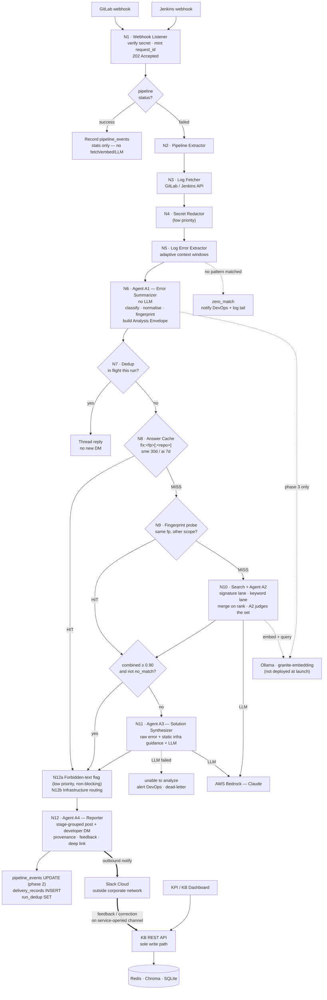

# BFA MVP-2 System Design

**Project:** Build Failure Analyzer — MVP-2 Full Architecture  
**Date:** 2026-08-10  
**Author:** Vignesh Palanivel  
**Status:** Draft v2 — Requirements-driven, flow-corrected  
**Requirements covered:** All 106 (BFA-PP through BFA-FMR)

---

## Table of Contents

1. [Architecture Overview](#1-architecture-overview)
   - **1.0 Terms Used in This Document** (glossary) · 1.1 Component Inventory (with *Exists today?*)
   - 1.2 Flow Step Table (with *Stats written* and *Exists today?*) · 1.3 Flow Diagram
   - 1.4 Stores at a Glance · 1.5 Boundaries and Trust
   - 1.6 Analysis Envelope · **1.7 Agent State Graph**
2. [Configuration Files](#2-configuration-files)
3. [Node-by-Node Analysis](#3-node-by-node-analysis)
4. [Data Schemas](#4-data-schemas)
   - 4.1 SQLite `bfa_kb.db` · 4.2 SQLite `bfa_stats.db` · 4.3 Chroma · 4.4 Redis · 4.5 Relationships
   - **4A. Database Access by Flow Phase** · **4B. Per-Store Access Matrix**
   - **4C. [Error Embedding and Retrieval](#4c-error-embedding-and-retrieval)** — the whole
     search design in one place, in five parts:
     **4C.1** concepts and vocabulary (normalisation · fingerprint · signature · scope) ·
     **4C.2** where fixes are stored and indexed ·
     **4C.3** how an error gets answered, end to end ·
     **4C.4** rollout — what to measure first, the first weeks, what to build when ·
     **4C.5** settings
5. [API Specifications](#5-api-specifications)
6. [Security Design](#6-security-design) — **6.1 Webhook Ingestion (no authentication — network isolation)**
7. [Resilience and Operations](#7-resilience-and-operations)
8. [Logging and Observability](#8-logging-and-observability)
   - 8.1 Log Format · 8.2 Per-Node Fields · 8.3 Health Check · 8.4 Metrics tab
   - **8.5 Measuring the search** — the cold-start indicators, per-lane recall, the outcome-mix
     drift KPI, and an observation → action table
   - 8.6 Current State Analysis · 8.7 Improvement Plan
9. [Test Architecture](#9-test-architecture)
   - 9.1 Replay Harness · **9.2 Retrieval Benchmark** — five arms; arm 3 vs arm 5 is the only decision it exists to make
10. [Agent Detail Specifications](#10-agent-detail-specifications)
    - 10.1 A1 Error Summarizer · **10.1.1 Normalisation, fingerprinting and retrieval — the reasoning behind §4C**
    - **10.1.2 Why `product_team` comes from the namespace**
    - 10.2 A2 Deviation Analyzer · 10.3 A3 Solution Synthesizer · 10.4 A4 Reporter
11. [UI and Dashboard Flows](#11-ui-and-dashboard-flows)
    - **11A. Dashboard Pages — Column Specifications**
12. [Master Flow Chain Audit Table](#12-master-flow-chain-audit-table)
13. [Design Decisions Log](#13-design-decisions-log)

> **Revision note.** This document is the single canonical design. It supersedes
> `LLD.md` (§13.12) and incorporates: the single-service merge, Slack as an outbound
> notification channel plus a narrow feedback/correction channel, ingestion of successful
> pipelines for KPI reporting, and `request_id` as the one identifier.
>
> **Latest revision (§13.25, §13.26).** The search design is consolidated into §4C and
> reduced to what an empty knowledge base can actually use: **one** cache rather than two,
> two search lanes rather than three, resolution scope so that a fingerprint match is not
> treated as a licence to reuse, and `times_seen` ordering so reviewer effort goes where it
> compounds. The Match Result Cache, `kb_version`, the disambiguation hold, and the domain
> RAG collection are removed. Semantic search is deferred to an optional phase 3, decided on
> the §9.2 benchmark rather than assumed.

---

## 1. Architecture Overview

BFA MVP-2 runs as **one service, one process, one port, one repository**. Extraction and
analysis are separated by a Python function call, not an HTTP hop. Slack sits outside the
corporate network and is limited to outbound notification plus a narrow inbound channel for
feedback and solution correction. Every write to every store is performed by this single
process.

### 1.0 Terms Used in This Document

Plain definitions for the terms that appear throughout. Several were renamed in this
revision to remove jargon.

| Term | Plain meaning | Renamed from |
|---|---|---|
| **Generate a `request_id`** | Create one new UUID for this webhook event, before anything else happens, and attach it to every log line, database row, and file that this event produces. | "mint" |
| **Filter events** | Decide whether this webhook is worth processing at all — is it a *finished* pipeline, did it *fail*, is the project in scope, has it already been handled. Non-qualifying events stop here. | — |
| **Build the envelope** | Create one `AnalysisEnvelope` object (§1.6) holding everything known about this error, and pass that single object down the chain, so no later step has to re-derive context. | — |
| **Fingerprint** | A SHA-256 of the *normalised* error text — the identity of an error, stable across repositories. See §10.1.1. | — |
| **Normalise** | Rewrite the error text so that two occurrences of the same problem produce identical text: remove repo and branch names, timestamps, paths, versions, IDs, and casing. See §10.1.1 and the worked example in §1.2. | — |
| **In flight for this run** | The same error is *already being analysed right now* for the same pipeline run — for example a dependency error failing the build, test, and package stages. The second and third occurrences must not trigger a second analysis or a second message. | — |
| **`outcome`** | A2's decision about the candidate set: `REUSED` (one applies as-is), `ADAPTED` (one is nearly right, delivered with a diff), or `NO_MATCH` (none apply → A3). `GENERATED` is recorded when A3 answered. One field, not a probability (§4C.3.1). | — |
| **Cached (computed once, reused)** | The result of an expensive computation is stored under a key so the computation is not repeated. | "memoised" |
| **`fusion_score`** | The result of merging the two search lanes **on rank**. It is **not** a percentage and **not** a similarity — it means *"the lanes collectively ranked this one highly"*. Its only use is an admission floor keeping weak candidates out of A2's prompt. See §4C.3.4 | — |
| **`CANDIDATE_K`** | How many candidates the merged search hands to A2. There is no re-ranking step after it — A2 reads the set and decides. Configurable; see §1.2. | "top-K" |

---

### 1.1 Component Inventory

The **Exists today?** column reflects the current code at the time of writing, verified
file-by-file. It is the honest starting position for estimation — roughly half the pipeline
exists in some form, and the agent layer does not exist at all.

| Node | Component | What it does, in plain terms | Exists today? | Evidence / gap |
|---|---|---|---|---|
| N1 | Webhook Listener | Creates one `request_id` for the event and drops events that are not finished, failed, in-scope pipelines | **Partial** | A UUID is created (`webhook_listener.py:522`, `:772`) but is **8 characters and never written to the database**. Secret validation exists in code today (`:255`, `:276`, `:798`) but is **removed in MVP-2** — see §6.1 |
| N2 | Pipeline Extractor | Parses the webhook into a usable structure and decides whether to continue | **Yes** | `should_process_pipeline` (`pipeline_extractor.py:207`) |
| N3 | Log Fetcher | Downloads the job logs from GitLab or Jenkins | **Yes** | `fetch_job_log` / `fetch_job_log_tail` / `fetch_pipeline_jobs` (`log_fetcher.py:59, 111, 253`) |
| N4 | Secret Redactor *(low priority)* | Masks tokens and passwords before the text is stored or sent | **No** | No `redactor.py`. `logging_config.py:37` masks the service's own **log output** only — the analysed text is never filtered |
| N5 | Log Error Extractor | Finds the error lines and grabs surrounding context | **Partial** | `extract_error_sections` (`log_error_extractor.py:90`) works, but the 17 patterns are hardcoded substrings with no category |
| N6 | **Agent A1 — Error Summarizer** | Classifies the error, normalises the text, computes the fingerprint, builds the envelope | **No** | No normaliser, no fingerprint function, no `agents/` package |
| N7 | Dedup Check | Suppresses the same error already being analysed in this run | **No** | Nothing exists |
| N8 | **Fix Cache** | One lookup that answers "have we already solved this exact error?" | **Partial** | Two separate keys exist (`analyzer_service.py:73-74`) but they are keyed by a SHA-256 of **raw** text, so they effectively never hit |
| N10 | **Search + Agent A2 — Deviation Analyzer** | Runs the signature and keyword lanes, merges them on rank, and lets A2 judge the shortlist | **Partial** | `lookup_existing_fix` (`vector_db.py:159`) exists but is a bare vector query — no signature lane, no FTS5 index, no rank merging, and A2 sees one candidate rather than a set |
| N11 | **Agent A3 — Solution Synthesizer** | Asks the LLM for a fresh fix when nothing stored applies | **Partial** | `resolve` (`resolver_agent.py:64`), `call_llm` (`llm_openwebui_client.py:118`). No JSON schema, no confidence, no structured failure |
| N12 | **Agent A4 — Reporter** | Routes, formats, and delivers the answer | **Partial** | `send_error_message` (`slack_helper.py:229`), `send_dev_dm_fix` (`analyzer_service.py:1339`). No stage grouping, team routing, provenance, or guardrail |
| — | KB REST API | Add, search, edit, deprecate fixes — the only write path | **Partial** | `add_manual_fix` (`:726`), `bulk_manual_fix` (`:764`). No list, search, edit, or deprecate |
| — | Slack Connector | Carries notifications out and feedback/corrections back | **Partial** | Handlers exist in `analyzer_service.py` **and** duplicated in `slack_reviewer.py` — the duplication this design removes |
| — | KPI / KB Dashboard | The pages SMEs use | **No** | No `dashboard/` directory |
| — | Watchdog | Health endpoint and silent-failure alert | **Partial** | `health_check` (`analyzer_service.py:1259`). No silent-failure detection |

**Summary:** 2 of 16 components exist as needed, 9 exist partially, 5 do not exist at all.
The whole agent layer (A1–A4 as designed), both caches as designed, dedup, and the dashboard
are new build.

---

### 1.2 Flow — Step Table

`request_id` is created at step 1 and is present on every row, log line, and file produced
afterwards.

**When statistics are written.** Statistics are **not** written before every step — that
would mean eighteen database writes per error and would leave half-populated rows whenever a
step failed. They are written at **four defined points**, shown in the *Stats written*
column below. The pipeline row is created early (so a failure that never reaches analysis
still appears in the KPI denominator) and completed at the end; analysis measurements are
written when the measurement actually exists.

| # | Step | Condition | Action | Stats written | Exists today? | Next |
|---|---|---|---|---|---|---|
| 1 | Webhook received | — | create `request_id`; reply **202 Accepted**. No authentication check — the endpoint is reachable only from the corporate network (§6.1) | — | Partial — UUID exists but is not persisted | 2 |
| 2 | Status routing | pipeline **succeeded** | record the event only — no log download, no embedding, no LLM | **`pipeline_events` INSERT** | No — only failures are processed today | end |
| 3 | Status routing | pipeline **failed** | record the event, then start the background task | **`pipeline_events` INSERT** | Partial — failures processed, but not recorded as stats rows | 4 |
| 4 | Fetch logs | — | download the job logs | — | Yes | 5 |
| 5 | Redact | *(low priority)* | mask secrets before anything is stored or sent | — | **No** | 6 |
| 6 | Extract errors | patterns matched | produce `error_sections[]` (shape below) | — | Partial — patterns hardcoded | 7 |
| 6a | Extract errors | nothing matched | record a zero-match event; notify DevOps with the log tail | zero-match row | No | end |
| 7 | **A1** | — | classify → normalise → fingerprint → build the envelope | `pipeline_events` UPDATE (classification) | **No** | 8 |
| 8 | Dedup | already in flight for this run | reply in the existing message thread instead of sending a new one | — | **No** | end |
| 9 | **Fix cache** | hit | reuse the stored answer; skip the vector search and the LLM entirely | — | Partial — keys exist but never hit | 14 |
| 10 | Match result cache | hit | reuse A2's earlier decision; skip the embedding call and the vector query | — | **No** | 12 |
| 11 | **Search + A2** | miss | signature lookup + keyword search → merge on rank → shortlist → **A2 judges the whole set** | **`request_telemetry` INSERT** | Partial — `lookup_existing_fix` exists; no signature lane, no FTS5, no rank merging | 12 |
| 12 | A2 judgement | `outcome` ∈ `REUSED` / `ADAPTED` | use the stored fix, adapted if needed | — | No | 14 |
| 13 | **A3** | below threshold, or `no_match` | ask the LLM for a fresh fix | `request_telemetry` UPDATE (cost, latency) | Partial — unstructured | 14 |
| 13a | **A3** | LLM failed | reply "unable to analyze", alert DevOps, write a dead-letter file | telemetry marked `unable` | No | end |
| 14 | Forbidden-text check *(low priority)* | pattern matched | flag for SME visibility — **does not block delivery** | — | No | 15 |
| 15 | Infrastructure routing | category is `infrastructure` | send to the DevOps channel; tell the developer it was not their change | — | No | 17 |
| 17 | **A4 delivery** | — | one message per failed stage; developer DM with provenance, feedback buttons, dashboard link | — | Partial — flat messages only | 18 |
| 18 | Completion | — | finish the pipeline row and record what was delivered | **`pipeline_events` UPDATE + `delivery_records` INSERT** | No | end |

#### What `error_sections[]` looks like

`error_sections[]` is what N5 hands to A1: one entry per detected error region, each holding
the matched error lines plus the surrounding context that was captured with them.

```python
[
  {
    "error_lines":   ["npm ERR! code ERESOLVE",
                      "npm ERR! ERESOLVE unable to resolve dependency tree",
                      "npm ERR! Found: react@18.2.0"],
    "context_lines": ["Resolving dependencies...",
                      "Reading package.json",
                      "added 214 packages in 12s"],
    "error_pattern": "npm_error",       # which rule matched
    "error_category": "dependency",     # from error_patterns.json
    "sub_category":  "npm",
    "line_range":    [842, 907]         # position in the original log
  },
  { ... one entry per further error region ... }
]
```

Two regions that overlap are merged into one entry, so the same lines are never analysed
twice. Today's code returns a **single joined string** instead of this list — that change is
requirement A-1.

#### What "normalise" means, concretely

Normalising rewrites the error text so that the *same problem* always produces the *same
text*, and therefore the same fingerprint. Three layers, described fully in §10.1.1:

```
BEFORE  2026-08-09T04:12:55Z [ERROR] Failed to execute goal on project payments-svc:
        Could not find artifact com.acme:auth-lib:jar:2.9.4
        at /builds/runner-02/payments-svc/pom.xml

AFTER   [error] failed to execute goal on project <REPO>:
        could not find artifact com.acme:auth-lib:jar:<VER>
        at <PATH>/pom.xml
```

Removed: the timestamp, the repository name, the version number, the build path. Kept:
`auth-lib` — the actual diagnosis. The same failure in a different repository normalises to
exactly this string, which is what lets one cache entry and one knowledge-base row serve
every product.

#### What `outcome ∈ REUSED / ADAPTED` means

This is the gate that decides whether a stored fix is served instead of calling the LLM — and
**it is a judgement, not a number.** An earlier draft gated on a blended similarity score
crossing 0.90. That is gone. §4C explains the full reasoning; the short version:

| Old design | Now |
|---|---|
| `combined_score = 0.60 × error_similarity + 0.40 × context_similarity`, served if ≥ 0.90 | the search produces a **shortlist**; A2 reads it and decides |
| context compared by cosine between two averaged bags of log lines | A2 receives the context lines and *reads* them |
| candidates from a different `error_category` deleted before scoring | no category filter — it never protected routing, and it deleted correct fixes when a failure was classified differently today than historically |
| a score threshold decided whether to serve | `outcome` decides: `REUSED`, `ADAPTED`, or `NO_MATCH` |

**What survives as a number** is `fusion_score` — the result of merging the two search lanes
on rank (§4C.3.4). Its only job is an **admission floor**: keep obviously weak candidates out
of A2's prompt. It is not a percentage, it is not a similarity, and nothing is served on the
strength of it alone.

**Why the change.** A fix is served without an LLM reasoning about it in exactly one place:
the answer cache, on an exact fingerprint match within the correct scope (§4C.3.3). Everywhere
else, judgement runs. Gating on a blended score meant a fix could be served because two numbers
crossed a line, and the one component able to notice that the artifact was *different* — A2 —
had already been bypassed.

**Product, stage, and category are used nowhere in ranking.** Not as a filter, not as a score
term, not as a tie-break. A good fix from another team wins on merit, which is the whole point
of normalising repository names out of `error_key` in the first place.


**Tuning the candidate-set size.** `CANDIDATE_K` controls how many candidates A2 is shown.

| Value | Effect | When to use |
|---|---|---|
| 3–5 | cheapest prompt; risks the correct fix falling just outside the shortlist | small knowledge base (< 200 fixes) |
| **10** | **default** — a starting point, not a measured value | initial deployment |
| 15–20 | best recall, but more distractors in the prompt | large knowledge base, or if the benchmark shows recall below its gate |

**More is not simply better.** Every extra candidate is prompt cost *and* a distractor. A2's
accuracy is expected to rise with `CANDIDATE_K`, peak, and then fall — so there is an interior
optimum, and §9.2 measures it by sweeping K. Measure, do not guess.

---

### 1.3 Flow Diagram



### 1.4 Stores at a Glance

| Store | Role | Holds | Authority |
|---|---|---|---|
| **Redis** | cache only | `fix:<fp>[:<repo>]` (merged SME + AI, scope-keyed), `run_dedup`, `thread_map` | never a source of truth |
| **Chroma** | **phase 3 — not deployed at launch** | `id = fix-<fingerprint>`, embedding of `error_key` | rebuildable from SQLite (§4.3) |
| **SQLite** | system of record | `fixes`, `fix_revisions` (metadata) + `pipeline_events`, `request_telemetry`, `delivery_records`, `feedback_events`, `sme_audit_log` (statistics), joined on `request_id` / `fingerprint` / `fix_id` | **authoritative** |

### 1.5 Boundaries and Trust

| Boundary | Direction | Authentication | Notes |
|---|---|---|---|
| GitLab / Jenkins → BFA | inbound | **none** — network isolation only (§6.1) | reachable only from the corporate network |
| BFA → GitLab / Jenkins API | outbound | CI token | log retrieval |
| BFA → Ollama, Chroma | local | none — loopback | **phase 3 only** — not deployed at launch (§4C.4.3) |
| BFA → AWS Bedrock | outbound | egress path | called by **A2 and A3** |
| BFA → Slack Web API | outbound | bot token | notifications |
| Slack → BFA | inbound over a **service-opened** channel | app-level token; request signature if a published URL is used instead | feedback and correction only — never approve, deprecate, or delete |
| Dashboard → KB API | internal | session / SSO | sole write path for state changes |
| No JWT is used on any interface, and no external application submits work. | | | |

### 1.6 Analysis Envelope

One object, created at A1, passed down the chain by reference. It exists because without it
each function receives only what its immediate caller chose to pass, so context built early
is silently lost later.

**The rule: each field is written by exactly one node, then read-only.** That is what makes
the flow debuggable — if a value is wrong, only one node could have written it.

| # | Field | Type | What it holds | Written by | Read by |
|---|---|---|---|---|---|
| 1 | `request_id` | `str` | The one identifier for this webhook event — a UUID created before any other work. Appears on every log line, database row, and dead-letter file. | **N1** | everything downstream; it is also the `pipeline_events` primary key |
| 2 | `pipeline_info` | `dict` | Everything the webhook told us: repo, project id, branch, commit, pipeline id, `job_names`, triggering user and email, stage list. | **N2** | A1 (classification, product, normalisation), A3 (prompt), A4 (routing and the DM) |
| 3 | `error_key` | `str` | The error text after normalisation — timestamps, repo and branch names, paths, and versions removed. **This is what gets embedded.** | **N6 · A1** | A2 (embedding), A3 (prompt) |
| 4 | `fingerprint` | `str` | SHA-256 of `error_key` — the error's identity. Exact-or-nothing; never a similarity (§4C.1.3). | **N6 · A1** | N7 dedup, N8 cache key, N9 scope probe, A4 |
| 5 | `context_block` | `ContextBlock` | Three labels: `product_team`, `stage_type`, `error_category`. **Used for routing, grouping and reporting only — never in ranking** (§4C.3.4). | **N6 · A1** | A3 (prompt), A4 (routing), all telemetry |
| 6 | `is_infra` | `bool` | True when the category is `infrastructure`. Decides whether the developer is contacted at all. | **N6 · A1** | A4 |
| 7 | `fix_text` | `str \| None` | The remediation to deliver. Empty until something supplies it. | **N8**, **N9**, **A2**, or **A3** — whichever resolves first | A4 |
| 8 | `fix_source` | `str` | Where `fix_text` came from: `sme_cache`, `ai_cache`, `search`, `llm_generated`, or `no_match`. The single most useful field in the KPI page. | same node that set `fix_text` | A4, telemetry |
| 9 | `approved_by` | `str \| None` | The SME who approved this fix, when the answer came from an approved one. Drives the provenance line in the DM. | **N8** (from the cache value) | A4 |
| 10 | `outcome` | `str \| None` | A2's judgement: `REUSED`, `ADAPTED`, or `NO_MATCH`. Categorical, never a probability (§4C.3.1). | **A2** (or `GENERATED`, by A3) | routing, A4, telemetry |
| 11 | `ranked_candidates` | `list \| None` | The shortlist handed to A2 (§4C.3.4) — a *set* of suggestions, never a winner. Each entry keeps its per-lane positions for debugging. | **N9**/**N10** search; cleared by **A3** | A2, telemetry |
| 12 | `top_candidate` | `dict \| None` | The highest-scoring candidate, kept separately for convenience. | **N9** or **A2** | threshold gate, A4 |
| 13 | `slack_message_ts` | `str \| None` | Timestamp of the message A4 posted, so later stages of the same run reply in that thread. | **A4** | dedup thread replies |
| 14 | `scenario_id` | `str \| None` | Replay only — the corpus scenario being run, so debug output can be filtered per scenario. `None` in production. | replay harness | logging |

```python
@dataclass
class ContextBlock:
    product_team: str      # from the repository namespace (§10.1.2)
    stage_type: str        # build | test | package | deploy
    error_category: str    # code | infrastructure | dependency | configuration
```

**Reading the table as a timeline.** Fields 1–2 exist before analysis starts. Fields 3–6 are
filled by A1 and never change. Fields 7–12 are filled by whichever node resolves the
request — and only one of them does, which is why a request costs one lookup path, not
several. Field 13 is written after delivery. Field 14 is only ever set during a replay.

### 1.7 Agent State Graph

The envelope (§1.6) is the **data**. This is the **control flow** — which node runs next,
and why. Every row below is one possible move; the notes explain what actually happens and
why the move exists.

| From | Condition | Goes to | What is happening, and why |
|---|---|---|---|
| **A1** | always | Dedup | A1 has no failure exit. It only classifies and normalises text, which cannot fail in a way worth stopping for — if normalisation misbehaves it falls back to the raw lines and carries on. Everything downstream depends on the fingerprint existing, so A1 must always produce one. |
| **Dedup** | this error is already being analysed for this pipeline run | **stop** — reply in the existing thread | One broken dependency usually fails build, test, and package. Without this, that is three analyses, three LLM calls, and three messages for one problem. The second and third arrivals post a reply under the first message instead. |
| **Dedup** | not already in progress | Fix cache | The normal path. |
| **Fix cache** | hit | **A4** | We have solved this exact error before. Nothing else needs to run — no embedding, no vector search, no LLM. This is the cheapest outcome and, once the knowledge base is warm, the most common one. |
| **Fix cache** | miss | Match result cache | No stored answer, so ask whether we have at least already *searched* for one. |
| **Match cache** | hit, and it was not `no_match` | **A4** | We searched before and found something usable. The candidate list is restored from the cache, so the embedding call and vector query are skipped — but the routing decision still runs, because context may have changed. |
| **Match cache** | hit, and it was `no_match` | **A3** | We searched before and found nothing. There is no point searching again, so go straight to generating a fresh fix. |
| **Match cache** | miss | **A2** | Never searched for this error in this context. Do the full search. |
| **A2** | `outcome` ∈ `REUSED` / `ADAPTED` | **A4** | A2 read the candidate set and judged that one applies. Serve it — adapted, with a diff, if the fix needed a change (§4C.3.1). |
| **A2** | score below threshold, or `no_match` | **A3** | Either nothing was similar enough, or something looked similar but A2 judged it inapplicable. Generate instead. |
| **A2** | SQLite is unavailable | **fatal** | SQLite is the system of record — both search lanes and the fix table live in it. Nothing can proceed. |
| **A2** | The LLM is unavailable | **"unable to analyze"** | Exact answer-cache hits still deliver; anything needing judgement cannot be answered, and is not guessed. |
| **A2** | top two candidates score almost identically | **A4** → held | The system cannot tell which of two fixes applies, so it shows both to an SME and pauses rather than guessing. *(Candidate for removal — see §13.19.)* |
| **A3** | LLM returned a fix | **A4** | Normal generation path. |
| **A3** | LLM failed after retries | **stop** — "unable to analyze" | The developer is told plainly that no answer could be produced, DevOps is alerted, and the event is written to the dead-letter directory so it can be replayed later. It is never silently dropped. |
| **A4** | delivered | **stop** — completion write | The pipeline row is completed and a delivery record is written. This is the normal end of the flow. |

#### Five properties that hold by design

| Property | Plain meaning | Why it matters |
|---|---|---|
| **The flow only ever moves forward** | No step can send the work back to an earlier step. Follow any path and you always end up further along, never in a loop. | A single error can never be analysed twice, so it can never cost the LLM twice, and the system cannot get stuck circling between two steps. |
| **Every path ends somewhere definite** | Each route finishes either at A4 (delivered) or at a named stop — thread reply, unable-to-analyze, or held for review. | No event can quietly vanish. If nothing was delivered, one of the named stops explains why. |
| **A2 and A3 never both answer** | A3 runs only when A2 declined. They are alternatives, not a sequence. | The cost per error is bounded: at most one LLM generation call, never two. |
| **Every fallback moves forward too** | When a dependency is down, the flow skips ahead to a simpler path — never backwards to retry. | An outage lowers answer quality but never takes the service down or causes a retry storm. |
| **A1 and A4 cannot fail the request** | They are deterministic bookkeeping steps with fallbacks built in. | Something always creates the fingerprint, and something always tells the developer what happened. |

## 2. Configuration Files

One JSON file is validated at startup. The service refuses to start if it is missing or malformed (BFA-ARCH-1110). Two env vars control Slack notification targets: `DEVOPS_SLACK_CHANNEL` and `SME_SLACK_CHANNEL` (validated at startup — service refuses to start if absent).

### 2.1 `.env` — environment configuration

The service reads its runtime settings from environment variables. A subset is
**mandatory**: if any of these is missing or unparseable, the service **refuses to start**
and prints which variable is at fault, rather than starting and failing later on the first
webhook (BFA-ARCH-1110).

A representative subset — not the full list:

| Variable | Example | Why the service cannot start without it |
|---|---|---|
| `GITLAB_URL` | `https://gitlab.internal` | job logs cannot be fetched |
| `GITLAB_TOKEN` | `glpat-…` | the log API rejects unauthenticated reads |
| `JENKINS_URL` | `https://jenkins.internal` | required only if Jenkins ingestion is enabled |
| `CHROMA_HOST` / `CHROMA_PORT` | `localhost` / `8000` | no vector search without it |
| `OLLAMA_URL` | `http://localhost:11434` | no embeddings, so no retrieval |
| `LLM_ENDPOINT` | `https://chat.sandvine.com/apis` | A3 cannot generate fixes |
| `REDIS_HOST` / `REDIS_PORT` | `localhost` / `6379` | caching is unavailable |
| `KB_DB_PATH` / `STATS_DB_PATH` | `./data/bfa_kb.db` | nowhere to write the system of record |
| `SLACK_BOT_TOKEN` | `xoxb-…` | results cannot be delivered |
| `DEVOPS_SLACK_CHANNEL` | `#ci-devops` | infrastructure errors have nowhere to go |
| `ERROR_PATTERNS_CONFIG` | `config/error_patterns.json` | no error detection at all |
| `ROUTING_CONFIG` | `config/routing.json` | team routing cannot resolve |

Optional variables carry defaults and do not block startup — for example
`CANDIDATE_K` (10 — how many candidates A2 sees), `MIN_FUSION_SCORE` (**no default — establish
by measurement, §4C.3.4**), `SIG_WEIGHT` (2.0) and `LEXICAL_WEIGHT` (1.0 — how much each search
lane counts when merging), `RRF_K` (60 — the rank-fusion constant), `AI_FIX_TTL` (7 d),
`SME_FIX_TTL` (30 d), `LOG_LEVEL` (`INFO`). See §4C.5

Two settings are **not** environment variables because they are vocabulary rather than
tuning, and belong beside the patterns they describe in `error_patterns.json`: the
`signature` extraction rules (§4C.4) and the per-category `severity_weight` used to report
weighted value instead of a raw count (§8.5.3).

**Rules.** Secrets appear only in the environment, never in source or in the repository. A
`.env.example` lists every variable with a safe placeholder value, and startup validation is
driven from that same list so the two cannot drift apart.

---

### `error_patterns.json`

**This file is the only place the category names are defined.** It lists the allowed
`categories` and `sub_categories` at the top, and every pattern must use one of those
listed values. If someone adds a pattern with a category that is not in the list, the
service refuses to start and names the offending pattern — so the set of category names
stays fixed and consistent instead of growing informally with typos and near-duplicates
like `infra`, `infrastructure`, and `Infrastructure` all meaning the same thing.

This replaces the hardcoded `ERROR_PATTERNS` list in `log_error_extractor.py`, which today
is 17 plain lowercase substrings with no structure at all.

```json
{
  "version": 1,

  "categories":     ["code", "infrastructure", "dependency", "configuration"],
  "sub_categories": ["npm", "maven", "pip", "gradle", "docker", "kubernetes",
                     "network", "dns", "permission", "timeout", "disk", "compiler"],

  "patterns": [
    { "pattern": "make: ***",       "category": "code",           "sub_category": "compiler",   "label": "makefile_error",    "enabled": true },
    { "pattern": "docker.errors",   "category": "infrastructure", "sub_category": "docker",     "label": "docker_failure",    "enabled": true },
    { "pattern": "could not resolve","category": "infrastructure","sub_category": "dns",        "label": "dns_resolution",    "enabled": true },
    { "pattern": "npm ERR!",        "category": "dependency",     "sub_category": "npm",        "label": "npm_error",         "enabled": true },
    { "pattern": "PermissionError", "category": "infrastructure", "sub_category": "permission", "label": "permission_denied", "enabled": true }
  ]
}
```

| Field | Description | Used In |
|---|---|---|
| `pattern` | The text to look for in each log line. If a line contains it, this rule matched. | The extractor only — it is not stored anywhere afterwards. |
| `category` | **The broad type of problem** — one of `code`, `infrastructure`, `dependency`, `configuration`. This is the field that decides whether the developer or the DevOps channel is told (B-11). | Stored on the fix record, on every telemetry row, and in the vector store metadata. Shown as a filter on the KPI and Knowledge Base pages. |
| `sub_category` | **The specific tool or area** — `npm`, `docker`, `dns` and so on. A finer label than `category`, used for grouping in reports. | Stored on the fix record and on telemetry rows. Shown as a second-level filter in the dashboard. |
| `label` | A short fixed name for this exact rule, e.g. `npm_error`. Unlike `category` it never changes meaning, so it is safe to count over time. | Collected into the `labels` list on telemetry rows; used when counting "how often did this specific rule fire". |
| `enabled` | Set to `false` to switch a rule off without deleting it. | The extractor skips disabled rules at load time. |

**Reading the "Used In" column.** It answers "once this rule matches a log line, where does
this field end up?" A value set here is copied onto the analysis envelope, then written to
the database rows created for that error, and finally becomes a filter option in the
dashboard. So a category chosen in this file is the same string an SME later filters by.

**How to see the current list of categories without opening the file.** Call
`GET /api/meta/categories`. It returns the category and sub-category names from this file,
each with a count of how often it actually occurred in the last 30 days. Two practical uses:
the dashboard's filter drop-downs are built from this response instead of a hand-typed list,
and a name with a count of zero is dead — it is declared but nothing ever matches it.

**Validation rules enforced at startup**

| Rule | Failure behaviour |
|---|---|
| `label` unique across all patterns | refuse to start, naming the duplicate |
| `category` ∈ declared `categories` | refuse to start, naming the pattern |
| `sub_category` ∈ declared `sub_categories` | refuse to start, naming the pattern |
| regex compiles | refuse to start, naming the pattern |

---

## 3. Node-by-Node Analysis

| Node | ID | Inputs | Processing | Outputs | Next Node | Error Handling |
|---|---|---|---|---|---|---|
| **Startup Validator** | N0 | `error_patterns.json`, `routing.json`, mandatory env vars (§2.1) | Load and validate both config files: every `category` and `sub_category` must be declared; every regex must compile; `label` must be unique. Assert every mandatory env var is present | Pass / Fail | N1 on pass; `sys.exit(1)` on fail | Write a specific error to stderr naming the exact bad field or pattern |
| **Webhook Listener** | N1 | HTTP POST `/webhook` or `/webhook/jenkins` | Generate `request_id`; check event type; check pipeline status. **No authentication** — network isolation only (§6.1) | `request_id` + validated payload dict | N2 | HTTP 200 "ignored" on non-failed or out-of-scope status |
| **Pipeline Extractor** | N2 | Webhook payload dict | Call `PipelineExtractor.extract_pipeline_info()`; call `should_process_pipeline()` (project allow/block list, status filter); apply `external` stage guard | `pipeline_info` dict added to Envelope; fire background task | N3 (background) | Return `"skipped"` with log reason if filtered |
| **Log Fetcher** | N3 | `pipeline_info` (from Envelope): `project_id`, `pipeline_id` | Call `fetch_pipeline_jobs(project_id, pipeline_id)` → list of jobs; for each failed job call `fetch_job_log_tail(project_id, job_id)`; apply `should_save_job_log()` filter; collect `job_names` list | `all_logs: List[{job_id, job_name, details, log_text}]` (one entry per failed job); add `job_names` list to `pipeline_info` in Envelope | N4 (iterates over list) | Retry up to `RETRY_ATTEMPTS` with exponential backoff; on exhaustion → dead-letter + DevOps alert |
| **Secret Redactor** | N4 | `all_logs` list (from N3); iterates over each entry | For each entry: regex-strip `PRIVATE-TOKEN:`, `password=`, credential URLs, JWT strings, API keys from `log_text` | `all_logs_redacted: List[{job_id, job_name, details, log_text_redacted}]` — same structure, `log_text` replaced | N5 | Log warning per entry with line count redacted; never raise — redaction failure replaces `log_text` with empty string, not drop |
| **Log Error Extractor** | N5 | `all_logs_redacted` list (from N4); iterates over each entry | For each entry: pattern-match `log_text_redacted` against `error_patterns.json`; adaptive context windows (≤50 matches: 50b/10a, ≤150: 10b/5a, >150: 5b/2a); deduplicate overlapping windows; concatenate all entries into flat list | `error_sections: List[str]` (all error windows across all jobs, flat) | N6 | Empty result for all jobs → log "no errors found" + skip to monitoring update |
| **Agent A1 — Error Summarizer** | N6 | `error_sections: List[str]` (from N5); `pipeline_info` dict (from N2, including `job_names`) | ① `error_category` from `error_patterns.json` labels (majority across sections); ② `stage_type` from `job_names[0]` substring match (build/test/package/deploy); ③ `product_team` from the **namespace**, not the repo name (§10.1.2); ④ **conservative** normalisation → `error_key` — strip run identity only (timestamps, ANSI codes, `Line N:` prefixes, pipeline/build/job IDs, runner name, repo/branch, workspace path **prefix**). **Versions, artifact names, in-repo paths, line numbers and error codes are KEPT** (§4C.1.2); ⑤ SHA-256 `fingerprint`; ⑥ build `signature` from the matched pattern's `category\|sub_category\|label` plus optional `subject_regex` (§4C.1.4); ⑦ UPDATE `fixes.times_seen + 1` for this fingerprint if a row exists (§4C.2.4); ⑧ INSERT partial `pipeline_events` row → get `request_id`; ⑨ assemble Analysis Envelope | Populated `AnalysisEnvelope` (`request_id`, `pipeline_info`, `fingerprint`, `error_key`, `signature`, `context_block`, `is_infra`; `fix_text`/`outcome`/`ranked_candidates` all `None`) | N7 | Pattern file missing at runtime → alert + use generic category; partial DB write failure → log + continue with `request_id=None` |
| **Dedup Check** | N7 | Envelope: `fingerprint`, `pipeline_info.pipeline_id` (as `pipeline_run_id`) | Redis GET `run_dedup:<pipeline_run_id>:<fingerprint>` (1h TTL); value is `slack_message_ts` of first delivery | Hit → set `envelope.slack_message_ts = cached_ts`, route to THREADREPLY; miss → continue | THREADREPLY (hit) or N8 (miss) | Redis unavailable → treat as miss; never block on cache failure |
| **Thread Reply** | THREADREPLY | Envelope: `slack_message_ts`, `pipeline_info` (stage name), `error_key` | Post thread reply to existing Slack message at `slack_message_ts`; UPDATE `bfa_stats.db.pipeline_events` SET `failed_jobs = failed_jobs+1` if `request_id` exists; INSERT `delivery_records` with `slack_message_ts` reference | Thread reply posted; `pipeline_events` row updated (partial phase-2 — no `final_status` write since event is still in-flight) | Terminal | SlackApiError → log and skip; DB update failure → log and skip |
| **Answer Cache Check** | N8 | Envelope: `fingerprint`, `repo` | Redis GET `fix:<fingerprint>` then `fix:<fingerprint>:<repo>` → JSON `{fix_text, source, approved_by, fix_id, scope}`. One lookup covers both SME-approved and AI-generated fixes; `source` says which. TTL 30 d (`sme`) / 7 d (`ai`) | Envelope updated: `fix_text`, `fix_source` (`sme_cache` or `ai_cache`), `approved_by` when `source=sme` | N12a on hit; N9 on miss | Redis unavailable → skip to N9 |
| **Fingerprint Scope Probe** | N9 | Envelope: `fingerprint`, `repo` | SELECT from `fixes` WHERE `fingerprint` matches — **any scope, any status, `pending` included**. An exact fingerprint match is the strongest evidence available; the question A2 is being asked is environmental applicability, not whether it is the same error (§4C.3.1 step 0b) | Envelope: `ranked_candidates` **seeded** with the out-of-scope fix, labelled with its `scope`, `status` and provenance | N10 (always — the probe never delivers on its own) | SQLite unavailable → fatal |
| **Search + Agent A2 — Deviation Analyzer** | N10 | Envelope (`error_key`, `signature`, `context_lines`, `fingerprint`, seeded `ranked_candidates`); `SIG_WEIGHT`, `LEXICAL_WEIGHT`, `RRF_K`, `MIN_FUSION_SCORE`, `CANDIDATE_K` | ① **Signature lane** — indexed lookup on `fixes.signature`; ② **Keyword lane** — FTS5 `MATCH` over `fixes_fts` (hierarchical tokens); ③ **Merge on rank** by Reciprocal Rank Fusion → `fusion_score` (§4C.3.4); ④ **Filter** — `status='active'` and `fusion_score ≥ MIN_FUSION_SCORE`, nothing else; ⑤ Take top `CANDIDATE_K` as a **set**; ⑥ A2 judges the whole set → `outcome ∈ REUSED\|ADAPTED\|NO_MATCH`; on `REUSED` from another repo, **promote `scope` to `global`**; ⑦ INSERT rejected candidates into `match_rejections`; ⑧ INSERT `request_telemetry` | Envelope updated with `outcome`, `ranked_candidates`, `top_candidate`, `fix_text`, `adapted_diff` | N12a (`REUSED`/`ADAPTED`); N11 (`NO_MATCH`) | SQLite unavailable → fatal; LLM unavailable → "unable to analyze" |
| **Agent A3 — Solution Synthesizer** | N11 | Envelope (`error_raw`, `context_block`, `pipeline_info`) | ① Assemble LLM prompt — **`error_raw`, not `error_key`** (A3 needs the exact version and path to reason about a fix, §4C.1.7) + context lines + repo + branch + static infra guidance from `infra_overview.md`; ② Call LLM (OpenWebUI); ③ INSERT `fixes` `status='pending'`, `scope='repo'`; ④ Redis SET `fix:<fingerprint>:<repo>` `source=ai` **7 d**, labelled unreviewed (never overwrites an `sme` entry) | Envelope updated with `fix_text`, `fix_source="llm_generated"` | N12a | LLM fail → send "unable to analyze" + email + Slack to DevOps + write dead-letter; never silently discard |
| **Forbidden Text Gate** | N12a | Envelope (`fix_text`) | Check `fix_text` against `FORBIDDEN_TEXT_PATTERNS` env var list | Pass or match | N12b (pass); A4 SME warning route (match) | Config missing → log warning, treat as empty list (never block delivery) |
| **Infrastructure Gate** | N12b | Envelope (`is_infra`) | Check `is_infra` flag | Pass or infrastructure | N12 (pass); A4 DevOps route (infra) | — |
| **Agent A4 — Reporter** | N12 | Full Envelope (`fix_text`, `fix_source`, `approved_by`, `context_block`, `pipeline_info`, `is_infra`, `fingerprint`, `request_id`) | ① READ `bfa_kb.db.fixes` WHERE `fingerprint`: get `hit_count`, `last_seen`, `jira_key`; ② Developer lookup by email (`triggered_by_email`); ③ Build DM (`fix_text` + provenance using `approved_by` or `fix_source` + `hit_count` + `last_seen` + `repo` + feedback buttons + dashboard deep link); ④ Developer not found → fallback to email via `triggered_by_email` (SMTP); ⑤ UPDATE `pipeline_events` (`final_status`, `total_duration_ms`); ⑥ INSERT `delivery_records`; ⑦ UPDATE `bfa_kb.db.fixes` SET `hit_count+1`, `last_seen=now()`; ⑧ Redis SET `run_dedup:<pipeline_id>:<fp>` = `slack_message_ts` (1h TTL); ⑨ Set `envelope.slack_message_ts` | Slack DM (or email fallback) delivered; `pipeline_events` updated; `delivery_records` inserted; `run_dedup` Redis key written | Feedback loop (async, via the Slack connector); Jira creation is a dashboard action | SlackApiError → fallback to email; developer not found → send fix via SMTP to `triggered_by_email`; `request_id` None → skip `pipeline_events` UPDATE, still INSERT `delivery_records` |
| **KB REST API** | N14 | RS256 JWT (Slack service) or session token (dashboard) + action payload | Validate token (RS256 for Slack service; session token lookup in Redis for dashboard); route to approve/edit/discard/feedback handler. **On approve:** SQLite INSERT/UPDATE (`status='active'`) + `fix_revisions` INSERT + **FTS5 index write** (hierarchical tokens, §4C.2.5) + Redis SET `fix:<fp>` `source=sme` + `sme_audit_log` INSERT. Single writer, one transaction boundary. | `{status: ok, fix_id, revision}` | Terminal | SQLite WAL mode |
| **Dashboard API** | N15 | Session token + query params | Validate session token (Redis lookup); query `bfa_kb.db` and `bfa_stats.db`; support pagination, free-text search, label filtering; return Resolved / Needs-Attention / Stats views | Paginated JSON | Terminal | Invalid/expired session → HTTP 401; read-only; no lock contention |
| **Health Check** | N16 | None | Check SQLite (fatal if down); ping Redis; call LLM health; check GitLab and Jenkins reachability; check Slack token | `{status, sqlite, redis, llm, gitlab, jenkins, slack}` | Terminal | Each check independent; only SQLite or the LLM makes the service unable to work — see §8.3 |
| **Metrics endpoint** | N17 | None | Aggregate counters from `request_telemetry` and `pipeline_events` | JSON (§8.4), rendered as a table in the dashboard Metrics tab | Terminal | Always available; never blocks the request path |
| **Slack Actions Handler** | N18 | HTTP POST `/bfa/slack/actions` (Slack platform) | Validate Slack HMAC-SHA256 signature; parse `action_id` (e.g. `feedback_positive_<fp>`, `feedback_negative_<fp>`, `create_jira_<fp>`); route to feedback handler or Jira handler; call `POST /api/kb/{fix_id}/feedback` internally | Feedback recorded in `bfa_stats.db.sme_audit_log`; 3-thumbs-down → route to SME channel | Terminal | Invalid signature → HTTP 403; unknown action_id → log + HTTP 200 (Slack requires 200 for all actions) |

---

## 4. Data Schemas

### 4.1 SQLite — `bfa_kb.db`

**Source of truth for every fix and its full lifecycle** — not only approved ones. An
AI-generated fix is written here immediately with `status='pending'`, which is what the
Pending Review page reads; SME approval promotes it to `active`. Uses WAL mode for
concurrent reads.

| `status` | Meaning | Served by A2 retrieval? | Appears in |
|---|---|---|---|
| `pending` | AI-generated, awaiting SME review | **No** | Pending Review page |
| `active` | SME-approved and in use | **Yes** | Knowledge Base page |
| `deprecated` | withdrawn but retained for audit | No | KB page with filter |
| `discarded` | rejected at review | No | audit trail only |

**Retrieval rule:** A2 matches `status = 'active'` only. An unapproved fix is never served
as though it were curated.

**`fixes` — column reference.** The DDL follows; this table explains each column in words.

| Column | Type | Meaning | Set by |
|---|---|---|---|
| `id` | INTEGER PK | Row number. Referenced by `fix_revisions` and by the keyword index. | database |
| `fingerprint` | TEXT unique | The error's identity — SHA-256 of the normalised text (§10.1.1). One row per distinct error. | A1 |
| `error_key` | TEXT | Conservatively normalised error text — run identity removed, versions and paths kept (§10.1.1). Embedded **and** indexed for keyword search. | A1 |
| `fix_text` | TEXT | The remediation shown to the developer. Changes when an SME edits it. | A3 or SME |
| `revision` | INTEGER | Increments on every edit. Pairs with `fix_revisions` for the full history. | KB API |
| `status` | TEXT | `pending` → `active` → `deprecated`/`discarded`. **Only `active` is ever served.** | KB API |
| `product_team` | TEXT | Owning product, from the repository namespace (§10.1.2). Used for routing and for grouping every KPI. | A1 |
| `stage_type` | TEXT | `build`, `test`, `package`, or `deploy` — inferred from the job name. | A1 |
| `error_category` | TEXT | Broad problem type from `error_patterns.json`. Decides developer-vs-DevOps routing. | A1 |
| `sub_category` | TEXT | Specific tool or area, e.g. `npm`, `docker`. Reporting only. | A1 |
| `labels` | TEXT (JSON) | Which specific pattern rules matched. Safe to count over time. | A1 |
| `source_ci` | TEXT | `gitlab` or `jenkins`. | N2 |
| `source_repo` | TEXT | The repository this fix was first seen in — shown as provenance in the DM. | A1 |
| `approved_by` | TEXT | Who approved it. Empty while `status='pending'`. | KB API |
| `hit_count` | INTEGER | How many times this fix has been delivered. Drives the "served 12×" provenance line and pruning. | A4 |
| `first_seen` | TEXT | When the error was **first analysed** — not when it was approved. | A1 |
| `last_seen` | TEXT | Most recent delivery. Distinguishes live problems from stale ones. | A4 |
| `fix_confidence` | REAL | Running average of `fusion_score` across deliveries — how strongly this fix keeps being found. | A4 |
| `sme_review_count` | INTEGER | Times sent back for review after negative feedback. A high value means a poor fix. | KB API |
| `jira_key` | TEXT | Linked ticket, if one was raised from the dashboard. | KB API |
| `created_at` / `updated_at` | TEXT | First write and last change. | database |

```sql
PRAGMA journal_mode=WAL;

CREATE TABLE IF NOT EXISTS fixes (
    id              INTEGER PRIMARY KEY AUTOINCREMENT,
    fingerprint     TEXT    NOT NULL UNIQUE,
    error_key       TEXT    NOT NULL,
    signature       TEXT,               -- NEW: category|sub_category|label[|subject] (§4C.1.4)
    fix_text        TEXT    NOT NULL,
    revision        INTEGER NOT NULL DEFAULT 0,
    status          TEXT    NOT NULL DEFAULT 'pending'
                            CHECK(status IN ('pending','active','deprecated','discarded')),
                            -- pending  = AI-generated, awaiting SME review (Pending Review page)
                            -- active   = SME-approved; ONLY this status is returned by search
    scope           TEXT    NOT NULL DEFAULT 'repo'
                            CHECK(scope IN ('repo','global')),
                            -- NEW (§4C.1.5): where this fix is KNOWN to work.
                            -- 'repo'   = proven in source_repo only; a cross-repo hit goes to A2
                            -- 'global' = A2 confirmed it in a second repository; cache may serve it anywhere
    -- ── Context labels (A2 scoring + dashboard filtering) ───────────────────
    product_team    TEXT,               -- from the namespace (§10.1.2); used for filtering and tie-break only
    stage_type      TEXT,               -- build|test|package|deploy
    error_category  TEXT,               -- code|infrastructure|dependency|configuration
    sub_category    TEXT,               -- NEW: finer grouping e.g. docker, npm, pip
    labels          TEXT,               -- NEW: JSON array e.g. ["npm_error","dependency_install"]
    source_ci       TEXT,               -- NEW: gitlab|jenkins
    -- ── Provenance ──────────────────────────────────────────────────────────
    source_repo     TEXT,
    approved_by     TEXT,               -- Slack display name
    -- ── Usage stats ─────────────────────────────────────────────────────────
    hit_count       INTEGER NOT NULL DEFAULT 0,   -- times this fix was DELIVERED
    times_seen      INTEGER NOT NULL DEFAULT 0,   -- NEW (§4C.2.4): times this FINGERPRINT OCCURRED,
                                        -- whether or not a fix was delivered. Pending Review is
                                        -- sorted by this DESC — reviewing a fix that fired 34 times
                                        -- is worth 34x reviewing one that fired once.
    first_seen      TEXT,               -- NEW: ISO 8601 — when error first analysed (not first approved)
    last_seen       TEXT,               -- ISO 8601 — last delivery datetime
    fix_confidence  REAL,               -- NEW: running avg fusion_score across all deliveries
    sme_review_count INTEGER NOT NULL DEFAULT 0,  -- NEW: times routed to SME review (3× thumbs-down)
    -- ── Links ───────────────────────────────────────────────────────────────
    jira_key        TEXT,
    -- ── Timestamps ──────────────────────────────────────────────────────────
    created_at      TEXT    NOT NULL,   -- ISO 8601 — first approval
    updated_at      TEXT    NOT NULL    -- ISO 8601 — last update
);

CREATE INDEX IF NOT EXISTS idx_fixes_fingerprint    ON fixes(fingerprint);
CREATE INDEX IF NOT EXISTS idx_fixes_product_team   ON fixes(product_team);
CREATE INDEX IF NOT EXISTS idx_fixes_stage_type     ON fixes(stage_type);
CREATE INDEX IF NOT EXISTS idx_fixes_error_category ON fixes(error_category);
CREATE INDEX IF NOT EXISTS idx_fixes_sub_category   ON fixes(sub_category);
CREATE INDEX IF NOT EXISTS idx_fixes_source_ci      ON fixes(source_ci);
CREATE INDEX IF NOT EXISTS idx_fixes_status         ON fixes(status);
CREATE INDEX IF NOT EXISTS idx_fixes_signature      ON fixes(signature);   -- NEW: signature lane
CREATE INDEX IF NOT EXISTS idx_fixes_times_seen     ON fixes(times_seen);  -- NEW: review ordering

CREATE TABLE IF NOT EXISTS fix_revisions (
    id              INTEGER PRIMARY KEY AUTOINCREMENT,
    fix_id          INTEGER NOT NULL REFERENCES fixes(id),
    revision        INTEGER NOT NULL,
    fix_text_before TEXT    NOT NULL,
    fix_text_after  TEXT    NOT NULL,
    changed_by      TEXT,
    action          TEXT    NOT NULL CHECK(action IN ('approved','edited','discarded')),
    changed_at      TEXT    NOT NULL
);

CREATE INDEX IF NOT EXISTS idx_fix_revisions_fix_id ON fix_revisions(fix_id);

-- Keyword lane (§4C.2.5). FTS5 ships with SQLite, so this adds keyword search
-- with no new infrastructure.
CREATE VIRTUAL TABLE IF NOT EXISTS fixes_fts USING fts5(
    error_tokens,                    -- error_key AFTER hierarchical expansion (§4C.2.5):
                                     -- each compound name indexed whole AND split into parts
    fix_id UNINDEXED,                -- links back to fixes.id
    tokenize    = 'unicode61'        -- stemming OFF: log text is not prose, and Porter
                                     -- stemming risks mangling ERESOLVE / ENOENT / names
);

-- NOTE: this is a STANDALONE FTS table, not an external-content one, and it is
-- NOT maintained by triggers. `error_tokens` is DERIVED from error_key by the
-- hierarchical expansion in §4C.2.5, which SQL triggers cannot perform. The
-- application writes this index at the same moment it promotes a fix to
-- 'active', and deletes the row on discard. It is fully rebuildable from
-- `fixes`, so a corrupt or lost index is a reindex, never data loss.

-- Negative evidence (§4C.3.4). A2 rejects candidates with a stated reason;
-- that judgement is free, cannot be reconstructed later, and is the expensive
-- half of any labelled corpus. Stored from day one, ACTED ON by nothing yet.
CREATE TABLE IF NOT EXISTS match_rejections (
    id              INTEGER PRIMARY KEY AUTOINCREMENT,
    query_signature TEXT,               -- signature of the INCOMING error
    query_fingerprint TEXT,
    fix_id          INTEGER NOT NULL REFERENCES fixes(id),
    reason          TEXT,               -- A2's stated reason
    request_id      TEXT,
    created_at      TEXT    NOT NULL
);
-- Keyed by the PAIR, never by the candidate alone: a rejection is a fact about a
-- pairing. A per-candidate penalty would let one bad query poison a good fix.
CREATE INDEX IF NOT EXISTS idx_mr_pair ON match_rejections(query_signature, fix_id);
```

---

### 4.2 SQLite — `bfa_stats.db`

**What "telemetry" means here.** Telemetry is measurement of *how the system behaved*, as
distinct from *what happened in the world*. Three tables answer three different questions
and should not be conflated:

| Table | Answers | One row per |
|---|---|---|
| `pipeline_events` | What happened to the pipeline — succeeded or failed, who triggered it, how long each stage took | webhook event (success **and** failure) |
| **`request_telemetry`** | **How BFA arrived at its answer** — which path it took, what the scores were, how long it took, what it cost | analysed error |
| `delivery_records` | What was actually delivered, to whom, and where | delivery |
| `feedback_events` | Whether the recipient found it useful | feedback response |
| `sme_audit_log` | Who changed the knowledge base, and when | SME action |

`request_telemetry` is the table that makes the KPI page and any tuning possible. Without
it, questions like "what fraction of answers came from cache", "is the 0.90 threshold
right", "what is this costing per pipeline", and "how often does A2 decline" are all
unanswerable. It records the decision path (`fix_source`, `outcome`, `cache_tier_hit`), the
`fusion_score`, the **search provenance** that §8.5 turns into per-lane performance
(`signature_rank`, `lexical_rank`, `fused_rank`, `candidate_count`, `scope`), the cost and
latency (`llm_cost_estimate`, `request_latency_ms`, `lane_latency_ms`), and the
classification labels used for grouping.

All three link on `request_id`, which is why the headline KPI — *of N failed pipelines, M
received a solution* — is a single join rather than a reconciliation exercise.


Append-only audit and telemetry database. Never a source of truth for fixes — read-only from the analysis pipeline's perspective (A4 writes delivery records; the KB REST API writes audit records).

```sql
PRAGMA journal_mode=WAL;

-- Two-phase write: A1 INSERTs partial row, A4 UPDATEs with final fields
CREATE TABLE IF NOT EXISTS pipeline_events (
    id                  INTEGER PRIMARY KEY AUTOINCREMENT,
    pipeline_id         TEXT    NOT NULL,
    project_id          TEXT    NOT NULL,
    repo                TEXT,
    branch              TEXT,
    commit_sha          TEXT,
    triggered_by        TEXT,               -- developer username
    triggered_by_email  TEXT,               -- developer email
    product_team        TEXT,
    total_jobs          INTEGER,
    failed_jobs         INTEGER,
    stage_timings       TEXT,               -- JSON: {stage_name: {start, end, status}}
    total_duration_ms   INTEGER,            -- written by A4 on phase-2 update
    final_status        TEXT                -- 'failed'|'recovered'; written by A4
                            CHECK(final_status IN ('failed','recovered') OR final_status IS NULL),
    source_ci           TEXT,               -- NEW: gitlab|jenkins — CI system segmentation
    created_at          TEXT    NOT NULL
);

CREATE INDEX IF NOT EXISTS idx_pe_pipeline_id ON pipeline_events(pipeline_id);
CREATE INDEX IF NOT EXISTS idx_pe_repo        ON pipeline_events(repo);
CREATE INDEX IF NOT EXISTS idx_pe_source_ci   ON pipeline_events(source_ci);
CREATE INDEX IF NOT EXISTS idx_pe_created_at  ON pipeline_events(created_at);

CREATE TABLE IF NOT EXISTS request_telemetry (
    id                  INTEGER PRIMARY KEY AUTOINCREMENT,
    request_id   TEXT    REFERENCES pipeline_events(request_id),   -- UUID, generated at N1
    fingerprint         TEXT,
    step_name           TEXT,
    -- ── Analysis outcome ────────────────────────────────────────────────────
    fix_source          TEXT    CHECK(fix_source IN (
                            'sme_cache','ai_cache','search',
                            'llm_generated','no_match')),
    -- ── Scoring detail ──────────────────────────────────────────────────────
    fusion_score        REAL,               -- merged rank score (§4C.3.4). NOT a similarity and
                                            -- NOT a percentage: it means "the lanes collectively
                                            -- ranked this highly". Never compare it to 0.90.
    cache_tier_hit      TEXT,               -- NEW: sme|ai|none — answer-cache effectiveness
    -- ── Search provenance (§4C, measured in §8.5) ───────────────────────────
    -- Each lane's opinion of the SELECTED candidate, INCLUDING lanes that missed
    -- it. Two integers per request; this is what makes per-lane recall and
    -- unique-contribution computable at all. Recording only the winner cannot
    -- produce either (§9.2.3).
    signature           TEXT,               -- signature of the incoming error; NULL if no subject rule
    signature_rank      INTEGER,            -- rank of selected fix in signature lane; NULL = lane missed it
    lexical_rank        INTEGER,            -- its rank in the keyword lane;   NULL = lane missed it
    fused_rank          INTEGER,            -- its rank after merging — its position in what A2 saw
    candidate_count     INTEGER,            -- size of the set handed to A2 (0 = KB gap, not a ranking problem)
    candidate_sources   TEXT,               -- JSON {"signature":3,"lexical":8,"union":9}
    lane_latency_ms     TEXT,               -- JSON {"signature":2,"lexical":5}
    scope               TEXT,               -- scope of the fix that answered — repo|global
    a2_selected_fix_id  INTEGER,            -- logical FK to bfa_kb.fixes.id
    outcome             TEXT    CHECK(outcome IN ('REUSED','ADAPTED','GENERATED','NO_MATCH')
                            OR outcome IS NULL),
                                            -- REUSED/ADAPTED/NO_MATCH from A2; GENERATED when A3
                                            -- answered. One derived column, so the drift KPI in
                                            -- §8.5.4 is one query and not a three-way join.
    a2_confidence       REAL,               -- TELEMETRY ONLY — gates nothing (§4C.3.1)
    a2_rejected_count   INTEGER,            -- candidates A2 explicitly rejected — discrimination value
    -- ── Cost / latency ──────────────────────────────────────────────────────
    llm_cost_estimate   REAL,
    request_latency_ms  INTEGER,
    -- ── Classification labels ───────────────────────────────────────────────
    product_team        TEXT,
    error_category      TEXT,
    sub_category        TEXT,               -- NEW: finer grouping e.g. docker, npm
    stage_type          TEXT,
    labels              TEXT,               -- NEW: JSON array — all error labels from A1
    source_ci           TEXT,               -- NEW: gitlab|jenkins
    created_at          TEXT    NOT NULL
);

CREATE INDEX IF NOT EXISTS idx_rt_fingerprint  ON request_telemetry(fingerprint);
CREATE INDEX IF NOT EXISTS idx_rt_event_id     ON request_telemetry(request_id);
CREATE INDEX IF NOT EXISTS idx_rt_fix_source   ON request_telemetry(fix_source);
CREATE INDEX IF NOT EXISTS idx_rt_error_cat    ON request_telemetry(error_category);
CREATE INDEX IF NOT EXISTS idx_rt_sub_category ON request_telemetry(sub_category);
-- Search-performance queries (§8.5) group on this
CREATE INDEX IF NOT EXISTS idx_rt_outcome      ON request_telemetry(outcome);

CREATE TABLE IF NOT EXISTS sme_audit_log (
    id                      INTEGER PRIMARY KEY AUTOINCREMENT,
    fix_id                  INTEGER,        -- logical FK to bfa_kb.fixes.id (cross-DB)
    fingerprint             TEXT,
    slack_user_id           TEXT,
    slack_display_name      TEXT,
    action                  TEXT    NOT NULL CHECK(action IN (
                                'approved','edited','discarded',
                                'feedback_positive','feedback_negative')),
    fix_text_before         TEXT,
    fix_text_after          TEXT,
    feedback_count_positive INTEGER DEFAULT 0,
    feedback_count_negative INTEGER DEFAULT 0,
    created_at              TEXT    NOT NULL
);

CREATE INDEX IF NOT EXISTS idx_sal_fix_id     ON sme_audit_log(fix_id);
CREATE INDEX IF NOT EXISTS idx_sal_action     ON sme_audit_log(action);

CREATE TABLE IF NOT EXISTS delivery_records (
    id                      INTEGER PRIMARY KEY AUTOINCREMENT,
    fingerprint             TEXT,
    request_id       INTEGER REFERENCES pipeline_events(id),
    -- ── Delivery target ─────────────────────────────────────────────────────
    delivered_to_slack_user TEXT,           -- NULL if fallback used
    delivered_to_channel    TEXT,
    fallback_used           INTEGER DEFAULT 0,      -- 1 if developer not found
    delivery_method         TEXT,                   -- NEW: slack_dm|email_fallback
    -- ── Fix detail ──────────────────────────────────────────────────────────
    fix_source              TEXT,
    times_sent_before       INTEGER DEFAULT 0,
    -- ── Tracking ────────────────────────────────────────────────────────────
    slack_message_ts        TEXT,                   -- thread dedup key
    jira_key                TEXT,
    resolution_time_ms      INTEGER,                -- NEW: time from pipeline created_at to delivery
    developer_responded     INTEGER DEFAULT 0,      -- NEW: 1 if 👍/👎 clicked; 0 if ignored
    created_at              TEXT    NOT NULL
);

CREATE INDEX IF NOT EXISTS idx_dr_fingerprint ON delivery_records(fingerprint);
CREATE INDEX IF NOT EXISTS idx_dr_event_id    ON delivery_records(request_id);

CREATE TABLE IF NOT EXISTS pruning_runs (
    id              INTEGER PRIMARY KEY AUTOINCREMENT,
    run_at          TEXT    NOT NULL,               -- ISO 8601 — when job ran
    flagged_count   INTEGER NOT NULL DEFAULT 0,     -- fixes surfaced for review
    flagged_fix_ids TEXT    NOT NULL DEFAULT '[]',  -- JSON array of fix_ids
    resolved_count  INTEGER NOT NULL DEFAULT 0,     -- operator actions taken
    completed_at    TEXT                            -- NULL until all flags resolved
);

CREATE INDEX IF NOT EXISTS idx_pr_run_at ON pruning_runs(run_at);
```

---

### 4.3 Chroma — `fix_embeddings` Collection · **phase 3, not built for launch**

> **This store is not part of phase 1 or phase 2.** Semantic search is an *optional third
> search lane*, added only if the §9.2 benchmark shows it earns its keep — see §4C.4.3 On day
> one there is nothing stored to retrieve, so it would cost two services (Chroma and Ollama)
> and roughly 40 ms per miss to return nothing for months. The specification is kept here so
> that adding it later is a deployment change rather than a redesign.

**What adding it would involve.** One lane in the merge described in §4C.3.4, nothing more.
Because the merge combines lanes on rank, a third lane can be switched on or off without
altering the filters, the candidate set, A2's contract, or any other store — which is also
what makes the benchmark decidable: run arm 3 and arm 5, and measure the difference.

| Field | Type | Set by | Notes |
|---|---|---|---|
| `id` | string | KB API | `fix-<fingerprint>` — deterministic, no duplicates on re-upsert |
| `document` | string | KB API | `fix_text` (latest approved text) |
| `embedding` | float[] | KB API | Ollama `granite-embedding` of **`error_key`**, not `fix_text` — the index is searched by the *error*, never by the answer |
| `metadata.fingerprint` | string | KB API | links to `bfa_kb.fixes.fingerprint` |
| `metadata.fix_id` | integer | KB API | links to `bfa_kb.fixes.id` |

Metadata beyond those two links is deliberately absent. Product, stage and category are not
used to filter or score candidates anywhere in §4C, so storing them here would only invite
their reintroduction.

```python
client.get_or_create_collection(
    name="fix_embeddings",
    metadata={"hnsw:space": "cosine"}
)
```

**Concurrency.** If built, Chroma runs in **HTTP server mode** — one server process, all
clients using `chromadb.HttpClient(host, port)` — which prevents concurrent-write corruption
(BFA-PP-1050).

**Rebuild utility.** `rebuild_chroma.py` reads all `active` rows from `bfa_kb.db`, re-embeds
each `error_key`, and upserts. `bfa_kb.db` is always authoritative, so a lost collection is a
reindex, never data loss.

**No threshold applies to a raw cosine.** Nothing is served on the strength of a similarity
number. The dense lane would contribute *ranks* to the merge (§4C.3.4), and A2 decides. See
§1.2 for why the old `combined_score ≥ 0.90` gate was removed.

---


### 4.4 Redis Key Space

Redis stores **temporary answers and working state**. Nothing here is permanent: every key
expires, and losing all of Redis costs speed, never correctness — the system simply
recomputes what it had cached.

Three keys exist. The clearest way to understand them is by what each one is *for*:

#### Key 1 — `fix:<fingerprint>[:<repo>]` · "we already solved this, here"

**Question it answers:** has this exact error been solved before, **in an environment where
the answer is known to apply**?

If the answer is yes, the stored fix is returned immediately and the request skips the search
*and* the LLM entirely — the cheapest possible path, about 1 ms.

| | |
|---|---|
| **Key** | `fix:` + fingerprint, **plus the repository when the fix is `repo`-scoped** — `fix:a3f9c2…` (global) or `fix:a3f9c2…:payments-api` (repo-only) |
| **Value** | `{fix_text, source, approved_by, fix_id, scope}` where `source` is `sme` or `ai` |
| **Expires** | **30 days when `source=sme`, 7 days when `source=ai`** |
| **Written by** | A3 after generating a fix (`source=ai`); the KB API after an SME approves (`source=sme`) |
| **Read by** | N8, on every analysed error |

**Why the repository can be part of the key.** A fingerprint match is not a licence to reuse
(§4C.1.5). A fix starts `repo`-scoped, so a lookup from a *different* repository simply misses
and falls through to A2 — no extra gate, no new failure mode, just a key that does not match.
Once A2 confirms the fix in a second repository the scope becomes `global`, the key loses its
suffix, and every repository thereafter gets it in ~1 ms.

**Why a scope miss must not behave like "nothing known".** It falls through to the fingerprint
probe (§4C.3.1, step 0b), which finds the existing fix regardless of scope and hands it to A2
as a suggestion. Without that step, cold start would have the same error in twenty
repositories producing twenty A3 calls and twenty near-identical review-queue rows.

**Why SME and AI share one key.** They used to be two keys checked one after the other, for
one reason only: an SME-approved fix must win over an AI-generated one. That precedence is
now a rule applied when *writing* — an SME approval always overwrites, while an AI result is
only written if the slot is empty or already holds an AI answer. One lookup instead of two,
and the rule lives in one place.

**Why the AI entry expires four times faster.** An unreviewed AI answer is a hypothesis, and a
wrong one should stop being served quickly. A reviewed one should not. A 👎 on an AI-sourced
fix also evicts the key immediately (§4C.2.3).

#### Key 2 — `run_dedup:<pipeline_id>:<fingerprint>` · "already handling this right now"

**Question it answers:** is this same error already being analysed for this same pipeline
run?

A single broken dependency typically fails the build, test, and package stages of one
pipeline. Without this key that is three analyses, three LLM calls, and three messages for
one problem. With it, the first occurrence is analysed and the rest are posted as replies in
the same message thread.

| | |
|---|---|
| **Key** | `run_dedup:` + pipeline run id + fingerprint |
| **Value** | the Slack timestamp of the first message, so later stages know which thread to reply to |
| **Expires** | 1 hour — long enough for one pipeline, short enough not to suppress a genuine recurrence tomorrow |
| **Written by** | A4, after the first delivery |
| **Read by** | N7 |

#### Key 3 — `thread_map:<channel_id>:<message_ts>` · "which fix is this thread about"

**Question it answers:** someone replied in a Slack thread — which fix were they talking
about?

| | |
|---|---|
| **Key** | `thread_map:` + channel + message timestamp |
| **Value** | the fix id |
| **Expires** | 30 days |
| **Written by** | A4 when it posts |
| **Read by** | the Slack connector when a correction arrives |

---

#### Summary

| Key | Plain purpose | Expires | Cost if lost |
|---|---|---|---|
| `fix:<fp>[:<repo>]` | the answer we already have, where it applies | 30 d (SME) · 7 d (AI) | one search |
| `run_dedup:<run>:<fp>` | already working on it | 1 h | a duplicate message |
| `thread_map:<ch>:<ts>` | which fix a thread refers to | 30 d | a correction cannot be matched to its fix |

**Three keys removed from an earlier draft.** A *Match Result Cache*
(`match:<kb_version>:<fp>:<ctx>`) cached the outcome of a search, and a `kb_version` counter
existed only to invalidate it. Both are gone: the counter incremented on **every** approval,
so during the exact period the knowledge base is being populated the cache was invalidated
continuously and never hit — while caching `no_match` for hundreds of fingerprints that would
shortly have become findable. Key 1 already holds the answer under the same fingerprint. A
`disambig_pending` key held a delivery while an SME chose between two close candidates; A2 now
returns a ranked set with a stated reason per candidate, so there is nothing left to ask.
See §13.25.


### 4.5 Schema Relationships

```
bfa_kb.db                           bfa_stats.db
─────────────────                   ──────────────────────────────────
fixes                               pipeline_events
  id ◄──────────────────────────────  (no direct FK — logical link via fingerprint)
  fingerprint ◄───────────────────── request_telemetry.fingerprint
  id ◄─────────────── [logical] ──── sme_audit_log.fix_id
  fingerprint ◄───────────────────── delivery_records.fingerprint

fix_revisions
  fix_id ──────────────────────────► fixes.id  (same DB, hard FK)

Chroma fix_embeddings
  metadata.fingerprint ────────────► fixes.fingerprint (same value)
  metadata.fix_id ─────────────────► fixes.id

Redis
  fix:<fingerprint> ──────────────► fixes.fingerprint (lookup key)
  run_dedup:<run_id>:<fp> ─────────► (transient; 1h TTL)
```

**Write order on approve/edit (atomicity guarantee):**

```
1. INSERT/UPDATE bfa_kb.db fixes (SQLite WAL — crash-safe)
2. INSERT fix_revisions (same transaction)
3. Write the keyword index row (hierarchical tokens)
4. Redis SET fix:<fp> with source=sme (30d TTL)
5. INSERT bfa_stats.db sme_audit_log
```

If step 3 or 4 fails, `bfa_kb.db` is authoritative. The keyword index is fully rebuildable from `fixes`, and Redis TTL expiry is self-healing (cache miss → re-query `bfa_kb.db` on the next event).

---

## 4A. Database Access by Flow Phase

Every read and write against the three stores, grouped by phase rather than by node.
Fields are given as **schema shapes** — what goes in and what comes back — not as SQL.

`R` = read, `W` = write. Every row carries `request_id` implicitly; it is listed only where
it is the lookup key.

### Phase 1 — Ingest (N1, N2)

| Store | R/W | Fields in | Fields out | On failure |
|---|---|---|---|---|
| SQLite `pipeline_events` | W | `request_id` (PK), `pipeline_id`, `project_id`, `repo`, `branch`, `commit_sha`, `triggered_by`, `triggered_by_email`, `product_team`, `ci_system`, `status` (`success`\|`failed`), `stage_durations`, `total_duration_ms`, `received_at` | — | log and continue; the event still proceeds because `request_id` exists independently of the write |

A **successful** pipeline terminates here: statistics are recorded and no log retrieval,
embedding, or LLM call occurs.

### Phase 2 — Extract and Summarise (N3–N6, Agent A1)

| Store | R/W | Fields in | Fields out | On failure |
|---|---|---|---|---|
| SQLite `pipeline_events` | W | `request_id` → `failed_jobs`, `total_jobs`, `error_category`, `stage_type` | — | log and continue |
| SQLite `request_telemetry` | W | `request_id`, `fingerprint`, `error_category`, `stage_type`, `product_team`, `normalisation_inputs_applied` (which of repo/branch were substituted) | — | log and continue |

No cache or vector access occurs in this phase. The normaliser output `error_key`
and the derived `fingerprint` are carried on the envelope, not persisted here.

### Phase 3 — Cache Lookup (N7, N8, N9)

| Store | R/W | Fields in | Fields out | On failure |
|---|---|---|---|---|
| Redis `run_dedup:<pipeline_id>:<fp>` | R | `pipeline_id`, `fingerprint` | `slack_message_ts` if in flight | treat as miss; continue |
| Redis `fix:<fp>` | R | `fingerprint` | `{fix_text, source, approved_by, fix_id}` | treat as miss; continue to N9 |
| SQLite `fixes` (scope probe) | R | `fingerprint` | any row with this fingerprint — **any scope, any status** — seeded into `ranked_candidates` for A2 (§4C.3.1 step 0b) | SQLite down → fatal |

A hit at `fix:<fp>` short-circuits both the vector query and the LLM.

### Phase 4 — Retrieval (N10, Agent A2)

| Store | R/W | Fields in | Fields out | On failure |
|---|---|---|---|---|
| SQLite `fixes` (signature lane) | R | exact `signature` match, `status='active'` | candidate rows with per-lane rank | SQLite down → fatal |
| SQLite `fixes_fts` (keyword lane) | R | `MATCH` on hierarchical tokens of `error_key`, limit `CANDIDATE_K × 2` | candidate rows with BM25 rank | index missing → keyword lane empty; signature lane still runs; reindex from `fixes` |
| SQLite `fixes` | R | `fix_id[]` from candidate metadata | `product_team`, `stage_type`, `error_category`, `status`, `hit_count` | treat candidate labels as unmatched (context score 0) |
| SQLite `match_rejections` | W | `query_signature`, `fix_id`, `reason` per rejected candidate | — | log and continue |
| SQLite `request_telemetry` | W | `request_id`, `fingerprint`, `outcome`, `fusion_score`, search provenance (`signature_rank`, `lexical_rank`, `fused_rank`, `candidate_count`, `scope`), `latency_ms` | — | log and continue |

Candidates whose `status` is not `active` are excluded before scoring.

### Phase 5 — Synthesis (N11, Agent A3)

| Store | R/W | Fields in | Fields out | On failure |
|---|---|---|---|---|
| Redis `fix:<fp>` | W | `{fix_text, source:"ai"}`, TTL 30d — **only** when the slot is empty or already `source=ai` | — | log and continue |
| SQLite `request_telemetry` | W | `request_id`, `llm_calls`, `est_cost_usd`, `confidence`, `latency_ms` | — | log and continue |
| Dead-letter file | W | full envelope + failure reason | — | raise operational alert — silent loss is not permitted |

### Phase 6 — Delivery (N12, Agent A4)

| Store | R/W | Fields in | Fields out | On failure |
|---|---|---|---|---|
| SQLite `fixes` | R | `fingerprint` | `hit_count`, `last_seen`, `jira_key`, `source`, `approved_by` — used for the provenance line | omit provenance; still deliver |
| SQLite `pipeline_events` | W | `request_id` → `final_status`, `total_duration_ms`, `fix_source`, `delivered` | — | log and continue |
| SQLite `delivery_records` | W | `request_id`, `fingerprint`, `channel`, `recipient`, `fix_source`, `slack_message_ts` | — | log and continue |
| SQLite `fixes` | W | `fingerprint` → `hit_count + 1`, `last_seen = now()` | — | log and continue |
| Redis `run_dedup:<pipeline_id>:<fp>` | W | `slack_message_ts`, TTL 1h | — | later stages post as new messages instead of thread replies |

### Phase 7 — SME and UI Actions (KB REST API)

All four actions converge on one API, one authorisation check, and one revision history,
whether raised from the dashboard or from the Slack connector.

| Action | Store | R/W | Fields in | Fields out |
|---|---|---|---|---|
| **Approve** | SQLite `fixes` | W | `fingerprint`, `error_key`, `fix_text`, `approved_by`, context labels, `status='active'` | `fix_id`, `revision` |
| | SQLite `fix_revisions` | W | `fix_id`, `revision`, `actor`, `action='approved'`, `old_text`, `new_text`, `at` | — |
| | SQLite `fixes_fts` | W | insert hierarchical tokens of `error_key` — **the moment the fix becomes findable** | — |
| | Redis | W | `fix:<fp>` `source=sme`, TTL 30 d | — |
| | SQLite `sme_audit_log` | W | `fix_id`, `actor`, `action`, `at` | — |
| **Edit / correct** | SQLite `fixes` | W | `fix_id` → new `fix_text` | `revision` |
| | SQLite `fix_revisions` | W | actor, before/after text | — |
| | SQLite `fixes_fts` | W | **no write** unless `error_key` changed — the index is built from the error, not the fix text | — |
| | Redis | W | overwrite `fix:<fp>`, TTL reset | — |
| **Deprecate / discard** | SQLite `fixes` | W | `fix_id` → `status='discarded'` | — |
| | SQLite `fixes_fts` | W | delete the index row | — |
| | Redis | W | delete `fix:<fp>` (all scope variants) | — |
| **Feedback** | SQLite `feedback_events` | W | `fix_id`, `request_id`, `actor`, `response` (`helpful`\|`unhelpful`) | — |
| | SQLite `fixes` | W | `helpful_count` / `unhelpful_count` increment; at 3 unhelpful set `needs_review` | — |

**Write order and authority.** SQLite `fixes` first, then the keyword index, then Redis.
`bfa_kb.db` is authoritative: the index is rebuildable from it, and Redis is self-healing on
TTL expiry. Deleting `fix:<fp>` on discard is the only explicit invalidation needed.

### Phase 8 — Maintenance

| Store | R/W | Fields in | Fields out | Trigger |
|---|---|---|---|---|
| SQLite `fixes` | R | `status`, `hit_count`, `created_at` | pruning candidates | weekly job, surfaced in the dashboard first |
| SQLite `fixes` + `fixes_fts` | W | archive then delete | — | operator-confirmed action only |
| all three | R | — | backup artefacts via the SQLite `.backup` API | daily |

---

## 4B. Per-Store Access Matrix

The same accesses viewed per store, as a cross-check that nothing is orphaned.

### Redis

| Key | Op | Phase | Notes |
|---|---|---|---|
| `run_dedup:<pipeline_id>:<fp>` | R | 3 | in-flight suppression |
| `run_dedup:<pipeline_id>:<fp>` | W | 6 | value is the first `slack_message_ts` |
| `fix:<fp>` | R | 3 | merged SME + AI lookup |
| `fix:<fp>` | W | 5 | `source=ai`, never overwrites an `sme` entry |
| `fix:<fp>` | W | 7 | `source=sme` on approve/edit |
| `fix:<fp>` | delete | 7 | on discard |
| `fix:<fp>:<repo>` | R/W | 3, 4 | scope-keyed variant for `repo`-scoped fixes (§4C.1.5) |
| `thread_map:<channel>:<ts>` | R/W | 6, 7 | maps thread to fix |

### Chroma

| Op | Phase | Detail |
|---|---|---|
| upsert | 7 | on approve — id, embedding, document, metadata labels |
| document refresh | 7 | on edit — **no re-embedding** |
| delete | 7 | on discard |
| rebuild | 8 | `rebuild_chroma.py` from `bfa_kb.db` |

### SQLite

| Table | Op | Phase | Detail |
|---|---|---|---|
| `pipeline_events` | W | 1 | one row per webhook, success **and** failure, keyed by `request_id` |
| `pipeline_events` | W | 2, 6 | phase-1 enrichment, then phase-2 completion |
| `request_telemetry` | W | 2, 4, 5 | fingerprint, match_result, scores, latency, cost |
| `fixes` | R | 4, 6 | candidate labels; provenance for the DM |
| `fixes` | W | 6 | `hit_count`, `last_seen` |
| `fixes` | W | 7 | approve, edit, deprecate |
| `fix_revisions` | W | 7 | full edit history — actor, timestamp, before/after |
| `delivery_records` | W | 6 | one row per delivery |
| `feedback_events` | W | 7 | helpful / unhelpful |
| `sme_audit_log` | W | 7 | who did what, when |
| all | R | 8 | pruning candidates and backups |

**KPI derivation.** The headline figure — *of N failed pipelines, M received a solution* —
comes from joining `pipeline_events` (phase 1, both outcomes) to `request_telemetry` and
`delivery_records` on `request_id`. Because `request_id` is generated before any I/O, the
denominator is complete even when a later stage fails.

---

## 4C. Error Embedding and Retrieval

How an error becomes searchable, how a previously stored fix is found, and which path each
kind of failure takes. This section supersedes the retrieval and scoring descriptions
previously scattered through §10.

| | |
|---|---|
| **4C.1** | Concepts and vocabulary |
| **4C.2** | Where fixes are stored, and how they are indexed |
| **4C.3** | How an error gets answered — the flow, end to end |
| **4C.4** | Rollout — what to measure first, the first weeks, and what to build when |
| **4C.5** | Settings |

---

### 4C.1 Concepts and vocabulary

#### 4C.1.1 The three jobs

| Component | Its job | What it is good at |
|---|---|---|
| **Retrieval** | *find* fixes that might apply | being fast and casting a wide net |
| **A2** | *decide* whether one of them actually applies | reading carefully and saying no |
| **A3** | *write a new fix* when nothing stored applies | starting from nothing |

No component does another's job. Retrieval never decides; it only offers. A2 never searches;
it only judges what it is given. A3 is only asked when the other two have nothing.

Two mistakes matter more than the others:

| Mistake | What happens | How bad |
|---|---|---|
| Retrieval offers **too few** candidates | the right fix never reaches A2, and nothing later can recover it | **bad — a silent miss** |
| A fix is served straight from cache when it does **not** apply | a wrong fix is delivered and nobody checked | **bad — a wrong answer** |
| Retrieval offers **too many** candidates | A2 spends a few extra tokens saying no | acceptable |
| Something goes to A2 that could have been cached | one LLM call, about 2 seconds | acceptable |

These two pull in opposite directions, and the whole design follows from balancing them:

> **Be generous about what reaches A2. Be strict about what is allowed to skip A2.**

---

#### 4C.1.2 Normalisation

**What it is.** Cleaning up a raw error line so that the same problem, occurring on different
days on different machines in different repositories, produces the *same* text.

**Why it is needed.** The same failure never appears twice identically in a log. Timestamps
differ, build numbers differ, the machine name differs. Unless those are removed, two
occurrences of one problem look like two different problems.

**How it is done — the rule.** We only remove things that describe **which run this was**. We
keep everything that describes **what went wrong**.

| Removed — describes the run | Example |
|---|---|
| Timestamps | `2026-08-09T04:12Z` |
| Colour codes the terminal added | invisible characters around text |
| Line-number prefixes our own extractor added | `Line 447:` |
| Pipeline, build and job numbers | `job #88213` |
| The machine that ran the build | `runner-07` |
| Repository and branch names | `frontend-app`, `feature/login` |
| The folder the build happened to be checked out into | `/builds/runner-07/frontend-app/` → `<WS>/` |

| **Kept — describes the problem** | Example | Why keeping it matters |
|---|---|---|
| Version numbers | `2.7.1` | the fix is often *"change the version"* — if we deleted versions, the fix for 2.7.1 would be served for 2.9.4 |
| Names of libraries, packages, modules | `auth-lib` | this is the identity of the thing that broke |
| Paths **inside** the repository | `src/main/java/com/acme/Foo.java` | tells you which part of the code broke |
| Line and column numbers in source files | `Foo.java:112` | two different failures in one file are different failures |
| Error codes | `ERESOLVE`, `ENOENT`, `E404` | usually the single most identifying word in the line |
| Exception and class names | `NullPointerException` | same |

**Worked example.**

```
BEFORE  2026-08-09T04:12Z [ERROR] Could not find artifact
        com.acme:auth-lib:jar:2.7.1 at /builds/runner-07/frontend-app/pom.xml
        (job #88213, runner-07)

AFTER   [error] could not find artifact com.acme:auth-lib:jar:2.7.1 at <WS>/pom.xml
```

The result is called **`error_key`**. Notice that `auth-lib`, `2.7.1` and `pom.xml` all
survived. Only the date, the job number, the machine, and the checkout folder were removed.

**Why we are careful rather than aggressive.** An earlier version of this design also removed
version numbers and paths. That was wrong, and the reason is specific: a fingerprint match
(next term) **skips A2 entirely**. So if `auth-lib:2.7.1` and `auth-lib:2.9.4` were cleaned
down to the same text, the fix approved for one version would be delivered for the other with
nobody checking whether the version difference mattered.

| If normalisation is… | Result | Cost |
|---|---|---|
| Too aggressive | different problems look identical → **a wrong fix is served without review** | **dangerous** |
| Too careful | the same problem sometimes looks like two problems → an extra search runs | a few milliseconds |

Only one of those two is dangerous, so we deliberately err toward being too careful.

**What normalisation is *not*.** It is not summarising, rephrasing, or shortening the error.
The developer is still shown the original raw text, and A3 is still given the original raw
text. `error_key` exists only for matching.

---

#### 4C.1.3 Fingerprint

**What it is.** A short fixed-length code that stands for one exact `error_key` — like an ID
badge for a specific error.

**How it is produced.** The `error_key` text is put through SHA-256, a standard one-way
function that turns any text into a fixed-length code. The same text always produces the same
code; any difference at all, even one character, produces a completely different code.

```
error_key   [error] could not find artifact com.acme:auth-lib:jar:2.7.1 at <WS>/pom.xml
                                    │
                                 SHA-256
                                    ▼
fingerprint  a3f9c2e5b1...
```

**What it is used for.**

| Use | How |
|---|---|
| *"Have we answered this exact error before?"* | look up the fingerprint in the cache |
| *"Is this the same error we already saw earlier in this same pipeline run?"* | compare fingerprints, collapse duplicates into one analysis |
| *"How often does this exact error happen?"* | count occurrences per fingerprint — this is `times_seen` |

**What it is *not*.** It is **not** a similarity measure. Two fingerprints either match
exactly or they do not; there is no "80% match". Two errors that a human would call nearly
identical produce two completely unrelated fingerprints if a single character differs. That is
why searching (§4C.3) exists at all — the fingerprint only ever answers *"identical, yes or
no"*.

---

#### 4C.1.4 Signature

**What it is.** A short structured label describing **what kind of failure** this is, rather
than which exact failure it is.

```
dependency | maven | maven_missing_artifact | com.acme:auth-lib
     │         │              │                      │
   broad     which        what kind of         which thing
  category    tool          failure              failed
```

**How it is produced.** Almost entirely from configuration that already exists. Each entry in
`error_patterns.json` already has a `category`, a `sub_category`, and a `label`. Those are the
first three parts. The only new thing is an optional extra field per pattern that says how to
pull the name of the failing item out of the error text.

**What it is used for.** Answering *"we have never seen this exact error, but have we seen
this kind of error?"* A fingerprint cannot answer that, because it is exact-or-nothing.

**Fingerprint vs signature, side by side:**

| | Fingerprint | Signature |
|---|---|---|
| Question it answers | *have I seen this exact failure?* | *what kind of failure is this?* |
| Changes when the version number changes | yes — completely different | no — same signature |
| Can be partially matched | no | yes |
| Comes from | the error text itself | the pattern configuration |

---

#### 4C.1.5 Scope

**What it is.** A label on a **stored fix** recording **where that fix is known to work**.

**Why it exists.** Two different products can produce a byte-identical error and still need
different fixes:

> Both products fail with: *could not find artifact com.acme:auth-lib:jar:2.7.1*
> Product A's correct fix: *add auth-lib to the internal Nexus repository configuration*
> Product B's correct fix: *fix the Maven mirror configuration*

The error is the same. The fingerprint is the same. **The fix is not the same** — because the
difference is in the environment, not in the error text.

So: *the same fingerprint* does **not** mean *the same fix applies*. Scope is what records the
difference.

**How it works.**

| Scope | Meaning | Where the cached answer can be reused |
|---|---|---|
| `repo` | this fix has only ever been proven to work in one repository | that repository only |
| `global` | this fix has been confirmed to work in more than one repository | anywhere |

**How a fix moves from `repo` to `global`.** Not by anyone declaring it. A fix starts at
`repo` because that is the only place it has ever been shown to work. The first time the same
error appears in a *different* repository, the cached answer is deliberately **not** served
directly — it is handed to A2 as a suggestion instead, and A2 decides whether it applies
there. If A2 says yes, the fix becomes `global` and every future repository gets it instantly
from cache.

**What this costs.** One A2 call (about 2 seconds), **once**, the first time an error crosses
into a new repository. After that it is back to about 1 millisecond forever.

**What it is *not*.** Scope is not about permissions or ownership. It is only a record of
where a fix has been demonstrated to work.

---

#### 4C.1.6 Candidate, lane, and fusion score

| Term | Meaning |
|---|---|
| **Candidate** | a stored fix that the search brought back as *possibly* relevant. It is a suggestion for A2, never an answer by itself |
| **Lane** | one way of searching. This design has two: signature lookup and keyword search. Each lane produces its own ranked list |
| **Fusion score** | a single number produced by merging the lanes' ranked lists into one list. It is **not** a percentage and **not** a similarity — it only says *"the lanes collectively ranked this one highly"* |

---

#### 4C.1.7 The three forms of an error

Putting the above together — every error is turned into three things, each with exactly one
job.

| Name | How it is made | What it is used for |
|---|---|---|
| `error_raw` | the extractor's output, untouched | shown to the developer; given to A3 when it writes a new fix |
| `error_key` | conservative normalisation (§4C.1.2) | the fingerprint, and the keyword index |
| `signature` | derived from the pattern configuration (§4C.1.4) | looking up *this kind of* failure |

The developer and A3 always see the original text. Only matching uses the cleaned-up version,
because A3 needs the exact version number and exact path in order to reason about a fix.

---

### 4C.2 Where fixes are stored, and how they are indexed

#### 4C.2.1 Two stores that must not be confused

| | **Answer cache** (Redis) | **Knowledge base** (`fixes` table + keyword index) |
|---|---|---|
| What it claims | *"we answered **this exact error**, in **this environment**, before"* | *"this fix might be relevant to a **similar** error"* |
| Found by | fingerprint, within scope | searching |
| May hold AI output nobody has reviewed? | **Yes** — clearly labelled, short expiry | **No** |
| Used at | the very first step | the search steps |

**Why the separation matters.** If an unreviewed AI-written fix were allowed into the
knowledge base, it would later be found while searching for a *different* error, be presented
as history, and become established fact. The AI's guess would have quietly turned into
institutional knowledge. Keeping the two stores separate is what prevents that.

#### 4C.2.2 Fix lifecycle

| Status | Can the search return it? | How it gets there |
|---|---|---|
| `pending` | **No** | A3 wrote it. It is still served from the answer cache if the *exact same* error recurs, but it is never offered as a suggestion for a *different* error |
| `active` | **Yes** | an SME approved it |
| `deprecated` / `discarded` | No | withdrawn, kept for audit |

#### 4C.2.3 Protections on unreviewed AI output

| Protection | Rule |
|---|---|
| Expiry | SME-approved fixes last 30 days in the cache; AI-written fixes last **7 days**. A bad guess should expire quickly; a reviewed answer should not |
| Labelling | the Slack message says *AI-generated, not yet reviewed* — it never looks the same as an approved fix |
| Thumbs-down | a 👎 on an AI-written fix removes it from the cache immediately and flags it for review |
| Did it actually work? | if the same error comes back in the same repository within a week of a fix being delivered, the fix probably did not work. This is detected automatically, with no human input |

#### 4C.2.4 `times_seen` — the most valuable mechanism in this section

A counter on each stored fix, increased **every time** that fingerprint occurs. The Pending
Review page is sorted by it, **highest first — not oldest first**.

Reviewing a fix that has occurred 34 times is worth 34 times as much as reviewing one that
occurred once. In the first weeks this is the difference between a review queue of 400 items
that nobody can start on, and roughly 20 decisions that matter.

This is what turns scarce reviewer attention into a working knowledge base — and every other
mechanism in this section only starts helping once the knowledge base has content.

#### 4C.2.5 The keyword index — indexing names in whole and in parts

The keyword search runs over the cleaned-up `error_key` text, using the full-text search that
ships with SQLite. No new service is needed.

**The problem.** Compound names like `com.acme:auth-lib:jar:2.7.1` sit awkwardly in a search
index:

- Keep them whole, and a query from a different product with a slightly different name never
  matches at all.
- Split them apart, and an exact match is no longer recognisably better than a partial one.

**The solution — do both.** Each compound name is indexed in whole form *and* broken into its
parts:

```
com.acme:auth-lib:jar:2.7.1
     whole  →  com.acme:auth-lib:jar:2.7.1
     parts  →  com.acme    auth-lib    jar    2.7.1

src/network/auth-lib/foo.c
     whole  →  src/network/auth-lib/foo.c
     parts  →  src    network    auth-lib    foo.c
```

An identical error matches the whole form and ranks top. An error from another product with a
different folder layout still matches on `auth-lib` and `foo.c` and appears further down —
which is exactly right, because it is a weaker but real match.

**Word-stemming is switched off.** Stemming is a feature designed for English prose — it
treats *running*, *runs* and *ran* as one word. It does nothing useful for `ERESOLVE` or
`ENOENT`, and risks mangling names. Log text is not prose.

---

### 4C.3 How an error gets answered — the flow, end to end

#### 4C.3.1 Following one error through the system

The clearest way to describe the flow is to follow a single error through it. Take:

> *Could not find artifact `com.acme:auth-lib:jar:2.7.1`* — failing in repository
> `payments-api`.

**Step 0 — "Have we answered this exact error, here, before?"**

The error is normalised and fingerprinted, and the answer cache is checked.

- **Found, and the stored fix is `global` or belongs to this repository** → the answer is
  returned immediately. About 1 millisecond, no LLM, nothing else runs.
- **Not found** → continue.

This step exists because most failures in a busy CI system are repeats of a failure that
already happened.

**Step 0b — "Have we answered this exact error somewhere *else*?"**

Before searching, we check whether this exact fingerprint already exists but is scoped to a
different repository (§4C.1.5).

If it does, we do **not** serve it and we do **not** ignore it. We carry it forward as a
suggestion for A2 to judge. This matters most in the early weeks: without it, the same error
appearing in twenty repositories would cause A3 to write twenty near-identical fixes and flood
the review queue with duplicates.

**Step 1 — "Have we seen this *kind* of failure?"**

The signature is looked up: *a Maven missing-artifact failure concerning `com.acme:auth-lib`*.
Any stored fixes with the same signature are collected as candidates.

This catches the common case where the exact error differs — a different version number, say —
but the failure is the same kind of thing.

**Step 2 — "What does keyword search turn up?"**

The cleaned-up error text is searched against the keyword index (§4C.2.5). This is what finds
fixes recorded for a different product, or a different folder layout, that still concern
`auth-lib` and `pom.xml`.

Steps 1 and 2 are two different **lanes**. Each produces its own ranked list. They frequently
disagree, and that is the point — each finds things the other misses.

**Step 3 — "Merge the lists and throw out the obvious rubbish."**

The two ranked lists are merged into one (§4C.3.4), unreviewed fixes are excluded, and
anything scoring below a minimum is dropped so it never reaches the LLM prompt. What survives
is a small set — typically under ten — of possible fixes.

Note what this step does **not** do: it does not pick a winner, and it does not decide whether
any of them are right.

**Step 4 — "Does any of these actually apply?"**

A2 receives the whole set, not just the top one, and answers one of three ways:

| A2's answer | Meaning | What happens next |
|---|---|---|
| `REUSED` | one of these fixes applies as-is | it is delivered; if it came from another repository, its scope becomes `global` |
| `ADAPTED` | one is nearly right and needs a specific change | it is delivered with the change shown as a before/after diff |
| `NO_MATCH` | none of these apply | hand over to A3 |

**Why A2 gets the whole set rather than the best one.** Given a single candidate, A2 can only
approve or reject a decision search already made. Given several, it can *tell them apart* —
which is a far more useful judgement:

> The error is: *gcc failed — `openssl/ssl.h` missing*
> Candidate 1 — an OpenSSL **version mismatch**
> Candidate 2 — `openssl/ssl.h` **not found**
> Candidate 3 — `libssl.so` missing **at runtime**
>
> Only because 1 and 3 are also in front of it can A2 be confident that 2 is the right one.

**Step 5 — "Nothing applies, so write something new."**

A3 writes a fresh fix using the **original** error text, the surrounding log lines, and the
repository context. The result is delivered, stored as `pending`, and cached for 7 days
clearly labelled as AI-written and unreviewed.

#### 4C.3.2 The whole flow

```
  error arrives
       │
       ▼
  ┌─────────────────────────────┐
  │ 0  answer cache             │  exact error, right scope?      ~1 ms
  └───────┬─────────────────────┘
     hit ─┴──────────────────────────────────────► deliver
       │ miss
       ▼
  ┌─────────────────────────────┐
  │ 0b same error elsewhere?    │  carry it forward as a suggestion
  └───────┬─────────────────────┘
       ▼
  ┌─────────────────────────────┐
  │ 1  signature lookup         │  same KIND of failure           ~2 ms
  └───────┬─────────────────────┘
       ▼
  ┌─────────────────────────────┐
  │ 2  keyword search           │  same NAMES and CODES           ~5 ms
  └───────┬─────────────────────┘
       ▼
  ┌─────────────────────────────┐
  │ 3  merge, filter, shortlist │  → a small set of candidates
  └───────┬─────────────────────┘
       ▼
  ┌─────────────────────────────┐
  │ 4  A2 judges the whole set  │                                  ~2 s
  └───────┬─────────────────────┘
   ┌──────┴───────┐
REUSED/ADAPTED  NO_MATCH
   │              │
deliver     ┌─────▼──────────────┐
            │ 5  A3 writes a new │                                  ~4 s
            │    fix (pending)   │
            └────────────────────┘
```

#### 4C.3.3 What each step is allowed to decide

A useful way to read the flow is by how much authority each step has.

| Step | May it deliver an answer on its own? | May it reject a candidate? | Reasoning involved |
|---|---|---|---|
| 0 · answer cache | **Yes** — exact error, correct scope | — | none; exact match only |
| 0b · same error elsewhere | No | No | none |
| 1 · signature lookup | No | No | none |
| 2 · keyword search | No | No | none |
| 3 · merge and filter | No | **Yes** — but only unreviewed fixes and very weak matches | none — mechanical rules only |
| 4 · A2 | **Yes** | **Yes** — with a stated reason | full |
| 5 · A3 | **Yes** — but the result is marked unreviewed | — | full |

Only two steps in the entire flow can deliver an answer without an LLM having reasoned about
it: step 0, which requires an exact fingerprint match within the correct scope, and nothing
else. That is the design's central safety property.

#### 4C.3.4 Step 3 in detail — merging the two lanes

Each lane returns its own ranked list. They must be combined into one list, and the two lanes'
scores cannot simply be added together — a keyword-search score and a signature match are
different kinds of number measured on different scales. Adding them would be meaningless.

**So we combine on *position*, not on score.** A fix that came 1st in either list is strong
evidence, regardless of what number that list attached to it. This is a standard technique
called Reciprocal Rank Fusion.

**How it works.**

| | |
|---|---|
| Each lane contributes points to every fix it returned | based on the **position** it gave it |
| Higher position → more points | 1st place is worth far more than 10th |
| A fix returned by **both** lanes accumulates points from both | which is how agreement between lanes is rewarded |
| Lanes can be given different importance | a signature match counts for more than a keyword match |

**Worked example — four candidate fixes:**

| Fix | Position in signature lane | Position in keyword lane | Fusion score | Outcome |
|---|---|---|---|---|
| #412 | 1st | 3rd | highest | top of the shortlist |
| #388 | — | 1st | high | shortlisted |
| #401 | 2nd | — | medium | shortlisted |
| #455 | — | 9th | very low | **dropped — below the floor** |

Fix #412 wins because *both* lanes liked it. Fix #388 is still shortlisted even though the
signature lane never saw it — because the keyword lane ranked it first. That is the whole
point of running two lanes.

**Then two mechanical filters are applied:**

| Filter | Rule | Reason |
|---|---|---|
| Review status | only `active` fixes survive | an unreviewed AI-written fix must never be offered as a suggestion for a different error |
| Minimum score | anything below the floor is dropped | keeps rubbish out of the LLM prompt and out of the cost |

**And nothing else.** In particular, product, team, stage and error category are **not** used
here — not to filter and not to score. A good fix from another team wins on merit. This is
deliberate and consistent: repository names were removed during normalisation precisely so
that fixes could travel between products.

**On the fusion score's name.** It is deliberately not called a "similarity". It is not a
percentage and it does not mean *"91% alike"* — it means *"the lanes collectively ranked this
one highly"*. An earlier draft called it a similarity, and as a direct result a threshold
meant for percentages was written against it. The minimum score here is only an **admission
floor**, and its value must be established by measurement rather than carried over.

For debugging, each candidate keeps its per-lane positions alongside the merged score, so it
is always possible to see *which* lane found something and where it placed it.

#### 4C.3.5 Routing — every scenario

| # | Scenario | Path taken | Cost |
|---|---|---|---|
| 1 | Exact repeat, same repository | step 0 | ~1 ms, no LLM |
| 2 | Exact repeat, different repository, fix still `repo`-scoped | 0 miss → 0b → A2; on `REUSED` it becomes `global` | ~2 s **once**, ~1 ms thereafter |
| 3 | Exact repeat, different repository, fix already `global` | step 0 | ~1 ms, no LLM |
| 4 | Same error, different version number | 0 miss → 1 → A2 confirms and **adapts** | ~2 s |
| 5 | Same error, different product or folder layout | 0 miss → 1, 2, 3 → A2 confirms | ~2 s |
| 6 | Same underlying cause, worded quite differently | all steps miss → A3 | ~4 s |
| 7 | Genuinely new problem | all steps miss → A3 | ~4 s |
| 8 | **First weeks — everything is new** | A3 every time | expected; `times_seen` builds the review priority |
| 9 | Infrastructure failure, not the developer's change | A4 routes on the error's category | DevOps is notified instead |
| 10 | Nothing in the log matched any pattern | extraction produced nothing | recorded; DevOps notified with the log tail |
| 11 | Same error in three stages of one run | step 0, then in-run de-duplication | one analysis, the rest become thread replies |
| 12 | No signature configured for this error type | step 1 skipped → 2, 3, 4 | keyword lane alone |
| 13 | A delivered fix did not work — same error returns within a week | step 0 hits, but it is **flagged** | raises a review flag automatically |
| 14 | Developer marks a fix 👎 | — | removed from the cache immediately, flagged for review |

#### 4C.3.6 What happens when something is down

| Unavailable | What stops | What still works | Effect |
|---|---|---|---|
| Redis | step 0 | 0b onward | every request searches — slower, still correct |
| SQLite | 0b, 1, 2, 3 | — | **fatal** — this is the system of record |
| The LLM | steps 4 and 5 | 0 to 3 | exact cache hits still deliver; anything needing judgement returns *"unable to analyze"* |

There is no vector database or embedding service in this design, so there is no failure mode
for one. If one is added later (§4C.4.3), it becomes one more lane that can be lost without
stopping retrieval — which is what keeps that decision reversible.

---

### 4C.4 Rollout — what to measure first, the first weeks, and what to build when

#### 4C.4.1 Before building any of this — the recurrence check

**The question.** Does the same build failure happen again and again, or is every failure
different from every other?

**Why it decides everything.** A knowledge base only saves work when problems come back. If
the same twenty errors cause most of your failed builds, then solving those twenty once and
remembering the answers solves most of the problem — and everything in this section is worth
building. If every failure is genuinely one-of-a-kind, there is nothing worth remembering, no
amount of searching will help, and the sensible system is just to ask the LLM each time.

**How to check it.** This needs no LLM, no knowledge base, and no labelled data — only the
build logs you already have:

1. Take the last few months of failed pipeline logs.
2. For each failure, produce its `error_key` and its fingerprint (§4C.1).
3. Count how many times each distinct fingerprint appears.
4. Sort the list, most frequent first.
5. Add up how much of the total the top 20 account for.

**How to read the answer.**

| Top 20 fingerprints cover… | What it means | What to do |
|---|---|---|
| **60% or more** of all failures | a small number of problems cause most of the pain; answers will be reused constantly | build this design — it pays back fast |
| **around 30%** | worth having, but the benefit builds up more slowly | build it; the keyword search in phase 2 matters more |
| **around 5%** | almost every failure is unique; there is nothing to look up | **do not build retrieval.** Ship A3 with good prompts and stop there |

**A bonus from the same exercise.** The sorted list *is* the priority order for writing error
patterns, and later the priority order for which fixes an SME should review first. One
counting job answers three questions.

> **Run this on the scraped log export before any retrieval code is written.**

#### 4C.4.2 Cold start — what the first weeks actually look like

On day 1 the knowledge base is empty, so every search returns nothing, A2 has nothing to
judge, and **A3 writes every answer**. This is expected and correct. It is worth stating
plainly because the design reads very differently on day 1 than it does six months later.

| | Week 1 | Week 4 | Month 6 |
|---|---|---|---|
| Answer cache | filling up | catching exact repeats | catching most repeats |
| Keyword search | nothing stored | first approved fixes returning | the main source of candidates |
| A2 | rarely runs — nothing to judge | starts running | runs on most non-cached errors |
| A3 | **writes everything** | writes new problems only | writes rarely |
| Reviewer effort | highest value it will ever have | still high | maintenance |

The transition from "A3 writes everything" to "the knowledge base answers" depends entirely on
approvals turning `pending` fixes into `active` ones. That is why `times_seen` ordering
(§4C.2.4) is treated as more important than anything in the search itself.

**Track the approval rate against the recurrence rate.** If approvals persistently fall
behind, the knowledge base never becomes useful no matter how good the search is — and that is
a staffing observation, not an engineering one.

#### 4C.4.3 Build order

| Phase | What ships | Why in this order |
|---|---|---|
| **1** | normalisation · fingerprint · answer cache · scope · the "same error elsewhere" check · AI/SME expiry split, labelling, 👎 removal · **`times_seen` and recurrence-ordered review** · A3 · A4 | These are the only parts that do anything at all with an empty knowledge base |
| **2** | keyword index with whole-and-parts names · signature lookup · lane merging · A2 judging a candidate set | Cheap, needs no new services, and by now there is something worth searching |
| **3** | *Optional:* semantic search, added as a third lane — measured against phase 2 before being kept | Only worth evaluating once there is enough stored knowledge to search, and enough labelled history to measure against |

Phase 1 on its own — A3, A4, `times_seen`, and a review queue ordered by recurrence — is
already a useful tool. Everything after it improves a system that has to work first.

Phase 3 is written as optional deliberately. On day 1 a semantic search lane cannot help,
because there is nothing stored to retrieve. The decision to add it belongs after phase 2 has
been running long enough to show whether keyword search and signatures are missing a
meaningful class of failure — see §9.2 for how that is measured.

---

### 4C.5 Settings

| Setting | Where it lives | Starting value |
|---|---|---|
| Weight given to the signature lane when merging | `.env` | 2.0 — a starting point, to be measured |
| Weight given to the keyword lane when merging | `.env` | 1.0 |
| Rank-fusion constant | `.env` | 60 |
| Minimum score to reach the shortlist | `.env` | **to be established by measurement** |
| Maximum candidates shown to A2 | `.env` | 10 — also to be measured; too many candidates confuse the judgement as well as costing more |
| Cache lifetime, AI-written fix | `.env` | 7 days |
| Cache lifetime, SME-approved fix | `.env` | 30 days |
| How to extract the failing item's name | `error_patterns.json` | optional, per pattern |
| Severity weight per error category | `error_patterns.json` | set by an SME — used so that a hundred trivial failures do not outrank three release-blocking ones |

Every analysed error records which lane found the chosen fix and at what position, how many
candidates there were, what A2 decided, and the scope involved. §8.5 explains what those
numbers mean and what to do about each of them; §9.2 describes the benchmark, which is the
only place a search lane may be added, removed, or re-weighted.

---

## 5. API Specifications

### Endpoint Summary

| Method | Path | Auth | Rate Limit | Purpose | Used by |
|---|---|---|---|---|---|
| POST | `/webhook` | HMAC secret | — | GitLab webhook entry point | Extractor (N1→N5) |
| POST | `/webhook/jenkins` | Bearer secret | — | Jenkins webhook entry point | Extractor (N1→N5) |
| POST | `/api/auth/login` | Username + password | 10/min | Create session — returns session token (8h TTL in Redis) | Dashboard, Auth |
| POST | `/api/auth/logout` | Session token | — | Invalidate session token | Dashboard, Auth |
| POST | `/api/analyze` | `ANALYZE_API_KEY` header | 60/min | Direct error submission (bypasses extractor) | A1→A4 |
| POST | `/api/vector/manual-fix` | Session token | 60/min | Insert single error+fix pair into KB | KB API, keyword index |
| POST | `/api/vector/manual-fix/bulk` | Session token | 10/hr | Bulk insert from CSV/JSON/XLSX | KB API, keyword index |
| POST | `/api/kb/approve` | RS256 JWT (Slack service) or session token (dashboard) | — | Approve fix → write KB + keyword index | N14 (KB API), Slack service, Dashboard |
| PATCH | `/api/kb/{id}` | RS256 JWT (Slack service) or session token (dashboard) | — | Edit fix text or context labels | N14 (KB API), Slack service, Dashboard |
| DELETE | `/api/kb/{id}/discard` | RS256 JWT (Slack service) or session token (dashboard) | — | Discard fix | N14 (KB API), Slack service, Dashboard |
| POST | `/api/kb/{id}/feedback` | RS256 JWT (Slack service) or session token (dashboard) | — | Record 👍/👎 | N14 (KB API), N18 (Slack actions), Dashboard |
| GET | `/api/kb` | Session token | — | Paginated KB browse with full filter support | Dashboard (KB view) |
| GET | `/api/kb/{id}` | Session token | — | Single fix detail | Dashboard (KB view) |
| GET | `/api/kb/{id}/revisions` | Session token | — | Full revision history for a fix | Dashboard (KB view) |
| GET | `/api/dashboard/failures` | Session token | — | Unaddressed failures — filterable, default grouped by product | Dashboard (Unaddressed view) |
| GET | `/api/dashboard/failure/{event_id}` | Session token | — | Single pipeline event full detail | Dashboard (Failure detail) |
| GET | `/api/dashboard/feed` | Session token | — | Real-time pipeline event stream (`?since=<ts>&product_team=...`) | Dashboard (Pipeline feed) |
| GET | `/api/dashboard/resolved` | Session token | — | Resolved fixes, paginated | Dashboard (KB view) |
| GET | `/api/dashboard/pending` | Session token | — | Needs-attention records | Dashboard (Pending view) |
| GET | `/api/dashboard/stats` | Session token | — | Filterable stats + telemetry | Dashboard (KPI view) |
| GET | `/api/dashboard/kpi` | Session token | — | All KPI aggregate metrics | Dashboard (KPI view) |
| POST | `/api/dashboard/notify` | Session token | — | Email product owner for unaddressed failures in a product | Dashboard, SMTP |
| GET | `/api/dashboard/pruning/latest` | Session token | — | Latest weekly pruning run — flagged fixes list | Dashboard (Pruning view) |
| POST | `/api/dashboard/pruning/{run_id}/resolve` | Session token | — | Operator action on flagged fix: keep / deprecate / delete | Dashboard (Pruning view) |
| POST | `/bfa/slack/events` | Slack HMAC-SHA256 | — | Slack message events (edit thread) | N18 (Slack actions handler) |
| POST | `/bfa/slack/actions` | Slack HMAC-SHA256 | — | Slack button interactions (👍👎, Jira, approve) | N18 (Slack actions handler) |
| GET | `/healthz` | None | — | Service health (SQLite, Redis, LLM, GitLab, Jenkins, Slack) | Ops, monitoring |
| GET | `/api/metrics` | Session token (disabled in dev) | — | JSON counters (§8.4) | Dashboard Metrics tab |
| GET | `/api/test/alert` | Session token (disabled in prod) | — | Test alert notification | Ops (dev only) |

### Vocabulary Discovery — `GET /api/meta/categories`

Returns the classification vocabulary declared in `error_patterns.json` together with
observed counts, so dashboard filters are populated from configuration rather than
hand-maintained lists.

```json
{
  "categories": [
    { "value": "code",           "patterns": 6, "observed_30d": 412 },
    { "value": "infrastructure", "patterns": 5, "observed_30d": 188 },
    { "value": "dependency",     "patterns": 4, "observed_30d": 233 },
    { "value": "configuration",  "patterns": 2, "observed_30d":  41 }
  ],
  "sub_categories": [
    { "value": "npm",    "category": "dependency",     "patterns": 2, "observed_30d": 190 },
    { "value": "docker", "category": "infrastructure", "patterns": 2, "observed_30d":  96 }
  ],
  "stage_types":   ["build", "test", "package", "deploy"],
  "product_teams": [ { "value": "payments", "observed_30d": 51 } ]
}
```

`patterns` counts how many rules declare the value; `observed_30d` counts occurrences in
`request_telemetry`. A declared value with zero observations is dead vocabulary; a heavily
observed `unknown` means patterns are missing.

### KB Approve Payload

```json
POST /api/kb/approve
Authorization: Bearer <session-token>  (dashboard)
  OR
Authorization: Bearer <RS256-JWT>      (Slack service)

{
  "fingerprint": "e3b0c44298fc1c...",
  "error_key": "make: *** [Makefile:42] Error 1",
  "fix_text": "## Summary\n...\n## Steps\n- ...",
  "approved_by": "alice",
  "context": {
    "product_team": "PacketLogic",
    "stage_type": "build",
    "error_category": "code",
    "source_repo": "packetlogic2"
  },
  "request_id": 42
}
```

Response:
```json
{"status": "ok", "fix_id": 17, "revision": 0}
```

### KB Edit Payload

```json
PATCH /api/kb/17
Authorization: Bearer <session-token>  (dashboard)
  OR
Authorization: Bearer <RS256-JWT>      (Slack service)

{
  "fix_text": "## Updated fix...",
  "edited_by": "bob"
}
```

Response:
```json
{"status": "ok", "fix_id": 17, "revision": 1}
```

### KB Feedback Payload

```json
POST /api/kb/17/feedback
Authorization: Bearer <session-token>  (dashboard)
  OR
Authorization: Bearer <RS256-JWT>      (Slack service)

{
  "sentiment": "negative",
  "slack_user_id": "U012AB3CD",
  "slack_display_name": "alice"
}
```

Response:
```json
{"status": "ok", "negative_count": 3, "routed_to_sme": true}
```

### Dashboard Stats Query

```
GET /api/dashboard/stats?product_team=PacketLogic&stage_type=build&from=2026-01-01&to=2026-08-10&page=1&per_page=50
Authorization: Bearer <session-token>
```

Response:
```json
{
  "total": 142,
  "page": 1,
  "per_page": 50,
  "items": [
    {
      "fingerprint": "e3b0c44...",
      "product_team": "PacketLogic",
      "stage_type": "build",
      "error_category": "code",
      "hit_count": 7,
      "last_seen": "2026-08-09T14:32:00Z",
      "fix_source": "sme_cache",
      "avg_latency_ms": 312
    }
  ]
}
```

---

## 6. Security Design

### Authentication Model

```
[ GitLab / Jenkins        ]  ──HMAC-SHA256 / Bearer ──►  [ /webhook, /webhook/jenkins ]
[ CI scripts / direct     ]  ──ANALYZE_API_KEY header ►  [ /api/analyze ]
[ Slack service (DMZ)     ]  ──RS256 JWT ─────────────►  [ /api/kb/* ]
[ Slack platform          ]  ──HMAC-SHA256 ───────────►  [ /bfa/slack/* ]
[ Dashboard users         ]  ──session token ─────────►  [ /api/dashboard/*, /api/kb/*, /metrics ]
```

**RS256 JWT** is used only by the Slack service — the one cross-network caller that cannot share a session with the service directly.

**Session tokens** are used by all dashboard users. Login via `POST /api/auth/login` (username + bcrypt password). Returns a 256-bit random hex token stored in Redis with 8-hour TTL. Every dashboard request carries `Authorization: Bearer <session-token>`; the service does a Redis GET to validate. Logout (`POST /api/auth/logout`) deletes the Redis key immediately.

**`ANALYZE_API_KEY`** is a shared secret in the env var of the same name. Used for direct error submission from CI scripts. Simple header check: `X-Api-Key: <value>`. No token issuance endpoint needed.

`/api/test/alert` is **disabled in production** (BFA-SECUR-1010). Controlled by env-var `ENABLE_TEST_ALERT=false` by default; returns HTTP 404 when false.

### Secrets — never hardcoded

| Secret | Storage |
|---|---|
| JWT private key (Slack service only) | File, path via `JWT_PRIVATE_KEY_PATH` |
| JWT public key (Slack service only) | File, path via `JWT_PUBLIC_KEY_PATH` |
| Slack bot token | `SLACK_BOT_TOKEN` env var |
| Slack signing secret | `SLACK_SIGNING_SECRET` env var |
| GitLab token | `GITLAB_TOKEN` env var (base64-obfuscated in `.env`) |
| Jira API token | `JIRA_API_TOKEN` env var |
| SMTP credentials | `SMTP_USER`, `SMTP_PASSWORD` env vars |
| Email domain | `USER_EMAIL_DOMAIN` env var — **never** hardcoded (BFA-SECUR-1030) |
| Direct submission API key | `ANALYZE_API_KEY` env var — used by `/api/analyze` |
| Product owner emails | `PRODUCT_OWNER_<REPO>` env vars — used only by `POST /api/dashboard/notify` |
| Default product owner | `PRODUCT_OWNER_DEFAULT` env var — fallback when no repo-specific owner set |

### Log Sanitization (BFA-SECUR-1020)

Full request bodies are **never** written to log files. Log output includes only: `pipeline_id`, `step_name`, `error_count`, `failure_reason`. The same regex redaction applied by the Secret Redactor (N4) is also applied to all structured log `extra` fields before writing.

### SMTP (BFA-FN-1040)

When `SMTP_USER` and `SMTP_PASSWORD` are set, use STARTTLS authenticated SMTP. When absent, fall back to unauthenticated relay (for trusted internal networks).

### Protocol (BFA-SECUR-1040)

All outgoing HTTP calls default to HTTPS. Configurable via `OUTGOING_PROTOCOL` env var; only permit plain HTTP when explicitly set (for trusted-network, non-internet-exposed deployments).

### 6.1 Webhook Ingestion — no authentication in MVP-2

**Decision: the webhook endpoints do not authenticate callers.** BFA, GitLab, and Jenkins
all sit inside the corporate network; the endpoint is not published externally and is not
reachable from the internet. Adding a shared-secret check would mean maintaining a secret in
three places (GitLab, Jenkins, and the service environment), handling its rotation, and
debugging the failure mode where a rotation is applied to one side only — for an internal
tool whose worst case is a spurious analysis of a fake pipeline.

**What protects the endpoint instead**

| Control | Effect |
|---|---|
| Network placement | the service listens on a corporate-network interface only; nothing external can reach it |
| Event filtering (N2) | a payload that is not a finished, failed, in-scope pipeline is discarded before any log is fetched |
| Idempotency | replaying the same pipeline event produces the same fingerprint, hits the cache, and re-delivers nothing new |
| Rate bound (BFA-ARCH-1170) | a flood of forged events is bounded by the concurrency limit, not by authentication |

**Residual risk, accepted.** Anyone already inside the corporate network can post a
fabricated webhook and cause BFA to fetch a log and post a Slack message. The blast radius
is noise, not data loss or disclosure. Recorded in §13.18.

**If this changes.** Should the endpoint ever be exposed beyond the corporate network,
authentication becomes mandatory and the appropriate mechanism is the one the provider
supports — a shared-secret token for GitLab and Jenkins, verified with a constant-time
comparison. The current code already contains that check
(`webhook_listener.py:255`, `:276`, `:798`), so re-enabling it is a configuration change
rather than new development.

## 7. Resilience and Operations

### Degradation Ladder (BFA-RES-1010)

| Service down | Behavior | Alert fired? |
|---|---|---|
| Redis | Skip all cache tiers; go direct to A2 | Yes — health alert |
| Ollama (embedding) | **Phase 3 only.** Not deployed at launch, so not a degradation mode. If added, its loss removes one search lane and the others continue (§4C.3.6) | Yes |
| Chroma HTTP server | **Phase 3 only** — not deployed at launch. If added, its loss removes one search lane; the others continue | Yes |
| LLM (OpenWebUI) | Return structured "unable to analyze"; save to dead-letter; notify DevOps email + Slack | Yes |
| Slack API | Log error; do not crash; RateLimitErrorRetryHandler handles rate limits | No (Slack retries) |
| SQLite (write) | Log error; return HTTP 500 to Slack service caller; do not silently discard | Yes |
| Jira API | Log warning; record the ticket as pending; never block the dashboard action | No |

### Dead-Letter Directory (BFA-RES-1020, BFA-FMR-1000)

Events that exhaust all retries are written to:
```
$DEAD_LETTER_DIR/<pipeline_id>-<timestamp>.json
```
Each file contains the full payload: `pipeline_info`, `error_sections`, `fingerprint`, `context_block`, and the failure reason. The `replay_failed.py` utility reads this directory and resubmits each event to the analysis pipeline.

### Alerts — what is watched and how

Four alert sources. Everything that can be surfaced in the dashboard is, so operators have
one place to look.

| # | Condition | Detected by | Surfaced where |
|---|---|---|---|
| 1 | **Service down or crashed** | `systemd` — the unit restarts it and records the failure | `systemctl status`; the dashboard shows "last heartbeat" from `/health` |
| 2 | **Service alive but producing nothing** | watchdog: webhooks arriving while zero analyses complete in 15 minutes | Slack DevOps channel + email |
| 3 | **Storage filling up** | disk-usage check on the log directory, the database directory, and the dead-letter directory | dashboard banner at 80% used; Slack alert at 90% |
| 4 | **Jira API failure** | the KB API records the ticket as `pending` instead of failing the action | **dashboard only** — a "Jira pending" badge on the fix row with a retry button; no Slack noise |

**Why Jira failures stay in the UI.** A Jira outage does not affect analysis or delivery —
only the linking of a ticket. Paging anyone for it would be noise. The dashboard shows which
fixes have a pending ticket and lets an operator retry.

#### systemd unit — extend the existing file

`build-failure-analyzer.service` already exists and already has `Restart=always` with
`RestartSec=5`. Three additions rather than a rewrite:

```ini
[Service]
# ... existing User, Group, WorkingDirectory, ExecStart ...

Restart=always
RestartSec=5

# NEW — stop an endless crash loop from hiding a real fault
StartLimitIntervalSec=300
StartLimitBurst=5

# NEW — bound memory so one enormous log cannot take the host down
MemoryMax=2G

# NEW — notify on repeated failure
OnFailure=bfa-alert@%n.service
```

`bfa-alert@.service` is a one-shot unit that posts to the DevOps Slack channel. Everything
else in the existing unit is unchanged.

#### Storage checks

| Path | Threshold | Action |
|---|---|---|
| log directory | 80% / 90% | dashboard banner / Slack alert; rotation already caps individual files |
| database directory (`bfa_kb.db`, `bfa_stats.db`) | 80% / 90% | as above — a full disk means SQLite writes fail, so this is the most serious of the three |
| dead-letter directory | more than 50 files, or 80% disk | dashboard banner — a growing dead-letter directory means replay is not being run |

The same watchdog cron that performs the silent-failure check runs these; no extra scheduler.

### Silent-Failure Alert (BFA-RES-1030)

A background thread checks every 15 minutes: if webhook events have been received but `bfa_stats.db.pipeline_events` shows zero completed analyses in the same window, fire an operational alert via Slack and email. Prevents the service from silently failing to analyze events.

### Backups (BFA-RES-1000)

A daily cron job (via `apscheduler`) performs:
```python
sqlite3.connect("bfa_kb.db").backup(dest_conn)     # SQLite streaming backup API
sqlite3.connect("bfa_stats.db").backup(dest_conn)
subprocess.run(["tar", "czf", f"chroma_backup_{date}.tar.gz", CHROMA_DATA_PATH])
```
Retention policy: 30 days of daily backups. Restore procedure documented in `RESTORE.md`.

### Weekly Pruning (BFA-DASH-1030)

A weekly job runs every Monday at 00:00 (via `apscheduler`) and surfaces fixes that need operator attention. It flags records in `bfa_kb.db.fixes` where:
- `status='active'` AND `hit_count=0` AND `created_at < now() - 6 months` (never used, stale), OR
- `status='deprecated'`

**No automatic deletion** — every flagged fix requires explicit operator action.

**How the job runs:**
1. Query `bfa_kb.db.fixes` for matching records
2. INSERT a `pruning_runs` row in `bfa_stats.db` with `flagged_count` and `flagged_fix_ids` (JSON array)
3. Dashboard polls `GET /api/dashboard/pruning/latest` — if a new run has fired since last UI load, show a banner: *"Weekly pruning found N fixes needing review"*
4. Operator sees a filtered view of flagged fixes with columns: fingerprint, error_key excerpt, error_category, sub_category, hit_count, first_seen, last_seen, status

**Per-row operator actions (via `POST /api/dashboard/pruning/{run_id}/resolve`):**

| Action | Effect |
|---|---|
| **Keep** | Clears the flag — fix stays active, not surfaced again for 6 months |
| **Deprecate** | `UPDATE fixes SET status='deprecated'` — kept in KB for history, not used for matching |
| **Delete** | Hard delete: `DELETE FROM fixes`; delete the FTS5 index row; Redis DELETE `fix:<fp>` (all scope variants); INSERT `fix_revisions` with `action='deleted'` for audit trail |

When `resolved_count = flagged_count`, the `pruning_runs.completed_at` is set and the banner is dismissed.

### Container and Process (BFA-ARCH-1170–1200)

- One Dockerfile, one image: both extraction and analysis pipelines
- Single port via `WEBHOOK_PORT` env var
- `SIGTERM` handler: stop accepting new webhooks; wait for in-progress background tasks (up to 30s); then exit cleanly
- `systemd` unit with `Restart=on-failure`
- Python base image pinned to exact digest; security updates applied
- CI/CD: `trivy image` scan; fail build on any CRITICAL or HIGH CVE

---

## 8. Logging and Observability

### 8.1 Log Format — reuse the extractor's formatter, not JSON

**Decision: the analyzer adopts the extractor's existing pipe-delimited format.** JSON logs
were specified in an earlier draft; they are dropped. One format across the merged service
means one thing to read, and the extractor's implementation already works.

#### The format

```
timestamp               | level  | logger                    | request_id | message | context
2026-08-09 04:12:55.123 | INFO   | bfa.agents.summarizer     | a1b2c3d4   | Fingerprint computed | pipeline_id=88213 fingerprint=a3f9c2
```

Column widths are fixed so the output stays aligned and greppable:
`LEVEL_WIDTH=6`, `LOGGER_WIDTH=25`, `REQUEST_ID_WIDTH=8`
(`src/logging_config.py:131-133`).

#### What already exists and is reused as-is

| Component | Location | Reused for |
|---|---|---|
| `PipeDelimitedFormatter` | `src/logging_config.py:122` | the format above — no changes needed |
| `RequestIdFilter` | `src/logging_config.py:108` | injects `request_id` from a `ContextVar` into every record |
| `SensitiveDataFilter` | `src/logging_config.py:37` | masks tokens and secrets in log output |
| `setup_logging(log_dir, log_level)` | `src/logging_config.py:294` | console handler + `RotatingFileHandler` on the root logger |
| `get_logger(name)` | `src/logging_config.py:313` | module logger factory |
| `set_request_id(request_id)` | `src/logging_config.py:329` | sets the context variable for the current async context |

#### How to plug the analyzer into it

The analyzer currently uses bare `print()` calls. Three mechanical changes:

**1 — call `setup_logging` once at startup**, in place of any existing logging setup:

```python
from logging_config import setup_logging, get_logger, set_request_id

setup_logging(log_dir=os.getenv("LOG_DIR", "./logs"),
              log_level=os.getenv("LOG_LEVEL", "INFO"))
```

Because it configures the **root** logger, every module that later calls `get_logger()`
inherits the format, the rotation, the request-id filter, and the secret masking without
further wiring.

**2 — set the request id once per event**, at the webhook handler, immediately after the
UUID is generated:

```python
request_id = str(uuid.uuid4())
set_request_id(request_id)          # every log line for this event now carries it
```

The value propagates through the background task because it is stored in a `ContextVar`,
so no function needs to accept or pass it for logging purposes.

**3 — replace every `print()` with a module logger**, using the naming convention below:

```python
logger = get_logger(__name__)

logger.info("Fingerprint computed",
            extra={"pipeline_id": pipeline_id, "fingerprint": fp[:12]})
```

#### Logger naming — mirrors the extractor

The extractor uses dotted module paths (`src.webhook_listener`). The analyzer follows the
same convention under a `bfa.` root:

| Component | Logger name |
|---|---|
| Webhook listener | `bfa.webhook` |
| Pipeline extractor | `bfa.extractor.pipeline` |
| Log fetcher | `bfa.extractor.fetcher` |
| Error extractor | `bfa.extractor.errors` |
| Agent A1 | `bfa.agents.summarizer` |
| Agent A2 | `bfa.agents.deviation` |
| Agent A3 | `bfa.agents.synthesizer` |
| Agent A4 | `bfa.agents.reporter` |
| Retrieval cascade | `bfa.retrieval` |
| Vector store | `bfa.store.vector` |
| SQLite stores | `bfa.store.sqlite` |
| Redis cache | `bfa.store.cache` |
| KB REST API | `bfa.api.kb` |
| Slack connector | `bfa.slack` |
| Watchdog | `bfa.watchdog` |

`LOGGER_WIDTH=25` accommodates all of these without truncation. A single dotted root also
allows per-subsystem log levels — for example `bfa.agents=DEBUG` while everything else stays
at `INFO`.

#### Extending the context fields

`PipeDelimitedFormatter` prints a fixed list of `extra` fields
(`src/logging_config.py:161-162`). Extend that list with the analyzer's fields —
`fingerprint`, `fix_source`, `outcome`, `fusion_score`, `product_team`,
`scenario_id` — so they appear in the context column. This is a one-line change to an
existing list, not a new formatter.

### 8.2 Per-Node Structured Log Fields

| Node | Logger | Level | Log event | Key `extra` fields | request_id available? |
|---|---|---|---|---|---|
| N0 (Startup) | `bfa.extractor.bridge` | INFO | Config validated | `config_files`, `weight_sum`, `vector_weight`, `context_weight` | No |
| N0 (Startup fail) | `bfa.extractor.bridge` | ERROR | Config invalid — refuse to start | `bad_field`, `bad_value`, `error_message` | No |
| N1 (Webhook arrived) | `bfa.extractor.webhook` | INFO | Webhook received | `source_ci`, `pipeline_id`, `project_id`, `status` | No — log pipeline_id only |
| N1 (Webhook queued) | `bfa.extractor.webhook` | INFO | Background task queued — bridge to request_id | `source_ci`, `pipeline_id`, `request_id` | Yes — bridge event |
| N1 (Rejected) | `bfa.extractor.webhook` | WARNING | Webhook rejected | `source_ci`, `pipeline_id`, `reason` (bad_secret / not_failed / filtered) | No |
| N2 (Extractor) | `bfa.extractor.pipeline` | INFO | Pipeline extracted | `request_id`, `project_id`, `pipeline_id`, `ref`, `source_ci`, `stage_count`, `external_stage_guard` | Yes |
| N3 (Log Fetcher) | `bfa.extractor.fetcher` | INFO | Logs fetched | `request_id`, `pipeline_id`, `job_count`, `failed_job_count`, `total_log_lines` | Yes |
| N3 (Retry) | `bfa.extractor.fetcher` | WARNING | Fetch retry | `request_id`, `pipeline_id`, `attempt`, `job_id`, `error` | Yes |
| N3 (Exhausted) | `bfa.extractor.fetcher` | ERROR | Fetch exhausted — dead-letter write | `request_id`, `pipeline_id`, `dead_letter_path`, `total_attempts` | Yes |
| N4 (Redactor) | `bfa.extractor.redactor` | INFO | Secrets redacted | `request_id`, `job_id`, `lines_redacted`, `patterns_matched` | Yes |
| N4 (Redactor fail) | `bfa.extractor.redactor` | WARNING | Redaction failed for entry — continuing | `request_id`, `job_id`, `error` | Yes |
| N5 (Error Extractor) | `bfa.extractor.errors` | INFO | Error sections extracted | `request_id`, `job_id`, `section_count`, `total_lines`, `bucket_breakdown` | Yes |
| N5 (Empty) | `bfa.extractor.errors` | INFO | No errors found in log | `request_id`, `job_id`, `log_lines_scanned` | Yes |
| N6 (A1) | `bfa.agent.a1` | INFO | Envelope created | `request_id`, `fingerprint`, `error_category`, `sub_category`, `labels`, `stage_type`, `product_team`, `is_infra`, `source_ci`, `request_id` | Yes |
| N6 (A1 DB fail) | `bfa.agent.a1` | ERROR | pipeline_events INSERT failed | `request_id`, `fingerprint`, `error` | Yes |
| N7 (Dedup hit) | `bfa.analyzer` | DEBUG | Dedup hit — thread reply only | `request_id`, `fingerprint`, `pipeline_run_id`, `existing_slack_ts` | Yes |
| N7 (Dedup miss) | `bfa.analyzer` | DEBUG | Dedup miss — proceeding | `request_id`, `fingerprint`, `pipeline_run_id` | Yes |
| N8 (SME Cache hit) | `bfa.analyzer` | DEBUG | SME cache hit | `request_id`, `fingerprint`, `fix_id` | Yes |
| N8 (SME Cache miss) | `bfa.analyzer` | DEBUG | SME cache miss | `request_id`, `fingerprint` | Yes |
| N9 (AI Cache hit) | `bfa.analyzer` | DEBUG | AI cache hit | `request_id`, `fingerprint` | Yes |
| N9 (AI Cache miss) | `bfa.analyzer` | DEBUG | AI cache miss | `request_id`, `fingerprint` | Yes |
| N9 (Match result hit) | `bfa.analyzer` | DEBUG | Match result cache hit | `request_id`, `fingerprint`, `ctx_hash`, `match_result` | Yes |
| N9 (Match result miss) | `bfa.analyzer` | DEBUG | Match result cache miss | `request_id`, `fingerprint`, `ctx_hash` | Yes |
| N10 (A2 result) | `bfa.agents.deviation` | INFO | A2 outcome decided | `request_id`, `fingerprint`, `outcome`, `fusion_score`, `signature_rank`, `lexical_rank`, `fused_rank`, `candidate_count`, `scope`, `a2_rejected_count`, `latency_ms` | Yes |
| N10 (A2 skip) | `bfa.agent.a2` | WARNING | A2 skipped — degradation ladder | `request_id`, `fingerprint`, `reason`, `degradation_ladder_step` | Yes |
| N11 (A3 start) | `bfa.agent.a3` | INFO | LLM call started | `request_id`, `fingerprint`, `model`, `prompt_token_count` | Yes |
| N11 (A3 result) | `bfa.agent.a3` | INFO | LLM call completed | `request_id`, `fingerprint`, `completion_token_count`, `cost_estimate_usd`, `latency_ms` | Yes |
| N11 (A3 fail) | `bfa.agent.a3` | ERROR | LLM call failed | `request_id`, `fingerprint`, `error`, `dead_letter_path` | Yes |
| N12a (Gate) | `bfa.agent.a4` | WARNING | Forbidden text gate triggered | `request_id`, `fingerprint`, `pattern_matched` | Yes |
| N12b (Gate) | `bfa.agent.a4` | INFO | Infrastructure gate triggered | `request_id`, `fingerprint`, `error_category` | Yes |
| N12 (A4 delivered) | `bfa.agent.a4` | INFO | Fix delivered | `request_id`, `fingerprint`, `delivery_method`, `fix_source`, `times_sent_before`, `jira_key` | Yes |
| N12 (A4 fallback) | `bfa.agent.a4` | WARNING | Developer not found — email fallback | `request_id`, `fingerprint`, `delivery_method` | Yes |
| N14 (KB approve) | `bfa.kb` | INFO | Fix approved | `fix_id`, `fingerprint`, `approved_by`, `fts_index_ms` | No (KB REST call) |
| N14 (KB edit) | `bfa.kb` | INFO | Fix edited | `fix_id`, `revision`, `edited_by`, `label_change`, `chroma_updated` | No |
| N14 (KB discard) | `bfa.kb` | INFO | Fix discarded | `fix_id`, `fingerprint` | No |
| N14 (KB feedback) | `bfa.kb` | INFO | Feedback recorded | `fix_id`, `sentiment`, `negative_count`, `routed_to_sme`, `sme_review_count` | No |
| N15 (Dashboard) | `bfa.dashboard` | INFO | Dashboard query | `view`, `filter_count`, `result_count`, `query_ms` | No |
| N18 (Slack action) | `bfa.slack` | INFO | Slack action received | `action_type`, `fingerprint` | No |
| N18 (Slack fail) | `bfa.slack` | ERROR | Slack action failed | `action_type`, `fingerprint`, `error` | No |
| Weekly pruning | `bfa.dashboard` | INFO | Pruning run completed | `flagged_count`, `run_at` | No |

### 8.3 Health Check

`GET /health` reports whether the service can actually do its job — not merely whether the
process is listening. Every dependency is probed, and the response distinguishes what is
**fatal** (the service cannot function) from what is **degraded** (it still works, at lower
quality — the ladder in §7).

| Check | Probe | Fatal if down? | Effect when down |
|---|---|---|---|
| Process | uptime, version, PID | — | — |
| `bfa_kb.db` | `SELECT 1` + write-probe to a scratch table | **Yes** | no fixes can be read or written |
| `bfa_stats.db` | `SELECT 1` | No | statistics are lost; analysis continues |
| Chroma | collection heartbeat | No | **phase 3 only** — if present, its loss drops one lane |
| Ollama | `/api/tags` | No | **phase 3 only** — if present, its loss drops one search lane; signature and keyword lanes continue |
| LLM endpoint | cheap model-list call | No | A3 unavailable → "unable to analyze" |
| Redis | `PING` | No | caching skipped, everything recomputed |
| GitLab API | `/version` with the configured token | No | logs cannot be fetched for GitLab pipelines |
| Jenkins API | `/api/json?tree=mode` | No | as above for Jenkins |
| Slack | `auth.test` | No | notifications cannot be delivered |
| Disk | free space on log, database, dead-letter paths | **Yes at 95%** | SQLite writes fail |

**Status is the worst of the parts:** `ok` when everything passes, `degraded` when any
non-fatal check fails, `fail` when a fatal check fails. The endpoint returns HTTP 200 for
`ok` and `degraded`, and 503 for `fail`, so a container probe restarts only on genuine
failure and not on a Slack outage.

```python
# bfa/health.py — skeleton

from dataclasses import dataclass, asdict
import time

@dataclass
class CheckResult:
    name:    str
    ok:      bool
    fatal:   bool           # does failure make the service unusable?
    latency_ms: int
    detail:  str | None = None

async def check(name, fn, fatal=False) -> CheckResult:
    """Run one probe with a short timeout; never raise."""
    start = time.monotonic()
    try:
        detail = await asyncio.wait_for(fn(), timeout=2.0)
        return CheckResult(name, True, fatal,
                           int((time.monotonic() - start) * 1000), detail)
    except Exception as exc:
        return CheckResult(name, False, fatal,
                           int((time.monotonic() - start) * 1000), str(exc)[:200])

@app.get("/health")
async def health():
    checks = await asyncio.gather(
        check("kb_db",     probe_kb_db,     fatal=True),   # SELECT 1 + write probe
        check("stats_db",  probe_stats_db),
        check("chroma",    probe_chroma),                  # collection heartbeat
        check("ollama",    probe_ollama),                  # GET /api/tags
        check("llm",       probe_llm),                     # cheap model-list call
        check("redis",     probe_redis),                   # PING
        check("gitlab",    probe_gitlab),                  # GET /version
        check("jenkins",   probe_jenkins),                 # GET /api/json
        check("slack",     probe_slack),                   # auth.test
        check("disk",      probe_disk,      fatal=True),   # log / db / dead-letter paths
    )

    failed        = [c for c in checks if not c.ok]
    fatal_failed  = [c for c in failed if c.fatal]
    status = "fail" if fatal_failed else ("degraded" if failed else "ok")

    body = {
        "status":  status,
        "version": APP_VERSION,
        "uptime_s": int(time.monotonic() - PROCESS_START),
        "checks":  [asdict(c) for c in checks],
        "queue":   {"in_flight": orchestrator.in_flight(),
                    "limit":     settings.MAX_CONCURRENT_ANALYSES},
        "dead_letter_pending": count_dead_letter_files(),
        "last_analysis_at":    stats.last_analysis_timestamp(),
    }
    return JSONResponse(body, status_code=503 if status == "fail" else 200)
```

Probes run **concurrently** with a 2-second timeout each, so the endpoint answers in about
two seconds even when several dependencies are unreachable. Nothing raises: a probe that
fails is reported, never propagated.

`last_analysis_at` and `queue.in_flight` are what the watchdog compares against inbound
webhook counts to detect the silent-failure mode (§7).

### 8.4 Metrics — a dashboard tab, not a separate system

**Prometheus is removed from the design.** Running it means another process to deploy,
scrape configs to maintain, and dashboards to build elsewhere — for an internal tool that
already has a dashboard of its own. Metrics live in the dashboard instead, as one more tab.

| | |
|---|---|
| **Endpoint** | `GET /api/metrics` returns the counters as JSON |
| **Presentation** | a **Metrics** tab in the dashboard renders that JSON as a table — no charting library needed |
| **Source** | aggregated from `request_telemetry` and `pipeline_events` by the same queries the KPI tab uses |
| **Retention** | whatever the stats database holds; no separate time-series store |

```json
{
  "window": "24h",
  "counters": {
    "events_received":        1204,
    "events_analysed":          54,
    "delivered":                41,
    "unable_to_analyze":         2,
    "zero_match":                7,
    "dead_letter_pending":       1,
    "degradations": { "redis": 0, "chroma": 1, "ollama": 0, "llm": 2 }
  },
  "sources":  { "fix_cache": 22, "vector_db": 11, "llm_generated": 8, "no_match": 13 },
  "latency_ms": { "p50": 340, "p95": 5100, "p99": 8200 },
  "llm": { "calls": 8, "estimated_cost_usd": 0.16 }
}
```

Rendering JSON as a table is enough. If time-series analysis is ever genuinely needed, this
endpoint is already the natural scrape target and Prometheus can be added then — without
having carried it in the meantime.

This tab answers *is the service healthy and what is it costing*. **§8.5 adds a second
Retrieval tab** answering a different question — *which retrieval lane is actually finding
answers, and what should be optimised next*.

### 8.5 Measuring the search — what is working, and what to fix next

§8.4 measures whether the service is *healthy*. This section measures whether the **search**
(§4C) is *earning its keep*, and — for the first months, when there is nothing to search —
whether the knowledge base is filling up at all.

#### 8.5.1 The first months measure something different

Almost every indicator in this section is about the search. In the first weeks there is
nothing stored, so the search returns nothing and all of those indicators read zero. That is
not a fault, and it is not a signal.

**The only thing worth measuring early is whether the knowledge base is filling.**

| Cold-start indicator | How it is computed | What it tells you |
|---|---|---|
| **Recurrence rate** | share of analysed errors whose fingerprint has been seen before | whether a knowledge base can ever pay off here (§4C.4.1) |
| **Approval rate vs recurrence rate** | fixes moved to `active` per week, against distinct recurring fingerprints per week | if approvals persistently lag, the knowledge base never becomes useful no matter how good the search is. **This is a staffing observation, not an engineering one** |
| **Review queue depth and top `times_seen`** | count of `pending`, and the highest `times_seen` among them | a large queue is fine; a large queue whose top item has fired 30 times is not |
| **Answer-cache hit rate** | share served at step 0 | the first thing that starts working, usually within days |
| **Did the fix work?** | same fingerprint, same repository, recurring within a week of delivery | the only quality signal available before anyone reviews anything |
| **Feedback rate and 👍 ratio** | responses per delivery | thin, but it is real human judgement |

Do not tune the search on these. Do not conclude anything about lanes from them. They answer
one question: *is this thing accumulating knowledge, or not?*

#### 8.5.2 Two kinds of measurement, and why they must not be mixed

| | **Production telemetry** | **Benchmark evaluation** |
|---|---|---|
| Source | `request_telemetry`, live traffic | labelled corpus, replayed offline (§9.2) |
| Question it answers | *What is the system doing, and what is it costing?* | *Which lane finds the right fix, and how often?* |
| Ground truth | none — nobody labelled the right answer | every query has a known correct fix |
| Bias | heavily weighted toward **frequent, easy, repeated** failures | stratified deliberately, so rare cases count |
| May it decide architecture? | **No** | **Yes** |

The two disagree in a predictable direction. Live traffic is dominated by the same handful of
failures recurring, and those are served from the answer cache and never reach the search at
all. A lane that exists for the long tail therefore measures as worthless on volume alone —
precisely because the tail is, by definition, rare. **Frequency is not value.**

So production telemetry spots drift, cost, and gaps. The benchmark decides what to keep, drop,
or tune.

#### 8.5.3 What every analysed error records

Recording only the winner is not enough. Knowing that a fix was served says nothing about
whether one lane would have found it alone. So **every lane's opinion of the selected
candidate is recorded, including the lanes that did not surface it.**

| Field | Records | Enables |
|---|---|---|
| `signature` | signature of the incoming error, `NULL` if no pattern supplied one | coverage measurement |
| `signature_rank` | rank of the selected fix in the signature lane, `NULL` if that lane missed it | per-lane recall |
| `lexical_rank` | its rank in the keyword lane, `NULL` if that lane missed it | per-lane recall |
| `fused_rank` | its rank after merging — its position in what A2 actually saw | tells you whether `CANDIDATE_K` can shrink |
| `candidate_count` | size of the set handed to A2 | prompt cost; `0` means a gap in the knowledge base, not a ranking problem |
| `candidate_sources` | JSON — how many candidates each lane contributed, and the union size | lane overlap |
| `lane_latency_ms` | JSON — per-lane time | where the milliseconds go |
| `scope` | scope of the fix that answered | how often the cross-repo path is exercised |
| `outcome` | `REUSED` / `ADAPTED` / `NO_MATCH`, plus `GENERATED` when A3 answered | the drift KPI below |
| `a2_confidence` | A2's own confidence | **telemetry only — gates nothing** |
| `a2_rejected_count` | how many candidates A2 explicitly rejected | discrimination value of the set |

The two `*_rank` columns are the important ones and they are cheap: two integers per analysed
error. Together they turn every production request into a small, honest experiment — *given
this query, which lanes had the right answer, and how far down?*

#### 8.5.4 The indicators that drive decisions

| Indicator | How it is computed | Decision it informs |
|---|---|---|
| **Lane recall** | share of served answers where `<lane>_rank IS NOT NULL` | is this lane finding anything? |
| **Unique contribution** | share where one lane found the answer and the other missed it entirely | what would actually be lost by dropping this lane |
| **Rank depth** | distribution of `fused_rank` for served answers | if it is almost always 1–3, `CANDIDATE_K` can be reduced and A2's prompt shrinks |
| **Signature coverage** | `signature IS NOT NULL` ÷ all analysed errors | how many error patterns still lack a subject rule |
| **Outcome mix** | `REUSED` / `ADAPTED` / `GENERATED` / `NO_MATCH` | **the drift KPI — see below** |
| **Rejection rate** | mean `a2_rejected_count` ÷ `candidate_count` | a set of near-duplicates teaches A2 nothing |
| **Knowledge gaps** | share where `candidate_count = 0` | where to direct SME authoring |
| **Weighted value** | Σ `severity_weight[error_category]` over served answers, not a raw count | stops frequent-and-trivial failures dominating the KPI |

**The outcome mix is the single most valuable number here**, and it must be read over time
rather than as a snapshot:

| | Month 1 | Month 6 |
|---|---|---|
| `REUSED` | 72% | 31% |
| `ADAPTED` | 18% | 40% |
| `GENERATED` | 8% | 27% |
| `NO_MATCH` | 2% | 2% |

`REUSED` means the knowledge base answered. `ADAPTED` means the search found something *near*
and the LLM rewrote it. A drift like the one above is the signature of a system quietly
sliding from *retrieval* into *generation dressed as retrieval* — the answers still look
plausible, the knowledge base stops compounding, and nothing fails loudly. Requiring A2 to
declare its outcome (§4C.3.1) is what makes the slide visible at all.

**And the same headline has two opposite causes**, which is why it must be read against
`candidate_count`:

| Observation | Cause | What to do |
|---|---|---|
| `GENERATED` ↑, `candidate_count` healthy | matching is weakening — the search finds things, A2 rejects them | tune the lane weights, widen the signature subjects |
| `GENERATED` ↑, `candidate_count = 0` rising | the corpus has moved — new stack, new tooling | SME authoring and new error patterns; no search change will help |

**On weighted value.** Engineer time saved is the metric that matters and the one nobody can
measure directly. Rather than invent a number, each `error_category` carries an SME-assigned
`severity_weight` in configuration — a coarse statement of *how much pain this class of
failure causes*. Reporting the weighted sum alongside the raw count keeps a hundred trivial
lint failures from outranking three release-blocking build breaks. It is a judgement recorded
in config, and it is honest about being one.

#### 8.5.5 The Retrieval tab

The Metrics tab (§8.4) shows service health. A second **Retrieval** tab shows the above, over
a selectable window, sliced by `error_category`:

```json
{
  "window": "30d",
  "analysed": 812,
  "recurrence_rate": 0.68,
  "approvals_per_week": 11,
  "recurring_fingerprints_per_week": 14,
  "signature_coverage": 0.61,
  "lanes": {
    "signature": { "recall": 0.58, "unique": 0.09, "p50_latency_ms": 2 },
    "lexical":   { "recall": 0.84, "unique": 0.21, "p50_latency_ms": 6 }
  },
  "fused_rank_of_served": { "1": 0.62, "2-3": 0.24, "4-10": 0.14 },
  "outcome": { "reused": 0.63, "adapted": 0.21, "generated": 0.14, "no_match": 0.02 },
  "candidate_count": { "p50": 7, "p95": 12, "zero": 0.09 }
}
```

Read that example as it would actually be read: the keyword lane is the workhorse and uniquely
rescues about one answer in five; signature coverage at 0.61 says roughly two in five errors
have no subject rule; approvals at 11/week against 14 recurring fingerprints/week means the
knowledge base is *just* keeping pace and should be watched; and `fused_rank` being 1 only 62%
of the time says A2 is doing real discrimination rather than rubber-stamping the top result —
which is the behaviour §4C.3.1 was designed for.

#### 8.5.6 From observation to action

Telemetry that does not name the next move is decoration. This table is the contract.

| What the numbers show | What it means | Action |
|---|---|---|
| Approvals persistently below recurring fingerprints | the knowledge base will never fill | **staffing, not engineering.** Escalate before building anything else |
| `signature_coverage` < 0.5 | patterns lack subject rules | **cheapest high-value work available** — it is configuration, not code |
| Recurrence rate below ~20% | failures are mostly one-of-a-kind | reconsider whether search is worth having at all (§4C.4.1) |
| `fused_rank` = 1 for > 90% | the search is already decisive | reduce `CANDIDATE_K`; A2's prompt shrinks and cost falls |
| `fused_rank` frequently > 5 | merging is ranking poorly | tune `RRF_K` and the lane weights before anything else |
| `candidate_count = 0` concentrated in one category | a gap in the knowledge base, not a ranking problem | direct SME authoring there; no search change will help |
| `ADAPTED` climbing month over month | drift from reuse toward generation | promote frequently-adapted fixes into the knowledge base as entries of their own |
| Rejection rate near zero with high `candidate_count` | the set is near-duplicates; A2 has nothing to tell apart | de-duplicate candidates by fingerprint before building the prompt |
| `a2_confidence` clustered just under any threshold | if a threshold is ever added, it — not the search — is doing the rejecting | recalibrate on the benchmark, never on live traffic |
| Keyword lane `p50_latency` rising with knowledge-base size | the index needs maintenance | schedule an FTS5 optimise |
| A lane's unique contribution near zero across a full benchmark run | it is finding nothing the other does not | drop the lane — see §9.2 |

#### 8.5.7 Optimisations deliberately not done yet

Each is listed with the measurement that would justify it. None should be built before that
measurement exists.

| Optimisation | Build it when | Why wait |
|---|---|---|
| **Semantic search as a third lane** | benchmark arm 4 vs arm 5 (§9.2) shows unique contribution above ~15%; between ~2% and ~15%, `severity_weight` decides | On day 1 it cannot help — there is nothing stored to retrieve. Two services and ~40 ms per miss to return nothing for months |
| Signature broadening ladder — same-type, same-tool, same-domain levels with per-level weights | exact signature plus keyword search measurably miss a recurring class of failure | Four weights to tune against no data |
| A `provisional` status tier, letting frequently-recurring AI fixes be searchable before review | the measured approval rate persistently lags recurrence (§8.5.1) | Solves a predicted problem. If it appears, it is one filter clause plus a promotion job |
| Per-lane slot quotas in the candidate set | telemetry shows a lane's candidates being truncated rather than out-ranked | Meaningless with two lanes |
| Acting on stored rejections — demotion of repeatedly-rejected pairs | the same `(signature, fix_id)` pair is rejected repeatedly | The data is stored from day one; only the *use* is deferred. Usual root cause is coarse patterns, not ranking |
| Cross-encoder reranker between merging and A2 | `fused_rank` of served answers is routinely > 5 | A2 already reranks; a second model is only worth it if merging is demonstrably weak |
| Learned merge weights instead of fixed RRF | a grid search over the benchmark beats fixed weights by a clear margin | Fixed RRF is strong, explainable, and has no training pipeline to maintain |

---

### 8.6 Current State Analysis — Code Audit Findings (2026-08-11)

Code audit of both services before merge. Every gap and issue is listed here so implementation can address them systematically.

#### Format and configuration — current state

| Aspect | `extract-build-logs` | `build-failure-analyzer` | Target (after merge) |
|---|---|---|---|
| Format | Pipe-delimited plain text | `basicConfig` default — no structure | Structured JSON (`bfa_logging.py`) |
| Output | stdout + RotatingFileHandler (100MB, 10 backups) | stderr only — no file, no rotation | stdout + RotatingFileHandler via `LOG_FILE` env var |
| Level control | `LOG_LEVEL` env var | Hardcoded INFO — no env var | `LOG_LEVEL` env var, default INFO |
| Structured `extra=` fields | 11 recognised fields, most silently dropped by formatter | None | All `extra=` fields rendered in JSON |
| JSON output | No | No | Yes — `python-json-logger` or equivalent |
| Request / correlation ID | 8-char UUID via ContextVar (but buggy — access log always shows N/A) | Absent entirely | `request_id` UUID, param-propagated, in every log line from N2 onward |
| Sensitive data filter | `SensitiveDataFilter` on `record.args` only | None | `SensitiveDataFilter` on `record.getMessage()` post-render — covers f-strings |

#### Node-by-node — current gaps found in code

| Node | ID | File | Current logging | Issues found |
|---|---|---|---|---|
| Startup / Config | N0 | `config_loader.py` | Plain text, INFO on load success | No startup validation log for weight constraints; secret values could appear in config dump |
| Webhook Listener | N1 | `webhook_listener.py` | Named logger `webhook_listener`, pipe-delimited | ContextVar set but access logger always shows `request_id='N/A'` — ContextVar never linked to `request.state`; access log entries have no correlation |
| Pipeline Extractor | N2 | `pipeline_extractor.py` | Named logger, pipe-delimited | Missing `external_stage_guard` log; missing `source_ci` |
| Log Fetcher | N3 | `log_fetcher.py` | Named logger, INFO on fetch | `api_poster.py` logs full payload including `error_lines` at ERROR on retry exhaustion — **raw build log content in error logs** |
| Secret Redactor | N4 | `extractor_bridge.py` (`_redact_secrets`) | **None — completely absent** | Zero log output; redaction success/failure invisible; no count of lines redacted |
| Log Error Extractor | N5 | `log_error_extractor.py` | Named logger, section count | No bucket breakdown at DEBUG; no per-pattern match detail |
| Agent A1 | N6 | `internal_analyzer.py` | **None — completely absent** | No fingerprint logged; no classification result; no envelope creation; no request_id |
| Dedup / Cache checks | N7–N9 | `internal_analyzer.py` | **None — completely absent** | All three cache tiers and dedup check produce zero log output; cache hit/miss invisible |
| Agent A2 | N10 | `vector_db.py` | Named logger `vector_db` + root logger (mixed) | `"=== Best Similarity Score: X ==="` at INFO on every lookup — noisy, unparseable; mixed logger usage makes filtering impossible; no match_result logged; no `request_id` |
| Agent A3 | N11 | `resolver_agent.py` | **None — completely absent** | **`print()` dumps entire LLM prompt** (full error text + 6000-char infra overview) to stdout on every LLM call — severe data exposure; no LLM success/fail log; no cache write log |
| Gates (N12a/b/c) | N12a–c | `analyzer_service.py` | **None — completely absent** | All three gate decisions invisible in logs |
| Agent A4 | N12 | `analyzer_service.py` | Partial — `basicConfig` | **Developer email addresses and Slack user IDs logged at INFO** — PII; no `delivery_method`; no `fix_confidence` update log |
| KB REST API | N14 | `analyzer_service.py` | Partial — `basicConfig` | No Chroma upsert result logged; no Redis write logged; no `sme_review_count` |
| Slack actions handler | N18 | `slack_helper.py` | **None — completely absent** | Only `print()` calls; `print()` outputs raw error log content (first 300 chars) on every Slack send — data exposure; Redis ops silent |
| Dashboard API | N15 | `analyzer_service.py` | Minimal — `basicConfig` | No query timing; no filter params logged |

#### Critical issues — ranked by severity

| # | Severity | Issue | File |
|---|---|---|---|
| 1 | **Critical** | `resolver_agent.py`: `print()` dumps entire LLM prompt (full error text + 6000-char infra overview) to stdout on **every** LLM call | `resolver_agent.py` line 166 |
| 2 | **Critical** | `api_poster.py`: logs full API payload including `error_lines` at ERROR on retry exhaustion — build log content in error logs routinely | `api_poster.py` |
| 3 | **Critical** | `slack_helper.py`: no logging at all — Slack sends, Redis ops, LLM summarization calls all silent; `print()` exposes raw error text | `slack_helper.py` |
| 4 | **Critical** | `analyzer_service.py`: developer email addresses and Slack user IDs logged at INFO — PII | `analyzer_service.py` |
| 5 | **High** | `SensitiveDataFilter` only covers `record.args` — f-string messages bypass it entirely; sensitive data in f-strings goes unfiltered | `logging_config.py` |
| 6 | **High** | `logging_config_extractor.py` is never imported by the analyzer service — all its protections (SensitiveDataFilter, RequestIdFilter, PipeDelimitedFormatter) don't apply to analyzer | Both services |
| 7 | **High** | N4 (Secret Redactor) has zero log output — redaction success/failure completely invisible | `extractor_bridge.py` |
| 8 | **High** | A1 (N6), N7 dedup, N8/N9/N9 caches, N12a/b/c gates all produce zero logs — majority of pipeline invisible | Analyzer nodes |
| 9 | **High** | `request_id` absent from entire analyzer service — no correlation across any analysis step | `analyzer_service.py`, `resolver_agent.py`, `vector_db.py` |
| 10 | **Medium** | Access logger ContextVar bug — `request_id` always `'N/A'` in access logs | `webhook_listener.py` |
| 11 | **Medium** | `vector_db.py` mixed logger usage — half calls use named logger `vector_db`, half use root `logging.*` — unfilterable by logger name | `vector_db.py` |
| 12 | **Medium** | `"=== Best Similarity Score: X ==="` INFO line fires on every lookup — noisy, not structured, not parseable | `vector_db.py` |
| 13 | **Medium** | Neither service outputs structured JSON — §8.1 requirement not met in current code | Both services |
| 14 | **Medium** | Analyzer service logs to stderr only — no file, no rotation | `analyzer_service.py` |
| 15 | **Low** | f-string log calls throughout both services — string interpolation executes regardless of log level; use `%s` style or `extra=` | Everywhere |

---

### 8.7 Improvement Plan — What to Change and Where

#### Change 1 — Unified logging initialisation (`bfa_logging.py`)

Create a single `bfa_logging.py` in the merged service. Called once at startup from `analyzer_service.py`. Configures:
- Root handler: stdout, structured JSON format, `LOG_LEVEL` env var
- File handler: `LOG_FILE` env var path, RotatingFileHandler (100MB, 10 backups)
- `SensitiveDataFilter` applied to ALL handlers — filters both `record.args` AND `record.getMessage()` post-render to catch f-string messages
- `RequestIdFilter` that reads `request_id` from the log `extra=` dict (not ContextVar — param-propagated instead)

`logging_config_extractor.py` must be modified to:
- NOT call `logging.basicConfig()`
- NOT add handlers to the root logger
- Only rename logger calls in extractor modules from old names to `bfa.extractor.*` hierarchy
- All format and handler config deferred to `bfa_logging.py`

#### Change 2 — Structured JSON format

Replace pipe-delimited formatter and `basicConfig`. Use `python-json-logger` (`pythonjsonlogger.jsonlogger.JsonFormatter`). Every log line renders all `extra=` fields as JSON keys — no more silent field dropping.

```python
formatter = jsonlogger.JsonFormatter(
    "%(timestamp)s %(level)s %(logger)s %(request_id)s %(message)s",
    rename_fields={"levelname": "level", "name": "logger"}
)
```

#### Change 3 — `request_id` propagation

| Step | Where | Change |
|---|---|---|
| Generate | `extractor_bridge.handle_gitlab_webhook()` | `request_id = str(uuid4())` already done — correct |
| Pass to background task | `process_pipeline_event(pipeline_info, db_req_id, request_id)` | Already done — correct |
| Pass to analyzer | `AnalyzePayload.request_id = request_id` | Already in plan — verify `AnalyzePayload` Pydantic model has this field |
| Into envelope | `AnalysisEnvelope.request_id = payload.request_id` | Already in envelope spec — verify A1 sets it |
| On every log call | `logger.info("...", extra={"request_id": envelope.request_id, ...})` | Must add `extra=` to every log call in N6–N18 |
| N1 bridge event | Log second line after queued: `{"request_id": req_id, "pipeline_id": pipeline_id}` | New log line — links arrival to analysis |

#### Change 4 — Sensitive data — three specific fixes

| File | Fix |
|---|---|
| `resolver_agent.py` line 166 | **Remove `print()` entirely.** Replace with `logger.debug("LLM prompt built", extra={"request_id": ..., "fingerprint": ..., "prompt_token_count": len(prompt.split())})`. Never log prompt text. |
| `api_poster.py` | On retry exhaustion: log only `pipeline_id`, `error_count`, `retry_attempts` — never `error_lines` or `fix_text` |
| `slack_helper.py` | Add `logger = logging.getLogger("bfa.slack")`; log `fingerprint` / `fix_id` not `error_title` / `error_text`; remove all `print()` calls |
| `analyzer_service.py` | Replace `email` and `slack_user_id` in log messages with `triggered_by` (username only) |
| `SensitiveDataFilter` | Extend to also call `record.getMessage()` and scan the rendered string — covers f-string messages |

#### Change 5 — Fill per-node gaps

The following nodes currently produce zero logs and must have loggers added:

| Node | File | Minimum to add |
|---|---|---|
| N4 (Redactor) | `extractor_bridge.py` | INFO: `lines_redacted`, `patterns_matched`, `job_id`; WARNING: redaction failure |
| N6 (A1) | `internal_analyzer.py` | INFO: `fingerprint`, `error_category`, `sub_category`, `stage_type`, `product_team`, `is_infra`, `request_id` |
| N7 (Dedup) | `internal_analyzer.py` | DEBUG: hit/miss with `fingerprint`, `pipeline_run_id` |
| N8/N9/N9 | `internal_analyzer.py` | DEBUG: hit/miss per tier, `fingerprint`, `cache_tier`, `fix_id` on hit |
| N11 (A3) | `resolver_agent.py` | INFO: LLM start (`fingerprint`, `model`, `prompt_token_count`); INFO: result (`completion_token_count`, `latency_ms`); ERROR: fail (`fingerprint`, `error`) |
| N12a/b/c (Gates) | `analyzer_service.py` | INFO: gate name + result per gate, `fingerprint` |
| N18 (Slack actions) | `slack_helper.py` | INFO: action received; ERROR: failure — never log `error_text` |

#### Change 6 — Fix log level misuse

| Current | Fix |
|---|---|
| `"=== Best Similarity Score: X ==="` at INFO every lookup | Move to DEBUG; use `extra={"fusion_score": score}` |
| Full payload at ERROR on retry exhaustion | Log only `pipeline_id`, `error_count`, `retry_attempts` |
| PII (email, Slack user ID) at INFO | Remove or mask to `user[:4]+"****"` |
| f-string calls everywhere | Replace with `%s` style or move values into `extra=` — prevents string interpolation at suppressed log levels |

#### Change 7 — Fix ContextVar access logger bug

In `webhook_listener.py` access log middleware: the `RequestIdFilter` reads `request_id` from the ContextVar but the ContextVar is set on the async task context, not on the middleware context. Fix: read `request_id` from `request.state.request_id` (set by the middleware itself) rather than the ContextVar, or pass it explicitly.

#### Change 8 — Replay debug logging (separate file + gap detection)

**Purpose:** When `replay.py --mode test` runs, debug logs must go to a separate file (not pollute the main service log), and the run must automatically identify nodes that produce zero log output even at DEBUG level.

**Three layers:**

**Layer 1 — Separate debug file handler (replay mode only)**

Before the first scenario, `replay.py` adds a second `FileHandler` at DEBUG level:
```python
debug_handler = logging.FileHandler(f"replay_debug_{run_ts}.log")
debug_handler.setLevel(logging.DEBUG)
debug_handler.setFormatter(JsonFormatter(...))
logging.getLogger("bfa").addHandler(debug_handler)
```
Removed after all scenarios complete. The main service handler stays at INFO and is unaffected.

```
Main log:     INFO+  →  bfa_service.log           (always, production)
Replay debug: DEBUG+ →  replay_debug_<ts>.log      (only during --mode test)
```

`scenario_id` from the JSONL corpus is set on `envelope.scenario_id` before the pipeline runs and included in every `extra=` dict throughout the pipeline. The debug file is greppable per scenario:
```bash
grep '"scenario_id": "r003"' replay_debug_2026-08-11T09.log
```

**Layer 2 — Sentinel logs (node_entry)**

Every node function emits one DEBUG sentinel at entry as its first line:
```python
logger.debug("node_entry", extra={"node": "N8", "request_id": envelope.request_id, "scenario_id": envelope.scenario_id})
```
- In production at INFO level: costs nothing (DEBUG suppressed)
- In replay debug mode: appears in the debug file for every node reached

This makes the difference between "node ran but produced no business logs" and "node was never reached" visible. Without sentinels, silence in the debug file is ambiguous.

**Layer 3 — In-memory log capture per scenario (ReplayLogHandler)**

A lightweight custom handler added to the root logger at the start of each scenario, removed after:
```python
class ReplayLogHandler(logging.Handler):
    def __init__(self, capture: ReplayCapture):
        super().__init__(level=logging.DEBUG)
        self.capture = capture

    def emit(self, record):
        self.capture.log_events.append({
            "level":   record.levelname,
            "logger":  record.name,
            "node":    getattr(record, "node", None),
            "message": record.getMessage(),
        })
```
`ReplayCapture.log_events` holds the full in-memory log trace for that scenario — no file parsing needed for the coverage report.

**Coverage report — emitted after all scenarios:**

```
── Logging Coverage Report ─────────────────────────────────────────────
Scenarios run: 100

Node coverage (node_entry detected / scenarios that traversed node):
  N1  (Webhook arrived)  : 100/100  ✓
  N2  (Extractor)        : 100/100  ✓
  N3  (Log Fetcher)      : 100/100  ✓
  N4  (Redactor)         :   0/100  ✗  NO LOGS — sentinel missing
  N5  (Error Extractor)  : 100/100  ✓
  N6  (A1)               :   0/100  ✗  NO LOGS — sentinel missing
  N7  (Dedup)            :   0/100  ✗  NO LOGS — sentinel missing
  N8  (SME Cache)        :   0/100  ✗  NO LOGS — sentinel missing
  N9  (AI Cache)         :   0/100  ✗  NO LOGS — sentinel missing
  N9 (Scope probe)          :   0/100  ✗  NO LOGS — sentinel missing
  N10 (A2)               :  72/72   ✓  (28 took cache path — correct)
  N11 (A3)               :  18/18   ✓
  N12a (Forbidden Gate)  :   5/5    ✓
  N12b (Infra Gate)      :  12/12   ✓
  N12 (A4)               :  80/80   ✓
  N18 (Slack Actions)    :   0/100  ✗  NO LOGS — sentinel missing

Nodes with missing sentinels: N4, N6, N7, N8, N9, N9, N18
Action: add node_entry sentinel to these nodes before next run.
──────────────────────────────────────────────────────────────────────
```

The coverage report directly produces the list of nodes that need logging added. It also validates that nodes correctly skipped for cache-hit paths (e.g. N10 only shows 72/100 because 28 scenarios hit the SME/AI/Match result cache — this is correct behaviour, not a gap).

---

## 9. Test Architecture

| Requirement | Test type | What it verifies |
|---|---|---|
| BFA-TEST-1000 | Unit tests | A1 normalizer golden cases; orchestrator state-machine branches; mocked A2/A3; A4 message formatting; Analysis Envelope field propagation |
| BFA-TEST-1010 | Unit test | `POST /api/auth/login` rejects wrong password with HTTP 401; valid login returns session token; `POST /api/auth/logout` invalidates token; expired token returns HTTP 401 |
| BFA-TEST-1020 | Component test (real SQLite) | 0% false-match rate on known-tricky pairs; **hierarchical token expansion** — an exact compound name outranks a partial one (§4C.2.5); signature lookup returns only exact matches; `MIN_FUSION_SCORE` calibration |
| BFA-TEST-1030 | Contract test | Shared `AnalyzePayload` Pydantic model validated in both extractor and analyzer test suites; Analysis Envelope fields match across service boundary |
| BFA-TEST-1040 | End-to-end (docker-compose) | Simulated GitLab; record/replay mock LLM; mock Slack; real Redis; real SQLite; covers: approve → FTS index write → SME cache write, degradation chaos (kill Redis, then SQLite), scope promotion on cross-repo reuse, infrastructure routing, dead-letter replay, two-phase pipeline_events write |
| BFA-TEST-1050 | Evaluation harness | Routing accuracy ≥ 95%; false-match rate 0%; recall ≥ 90%; cost/latency vs forecast; CI mode (mock LLM, every PR) + nightly mode (real LLM) |
| BFA-TEST-1060 | Component test | **Metadata never affects ranking** — swapping `product_team`, `stage_type` or `error_category` on a candidate leaves the shortlist and its order unchanged. A good fix from another team must still win on merit (§4C.3.4); 100% pass required |
| BFA-TEST-1070 | Regression corpus | Curated tricky pairs: MVP-1 production incident, path-noise, **version-bump (must NOT collapse — §4C.1.2)**, cross-product confusion, cross-repo scope promotion, answer-cache eviction on 👎 |
| BFA-TEST-1080 | Regression & replay harness (`replay.py`) | See §9.1 below for full spec |
| BFA-TEST-1090 | **Retrieval benchmark** (`benchmark.py`) | Per-lane Recall@1/5/10 and MRR across five arms and seven strata; false-positive rate 0% on the novel stratum. **The only place a lane may be added, removed, or reweighted** — see §9.2 |
| BFA-PP-1210 | Component test (real stores, no mocks) | Detects bugs in **scope-keyed cache-key construction** (`fix:<fp>` vs `fix:<fp>:<repo>`), FTS5 index maintenance on approve/discard, and `times_seen` increment |

---

### 9.1 BFA-TEST-1080 — Regression & Replay Harness (`replay.py`)

**One script, one argument, two completely separate purposes.**

```bash
python replay.py --mode real    # recover missed pipelines from dead-letter dir
python replay.py --mode test    # measure accuracy against JSONL corpus
```

---

#### Mode 1 — `--mode real` (Production recovery)

**Purpose:** Operational recovery of pipeline events that failed in production and were saved to the dead-letter directory.

**Input:** `$DEAD_LETTER_DIR/*.json` — each file is a full pipeline payload saved when the service exhausted all retries or the LLM failed.

**Behaviour:** Submit each file back through the full pipeline exactly as if it just arrived. All writes are real — `bfa_stats.db`, `bfa_kb.db`, Redis, Slack, Jira, SMTP. Nothing is suppressed or captured. This is not a test — it is operational recovery.

**Output:**
```
[r] p001-2026-08-10T09:34.json  → OK   (delivered to @alice)
[r] p002-2026-08-10T11:12.json  → FAIL (LLM still unavailable)
[r] p003-2026-08-10T14:55.json  → OK   (delivered to @bob)

Replayed: 3   Recovered: 2   Still failing: 1
Still-failing files left in dead-letter dir for next run.
```

Successfully replayed files are removed from the dead-letter directory. Still-failing files stay for the next run.

---

#### Mode 2 — `--mode test` (Accuracy measurement)

**Purpose:** Measure how accurately the pipeline classifies, routes, and resolves errors — without touching any production data.

**Input:** JSONL corpus file — one scenario per line. One file, not hundreds of individual files.

**Why JSONL:**
- One file to version-control; append a new scenario with one line
- Streamable — `for line in open("corpus.jsonl")` — no DB connection
- `grep "npm_error" corpus.jsonl` works instantly for debugging
- Git diffs are line-level — one changed scenario = one changed line
- Production failures from the dead-letter directory can be auto-appended as new regression cases

**Corpus format (one line per scenario):**

```jsonl
{"id":"r001","desc":"npm install failure — dependency, build stage, A2 exact match","input":{"raw_log":"npm ERR! code ENOTFOUND\nnpm ERR! errno ENOTFOUND registry.npmjs.org","repo":"packetlogic2","branch":"main","pipeline_id":"p-test-001","job_name":"build"},"expected":{"N6":{"error_category":"dependency","stage_type":"build","product_team":"packetlogic2","is_infra":false},"path":"A2","N10":{"match_result":"exact_match","fix_id":7},"N12":{"fix_source":"vector_db"}}}
{"id":"r002","desc":"docker pull failure — infra route to devops channel","input":{"raw_log":"docker.errors.APIError: 500 Server Error","repo":"csd-core","branch":"main","pipeline_id":"p-test-002","job_name":"package"},"expected":{"N6":{"error_category":"infrastructure","stage_type":"package","is_infra":true},"path":"A4DEVOPS","N12":{"fix_source":"sme_cache"}}}
```

**`path` valid values:**

| Value | Meaning |
|---|---|
| `FIX_CACHE` | Hit at N8 (merged fix cache); `source` distinguishes sme from ai |
| `MATCH_CACHE` | Hit at N9, delivered from match result cache |
| `A2` | Reached N10, A2 found a match |
| `A3` | Reached N11, LLM generated a fix |
| `A4DEVOPS` | Infra gate triggered, routed to devops channel |
| `A4SME` | Forbidden text gate triggered, held for SME review |
| `THREADREPLY` | Dedup hit, added as thread reply |
| `DEADLETTER` | LLM failed, saved to dead-letter |

**Behaviour:**
- Each scenario runs through the full pipeline — A1 classifies, A2 runs both search lanes against the real SQLite KB, A3 calls the real LLM (reads are real, so A2 genuinely judges against stored fixes)
- All writes are intercepted by `ReplayCapture` — nothing touches `bfa_stats.db`, `bfa_kb.db`, Redis, Slack, Jira, or SMTP
- Each scenario is fully isolated — Redis keys written by scenario N do not affect scenario N+1

**ReplayCapture — carried on the Analysis Envelope in test mode:**

```python
@dataclass
class ReplayCapture:
    node_outputs: dict    # {"N6": {error_category, stage_type, product_team, is_infra},
                          #  "N10": {outcome, fusion_score, fix_id},
                          #  "N12": {fix_source}, ...}
    path_taken: str       # actual path taken: SME_CACHE / A2 / A3 / A4DEVOPS / ...
    db_writes: list       # [{table, operation, fields}] — what WOULD have been written
    redis_writes: list    # [{key, value, ttl}]
    slack_calls: list     # [{type, recipient, fix_source}]
    jira_calls: list      # [{title, fingerprint}]
    email_calls: list     # [{to, subject}]
    log_events: list      # [{level, logger, node, message}] — in-memory log trace
                          # captured by ReplayLogHandler; used for coverage report
                          # and for showing log trace on failed scenarios
```

**Toggle mechanism:** `envelope.replay_capture = ReplayCapture()` is set before the pipeline runs. Every write call in every node checks:

```python
if envelope.replay_capture is not None:
    envelope.replay_capture.db_writes.append({table, operation, fields})
else:
    db.execute(...)   # real write
```

Reads are never intercepted — real Redis, real SQLite. The envelope already carries all context through the pipeline, so `replay_capture` travels naturally alongside it.

**Pass/fail per scenario:** Compare `replay_capture` against `expected` field by field. First diverging node is the failure point. On FAIL, the in-memory log trace (`replay_capture.log_events`) is printed below the failure line to show exactly what each node logged — making it immediately visible whether the node ran, what it classified, and where the divergence occurred.

```
[t] r001  PASS  N6✓ path=A2✓ N10✓ N12✓
[t] r002  PASS  N6✓ path=A4DEVOPS✓ N12✓
[t] r003  FAIL  N6✓ path=A2✓ N10✗  expected match_result=exact_match  actual=partial
          Log trace:
            DEBUG bfa.agent.a1  node_entry node=N6
            INFO  bfa.agent.a1  Envelope created fingerprint=e3b0.. error_category=dependency
            DEBUG bfa.analyzer  node_entry node=N8  (SME cache miss)
            DEBUG bfa.analyzer  node_entry node=N9  (AI cache miss)
            DEBUG bfa.analyzer  node_entry node=N9 (match result cache miss)
            DEBUG bfa.agent.a2  node_entry node=N10
            INFO  bfa.agent.a2  A2 outcome decided outcome=ADAPTED fusion_score=0.71
            ← divergence here: expected exact_match, got partial
[t] r004  FAIL  N6✗  expected error_category=dependency  actual=infrastructure
          Log trace:
            DEBUG bfa.agent.a1  node_entry node=N6
            INFO  bfa.agent.a1  Envelope created fingerprint=f4c1.. error_category=infrastructure
            ← divergence here: pattern matched infrastructure not dependency
```

**Summary report:**

```
Corpus: 100 scenarios
Passed:  94  (94.0%)
Failed:   6   (6.0%)

Failures by node:
  N6  (A1 classification)  : 2
  N10 (A2 match_result)         : 3
  N12 (fix_source)         : 1

Failures by path:
  Expected A2, got A3             : 2
  Expected exact_match, got partial: 3
```

**Accuracy targets (from BFA-TEST-1050):** Routing accuracy ≥ 95%, false-match rate 0%, recall ≥ 90%. The runner exits non-zero if any target is missed — blocks CI.

---

#### What changed vs what was already in the design

| Already planned | New in this spec |
|---|---|
| `replay_failed.py` for dead-letter recovery | Merged into `replay.py --mode real` |
| BFA-TEST-1080 one-liner (replay raw CI logs) | Full corpus JSONL format + scenario shape |
| BFA-TEST-1050 accuracy targets | `ReplayCapture` dataclass and intercept pattern |
| Analysis Envelope as context carrier | `replay_capture` field on envelope |
| | `--mode real` / `--mode test` toggle |
| | Per-node output capture spec |
| | Isolation guarantee (no cross-scenario state bleed) |
| | Pass/fail report with first-diverging-node highlight + log trace on failure |
| | `ReplayCapture.log_events` — in-memory log capture per scenario |
| | `ReplayLogHandler` — lightweight custom log handler for replay |
| | `envelope.scenario_id` — corpus id propagated through pipeline for debug file grep |
| | Separate `replay_debug_<ts>.log` file at DEBUG level (production log unaffected) |
| | Node sentinel logs (`node_entry`) — disambiguate "ran silent" vs "never reached" |
| | Logging coverage report — per-node traversal count vs log count |

---


---

#### Replay inputs, outputs, and batching

**What a scenario carries.** Each corpus line holds the **pipeline details *and* the error
lines**, in exactly the shape the extraction stage hands to the analysis stage — so a replay
exercises the same code path a live webhook does, for both GitLab and Jenkins.

| Field group | Fields | Why it is needed |
|---|---|---|
| Identity | `id`, `desc` | scenario reference in reports |
| Pipeline | `ci_system`, `repo`, `branch`, `commit_sha`, `pipeline_id`, `job_name`, `stage`, `status` | drives layer-1 normalisation, routing, and product attribution |
| Error | `error_lines[]`, `context_lines[]` | the analysed content |
| Expected | `path`, node-level expectations, `must_contain`, `must_not_contain` | grading |

Jenkins scenarios may legitimately carry `repo`/`branch` as `"unknown"`; those cases
exercise the degraded fingerprint path deliberately.

**`--batch-size N`.** Scenarios are processed in configurable batches. Metrics are
aggregated across the whole run; a batch boundary flushes partial results so a long run can
be interrupted without losing what it has already measured.

**Two output artefacts, deliberately separate.** Each run writes to its own directory,
`$REPLAY_OUT/<run_id>/`, and never into the production log path:

| Artefact | Contents | Written by |
|---|---|---|
| **logging file** — `app.log` | BFA's own structured application log, exactly as production emits it, with `scenario_id` added to every record | the service under test |
| **log file** — `replay.log` | the harness's own record: scenario in, expectation, observed path, pass/fail, timings | `replay.py` |
| invocation record — `invocation.json` | argv, corpus checksum, config snapshot, model names, start/end time, git revision | `replay.py` |
| report — `report.json` / `report.md` | the computed metrics below | `replay.py` |

Metrics are computed **from these files**, not from production telemetry, so a measurement
run can never be confused with production traffic and never depends on it.

**Metrics computed.**

| Group | Metric | Gate |
|---|---|---|
| Routing | accuracy vs `expected.path`; confusion matrix of actual vs expected | ≥ 95% |
| Routing | source distribution — fix cache, match result cache, vector, A2-adjusted, A3, unable | report only |
| Routing | match-result distribution — exact / adjusted / partial / no_match | report only |
| **Fingerprint** | **collapse rate** — same error across different repos, branches and versions yields one fingerprint | **100%** |
| **Fingerprint** | **collision rate** — genuinely different errors never share a fingerprint | **0%** |
| **Cache** | hit rate per tier (`fix:<fp>`, match_result) | report only |
| **Cache** | LLM calls avoided by cache and vector hits | report only |
| Cost | LLM call count and estimated cost per scenario and per run | within forecast |
| Latency | per phase — extract, A1, cache, A2, A3, A4 | within targets |
| Quality | keyword pass (`must_contain` present, `must_not_contain` absent) | ≥ baseline |
| Quality | zero-match count | report only |
| **Coverage** | which nodes and which branches the corpus exercised, and which it never reached | no unreached branch |
| Per scenario | pass / fail with the first failing expectation named | — |

**Corpus generation — dataset pending.** The 100-scenario corpus is generated from scraped
production application logs rather than authored by hand. `replay.py --generate-corpus`
consumes an application-log export and emits corpus lines; the expected input is one JSON
object per log record containing at minimum the pipeline fields above plus the extracted
error lines. **Scenarios are not fabricated** — until the export is supplied, the generator
is specified but the corpus stays empty.

---

### 9.2 BFA-TEST-1090 — Retrieval Benchmark (`benchmark.py`)

The one place where a retrieval-architecture decision may legitimately be made. §8.5.1
explains why production telemetry cannot make it: live traffic is dominated by repeated easy
failures, so any lane that exists for the long tail measures as worthless on volume alone.

**Rule: no lane is added, removed, or reweighted on production numbers.** The benchmark
decides; production telemetry only says when to *re-run* it.

#### 9.2.1 The corpus — stratified on purpose

Each entry is a query plus the fix that is known to be correct for it. Strata are sized by
*what needs to be distinguished*, not by how often each occurs in production — a benchmark
that mirrors production frequency simply re-imports production's bias.

| # | Stratum | What it tests | Which lane should win |
|---|---|---|---|
| 1 | 300 | Exact repeat — identical error, same repo | answer cache; nothing else should even run |
| 1b | 100 | Exact repeat, **different repo** | scope probe → A2, then `global` thereafter (§4C.1.5) |
| 2 | 200 | Parameter variation — same failure, different version, artifact, or line number | signature + keyword |
| 3 | 150 | Product / path variation — same failure, different repo and directory tree | hierarchical tokens (keyword) |
| 4 | 150 | Tool / version variation — same failure, different tool release, altered message layout | signature |
| 5 | 100 | Wording variation — same root cause, materially different phrasing | **nothing should win.** This stratum is the entire case for a semantic lane, and phase 2 is expected to fail it — that failure is the measurement |
| 6 | 100 | Genuinely novel — no correct fix exists in the KB | **all lanes must miss**; correct behaviour is routing to A3 |

Stratum 6 is not filler. A retrieval system that never returns "nothing" is worse than
useless, because a confident wrong answer costs more engineer time than no answer.

Corpus lines are generated from scraped production application logs by
`replay.py --generate-corpus` and then **labelled by an SME**. Labels cannot be derived
automatically — if they could, the retrieval problem would already be solved. **The corpus
stays empty until the log export is supplied; no scenarios are fabricated.**

#### 9.2.2 The arms — each removes or adds exactly one thing

```bash
python benchmark.py --arm lexical
python benchmark.py --arm sig+lex+dense --report out/2026-08-14/
```

| Arm | Lanes enabled | Isolates |
|---|---|---|
| 1 | signature only | how far structure alone gets |
| 2 | keyword only | the BM25 baseline |
| 3 | signature + keyword | **what actually ships (§4C phase 2)** |
| 4 | semantic only | embeddings alone — the assumption being tested |
| 5 | signature + keyword + semantic | **phase 3, if it happens** |

**Arm 3 versus arm 5 is the only decision this benchmark exists to make.** Arms 1, 2 and 4
exist to explain the result, not to choose anything.

The comparison is possible at all because the semantic lane, if added, is *one lane in a
merge* rather than the backbone — so it can simply be switched off and the difference
measured. Nothing else in the design has to change to run either arm.

**The decision band.** Measure the semantic lane's **unique contribution**: queries where it
found the correct fix and the other two lanes did not.

| Unique contribution | Decision |
|---|---|
| below ~2% | do not add it — two services and ~40 ms per miss for nothing |
| above ~15% | add it |
| between | `severity_weight` decides — if the rescued failures are disproportionately release-blocking, add it even at the low end. This is the point at which that config value stops being decoration |

#### 9.2.3 Metrics — reported per arm **and per stratum**

Aggregates hide the answer. A lane that carries stratum 5 and nothing else looks mediocre
overall and is indispensable in fact.

| Metric | Definition | Why this one |
|---|---|---|
| **Recall@1 / @5 / @10** | is the correct fix in the top *K* candidates | the honest question — did retrieval *find* it. Supersedes any "which lane won" statistic |
| **MRR** | mean of 1 ÷ rank of the correct fix | rewards ranking it higher, not merely including it |
| **Unique contribution** | queries where this lane found it and the others did not | what is actually lost by dropping the lane |
| **A2 selection accuracy** | given a set containing the correct fix, does A2 choose it | separates *finding* from *judging* |
| **False-positive rate** | on stratum 6 — served an answer where none was correct | **gate: 0%.** The one metric with no acceptable trade-off |
| **Outcome split** | `REUSED` / `ADAPTED` / `GENERATED` / `NO_MATCH` per stratum | high `ADAPTED` on strata 1–3 means the search underperformed and the LLM covered for it |
| **Latency** | p50 / p95, per lane and end to end | a lane's cost is only justified by its recall |
| **LLM cost** | calls and estimated spend per 100 queries | comparable across arms |

**Why Recall@K and not "which lane produced the winner".** Winner-counting manufactures its
own conclusion. If the merged list is dominated by one lane, the correct fix arriving at rank 8
from lane A and rank 25 from lane B is scored as a clean win for A — even though B found it
too, and even though a small weight change would flip the attribution. Recall@K asks whether
the lane *had* the answer, independent of how the merge happened to be tuned that day.

**Free negative labels.** Every candidate A2 rejects is written to `match_rejections`
(§4C.3.4) with a stated reason. Negatives are the expensive half of a labelled corpus, and
these cost nothing to collect — they feed stratum 6 and the false-positive gate directly.

#### 9.2.4 When it runs

| Trigger | Scope | Gate |
|---|---|---|
| Every PR touching normalisation, merging, signature rules, or scoring | arm 3, mock LLM | no Recall@5 regression; false positives stay 0% |
| Nightly | arm 3, real LLM | report only |
| Before any lane is added, removed, or reweighted | all five arms | the result **is** the decision |
| When §8.5.6 raises a flag | the arms relevant to that flag | re-decide with fresh data |
| Tuning `CANDIDATE_K` | arm 3, sweeping K | A2 accuracy peaks and then falls as distractors accumulate — K has an interior optimum, and it is measurable |

---

---

## 10. Agent Detail Specifications

### 10.1 Agent A1 — Error Summarizer

**Role:** Fully deterministic. No LLM call. Sole creator of the Analysis Envelope.

**Input:**
```python
error_sections: List[str]    # from N5 Log Error Extractor
pipeline_info: dict          # from N2 Pipeline Extractor
```

**Processing steps (in order):**

1. **Classify error category.** For each `error_section`, scan against all patterns in `error_patterns.json`. The first matching pattern's `category` field wins. If no pattern matches → `error_category = "unknown"`. Aggregate across sections: if any section is `infrastructure`, `is_infra = True`. Majority category wins for the envelope's `context_block.error_category`.

2. **Infer stage_type.** Iterate `pipeline_info.job_names` (the list of failed job names populated by N3). Use the first job name that matches. Substring matching rules:
   - contains `build` or `compile` → `stage_type = "build"`
   - contains `test` or `spec` or `pytest` → `stage_type = "test"`
   - contains `package` or `pack` or `docker` → `stage_type = "package"`
   - contains `deploy` or `release` or `publish` → `stage_type = "deploy"`
   - no match in any job name → `stage_type = "unknown"`

3. **Set product_team — derived from the namespace, not the repo name.** See §10.1.2 for the rationale and the fallback chain. In short: GitLab's `project_path` is `path_with_namespace` (e.g. `payments/backend/auth-service`), and the **top-level group is the product**, so `product_team = project_path.split("/")[0]`. Jenkins has no namespace and falls back to the job folder, then the repo name, then `"unknown"`. No lookup file is required in either case.

4. **Normalise the error text — three layers.** This is what makes the fingerprint useful
   across repositories. See §10.1.1 for the full rationale and the worked example.

   | Layer | Removes | Source |
   |---|---|---|
   | 1 · Payload substitution | **repo and branch only**, taken from *this event's own webhook payload* | `pipeline_info.repo`, `pipeline_info.branch` |
   | 2 · Structural placeholders | timestamps, absolute paths, versions, hex ≥ 8 chars, UUIDs, ports, byte sizes, line/column numbers | regex |
   | 3 · Canonicalisation | ANSI codes, case, whitespace runs, log-level prefixes | regex (largely exists in `_clean_line()`) |

   Result is `error_key`.

5. **Compute fingerprint.** `fingerprint = hashlib.sha256(error_key.encode()).hexdigest()`

6. **Write pipeline_events (phase 1).** INSERT into `bfa_stats.db.pipeline_events` with all known fields (pipeline_id, project_id, repo, branch, commit_sha, triggered_by, triggered_by_email, product_team, total_jobs, failed_jobs). `final_status` and `total_duration_ms` are NULL at this point — filled by A4 phase 2. The row is keyed by `request_id` (no autoincrement id is used).

7. **Assemble Analysis Envelope.** Create `AnalysisEnvelope` with all fields populated from above. `fix_text`, `fix_source`, `match_result`, `ranked_candidates`, `top_candidate` all start as `None` / default values — filled by downstream nodes.

**Output:** `AnalysisEnvelope` (fully populated except fix_text/match_result/candidates)

**Error handling:**
- `error_patterns.json` pattern match fails at runtime → log alert, set `error_category = "unknown"`, continue
- `pipeline_info.repo` missing or empty → set `product_team = "unknown"`, continue
- `pipeline_events` INSERT fails → log error and continue; `request_id` is unaffected because it is generated at N1, so the phase-2 update and all telemetry remain correlatable

**Stats writes:** `bfa_stats.db.pipeline_events` (partial INSERT, phase 1)

---


#### 10.1.1 Normalisation, fingerprinting, and retrieval

> **Moved.** This material is now **§4C** — one section covering normalisation, the
> fingerprint, the signature, resolution scope, where fixes are stored, the end-to-end flow,
> and the rollout order. It was previously split across §10 and had drifted out of step with
> itself.

For the parts most often needed while reading A1's specification:

| Question | Where |
|---|---|
| What exactly does normalisation strip, and what does it keep? | §4C.1.2 — with a worked before/after |
| Why *conservative* rather than aggressive? | §4C.1.2 — an over-collapsed key serves a wrong fix **without A2 ever seeing it** |
| What is the fingerprint, and what is it *not*? | §4C.1.3 — exact-or-nothing; never a similarity |
| Why does the same fingerprint not mean the same fix applies? | §4C.1.5 — resolution scope |

**The one thing worth repeating here**, because A1 is where it is decided: normalisation
biases deliberately toward being *too careful*. Being too aggressive makes two different
problems look identical, and since a fingerprint hit bypasses A2, that delivers a wrong fix
with nobody checking. Being too careful costs an extra search — a few milliseconds. Only one
of those two failures is dangerous.


#### 10.1.2 Why `product_team` comes from the namespace, not the repo name

**The problem.** Using the repo name directly as the product identifier does not scale.
With hundreds of repositories and new ones appearing daily, several repositories belong to
one product, so per-repo grouping fragments every KPI: a product with twelve repositories
appears as twelve rows that never aggregate.

**The solution — already in the payload.** GitLab supplies `project_path`, which is
`path_with_namespace`:

```
payments/backend/auth-service     → product_team = "payments"
payments/frontend/checkout-ui     → product_team = "payments"
web/marketing-site                → product_team = "web"
```

The top-level group is the product. This is derived per event from that event's own payload,
so — as with the fingerprint (§10.1.1) — **there is no registry to maintain** and a
repository created today is attributed correctly on first use.

**Fallback chain.**

| Rank | Source | Applies to |
|---|---|---|
| 1 | first segment of `project_path` (`path_with_namespace`) | GitLab — normal case |
| 2 | Jenkins job folder path, first segment | Jenkins jobs organised in folders |
| 3 | `gitlabSourceRepoName` build parameter | Jenkins jobs triggered from GitLab |
| 4 | repo name | flat structures with no namespace |
| 5 | `"unknown"` | nothing else available |

The rank actually used is recorded on `request_telemetry`, so attribution quality is
visible rather than assumed.

**Assumption to confirm.** This holds only if your GitLab group structure mirrors your
product structure. If it does not, nothing else in the webhook payload identifies a product
and an explicit mapping would be required — the one case where a maintained file becomes
unavoidable. Worth verifying against a sample of real `path_with_namespace` values before
implementation.

---

### 10.2 Search + Agent A2 — Deviation Analyzer

**Role:** run the two search lanes, merge them into a shortlist, and let A2 **judge the whole
set**. A2 is not a reranker approving a decision the search already made — given alternatives
it can tell candidates apart, which is a different and far more useful judgement (§4C.3.1).

**Input:** Analysis Envelope fields `error_key`, `signature`, `context_lines`, `fingerprint`,
plus any `ranked_candidates` already seeded by the N9 scope probe.
**Config inputs:** `SIG_WEIGHT` (2.0), `LEXICAL_WEIGHT` (1.0), `RRF_K` (60),
`MIN_FUSION_SCORE` (**establish by measurement — do not carry over 0.90**), `CANDIDATE_K` (10).

**Processing steps (in order):**

1. **Signature lane.** Indexed lookup on `fixes.signature` for an exact signature match.
   Skipped when the matched error pattern supplies no signature — the keyword lane then runs
   alone (§4C.3.5, scenario 12).

2. **Keyword lane.** FTS5 `MATCH` over `fixes_fts`, whose text is `error_key` after
   hierarchical token expansion (§4C.2.5) — compound names indexed whole *and* in parts.

3. **Merge on rank.** Reciprocal Rank Fusion across both lanes → `fusion_score`. Rank, not
   score: a BM25 value and a signature match are different kinds of number on different
   scales, so adding them would be meaningless (§4C.3.4).

4. **Filter — two rules, and no others.**
   - `status = 'active'`. An unreviewed AI-written fix is never offered as a suggestion for a
     *different* error.
   - `fusion_score >= MIN_FUSION_SCORE` — an admission floor, keeping weak candidates out of
     the prompt and out of the cost.

   Product, stage and category are used **nowhere** — not to filter, not to score, not to
   break ties. A good fix from another team wins on merit, which is the point of normalising
   repository names out of `error_key` in the first place.

5. **Take the top `CANDIDATE_K` as a set.** The shortlist is handed to A2 whole. Each entry
   keeps its per-lane positions for debugging, and any candidate seeded by the scope probe is
   labelled with its `scope`, `status` and provenance.

6. **A2 judges.** One LLM call over the whole set, returning:

```json
{ "selected_candidate_id": 412,
  "outcome":       "ADAPTED",           // REUSED | ADAPTED | NO_MATCH
  "adapted_diff":  "- downgrade to 2.7.1\n+ downgrade to 2.9.x",
  "rejected": [
    {"id": 388, "why": "version mismatch, not a missing artifact"},
    {"id": 401, "why": "runtime failure, not build-time"}
  ],
  "confidence": 0.88 }
```

   `outcome` is **categorical, not a probability**. `confidence` is recorded as telemetry and
   **gates nothing** — an LLM confidence number is not calibrated, and logging it against
   benchmark ground truth is the only way that ever gets settled.

   Requiring `ADAPTED` to carry a **diff** rather than a free rewrite is what keeps the
   boundary between *reusing* knowledge and *inventing* it visible. §8.5.4 tracks the mix,
   because a rising `ADAPTED` share is what drift looks like.

7. **Record rejections.** INSERT one `match_rejections` row per rejected candidate, keyed by
   `(query_signature, fix_id)` with A2's stated reason. Stored, not yet acted on (§4C.3.4).

8. **Promote scope.** On `outcome = REUSED` where the winning fix is `repo`-scoped and the
   current repository differs, UPDATE `fixes.scope = 'global'` (§4C.1.5). From then on the
   answer cache serves it everywhere in ~1 ms.

9. **Write telemetry.** INSERT `request_telemetry` with `outcome`, `fusion_score`, and the
   per-lane provenance — `signature_rank`, `lexical_rank`, `fused_rank`, `candidate_count`,
   `scope` — each rank left `NULL` when that lane did not surface the selected fix. Those
   `NULL`s are the point: they are what make per-lane recall computable (§8.5.3).

**Output:** Envelope updated with `outcome`, `ranked_candidates`, `top_candidate`, `fix_text`,
and `adapted_diff` when adapted.

**Degradation:** SQLite unavailable → fatal; it is the system of record. LLM unavailable →
"unable to analyze"; exact answer-cache hits still deliver (§4C.3.6).

---


### 10.3 Agent A3 — Solution Synthesizer

**Role:** LLM fallback. Called only when A2 returns no_match or is skipped.

**Input:** Analysis Envelope fields: `error_key`, `context_block`, `pipeline_info`

**Processing steps (in order):**

1. **Assemble infra guidance.** Include the relevant section of `infra_overview.md` as static
   prompt text. There is **no domain RAG collection** — with roughly 72 entries, a second
   vector collection plus an indexing job plus a query on every A3 call bought nothing that
   static text does not, and it sat in the hot path during exactly the phase where A3 answers
   everything (§13.25).

2. **Build LLM prompt.**
   ```
   System:
     You are a build failure analysis expert for {product_team}.
     Infrastructure overview: {infra_overview_text}
     Domain context: {rag_snippet}
   
   User:
     Analyze this build failure and provide a fix.
     
     Stage: {stage_type}
     Error category: {error_category}
     Repository: {repo}
     Branch: {branch}
     Job: {job_name}
     
     Error text:
     {error_key}
     
     Provide:
     1. Root cause (2-3 sentences)
     2. Step-by-step fix
     3. How to verify the fix worked
   ```

3. **Call LLM.** POST to OpenWebUI / Ollama. `OUTGOING_PROTOCOL` governs HTTP vs HTTPS.

4. **Cache result.** On success: Redis SET `fix:<fingerprint>:<repo>` = JSON `{fix_text, source:"ai", scope:"repo"}` (written only when the slot is empty or already `source=ai` — an SME entry is never overwritten), **TTL = 7 days** (§4C.2.3). INSERT `fixes` with `status='pending'`, `scope='repo'`. Update `fix_text`, `fix_source="llm_generated"`, and clear `ranked_candidates = None` in the envelope.

**Output:** Envelope updated with `fix_text="llm_generated"`, `fix_source`, `ranked_candidates=None` — OR failure path.

**Failure handling (LLM unavailable or error):**
1. Set `fix_source = "llm_failed"` in envelope
2. Send structured "unable to analyze" message to developer's team channel (not a DM — no fix to deliver)
3. Send email alert to DevOps (`SMTP_USER` / `SMTP_PASSWORD`)
4. Send Slack message to `#devops-alerts`
5. Write event to dead-letter directory: `$DEAD_LETTER_DIR/<pipeline_id>-<timestamp>.json`
6. INSERT `request_telemetry` with `fix_source="no_match"`, `match_result="no_match"`
7. Do NOT proceed to delivery gates — stop pipeline for this event

---

### 10.4 Agent A4 — Reporter

**Role:** Delivery. Three sequential gates then multi-channel routing. DB write-back. Dedup set.

**Input:** Full Analysis Envelope (all fields populated)

**Pre-delivery read (always runs first):**

0. **Read KB for provenance.** SELECT `hit_count`, `last_seen`, `jira_key` FROM `bfa_kb.db.fixes` WHERE `fingerprint = envelope.fingerprint`. These values are needed for the developer DM provenance line. If no row exists (LLM-generated fix, not yet in KB) → `hit_count=0`, `last_seen=None`, `jira_key=None`.

**Gate sequence (run even for cache hits — gates apply to all fix sources):**

1. **Gate 1 — Forbidden text.** Check `fix_text` against `FORBIDDEN_TEXT_PATTERNS` (env var, newline-separated regex list). Match → post to `SME_SLACK_CHANNEL` (env var) with `⚠ FORBIDDEN TEXT` warning label; INSERT `delivery_records` (`delivered_to_channel=SME_SLACK_CHANNEL`, `fallback_used=1`, `fix_source`); UPDATE `pipeline_events` (`final_status='failed'`). Stop — do not DM developer until SME reviews.

2. **Gate 2 — Infrastructure.** `is_infra == True` → post fix to `DEVOPS_SLACK_CHANNEL` (env var). DM developer: "This build failed due to an infrastructure issue — not your code. Please retry after the infrastructure team resolves it." INSERT `delivery_records`; UPDATE `pipeline_events`. Stop main delivery path.

**Main delivery (all gates passed):**

4. **Developer DM.** Look up developer's Slack user ID by email (`triggered_by_email`). Build DM using values from step 0 (`hit_count`, `last_seen`) and `approved_by` from envelope:
   ```
   Build Failure Fix — {repo} #{pipeline_id}
   
   {fix_text (markdown rendered)}
   
   Source: {SME-approved by {approved_by} | LLM-generated | From knowledge base}
   Sent {hit_count} times before | Last seen: {last_seen or "first time"}
   Repository: {source_repo}
   
   [👍 Helpful] [👎 Not helpful] [Create Jira ticket]
   ```
   Button `action_id` values: `feedback_positive_<fingerprint>`, `feedback_negative_<fingerprint>`, `create_jira_<fingerprint>`.

5. **Developer not found fallback.** If Slack user lookup by email fails → send fix via SMTP to `triggered_by_email` with subject `Build failure fix: {repo} #{pipeline_id}` and fix_text in body. Set `fallback_used = 1` in delivery_records.

6. **Jira.** Check `bfa_stats.db.delivery_records` for existing `jira_key` for this `fingerprint`. If none: auto-create Jira ticket via Jira REST API with title = `Build failure: {first_line_of_error_key}`, description = `error_key + fix_text`. Store `jira_key` in new record. If exists: include link in DM. If Jira API fails: log warning, omit button, never block delivery.

7. **Write-back (phase 2 and delivery record).**
   - UPDATE `bfa_stats.db.pipeline_events` SET `final_status='failed'`, `total_duration_ms={now - created_at}` WHERE `id = request_id`
   - INSERT `bfa_stats.db.delivery_records` (fingerprint, request_id, slack_user_id, channel, fallback_used, fix_source, times_sent_before, slack_message_ts, jira_key)
   - UPDATE `bfa_kb.db.fixes` SET `hit_count = hit_count + 1`, `last_seen = now()` WHERE `fingerprint = fingerprint` (if fix came from KB)
   - Redis SET `run_dedup:<pipeline_run_id>:<fingerprint>` = slack_message_ts, TTL = 1h

---

## 11. UI and Dashboard Flows

### 11.1 Approve Flow

When an SME approves a fix (either from the Slack review channel or the Dashboard):

```
[SME clicks Approve in Slack]
        │
        ▼
Slack service (DMZ)
  POST /api/kb/approve   ← RS256 JWT (Slack service) or session token (dashboard)
  {fingerprint, error_key, fix_text, approved_by, context, request_id}
        │
        ▼
N14: KB REST API handler
  1. Validate token (RS256 signature check for Slack service; Redis session lookup for dashboard)

  ── ALWAYS execute the full write path first (steps 2–8) ──────────────────
  2. BEGIN SQLite transaction (bfa_kb.db)
     ├─ INSERT INTO fixes (...) ON CONFLICT(fingerprint) DO UPDATE
     │   SET fix_text=..., revision=revision+1, updated_at=...,
     │       status='active', product_team=..., stage_type=...,
     │       error_category=..., approved_by=...
     ├─ SELECT id INTO fix_id
     └─ INSERT INTO fix_revisions (fix_id, revision, fix_text_before,
                                   fix_text_after, changed_by, action='approved')
     COMMIT
  3. Expand error_key into hierarchical tokens (§4C.2.5)
  4. INSERT into fixes_fts (error_tokens, fix_id)
     ← this is the moment the fix becomes FINDABLE. Until now it was
       status='pending' and invisible to search.
  5. Redis SET fix:<fingerprint> with source=sme
     value = {fix_text, approved_by, fix_id, scope}
     key   = fix:<fp>  when scope='global'
             fix:<fp>:<repo>  when scope='repo'
     TTL   = 30 days   (AI-written entries get 7 — §4C.2.3)
  6. INSERT bfa_stats.db.sme_audit_log
     (fix_id, fingerprint, slack_user_id, action='approved', fix_text_after=fix_text)
  7. Return {status: "ok", fix_id, revision}
```

**Search state after approve:** the keyword index now contains this fix, so it becomes a
candidate for *similar* errors — which it was not while `pending` (§4C.2.1). The answer cache
means the search is bypassed entirely on an exact fingerprint match within scope.

---

### 11.2 Edit Flow

```
[SME edits fix text in Slack thread or Dashboard]
        │
        ▼
Slack service
  PATCH /api/kb/{fix_id}   ← RS256 JWT (Slack service) or session token (dashboard)
  {fix_text: "new text", edited_by: "alice"}
        │
        ▼
N14: KB REST API handler
  1. Validate token (RS256 signature check for Slack service; Redis session lookup for dashboard)
  2. SELECT fix_text AS old_text FROM bfa_kb.db.fixes WHERE id=fix_id
  3. BEGIN SQLite transaction
     ├─ UPDATE fixes SET fix_text=new_text, revision=revision+1, updated_at=now()
     └─ INSERT fix_revisions (fix_id, revision, fix_text_before=old_text,
                              fix_text_after=new_text, changed_by, action='edited')
     COMMIT
  4. Re-embed error_key (fetch from fixes.error_key) → vector
  5. Keyword index: rewrite only if error_key changed (it did not)
  6. Redis SET fix:<fingerprint> with source=sme
     value = {fix_text: new_text, approved_by: edited_by, fix_id}
     TTL   = 30 days (reset)
  8. INSERT bfa_stats.db.sme_audit_log (action='edited')
  9. Return {status: "ok", fix_id, revision}
```

**Note:** the keyword index is built from `error_key` (what errors are *searched by*), not from
`fix_text` (what is *returned*). Correcting the wording of a fix therefore requires **no index
write at all** — it is a SQLite update plus a cache refresh. Only a change to `error_key` needs
the index rebuilt.

---

### 11.3 Feedback → Re-review Flow

```
[Developer clicks 👎 on DM]
        │
        ▼
Slack platform sends action to POST /bfa/slack/actions
        │
        ▼
BFA service: Slack action handler
  1. Validate Slack HMAC-SHA256 signature
  2. Parse action_id: feedback_negative_<fingerprint>
  3. POST /api/kb/{fix_id}/feedback (internal call)
     {sentiment: "negative", slack_user_id, slack_display_name}
        │
        ▼
N14: KB REST API feedback handler
  1. INSERT bfa_stats.db.sme_audit_log (action='feedback_negative')
  2. SELECT COUNT(*) negative feedback WHERE fix_id = fix_id AND action='feedback_negative'
  3. IF count >= 3:
     a. Mark fix as "needs_review" (UPDATE fixes SET status='active' — status stays active,
        but surface in dashboard pending view; add to sme_review_pending set)
     b. Post to SME review channel:
        "Fix for {fingerprint} received 3 negative reviews.
         Please review: [fix_text excerpt] [Edit | Discard | Keep]"
     c. Return {status: "ok", routed_to_sme: true}
  4. ELSE:
     Return {status: "ok", negative_count: count, routed_to_sme: false}
```

**Re-approval after re-review:** SME reviews the fix, makes edits, and clicks Approve again. This calls `POST /api/kb/approve` with the updated `fix_text`. The approve flow (§11.1) runs fully. Note that **correcting the wording of a fix needs no index write at all** — the keyword index is built from `error_key`, not from `fix_text`. Only the Redis entry is refreshed, and future deliveries use the corrected fix.

---

### 11.4 Discard Flow

```
[SME clicks Discard]
        │
        ▼
Slack service
  DELETE /api/kb/{fix_id}/discard   ← RS256 JWT (Slack service) or session token (dashboard)
        │
        ▼
N14: KB REST API discard handler
  1. Validate token (RS256 signature check for Slack service; Redis session lookup for dashboard)
  2. BEGIN SQLite transaction (bfa_kb.db)
     ├─ UPDATE fixes SET status='discarded', updated_at=now()
     └─ INSERT fix_revisions (action='discarded')
     COMMIT
  3. Delete the keyword index row for this fix
  4. Redis DELETE fix:<fingerprint>
  6. INSERT bfa_stats.db.sme_audit_log (action='discarded')
  7. Return {status: "ok"}
```

**After discard:** the fingerprint is no longer in the keyword index and no longer in the answer
cache. The next occurrence of this error searches, finds nothing, reaches A3, and is delivered as
AI-generated — after which an SME can approve the new fix. The `fixes` row remains in `bfa_kb.db`
with `status='discarded'` for audit.

---

*End of Design Document — covers all 106 BFA requirements (PP through FMR)*

---

## 11A. Dashboard Pages — Column Specifications

Four pages, deliberately plain: filter bar, table, row action. No charts beyond simple
counts and bars; nothing that needs a build toolchain.

Mock data is **pending** — the corpus will be scraped from production application logs and
supplied separately, then loaded into the three stores so these pages render against
realistic rows rather than invented ones.

### 11A.1 Pipeline Status KPI

*Source: `pipeline_events` — every webhook, success and failure.*

```
┌─ Pipeline Status ──────────────────────────────────────────────────────────┐
│ Product [all ▾]  Repo [all ▾]  Branch [all ▾]  Stage [all ▾]  Last [30d ▾] │
├────────────────────────────────────────────────────────────────────────────┤
│ Product    Pipelines  Success  Failed  Fail%  Analysed  Solved  Solve%  BFA │
│                                                                     failures│
│ web             1,204    1,150      54   4.5%       54      41   75.9%     0│
│ payments          876      831      45   5.1%       45      29   64.4%     2│
└────────────────────────────────────────────────────────────────────────────┘
```

| Column | Meaning | Derivation |
|---|---|---|
| Product | product team | `pipeline_events.product_team` |
| Pipelines | total events received | count of `pipeline_events` |
| Success / Failed | outcome split | count by `status` |
| Fail % | failure rate | failed ÷ total |
| Analysed | failures that reached A1 | failed rows with a `request_telemetry` row |
| Solved | failures that received a fix | rows with a `delivery_records` entry and `fix_source ≠ unable` |
| Solve % | headline KPI | solved ÷ failed |
| **BFA failures** | pipelines the tool itself could not process | `zero_match` + `unable` + dead-lettered |

Row click → the pipeline list for that product, with `request_id`, repo, branch, stage,
duration, error category, fix source, and delivery status.

### 11A.2 AI Fix KPI

*Source: `fixes`, `fix_revisions`, `sme_audit_log`.*

| Column | Meaning |
|---|---|
| Product | product team |
| AI generated | fixes created by A3 |
| Review accepted | approved unchanged |
| Review updated | approved after an edit |
| Review deleted | discarded at review |
| Manual additions | fixes added directly through the dashboard |
| Acceptance % | accepted ÷ (accepted + updated + deleted) |
| Pending | awaiting review |

Filters: product, repo, error category, date range. The five counts are the funnel the
team asked for and should be read left to right.

### 11A.3 Pending Review

*Source: `fixes` where `status='pending'` or `needs_review=1`.*

| Column | Meaning |
|---|---|
| Age | time since generated — oldest first by default |
| Product / Repo / Stage | routing context |
| Error summary | first lines of `raw_error_lines` |
| Proposed fix | `fix_text`, truncated |
| Source | AI-generated, or flagged after 3 unhelpful votes |
| Confidence | A3 confidence, or A2 combined score |
| Flags | forbidden-text flag (advisory), low confidence |

Row action opens an **edit tab**: error and context read-only on the left, editable fix text
on the right, with Approve · Save edit · Deprecate. Every action goes through the KB REST
API and writes `fix_revisions`.

### 11A.4 Knowledge Base

*Source: `fixes` + `fix_revisions` + `feedback_events`.*

| Column | Meaning |
|---|---|
| Issue | error summary, from `error_key` |
| Solution | current `fix_text` |
| Product / Repo / Stage / Category | context labels |
| Source | SME-approved, AI-generated, manual |
| Hits | times served |
| Last served | recency |
| **Manual update count** | number of `fix_revisions` rows with a human actor |
| **Manual update history** | expandable: actor, timestamp, before → after |
| **Helpful** | toggle showing helpful ÷ unhelpful, and the flag at 3 unhelpful |
| Jira | linked ticket, or a create action |

Filters: free text over issue and solution, plus product, repo, stage, category, source,
status, approver, date range.

**Jira** is created here and nowhere else — not from the agent and not from Slack. Both
systems are internal, so the dashboard is the natural place for it.

---

## 12. Master Flow Chain Audit Table

This table traces **every node** in the pipeline as a strict IN → PROCESS → OUT chain. Every output in one row must appear as an input in the next. This is the authoritative flow correctness reference.

### 12.1 Main Analysis Pipeline

| Step | Node | ID | Inputs (exact fields) | Processing summary | Outputs (exact fields) | Consumed by |
|---|---|---|---|---|---|---|
| 0 | Startup Validator | N0 | `error_patterns.json`, `routing.json`, mandatory env vars (§2.1) | Validate both config files (declared vocabulary, regex compiles, unique labels); assert mandatory env vars present | Pass → service starts; Fail → `sys.exit(1)` + stderr | N1 (service accepts traffic only on pass) |
| 1 | Webhook Listener | N1 | HTTP POST body | Generate `request_id` (UUID); check event type + status. No auth check (§6.1) | `request_id: str`, validated `payload: dict` | N2 |
| 2 | Pipeline Extractor | N2 | `request_id`, `payload` | `extract_pipeline_info(payload)`; `should_process_pipeline()`; external-stage guard | `AnalysisEnvelope(request_id=..., pipeline_info={project_id, pipeline_id, ref, sha, repo, branch, commit_sha, triggered_by, triggered_by_email, stages, job_names=[]})` | N3 (as background task) |
| 3 | Log Fetcher | N3 | `pipeline_info.project_id`, `pipeline_info.pipeline_id` | `fetch_pipeline_jobs(project_id, pipeline_id)`; `fetch_job_log_tail(project_id, job_id)` per failed job; populate `job_names` | `all_logs: List[{job_id, job_name, details, log_text}]`; updates `pipeline_info.job_names` | N4 |
| 4 | Secret Redactor | N4 | `all_logs` list | Per-entry regex strip (PRIVATE-TOKEN, password=, URLs, JWTs) | `all_logs_redacted: List[{job_id, job_name, details, log_text_redacted}]` | N5 |
| 5 | Log Error Extractor | N5 | `all_logs_redacted` list | Per-entry pattern match against `error_patterns.json`; adaptive windows; dedup; flatten | `error_sections: List[str]` | N6 |
| 6 | Agent A1 | N6 | `error_sections`, `pipeline_info` (with `job_names`) | Classify; infer stage_type from `job_names[0]`; derive `product_team` from the namespace (§10.1.2); **conservative** normalisation → `error_key` (run identity only — versions and in-repo paths kept, §4C.1.2); SHA-256 fingerprint; build `signature`; increment `times_seen`; INSERT `pipeline_events` phase-1 | Envelope populated: `fingerprint`, `error_key`, `signature`, `context_block{product_team, stage_type, error_category}`, `is_infra`, `request_id` | N7 |
| 7 | Dedup Check | N7 | Envelope: `fingerprint`, `pipeline_info.pipeline_id` | Redis GET `run_dedup:<pipeline_id>:<fp>` | **Hit:** `envelope.slack_message_ts = cached_ts` → THREADREPLY; **Miss:** → N8 | THREADREPLY or N8 |
| 7a | Thread Reply | THREADREPLY | Envelope: `slack_message_ts`, `error_key`, `pipeline_info.stage name` | Post thread reply to existing Slack message; UPDATE `pipeline_events.failed_jobs+1`; INSERT `delivery_records` | Thread reply posted; DB partial update | Terminal |
| 8 | Fix Cache Check | N8 | Envelope: `fingerprint` | Redis GET `fix:<fp>` → `{fix_text, source, approved_by, fix_id}` | **Hit:** envelope: `fix_text`, `fix_source` per `source`, `approved_by` → N12a; **Miss:** → N9 | N12a (hit) or N9 (miss) |
| 9 | Fingerprint Scope Probe | N9 | Envelope: `fingerprint`, `repo` | SELECT from `fixes` WHERE `fingerprint` matches — any scope, any status | Envelope: `ranked_candidates` seeded with the out-of-scope fix, labelled with `scope`/`status` | N10 (always) |
| 10 | Search + Agent A2 | N10 | Envelope: `error_key`, `signature`, `context_lines`, `fingerprint`, seeded `ranked_candidates`; config: `SIG_WEIGHT`, `LEXICAL_WEIGHT`, `RRF_K`, `MIN_FUSION_SCORE`, `CANDIDATE_K` | Signature lane + keyword lane; merge on rank by RRF → `fusion_score`; filter to `status='active'` and `≥ MIN_FUSION_SCORE`; take top `CANDIDATE_K` as a **set**; A2 judges the set → `outcome`; promote `scope` on cross-repo `REUSED`; INSERT `match_rejections`; INSERT `request_telemetry` | Envelope: `outcome`, `ranked_candidates`, `top_candidate`, `fix_text`, `adapted_diff`, `fix_source="search"` | N12a (`REUSED`/`ADAPTED`) or N11 (`NO_MATCH`) |
| 11 | Agent A3 | N11 | Envelope: **`error_raw`**, `context_block`, `pipeline_info` | Build LLM prompt from the **raw** error plus static infra guidance; call LLM; INSERT `fixes` `status='pending'`, `scope='repo'`; Redis SET `fix:<fp>:<repo>` `source=ai` **7 d**; clear `ranked_candidates=None` | Envelope: `fix_text`, `fix_source="llm_generated"`, `ranked_candidates=None` | N12a (success) or dead-letter (LLM fail) |
| 11f | LLM Failure | DEADLETTER | Envelope + failure reason | Send "unable to analyze" to team channel; email DevOps; Slack #devops-alerts; write dead-letter file; INSERT `request_telemetry(fix_source="no_match")` | Dead-letter JSON on disk | Terminal (replay via `replay_failed.py`) |

### 12.2 Delivery Gates and A4 (all paths)

| Step | Gate/Node | Inputs | Check | Pass → | Fail → | DB writes on fail path |
|---|---|---|---|---|---|---|
| 12a | Forbidden Text Gate | Envelope: `fix_text` | `fix_text` matches `FORBIDDEN_TEXT_PATTERNS`? | N12b | A4 SME channel + hold; INSERT `delivery_records`; UPDATE `pipeline_events` | Yes — delivery_records + pipeline_events |
| 12b | Infrastructure Gate | Envelope: `is_infra` | `is_infra == True`? | N12c | A4 DevOps channel + developer DM; INSERT `delivery_records`; UPDATE `pipeline_events` | Yes — delivery_records + pipeline_events |
| 12 | Agent A4 — Reporter | Full Envelope | READ `bfa_kb.db.fixes` (`hit_count`, `last_seen`, `jira_key`); developer lookup by email; build DM; check/create Jira | Slack DM (or email fallback) sent; DB writes: UPDATE `pipeline_events`; INSERT `delivery_records`; UPDATE `fixes.hit_count`; Redis SET `run_dedup` | N/A | Fallback: developer not found → send fix via SMTP to `triggered_by_email` |

### 12.3 SME Review Flows (UI / Slack buttons)

| Step | Action | Trigger | Inputs | Writes (in order) | Outputs | Next |
|---|---|---|---|---|---|---|
| A | Approve | `POST /api/kb/approve` (Slack service or dashboard) | `fingerprint`, `error_key`, `fix_text`, `approved_by`, `context`, `request_id` | ① `bfa_kb.db.fixes` INSERT/UPDATE `status='active'` + `fix_revisions` INSERT; ② **FTS5 index write** (hierarchical tokens); ③ Redis SET `fix:<fp>` `source=sme` 30 d; ④ `bfa_stats.db.sme_audit_log` INSERT | `{status:"ok", fix_id, revision}` | Terminal |
| B | Edit | `PATCH /api/kb/{id}` (Slack service or dashboard) | `fix_id`, `fix_text`, `edited_by` | ① `bfa_kb.db.fixes` UPDATE + `fix_revisions` INSERT; ② FTS5 index rewrite **only if `error_key` changed** — the index is built from the error, not the fix text; ③ Redis SET `fix:<fp>` `source=sme` (reset TTL); ④ `bfa_stats.db.sme_audit_log` INSERT | `{status:"ok", fix_id, revision}` | Terminal |
| C | Discard | `DELETE /api/kb/{id}/discard` (Slack service or dashboard) | `fix_id` | ① `bfa_kb.db.fixes` UPDATE `status='discarded'` + `fix_revisions` INSERT; ② DELETE the FTS5 index row; ③ Redis DELETE `fix:<fp>` (all scope variants); ④ `bfa_stats.db.sme_audit_log` INSERT | `{status:"ok"}` | Terminal |
| D | Feedback | `POST /api/kb/{id}/feedback` (Slack button → N18 → internal call, or dashboard) | `fix_id`, `sentiment`, `slack_user_id`, `slack_display_name` | ① `bfa_stats.db.sme_audit_log` INSERT; ② COUNT negative feedback for `fix_id` | `{status:"ok", negative_count, routed_to_sme: bool}` | if `routed_to_sme`: post to SME review channel |
| E | Re-approve after feedback | Same as action A | `fingerprint`, updated `fix_text`, `approved_by` | Same as action A (full write path) | `{status:"ok", fix_id, revision}` | Terminal |

### 12.4 Storage Write Summary (all nodes)

| Store | Table / Key | Written by | When |
|---|---|---|---|
| `bfa_stats.db` | `pipeline_events` (INSERT partial) | N6 (A1) | On every new pipeline event |
| `bfa_stats.db` | `pipeline_events` (UPDATE final) | N12 (A4) or THREADREPLY | After delivery or thread reply |
| `bfa_stats.db` | `request_telemetry` | N10 (A2) | After every vector search |
| `bfa_stats.db` | `delivery_records` | N12 (A4), THREADREPLY, Gate 1 exit, Gate 2 exit | After every delivery attempt |
| `bfa_stats.db` | `sme_audit_log` | N14 (KB API) for approve/edit/discard/feedback | After every SME action |
| `bfa_kb.db` | `fixes` (INSERT/UPDATE) | N14 (KB API) — approve, edit | On approve or edit |
| `bfa_kb.db` | `fixes` (`hit_count+1`, `last_seen`) | N12 (A4) | After each delivery from KB |
| `bfa_kb.db` | `fixes` (`status='discarded'`) | N14 (KB API) — discard | On discard |
| `bfa_kb.db` | `fix_revisions` | N14 (KB API) — approve, edit, discard | On every KB mutation |
| SQLite | `fixes_fts` INSERT | N14 (KB API) — approve | The moment a fix becomes findable |
| SQLite | `fixes_fts` DELETE | N14 (KB API) — discard | On discard |
| Redis | `fix:<fp>` SET `source=sme` (30d) | N14 (KB API) — approve, edit | On approve or edit |
| Redis | `fix:<fp>` DELETE | N14 (KB API) — discard | On discard |
| Redis | `fix:<fp>` SET `source=ai` (30d) | N11 (A3) | After the LLM generates a fix, only if no SME entry exists |
| SQLite | `fixes_fts` INSERT / DELETE | N14 (KB API) — approve, discard | The moment a fix becomes findable, or stops being |
| SQLite | `match_rejections` INSERT | N10 (A2) | One row per rejected candidate |
| SQLite | `fixes.scope` UPDATE → `global` | N10 (A2) | On cross-repo `REUSED` |
| Redis | `run_dedup:<pipeline_id>:<fp>` SET (1h) | N12 (A4) | After first delivery |
| `bfa_stats.db` | `pruning_runs` INSERT | Weekly pruning job | Every Monday — records flagged fix_ids |
| `bfa_stats.db` | `pruning_runs` UPDATE (`resolved_count`, `completed_at`) | Dashboard pruning resolve endpoint | After each operator action |
| `bfa_kb.db` | `fixes` UPDATE `status='deprecated'` | Dashboard pruning resolve (deprecate) | On operator deprecate action |
| `bfa_kb.db` | `fixes` DELETE | Dashboard pruning resolve (delete) | On operator delete action |
| `bfa_kb.db` | `fix_revisions` INSERT `action='deleted'` | Dashboard pruning resolve (delete) | Audit trail for hard deletes |
| Redis | `fix:<fp>` DELETE | Dashboard pruning resolve (delete) | On operator delete action |
| SQLite | `fixes_fts` DELETE | Dashboard pruning resolve (delete) | On operator delete action |


*End of Design Document — covers all 106 BFA requirements (PP through FMR)*

---

## 13. Design Decisions Log

### 13.1 `error_patterns.json` — Why flat, not nested

**Decision:** Keep `error_patterns.json` as a flat list of pattern objects. Do not use nested structures.

**Rationale (agreed 2026-08-10):**

The core idea behind `error_patterns.json` is to make error classification **externally configurable** rather than hardcoded. The same patterns that were hardcoded in `log_error_extractor.py` are moved to JSON, and each pattern carries two extra fields: `category` (drives downstream routing — `code`, `infrastructure`, `dependency`, `configuration`) and `label` (a stable tag used in telemetry like `makefile_error`, `dns_resolution`).

The `category` field drives routing: if any error section is `infrastructure`, Agent A1 sets `is_infra=True`, which causes Agent A4 to post to `DEVOPS_SLACK_CHANNEL` (env var) instead of DMing the developer directly. The `label` ends up in `request_telemetry` so you can query how many `npm_error` failures occurred in the last month.

**Why nesting was rejected — five operational challenges:**

| Challenge | Description |
|---|---|
| First-match precedence becomes ambiguous | The flat list has a clear rule: patterns checked in order, first match wins. With nesting it's no longer obvious whether a parent match takes priority over a child match, or whether all levels are scanned and merged. |
| Startup error messages harder to pinpoint | A bad flat entry produces: *"pattern 'make: ***' is missing 'category' field"*. Nested produces: *"patterns[2].sub_patterns[0] missing 'label'"* — harder to find and fix during an incident. |
| Category inheritance is unclear | If a sub-pattern exists under an `infrastructure` parent, does it inherit that category or override it? Either answer works but must be explicitly defined and validated — otherwise A1's `is_infra` flag becomes unreliable. |
| A flat `error_category` keeps routing unambiguous | A4 routes infrastructure failures to DevOps on this one value. If nesting introduced sub-categories it would be unclear which level drives routing, and a mismatch between what A1 classifies and what A4 reads would misroute notifications. |
| Harder to edit under pressure | Operations engineers adding patterns at 2am during an incident need to edit this safely. A flat list with three fields per entry is much safer than a nested tree. |

### 13.2 `error_patterns.json` — Fields as string or list; separation from stats collection

**Decision (agreed 2026-08-10):** Any string field in `error_patterns.json` (`label`, `category`, `sub_category`) may be either a plain string or a list of strings. Stats collection is a completely separate concern from pattern definition — changes to one do not force changes to the other.

---

#### Block 1 — `error_patterns.json` schema (pattern matching and classification)

This file's sole job is: given a line of log text, what classification metadata does it carry? It knows nothing about pipelines, products, or dashboards.

**String-or-list rule:** Every field that carries a tag can hold either a single value or a list. Both are valid:

```json
{ "pattern": "npm ERR!", "category": "dependency", "label": "npm_error" }
{ "pattern": "pip install", "category": "dependency", "label": ["pip_error", "dependency_install"] }
{ "pattern": "docker.errors", "category": ["infrastructure", "container"], "label": "docker_failure" }
```

**Normalisation rule (applied by A1 at runtime, not at file load time):**

Any field is normalised to a list internally before use. A1 always works with lists:

```python
def _as_list(val):
    return val if isinstance(val, list) else [val]

labels    = _as_list(pattern.get("label", []))
categories = _as_list(pattern.get("category", []))
```

This means:
- A pattern can tag an error with multiple labels — e.g. `["npm_error", "dependency_install"]` — both are recorded
- A pattern can belong to multiple categories — the **first** category in the list is the primary one used for routing (`is_infra` check); others are recorded as secondary
- No change to the file format for existing single-string entries — backward compatible

**What `error_patterns.json` owns:**

| Field | Type | Purpose |
|---|---|---|
| `pattern` | string | Substring to match against log line |
| `category` | string or list | Primary (first) drives `is_infra` routing; all stored in telemetry |
| `sub_category` | string or list (optional) | Finer grouping within a category (e.g. `docker` under `infrastructure`) |
| `label` | string or list | Human-readable stable tags stored in telemetry |

**What `error_patterns.json` does NOT own:** which product it belongs to, which pipeline it came from, how many times it occurred, what the fix was, or any Jira reference. Those belong to stats collection.

---

#### Block 2 — Stats collection (independent of pattern file)

Stats collection's job is: given a completed analysis event, record everything needed to answer operational questions later. It reads from the Analysis Envelope — which already has the classified pattern data — but it is not coupled to how the patterns file is structured.

**What stats collection owns:**

| Store | Table | Fields relevant to pattern-based queries |
|---|---|---|
| `bfa_stats.db` | `request_telemetry` | `fingerprint`, `error_category`, `step_name`, `fix_source`, `match_result`, `product_team`, `stage_type`, `request_id` |
| `bfa_stats.db` | `pipeline_events` | `pipeline_id`, `repo`, `branch`, `product_team`, `triggered_by`, `failed_jobs` |
| `bfa_stats.db` | `delivery_records` | `jira_key`, `slack_message_ts`, `fix_source`, `times_sent_before` |
| `bfa_kb.db` | `fixes` | `fix_text`, `hit_count`, `last_seen`, `jira_key`, `label` |

**What stats collection does NOT own:** the pattern strings, which substring matched, or how patterns are grouped in the JSON file.

**How multi-label patterns flow into stats:**

When a pattern has `"label": ["npm_error", "dependency_install"]`, A1 stores the full list in the Analysis Envelope. `request_telemetry` stores them as a JSON array in a `labels` column (added alongside the existing `error_category`). The dashboard query can then filter or group by any label in the list.

```sql
-- Example: all npm_error events for PacketLogic in August
SELECT pe.pipeline_id, pe.repo, pe.branch, dr.jira_key, f.fix_text
FROM request_telemetry rt
JOIN pipeline_events pe ON rt.request_id = pe.id
JOIN delivery_records dr ON dr.request_id = pe.id
JOIN bfa_kb.fixes f ON f.fingerprint = rt.fingerprint
WHERE rt.product_team = 'PacketLogic'
  AND json_each.value = 'npm_error'
  AND rt.created_at BETWEEN '2026-08-01' AND '2026-08-31'
  JOIN json_each(rt.labels)
```

---

#### Separation summary

| Concern | Owned by | Changes independently |
|---|---|---|
| Which patterns exist and how they are classified | `error_patterns.json` | Add/remove/edit patterns without touching stats code |
| Which labels/categories a pattern carries (string vs list) | `error_patterns.json` + A1 normalisation | Schema is backward compatible — existing single strings still work |
| What gets recorded per analysis event | `bfa_stats.db` tables | Add columns or new tables without touching pattern file |
| Dashboard queries and filters | `/api/dashboard/stats` API | Extend query params without changing pattern file or stats schema |
| Fix text, Jira links, solution provenance | `bfa_kb.db.fixes` + `delivery_records` | Entirely separate from pattern classification |

### 13.3 Regression & Replay Harness — Design decisions

**Decision (agreed 2026-08-10):** One script (`replay.py`), one `--mode` argument, two completely separate purposes. JSONL corpus for test mode. `ReplayCapture` on the Analysis Envelope for write interception.

---

#### Decision 1 — One script, two modes (not two separate tools)

**Question asked:** If there is a replay, should we have an optional way to turn off metrics, DB updates, stats updates and capture behaviour instead?

**Answer:** Yes — but the design separates this into two distinct modes with no overlap in intent:

| Mode | Purpose | Writes |
|---|---|---|
| `--mode real` | Operational recovery — replay pipelines that failed in production and landed in the dead-letter directory | All real (DB, Redis, Slack, Jira, email) |
| `--mode test` | Accuracy measurement — replay 100s of JSONL scenarios and calculate how correctly each node behaves | All suppressed — intercepted by `ReplayCapture` in memory |

`real` is a recovery tool. `test` is an accuracy measurement tool. Same entry point, completely different behaviour.

---

#### Decision 2 — JSONL corpus (not per-file JSON, not SQLite)

**Question asked:** Per-file JSON is tedious and SQLite is also tedious. What should we use?

**Answer:** JSONL — one scenario per line in a single file.

| Option | Rejected because |
|---|---|
| Per-file JSON | Hundreds of files to manage; git diffs noisy; no easy grep |
| SQLite | DB connection overhead; schema migration; no grep; overkill for a read-all runner |
| JSONL | One file, appendable, streamable, greppable, git-diff friendly; production failures can be auto-appended from dead-letter dir |

---

#### Decision 3 — Reads are real, writes are intercepted

In `--mode test`, reads stay real (real Redis, real SQLite) so A2 genuinely judges against the KB and results reflect actual system behaviour. Only writes are intercepted by `ReplayCapture` so production data is never polluted and scenarios are fully isolated from each other.

**Toggle mechanism:** `envelope.replay_capture = ReplayCapture()` is set before the pipeline runs. Every write call checks:

```python
if envelope.replay_capture is not None:
    envelope.replay_capture.db_writes.append({...})   # capture
else:
    db.execute(...)                                    # real write
```

No separate env var. No thread-local. The envelope already carries all context — `replay_capture` travels naturally alongside it.

---

#### Decision 4 — Correctness only, not latency

**Question asked:** Do you want timing (latency per node) captured, or just correctness?

**Answer:** Correctness only. `ReplayCapture.node_outputs` records what each node produced. The runner compares `actual` vs `expected` field by field and reports the first diverging node. No timing data collected.

### 13.4 Metadata — Current vs Improved; storage, retrieval, and dashboard use

**Decision (agreed 2026-08-10):** Add new fields across the stores. All additions are purely additive — no existing columns change, no data is lost. Fields are grouped by purpose: classification labels, usage stats, search provenance, delivery tracking.

---

#### Full field inventory — existing + new

| # | Store | Table / Collection | Field | Type | Status | Set by | Purpose | Enables |
|---|---|---|---|---|---|---|---|---|
| 1 | `bfa_kb.db` | `fixes` | `id` | INTEGER PK | Existing | KB API | Internal row ID | Retrieval |
| 2 | `bfa_kb.db` | `fixes` | `fingerprint` | TEXT UNIQUE | Existing | A1 | SHA-256 of cleaned error text | Retrieval, KPI, KB |
| 3 | `bfa_kb.db` | `fixes` | `error_key` | TEXT | Existing | A1 | Normalised error text | Retrieval |
| 4 | `bfa_kb.db` | `fixes` | `fix_text` | TEXT | Existing | KB API | Latest approved fix | KB, Retrieval |
| 5 | `bfa_kb.db` | `fixes` | `revision` | INTEGER | Existing | KB API | Incremented on every edit | KB |
| 6 | `bfa_kb.db` | `fixes` | `status` | TEXT | Existing | KB API | `active/deprecated/discarded` | KB |
| 7 | `bfa_kb.db` | `fixes` | `product_team` | TEXT | Existing | A1 | From the namespace (§10.1.2). **Never used in ranking** — grouping and reporting only | KPI, KB |
| 8 | `bfa_kb.db` | `fixes` | `stage_type` | TEXT | Existing | A1 | `build/test/package/deploy`. **Never used in ranking** — grouping and reporting only | KPI, KB |
| 9 | `bfa_kb.db` | `fixes` | `error_category` | TEXT | Existing | A1 | `code/infrastructure/dependency/configuration`. Drives **A4 routing** on the query's value; **never filters or ranks candidates** (§4C.3.4) | Routing, KPI, KB |
| 10 | `bfa_kb.db` | `fixes` | `sub_category` | TEXT | **New** | A1 | Finer grouping e.g. `docker` under `infrastructure`, `npm` under `dependency` | Retrieval, KPI, KB |
| 11 | `bfa_kb.db` | `fixes` | `labels` | TEXT (JSON array) | **New** | A1 | All labels from matching `error_patterns.json` e.g. `["npm_error","dependency_install"]` | Retrieval, KPI, KB |
| 12 | `bfa_kb.db` | `fixes` | `source_ci` | TEXT | **New** | A1 | `gitlab` or `jenkins` | KPI, KB |
| 13 | `bfa_kb.db` | `fixes` | `source_repo` | TEXT | Existing | KB API | Repository name at approval time | KB |
| 14 | `bfa_kb.db` | `fixes` | `approved_by` | TEXT | Existing | KB API | Slack display name of approver | KB |
| 15 | `bfa_kb.db` | `fixes` | `hit_count` | INTEGER | Existing | A4 | Times this fix was delivered | KPI, KB |
| 16 | `bfa_kb.db` | `fixes` | `first_seen` | TEXT | **New** | A1 | ISO 8601 — when error was first analysed (not first approved). Without this, derivable only by joining `pipeline_events` — slow at scale | KPI, KB |
| 17 | `bfa_kb.db` | `fixes` | `last_seen` | TEXT | Existing | A4 | ISO 8601 — last delivery datetime | KB |
| 18 | `bfa_kb.db` | `fixes` | `fix_confidence` | REAL | **New** | A4 | Running average `fusion_score` across all deliveries — how strongly this fix keeps being found | KPI, KB |
| 18a | `bfa_kb.db` | `fixes` | `scope` | TEXT | **New** | A2 | `repo` \| `global` — where this fix is known to work (§4C.1.5). Starts `repo`; A2 promotes it on cross-repo `REUSED` | answer-cache key |
| 18b | `bfa_kb.db` | `fixes` | `times_seen` | INTEGER | **New** | A1 | Times this **fingerprint occurred**, whether or not a fix was delivered. **Pending Review is sorted by this DESC** (§4C.2.4) | review ordering |
| 18c | `bfa_kb.db` | `fixes` | `signature` | TEXT | **New** | A1 | `category\|sub_category\|label[\|subject]`, derived from `error_patterns.json` (§4C.1.4) | signature lane |
| 19 | `bfa_kb.db` | `fixes` | `sme_review_count` | INTEGER | **New** | KB API | Times routed to SME review via 3× thumbs-down — quality signal | KPI, KB |
| 20 | `bfa_kb.db` | `fixes` | `jira_key` | TEXT | Existing | A4 | Jira issue linked to fingerprint | KB |
| 21 | `bfa_kb.db` | `fixes` | `created_at` | TEXT | Existing | KB API | ISO 8601 — first approval | KB |
| 22 | `bfa_kb.db` | `fixes` | `updated_at` | TEXT | Existing | KB API | ISO 8601 — last update | KB |
| 23 | `bfa_kb.db` | `fix_revisions` | `fix_id` | INTEGER FK | Existing | KB API | Links to `fixes.id` | KB |
| 24 | `bfa_kb.db` | `fix_revisions` | `revision` | INTEGER | Existing | KB API | Revision number | KB |
| 25 | `bfa_kb.db` | `fix_revisions` | `fix_text_before/after` | TEXT | Existing | KB API | Edit history | KB |
| 26 | `bfa_kb.db` | `fix_revisions` | `action` | TEXT | Existing | KB API | `approved/edited/discarded` | KB |
| 27 | `bfa_stats.db` | `pipeline_events` | `pipeline_id` | TEXT | Existing | A1 | GitLab/Jenkins pipeline ID | KPI |
| 28 | `bfa_stats.db` | `pipeline_events` | `repo` | TEXT | Existing | A1 | Repository name | KPI |
| 29 | `bfa_stats.db` | `pipeline_events` | `branch` | TEXT | Existing | A1 | | KPI |
| 30 | `bfa_stats.db` | `pipeline_events` | `triggered_by` | TEXT | Existing | A1 | Developer username | KPI |
| 31 | `bfa_stats.db` | `pipeline_events` | `triggered_by_email` | TEXT | Existing | A1 | Developer email | KPI |
| 32 | `bfa_stats.db` | `pipeline_events` | `product_team` | TEXT | Existing | A1 | Repo name as product team | KPI |
| 33 | `bfa_stats.db` | `pipeline_events` | `total_jobs` / `failed_jobs` | INTEGER | Existing | A1/A4 | | KPI |
| 34 | `bfa_stats.db` | `pipeline_events` | `stage_timings` | TEXT (JSON) | Existing | A1 | Per-stage start/end/status | KPI |
| 35 | `bfa_stats.db` | `pipeline_events` | `total_duration_ms` | INTEGER | Existing | A4 | Wall-clock pipeline duration | KPI |
| 36 | `bfa_stats.db` | `pipeline_events` | `final_status` | TEXT | Existing | A4 | `failed/recovered` | KPI |
| 37 | `bfa_stats.db` | `pipeline_events` | `source_ci` | TEXT | **New** | A1 | `gitlab` or `jenkins` — enables KPI segmentation by CI system | KPI |
| 38 | `bfa_stats.db` | `request_telemetry` | `fix_source` | TEXT | Existing | A2/A4 | `sme_cache/ai_cache/search/llm_generated/no_match` | KPI |
| 39 | `bfa_stats.db` | `request_telemetry` | `match_result` | TEXT | Existing | A2 | `exact_match/applicable_with_adjustments/partial/no_match` | KPI |
| 40 | `bfa_stats.db` | `request_telemetry` | `fusion_score` | REAL | **Changed** | A2 | Merged rank score for the winning candidate. **Not a similarity and not a percentage** — never compare it to 0.90 (§4C.3.4) | KPI |
| 41 | `bfa_stats.db` | `request_telemetry` | `outcome` | TEXT | **New** | A2/A3 | `REUSED` \| `ADAPTED` \| `GENERATED` \| `NO_MATCH` — one derived column, so the drift KPI is one query (§8.5.4) | KPI |
| 42 | `bfa_stats.db` | `request_telemetry` | `scope` | TEXT | **New** | A2 | Scope of the fix that answered — how often the cross-repo path is exercised | KPI |
| 43 | `bfa_stats.db` | `request_telemetry` | `llm_cost_estimate` | REAL | Existing | A3 | Estimated token cost USD | KPI |
| 44 | `bfa_stats.db` | `request_telemetry` | `request_latency_ms` | INTEGER | Existing | A4 | Total analysis latency | KPI |
| 45 | `bfa_stats.db` | `request_telemetry` | `product_team` | TEXT | Existing | A1 | | KPI |
| 46 | `bfa_stats.db` | `request_telemetry` | `error_category` | TEXT | Existing | A1 | | KPI |
| 47 | `bfa_stats.db` | `request_telemetry` | `stage_type` | TEXT | Existing | A1 | | KPI |
| 48 | `bfa_stats.db` | `request_telemetry` | `labels` | TEXT (JSON array) | **New** | A1 | Error labels — enables filter/group by label on KPI dashboard | KPI |
| 49 | `bfa_stats.db` | `request_telemetry` | `sub_category` | TEXT | **New** | A1 | Finer error grouping for KPI | KPI |
| 50 | `bfa_stats.db` | `request_telemetry` | `source_ci` | TEXT | **New** | A1 | `gitlab` or `jenkins` | KPI |
| 51 | `bfa_stats.db` | `request_telemetry` | `cache_tier_hit` | TEXT | **New** | N8/N9/N9 | Which tier fired: `sme/ai/match_result/none` — cache effectiveness metric | KPI |
| 52 | `bfa_stats.db` | `request_telemetry` | `candidate_count` | INTEGER | **New** | A2 | Size of the candidate set handed to A2; 0 means a KB hole, not a ranking problem | KPI, §8.5 |
| 52a | `bfa_stats.db` | `request_telemetry` | `signature`, `signature_level`, `signature_rank`, `lexical_rank`, `dense_rank`, `fused_rank`, `candidate_sources`, `lane_latency_ms` | TEXT/INTEGER | **New** | N10 retrieval | Retrieval provenance — each lane's rank for the selected candidate, including lanes that missed it | §8.5 per-lane recall and unique contribution |
| 52b | `bfa_stats.db` | `request_telemetry` | `a2_selected_fix_id`, `a2_resolution_mode`, `a2_confidence`, `a2_rejected_count` | INTEGER/TEXT/REAL | **New** | A2 | A2's decision, declared explicitly | §8.5 drift and threshold calibration |
| 54 | `bfa_stats.db` | `sme_audit_log` | `action` | TEXT | Existing | KB API | `approved/edited/discarded/feedback_positive/feedback_negative` | KB |
| 55 | `bfa_stats.db` | `sme_audit_log` | `feedback_count_positive/negative` | INTEGER | Existing | KB API | Running total per fix | KPI, KB |
| 56 | `bfa_stats.db` | `delivery_records` | `delivered_to_slack_user` | TEXT | Existing | A4 | Developer Slack user ID | KPI |
| 57 | `bfa_stats.db` | `delivery_records` | `fallback_used` | INTEGER | Existing | A4 | 1 if developer not found | KPI |
| 58 | `bfa_stats.db` | `delivery_records` | `fix_source` | TEXT | Existing | A4 | | KPI |
| 59 | `bfa_stats.db` | `delivery_records` | `times_sent_before` | INTEGER | Existing | A4 | Prior deliveries of same fix | KPI |
| 60 | `bfa_stats.db` | `delivery_records` | `jira_key` | TEXT | Existing | A4 | | KPI, KB |
| 61 | `bfa_stats.db` | `delivery_records` | `resolution_time_ms` | INTEGER | **New** | A4 | Time from `pipeline_events.created_at` to delivery — end-to-end resolution speed | KPI |
| 62 | `bfa_stats.db` | `delivery_records` | `developer_responded` | INTEGER | **New** | N18 | 1 if developer clicked 👍 or 👎; 0 if ignored | KPI |
| 63 | `bfa_stats.db` | `delivery_records` | `delivery_method` | TEXT | **New** | A4 | `slack_dm` or `email_fallback` | KPI |
| 64 | SQLite | `fixes_fts` | `error_tokens` | TEXT | **New** | KB API | `error_key` after hierarchical expansion (§4C.2.5) — the keyword lane | Retrieval |
| 65 | SQLite | `match_rejections` | `query_signature`, `fix_id`, `reason` | TEXT/INTEGER | **New** | A2 | Negative evidence, keyed by the **pair** (§4C.3.4). Stored, not yet acted on | Benchmark |
| 66 | Chroma | `fix_embeddings` | `metadata.fingerprint`, `metadata.fix_id` | string/int | **Phase 3** | KB API | The only metadata carried. Product, stage and category are deliberately absent — they are not used to filter or rank anywhere (§4.3) | Phase 3 only |

---

#### New fields summary — 13 additions

| Store | New fields | Count |
|---|---|---|
| `bfa_kb.db.fixes` | `sub_category`, `labels`, `source_ci`, `first_seen`, `fix_confidence`, `sme_review_count` | 6 |
| `bfa_stats.db.pipeline_events` | `source_ci` | 1 |
| `bfa_stats.db.request_telemetry` | `labels`, `sub_category`, `source_ci`, `cache_tier_hit`, `candidate_count`, plus the search-provenance block (`signature`, `signature_rank`, `lexical_rank`, `fused_rank`, `candidate_sources`, `lane_latency_ms`, `scope`, `a2_selected_fix_id`, `outcome`, `a2_confidence`, `a2_rejected_count`) | 16 |
| `bfa_stats.db.delivery_records` | `resolution_time_ms`, `developer_responded`, `delivery_method` | 3 |
| SQLite `fixes_fts`, `match_rejections` | new tables — the keyword lane and negative evidence | 2 |

---

#### KPI Dashboard — metrics enabled by this metadata

**Pipeline health:**

| Metric | Source fields |
|---|---|
| Total failures by week / month | `COUNT(pipeline_events)` GROUP BY `created_at` |
| Failures by repo | GROUP BY `repo` |
| Failures by stage type | GROUP BY `stage_type` |
| Failures by CI source | GROUP BY `source_ci` |
| Repeat failures (same fingerprint > 1 occurrence) | `COUNT DISTINCT fingerprint` in `request_telemetry` |

**Error classification:**

| Metric | Source fields |
|---|---|
| Failures by error category | GROUP BY `error_category` |
| Failures by sub-category | GROUP BY `sub_category` |
| Failures by label | `json_each(labels)` GROUP BY |
| Infrastructure vs code ratio | `SUM(is_infra) / COUNT(*)` |

**Resolution quality:**

| Metric | Source fields |
|---|---|
| Fix source breakdown | GROUP BY `fix_source` in `request_telemetry` |
| Cache hit rate by tier | GROUP BY `cache_tier_hit` |
| Average resolution time | `AVG(resolution_time_ms)` in `delivery_records` |
| Developer response rate | `SUM(developer_responded) / COUNT(*)` |
| 👍 / 👎 ratio | `feedback_count_positive / feedback_count_negative` in `sme_audit_log` |
| LLM fallback rate | `COUNT WHERE fix_source='llm_generated' / total` |
| Slack vs email delivery split | GROUP BY `delivery_method` |
| KB coverage signal | `AVG(candidate_count)`, and the share where `candidate_count = 0` — a hole in the KB, not a ranking problem (§8.5.3) |

**SME activity:**

| Metric | Source fields |
|---|---|
| Fixes approved / discarded this month | COUNT WHERE `action` in `sme_audit_log` |
| Average edits per fix | `AVG(revision)` in `fixes` |
| Most active approvers | GROUP BY `slack_display_name` |

---

#### KB Dashboard — metrics enabled by this metadata

| Metric | Source fields |
|---|---|
| Total active fixes | `COUNT WHERE status='active'` in `fixes` |
| Fixes by error category / sub-category | GROUP BY `error_category`, `sub_category` |
| Most-used fixes | ORDER BY `hit_count DESC` |
| Never-used fixes | `WHERE hit_count=0` |
| Fixes with low confidence | `WHERE fix_confidence < 0.75` |
| Fixes needing review | `WHERE sme_review_count > 0` |
| Error age — first to last seen | `last_seen - first_seen` |
| Fixes with Jira links by product | GROUP BY `product_team WHERE jira_key IS NOT NULL` |
| Revision depth per fix | `COUNT(fix_revisions) GROUP BY fix_id` |
| Fix source breakdown in KB | GROUP BY `source_ci` |

### 13.5 Authentication — Local sessions for dashboard; RS256 JWT for Slack service only; ANALYZE_API_KEY for direct submission

**Decision (agreed 2026-08-10):** RS256 JWT is used only by the Slack service (cross-network, DMZ). All dashboard users authenticate with local accounts and session tokens. Direct API submission uses a shared API key.

#### Auth model per caller

| Caller | Auth mechanism | Why |
|---|---|---|
| Dashboard users | Local account login → session token (Redis, 8h TTL) | Internal network only — RS256 overhead not justified |
| Slack service → `/api/kb/*` | RS256 JWT | Cross-network (DMZ) — token-based trust needed |
| GitLab / Jenkins webhook | HMAC-SHA256 / Bearer secret | Webhook standard |
| Slack platform → `/bfa/slack/*` | Slack HMAC-SHA256 | Slack-mandated |
| CI scripts → `/api/analyze` | `ANALYZE_API_KEY` header | Simple internal tool — no token issuance needed |

#### Local accounts

Small `users` table in `bfa_stats.db`:

```sql
CREATE TABLE IF NOT EXISTS users (
    id            INTEGER PRIMARY KEY AUTOINCREMENT,
    username      TEXT    NOT NULL UNIQUE,
    email         TEXT    NOT NULL UNIQUE,
    password_hash TEXT    NOT NULL,   -- bcrypt
    role          TEXT    NOT NULL DEFAULT 'viewer'
                          CHECK(role IN ('admin','viewer')),
    created_at    TEXT    NOT NULL,
    last_login    TEXT
);
```

Login flow: `POST /api/auth/login` → verify bcrypt → generate 256-bit random hex token → `Redis SET session:<token> = {username, role}` TTL 8h → return token. Logout: `Redis DEL session:<token>`. Every protected dashboard request: `Redis GET session:<token>` → 401 if missing/expired.

#### Product owner env vars — scope limited to notify only

`PRODUCT_OWNER_<REPO>` env vars are read by exactly one endpoint: `POST /api/dashboard/notify`. No node in the analysis pipeline (A1, A2, A3, A4) reads them. Key derivation: `"PRODUCT_OWNER_" + repo.upper().replace("-","_").replace("/","_")`. Fallback: `PRODUCT_OWNER_DEFAULT`.

```
PRODUCT_OWNER_PACKETLOGIC2=alice@example.com
PRODUCT_OWNER_CSD_CORE=bob@example.com
PRODUCT_OWNER_DEFAULT=devops@example.com
```

### 13.6 Weekly Pruning — Surface in UI, operator-driven actions

**Decision (agreed 2026-08-11):** Changed from monthly to weekly. Pruning is surfaced in the dashboard the moment the job completes — not as a passive query but as an active notification banner. Operators act per-record inline: keep, deprecate, or hard delete.

**Key points:**

| Decision | Detail |
|---|---|
| Frequency | Weekly (every Monday 00:00) — monthly was too infrequent to catch accumulating stale fixes |
| No auto-delete | Every deletion requires explicit operator confirmation — prevents accidental loss of KB data |
| `pruning_runs` table | Records each run's flagged fix_ids so the dashboard can show exactly which fixes need action and track resolution progress |
| Hard delete path | Deletes from `bfa_kb.db`, the keyword index, and Redis atomically — `fix_revisions` row with `action='deleted'` preserved for audit trail |
| Banner dismissal | Banner clears automatically when `resolved_count = flagged_count` — no manual dismiss needed |
| Separate from `pending` view | Previously mixed into `GET /api/dashboard/pending`. Now has its own endpoint (`/api/dashboard/pruning/latest`) and dedicated UI view — clearer operator intent |

### 13.7 Replay Debug Logging — Separate file, sentinel logs, coverage report

**Decision (agreed 2026-08-11):** Replay debug logs go to a separate file (never pollute the main service log). Node sentinel logs make the difference between "ran silent" and "never reached" visible. In-memory log capture per scenario enables a coverage report that directly lists nodes missing logging.

#### Three layers

| Layer | Mechanism | What it solves |
|---|---|---|
| Separate file | `FileHandler` at DEBUG added before first scenario, removed after | Replay debug logs never appear in `bfa_service.log` |
| Sentinel logs | `logger.debug("node_entry", extra={"node": "NX", ...})` as first line of every node | Disambiguates "ran but logged nothing" from "never reached" |
| In-memory capture | `ReplayLogHandler` appends to `ReplayCapture.log_events` per scenario | Coverage report without file parsing; log trace shown on FAIL |

#### Key design choices

**Why not a single debug run against the main log?** The main log is INFO+. Adding a DEBUG file handler to the main service in production would flood it. Replay is a test tool — its debug output belongs in a separate, timestamped, throwaway file.

**Why sentinel logs rather than just checking `log_events`?** Without sentinels, a node that runs and produces no logs is indistinguishable from a node that was never reached. A single `node_entry` DEBUG line costs nothing in production (suppressed) and makes the coverage report unambiguous.

**Why in-memory capture (`ReplayLogHandler`) in addition to the file?** The file is for human grep. The in-memory list is for the runner's coverage report (no file parsing, no I/O) and for printing the log trace directly under a FAIL line — showing developers exactly what each node logged before the divergence.

**`scenario_id` on the envelope** means the debug file is greppable per scenario without needing to parse timestamps or correlate across lines. `grep '"scenario_id": "r003"'` gives the complete trace for scenario r003 in one command.

#### Coverage report interpretation

| Pattern | Meaning |
|---|---|
| `node=N10: 72/72 ✓` | All 72 scenarios that reached A2 produced a sentinel — logging is present |
| `node=N10: 72/100` (not ✗) | 28 scenarios took a cache path before A2 — correct, not a gap |
| `node=N4: 0/100 ✗` | Redactor ran in every scenario but produced no log output — sentinel missing |
| `node=N11: 0/100` (not ✗, 0 scenarios reached) | A3 was never needed — all scenarios had cache/A2 hits — correct |

The runner distinguishes these cases by checking `path_taken` in `ReplayCapture` to know which nodes each scenario was supposed to traverse, then comparing against the `log_events` list.

### 13.8 Fingerprint normalisation — repo and branch substitution, no registry

**Decision.** Normalise repo and branch out of the error text using the values carried in
each event's own webhook payload, guarded by a word-boundary, minimum-length, and
stop-list check. Do not substitute commit, ids, runner, or user.

**Why not a lookup table.** There are hundreds of repositories and new ones appear daily.
Nothing is maintained: the substitution reads the value from the event being processed, so
a repository created this morning works on first use.

**Why not full substitution.** Substituting commit, pipeline ids, runner and user adds
guards and Jenkins fallbacks for a marginal gain — layer 2 already removes most of those
tokens generically.

**Why not skip it entirely.** That option was considered and is defensible: a fingerprint
miss costs a vector query, not a wrong answer. It was rejected because layer 1 also cleans
the text that gets **embedded**, so it improves retrieval quality as well as cache hit rate,
and it keeps one knowledge-base row per logical error instead of one per repository.

**Accepted risk.** Over-normalisation could merge unrelated failures. Mitigated by the
guard and measured continuously by the collapse and collision gates in §9.1.

### 13.9 One identifier — `request_id`

**Decision.** The UUID generated at webhook receipt is the `pipeline_events` primary key.
`pipeline_event_id` is removed.

**Why.** A per-request UUID already existed but was used only for log correlation and never
persisted, while `pipeline_events` was keyed by an autoincrement id that was `None` whenever
the insert failed — losing correlation exactly when something had already gone wrong. One
identifier, generated before any I/O, cannot be `None` and correlates logs, statistics,
dead-letter entries, and replay output. Per-error rows are keyed by
`(request_id, fingerprint)`.

### 13.10 Two caches, not three

> **Superseded by §13.25 — there is now one cache.** The Match Result Cache and `kb_version`
> were removed entirely. The reasoning below is retained because it records why the *third*
> cache went first, and the same argument, followed one step further, removes the second.


**Decision.** Merge the SME and AI caches into `fix:<fp>` carrying a `source` field; keep
the match result cache separate and add `kb_version` to its key. Uniform 30-day TTL.

**Why merge.** The two fix caches had the same key shape and the same payload shape; only
*precedence* separated them. Precedence is now a write rule — an SME approval always
overwrites, an AI result writes only into an empty or `ai` slot — which replaces two reads
with one and puts the rule in a single place.

**Why the match result cache stays separate.** Different key (context matters), different payload
(candidates, not a servable fix), different purpose (a stored computation that would otherwise be repeated rather than an
answer).

**Why `kb_version`.** A match_result references candidates an SME may since have edited or
discarded, which made a long TTL unsafe. Incrementing a counter on every approve, edit, or
discard orphans every stale match_result in one operation — so per-key invalidation disappears
and a uniform 30-day TTL becomes safe.

### 13.11 Scope decisions recorded

| Item | Decision | Rationale and residual risk |
|---|---|---|
| Forbidden-text check | **Low priority, non-blocking** | Retained in the design as an advisory flag; it annotates rather than gates. *Accepted risk:* generated fix text reaches developers without a destructive-command block. |
| Secret redactor | **Low priority, not a blocker** | Retained in the design and in the flow. *Accepted risk:* until it ships, credentials appearing in build logs may be persisted and delivered. |
| Jira | **Dashboard only** | Removed from the agent and from Slack. Both systems are internal, so the dashboard is the natural place; it also keeps Slack free of state-changing controls. |
| A3 → Bedrock | **Corrected** | A3 is an LLM agent; the edge was missing from the diagrams and is now shown for both A2 and A3. |

### 13.12 Consolidation — this document supersedes the standalone LLD

`build-failure-analyzer/LLD.md` was written before the single-service decision, before Slack
was reduced to notification plus feedback and correction, and before successful pipelines
were ingested for KPI purposes. Its content is absorbed here and the standalone file is
retired. Where an older requirement identifier conflicts with this document, **this document
is authoritative**.

### 13.13 Fix lifecycle — `pending` is a first-class status

**Gap found in review.** `fixes.status` allowed only `active`, `deprecated`, and
`discarded`, yet the Pending Review page needs AI-generated fixes awaiting approval. There
was nowhere for them to live.

**Decision.** `pending` becomes the default status. An AI-generated fix is written to
`fixes` immediately, and SME approval promotes it to `active`. One table holds the whole
lifecycle, and the Pending Review page is a filter rather than a separate store.

**Consequence that must not be missed.** A2 retrieval matches `status = 'active'` **only**.
Without that filter an unapproved AI fix would be served to a second developer as though it
were curated knowledge — silently converting a suggestion into an authority.

### 13.14 Classification vocabulary — declared in config, validated at startup

**Gap found in review.** `sub_category` existed as a column in `fixes`,
`request_telemetry`, and Chroma metadata, but `error_patterns.json` defined only `pattern`,
`category`, and `label` — so nothing could populate it, and there was no answer to "what
are all the valid values?".

**Decision.** `error_patterns.json` declares `categories` and `sub_categories` explicitly at
the top of the file and every pattern must use a declared value. Startup validation rejects
undeclared values, so the vocabulary cannot drift as patterns are added.
`GET /api/meta/categories` exposes the vocabulary plus observed counts, so dashboard filters
derive from configuration rather than a hand-maintained list.

### 13.15 `product_team` — derived from the namespace

**Gap found in review.** `product_team = repo name` does not scale: with hundreds of
repositories, several belong to one product, so per-repo grouping fragments every KPI.

**Decision.** Derive from GitLab's `path_with_namespace` — the top-level group is the
product — with a documented fallback chain for Jenkins and flat structures. Like the
fingerprint substitution (§10.1.1), the value comes from the event's own payload, so no
registry is maintained and new repositories are attributed on first use. The fallback rank
actually used is recorded on `request_telemetry` so attribution quality stays visible.

**Open assumption.** This holds only if the GitLab group structure mirrors the product
structure. If it does not, nothing else in the payload identifies a product and an explicit
mapping becomes unavoidable — the single case where a maintained file would be required.
Verify against real `path_with_namespace` values before implementation.

### 13.16 Webhook authentication removed (was: terminology corrected)

Earlier revisions described inbound webhook authentication as "shared-secret HMAC". That is
inaccurate for the providers in use — GitLab sends the **plain secret**, not a signature.
That correction has since been overtaken: **webhook authentication is removed from MVP-2
entirely.** BFA, GitLab, and Jenkins all sit inside the corporate network, so maintaining a
secret in three places and handling its rotation buys little against a worst case of a
spurious analysis. §6.1 records the controls that replace it and the accepted residual risk.
The check remains in the existing code, so re-enabling it is configuration rather than
development if the endpoint is ever exposed.

### 13.17 Terminology simplified, and current-state columns added

**Renames.** Review found several terms obscuring simple ideas. All occurrences were
changed throughout the document:

| Was | Now | Reason |
|---|---|---|
| `verdict` | `match_result` | "verdict" reads as a legal judgement; the field simply records whether a stored fix matched. `feedback_events.verdict` was separately renamed `response`, since it meant something different — helpful or unhelpful — and sharing the name was confusing |
| Verdict Cache | **Match Result Cache** | follows the field rename |
| Redis `verdict:...` | `match:<kb_version>:<fp>:<ctx>` | follows the field rename |
| "mint" a `request_id` | "**generate**" a `request_id` | plain word for the same act |
| "memoised" | "**computed once, reused**" | states the behaviour instead of naming the technique |
| "signature valid / invalid" | "**token matched / did not match**" | accurate: GitLab sends the plain secret, not a signature (§6.1) |

A glossary now opens the document as §1.0, so terms are defined before first use.

**Current-state columns.** §1.1 and §1.2 gained an **Exists today?** column, populated by
reading the code rather than by estimation, with file and line evidence for each entry. The
honest position: **2 of 16 components exist as needed, 9 exist partially, and 5 do not exist
at all.** The whole agent layer, both caches as designed, dedup, and the dashboard are new
build. Several "partial" entries are more misleading than helpful without their note — the
fix caches exist but are keyed by raw text so they effectively never hit, and the vector
collection exists but has no `hnsw:space` setting, so it is L2 rather than cosine.

**Statistics timing clarified.** Review asked whether statistics are written before every
step. They are not, and doing so would mean eighteen writes per error and half-populated
rows on failure. §1.2 now carries a **Stats written** column showing the four defined points:
the pipeline row is created at ingest — so a failure that never reaches analysis still counts
in the KPI denominator — enriched after classification, appended during analysis, and
completed at delivery.

**Explanations added on request:** the shape of `error_sections[]`, a before/after example of
normalisation, the `combined_score` formula with a worked comparison showing how context
breaks ties that text similarity alone cannot, and a tuning table for `top-K` with a
recommended range of 3–20 around a default of 10.

### 13.18 Webhook authentication removed — internal application

BFA, GitLab, and Jenkins all sit inside the corporate network. Maintaining a shared secret
in three places, rotating it, and debugging half-applied rotations is real ongoing cost
against a worst case of one spurious analysis. Removed for MVP-2; §6.1 records the controls
that remain and the accepted residual risk. The check still exists in the current code, so
re-enabling it later is configuration, not development.

---

### 13.19 Simplification review — what else may be over-built for an internal tool

> **Resolved by §13.25 and §13.26.** Items 1 (disambiguation hold), 2 (Match Result Cache and
> `kb_version`) and 4 (domain RAG) are **removed**. Item 3 (`sub_category` pre-filtering) is
> moot — the hard category filter is gone and `sub_category` is now a component of the
> signature. Item 5 (Prometheus) was already done. The list below is the original analysis.


Prompted by the same reasoning that removed webhook authentication. Each item below is
weighed by *what it costs to build and operate* against *what it protects an internal tool
from*. Nothing here has been removed yet — this is the decision list.

#### Recommended for removal

| # | Feature | What it costs | What it buys | Recommendation |
|---|---|---|---|---|
| 1 | **Disambiguation hold** (N12c, `disambig_pending`) | A paused-delivery state machine, a Redis key holding a serialised envelope, a resume path in the approve handler, an extra SME workflow, and one of the four thresholds | Avoids serving the wrong one of two near-identical fixes | **Remove.** Serve the top candidate. If it is wrong, feedback and correction already exist to fix it — a far cheaper loop than a hold-and-resume state machine. Removes a whole delivery state, one Redis key, one threshold, and one SME workflow. |
| 2 | **Match Result Cache** (N9, `match:…`) | A second cache tier, the context-hash formula that must match exactly in two places, and the `kb_version` counter that exists solely to invalidate it | Saves one embedding call plus one vector query — roughly 50 ms | **Remove for MVP-2.** The worked example below shows the fix cache already absorbs the repeat case. Removes a cache tier, a hash formula, and the `kb_version` mechanism entirely. |
| 3 | **`sub_category` pre-filtering before vector search** | Extra metadata to populate and keep consistent in two stores, plus filter logic | Narrows candidates before search | **Remove the pre-filter, keep the column.** With a knowledge base of a few hundred rows, filtering before a top-10 search saves nothing measurable. The column is still worth having for reporting. |
| 4 | **Domain RAG collection** (`domain_rag`, 72 pairs) | A second Chroma collection, an indexing step, and a query on every A3 call | Adds a hint to the LLM prompt | **Replace with static text.** With only 72 entries, include the relevant guidance directly in the prompt from `infra_overview.md`. Removes a collection, an index job, and a query per generation. |
| 5 | ~~Prometheus metrics~~ | — | — | **Done — removed.** Replaced by `/api/metrics` JSON plus a dashboard Metrics tab (§8.4). |
| 6 | **Weekly pruning job** (D-3) | A job, an archive format, an operator review step | Keeps the knowledge base tidy | **Defer.** A KB with a few hundred rows after a year does not need pruning. Revisit when it passes a few thousand. |
| 7 | ~~Weight-constraint bounds~~ | — | — | **Done — simplified.** Startup now asserts only `ERROR_WEIGHT + CONTEXT_WEIGHT == 1.0`; the upper and lower bounds are gone, since they encoded a tuning opinion the replay harness should settle with evidence. |

#### Worked example — when does the Match Result Cache actually help?

Take the case it was designed for: a flaky Docker registry timeout that fires **50 times a
day** across several products.

| Occurrence | Fix cache `fix:<fp>` | Match cache | What runs |
|---|---|---|---|
| 1st | miss | miss | full search → `no_match` → **A3 generates a fix** → answer cached under `fix:<fp>` |
| 2nd | **HIT** | never consulted | nothing — served from cache |
| 3rd–50th | **HIT** | never consulted | nothing — served from cache |

The match cache is never read after the first occurrence, because the **fix cache already
holds A3's answer under the same fingerprint**. Occurrences 2–50 stop at N8 and never reach
N9 at all.

So when *would* it help? Only in this window:

> A search ran, found nothing usable, **and** A3 then failed — so no answer was cached —
> **and** the same error recurs in the same context before the situation changes.

That is the dead-letter path, which is rare and already alerted on. Paying for a second
cache tier, a hash formula that must agree in two places, and the entire `kb_version`
invalidation mechanism to optimise that window is not a good trade.

**If it is kept anyway**, `kb_version` must be kept with it — the two are inseparable, since
`kb_version` exists only to invalidate match results.

#### Keep — cost is low or the risk is real

| Feature | Why it stays |
|---|---|
| Secret redaction | Already low priority, but this is the one security item I would not drop. A credential in a build log outlives the internal boundary: it lands in the knowledge base, in Redis, and in Slack history, and Slack is outside the corporate network. |
| Extraction checkpoint | Cheap to build; without it a crash loses an event that CI will never re-deliver. |
| Dead-letter and replay | Genuine operational value, and the replay harness reuses the same machinery for measurement. |
| Two-phase `pipeline_events` write | Required for the KPI denominator to be complete when analysis fails. |
| `fix:<fp>` cache | The single biggest cost saver in the design. |
| Context scoring in `combined_score` | The worked example in §1.2 shows it changing the outcome; text similarity alone is not sufficient. |
| Stage grouping and in-run dedup | Directly address the reported message-flood pain. |

#### If all seven are accepted

The design loses one cache tier, one Chroma collection, one Redis key, the `kb_version`
mechanism, a delivery state machine, an SME workflow, two thresholds, a metrics endpoint,
and a scheduled job — with no reduction in what a developer actually receives. The
recommended set is items **1, 2, 3, 4 and 7**; items 5 and 6 are deferrals rather than
removals.

### 13.20 Normalisation corrected — conservative fingerprint, hybrid retrieval

> **Partly superseded by §13.25.** The conservative-normalisation principle stands and is now
> §4C.1.2. The scoring model described below — the context term, the category filter, the
> blended `combined_score` — was later removed entirely. This entry is retained because it
> records why aggressive normalisation was abandoned, which remains the reasoning in force.


**The flaw.** The earlier design normalised aggressively (stripping versions, paths, and
identifiers) and used one string for both the fingerprint and the embedding. Review pointed
out that the fix often depends on precisely those details. Two consequences followed:

1. **A fingerprint hit bypasses A2.** If `auth-lib:2.7.1` and `auth-lib:2.9.4` collapse to
   one fingerprint, the fix approved for one version is served for the other with nothing
   judging whether the difference matters — the exact case A2 exists to catch.
2. **The design contradicted itself.** Repo names were stripped from the fingerprint to
   enable cross-product reuse, while the scoring formula penalised cross-product candidates
   and rejected them. The two halves worked against each other.

**The correcting principle.** Only over-aggressive fingerprinting produces a *wrong answer*;
every other error in this chain costs milliseconds or a little ranking quality. So: keep the
early stages conservative and push judgement downstream.

**What changed.**

| Area | Before | After |
|---|---|---|
| Texts | one aggressively normalised string | `error_raw` (display + A3 prompt) and `error_key` (conservative — fingerprint, embedding, keyword index) |
| Stripped | timestamps, paths, **versions**, IDs, repo, branch | timestamps, ANSI, line prefixes, run/build/job IDs, runner, repo, branch, workspace path **prefix** |
| Kept | — | **versions**, artifact and module names, **paths inside the repository**, line and column numbers, error codes, exception classes |
| Retrieval | dense vector only | **hybrid** — SQLite FTS5 lexical + Chroma dense, fused by Reciprocal Rank Fusion |
| Scoring | `0.7 × error_similarity + 0.3 × (matching_labels / 3)` | `0.6 × fused_similarity + 0.4 × context_line_similarity` |
| Metadata | a term in the score | a **hard filter** (`status`, `error_category`) and a **tie-break** only |

**Why hybrid retrieval.** A dense embedding blurs exactly the tokens that discriminate here
— `ERESOLVE`, `auth-lib`, `2.7.1`. Lexical search is excellent at those and poor at
paraphrase; embeddings are the reverse. SQLite ships with FTS5 and SQLite is already the
system of record, so the lexical half costs **no new infrastructure**.

**Why context lines instead of labels.** `matching_labels / 3` had four possible values and
could reject a perfect text match purely because it came from another product. Comparing the
actual surrounding log lines is continuous, measures what "similar situation" really means,
and is consistent with the cross-product reuse the fingerprint enables.

### 13.21 Observability simplified to one place

| Change | Reason |
|---|---|
| **Prometheus removed**; metrics served as JSON from `/api/metrics` and rendered as a table in a dashboard tab | One fewer process to deploy and maintain. The endpoint remains a natural scrape target if time-series analysis is ever genuinely needed |
| **Log format is the extractor's pipe-delimited formatter**, not JSON | One format across the merged service, and the implementation already exists — `PipeDelimitedFormatter`, `RequestIdFilter`, `SensitiveDataFilter`, and `setup_logging` are reused unchanged (§8.1) |
| **Logger names** follow the extractor's dotted convention under a `bfa.` root | Enables per-subsystem log levels and fits the 25-character column without truncation |
| **Jira failures surface in the dashboard**, not Slack | A Jira outage affects ticket linking only, never analysis or delivery — paging for it would be noise |
| **systemd unit extended, not rewritten** | The existing file already has `Restart=always`; three directives are added — `StartLimitIntervalSec`/`StartLimitBurst` to expose crash loops, `MemoryMax` to bound one enormous log, and `OnFailure` to alert |
| **Storage alerts** for the log, database, and dead-letter directories | A full disk breaks SQLite writes; a growing dead-letter directory means replay is not being run |
| **`/health` probes every dependency** and separates fatal from degraded | Returns 503 only when the service genuinely cannot work, so a container probe does not restart on a Slack outage (§8.3) |

### 13.22 Scoring model — every reference updated

> **Partly superseded by §13.26.** The context term and the hard category filter were later
> removed altogether, and `error_similarity` was renamed `fusion_score`. The table below
> records the intermediate state, which is why some rows describe fields that no longer exist.


The corrected scoring model of §13.20 was applied throughout, not only in the sections that
introduced it. Recorded here so a reader of an older copy can see what moved.

| Item | Before | After |
|---|---|---|
| Formula | `0.70 × vsim + 0.30 × (matching_labels / 3)` | `0.60 × error_similarity + 0.40 × context_similarity` |
| Config names | `VECTOR_WEIGHT` (0.70), `CONTEXT_WEIGHT` (0.30) | `ERROR_WEIGHT` (0.60), `CONTEXT_WEIGHT` (0.40), plus `RRF_K` (60) |
| Weight validation | `ERROR_WEIGHT ≤ 0.80`, `CONTEXT_WEIGHT ≥ 0.20`, sum 1.0 | sum must equal 1.0 — nothing more |
| Error-text term | single dense cosine (`vsim`) | **fused** FTS5 lexical + dense cosine, combined by Reciprocal Rank Fusion |
| Context term | `matching_labels / 3` — four discrete values | continuous cosine between query `context_lines` and stored `context_sample` |
| Metadata | a term in the score | hard filter (`status`, `error_category`) plus tie-break within `TIE_BREAK_MARGIN` |
| Telemetry columns | `vector_similarity`, `context_score` | `error_similarity`, `context_similarity`, plus the retrieval-provenance block (§8.5.2) |
| Band config | `CONTEXT_DISAMBIG_BAND` | `TIE_BREAK_MARGIN` — one name for one concept |
| Match cache TTL | 7 days, key `match:<fp>:<ctx>` | 30 days, key `match:<kb_version>:<fp>:<ctx>` |

Sections touched: the §1.0 glossary, §1.2 worked example, §2.1 env defaults, §3 node-by-node
rows for N0 and N10, §4.1 and §4.2 schemas, §4.3 Chroma threshold discussion, §4A phase
tables, §8.2 log fields, §10.2 agent specification, §12 audit tables, and the §3 data
dictionary.

### 13.23 Retrieval promoted to its own section — three lanes, a stop condition, and a candidate set

Retrieval had been described in fragments across §10. Review raised four objections that no
amount of editing in place would have answered, so §4C was written as a single specification.

| Objection | What changed |
|---|---|
| "BM25 + embeddings is stronger than embeddings alone" | Accepted, and taken further: **three** lanes — signature, lexical, dense — fused by RRF. The dense lane is one contributor, not the backbone (§4C.5) |
| "A2 is not merely a reranker" | Accepted. A2 receives the **candidate set**, not the winner. Given alternatives it can discriminate; given one candidate it can only approve a decision retrieval already made (§4C.3.1) |
| "Finding, deciding sameness, and producing an answer are three different jobs" | A2 must now declare `resolution_mode` — `reused` \| `adapted` \| `none` — and supply a **diff** when adapting rather than a free rewrite. Silent drift from retrieval into invented diagnosis becomes a visible number (§4C.3.1, §8.5.4) |
| "Preserving full paths in the tokenizer destroys cross-product matching" | Correct, and it was a flaw in the proposed tokenizer. Resolved by **hierarchical token expansion** — index each compound identifier in whole *and* component form — leaving the tokenizer as plain `unicode61`. Porter stemming is dropped: it is built for prose and does nothing useful to `ERESOLVE` (§4C.3) |

Two things were added that had not been proposed by either side:

- **The error signature** (§4C.4), distinct from the fingerprint. The fingerprint answers
  *"have I seen this exact failure?"*; the signature answers *"what kind of failure is
  this?"* and, unlike a hash, generalises. Coverage is partial by design and tracked.
- **A stop condition on broadening** (§4C.4). Climbing the ladder widens the candidate pool
  but must narrow the claim: `family` is a hint only and `domain` stops and hands to A3.
  Without it the cascade always terminates in *some* match and quietly degrades from "found
  the right fix" to "found something in the right building". Each broadening step feels
  locally reasonable, which is exactly why the rule has to be explicit.

### 13.24 Telemetry measures lanes, not winners — and the benchmark, not production, decides

Two proposals were made and both were withdrawn as wrong.

| Proposal | Why it was withdrawn |
|---|---|
| Record `winner_source` — which lane produced the served answer | It manufactures its own conclusion. A correct fix at rank 8 from one lane and rank 25 from another scores as a clean win for the first, though both found it and a small weight change flips the attribution. **Recall@K** asks the honest question — did the lane *have* the answer — independent of how fusion happened to be tuned (§9.2.3) |
| Decide the architecture after a few weeks of production telemetry | Production traffic is dominated by frequent, easy, repeated failures, which are served from cache and never reach retrieval. Judged on volume, a lane that exists for the long tail measures as worthless precisely because the tail is rare. A **labelled stratified benchmark must exist before the decision** (§8.5.1, §9.2) |

What was built instead:

| Piece | Purpose |
|---|---|
| **Retrieval provenance** — `signature_rank`, `lexical_rank`, `dense_rank`, `fused_rank`, each `NULL` when that lane missed | Three integers per request turn every production request into a small honest experiment: which lanes had the answer, and how far down (§8.5.2) |
| **Unique contribution** per lane | The only number that says what is actually *lost* by dropping a lane, as against what it happens to rank first |
| **`signature_coverage`** | Distinguishes "no rule authored" from "no error" — a low figure names the highest-value work available, and it is config, not code |
| **Adapted ratio** | A climbing `adapted` share is the signature of a system sliding from retrieval into generation dressed as retrieval. It looks fine and fails nothing; only the declared mode makes it visible |
| **`severity_weight` per category** | Engineer time saved is what matters and cannot be measured directly. Rather than invent a number, an SME-assigned weight in config keeps a hundred trivial lint failures from outranking three release-blocking build breaks — a judgement recorded openly as one |
| **Six benchmark arms, six strata** (§9.2) | Arm 4 (signature + lexical) versus arm 5 (+ dense) is the decision. If the gap is inside the noise band, Chroma and Ollama leave the deployment |
| **§8.5.5 observation → action table** | Telemetry that does not name the next move is decoration |
| **§8.5.6 deliberately-deferred list** | Cross-encoder reranker, fine-tuned embeddings, error→resolution vectors, learned fusion weights — each paired with the measurement that would justify it, and none to be built before that measurement exists |

One consequence is worth stating plainly: because the dense lane is one lane in a fusion
rather than the backbone, losing Ollama and Chroma **is the no-embeddings architecture,
running live** (§4C.3.6). The same property makes the benchmark decidable — the arm can simply
be run with the lane disabled and the difference measured.

### 13.25 Search consolidated into §4C, and cut to what an empty knowledge base can use

Retrieval had been described in fragments across §10, and had grown a mechanism for every
objection raised in review. Review then asked the question that none of those objections had:
*is this over-built?* It was. §4C is now one section, and the design is reduced to the parts
that do something on day one.

#### What was removed, and why

| Removed | What it was | Why it went |
|---|---|---|
| **Match Result Cache + `kb_version`** | a second cache holding the *outcome* of a search, plus a counter that existed only to invalidate it | **Provably useless during the period it was meant to help.** `kb_version` incremented on every approval, so while the knowledge base is being populated the cache was invalidated continuously and never hit — while caching `no_match` for hundreds of fingerprints that would shortly have become findable. The answer cache already holds A3's answer under the same fingerprint. Removed, not deferred |
| **Disambiguation hold** (N12c, `disambig_pending`) | a paused-delivery state machine, a Redis key holding a serialised envelope, a resume path in the approve handler, and an extra SME workflow | A2 now returns a ranked set with a stated reason per candidate. There is nothing left to ask a human |
| **Domain RAG collection** (72 pairs) | a second vector collection, an indexing job, and a query on **every** A3 call | 72 static entries belong in the prompt. This sat in the hot path during exactly the phase where A3 is the entire system |
| **Context embedding** and `combined_score` | a second dense representation, scored against stored context samples | Two write-time and two query-time embeddings, a confounded experiment, and a degradation table that did not survive contact with the code. A2 already receives the context lines and can *read* them |
| **Hard filter on `error_category`** | candidates from a different category were deleted before scoring | It never protected delivery routing — A4 routes on the **query's** category, not the candidate's. It only manufactured false negatives: a Maven failure classified `dependency` historically and `build` today would have had its correct fix deleted before A2 saw it |
| **Semantic search on day one** | Chroma + Ollama as a launch dependency | On day one there is nothing stored to retrieve. Two services and ~40 ms per miss to return nothing for months. Deferred to an optional phase 3, decided on the §9.2 benchmark |
| The signature broadening ladder, per-level weights, reserved slots, per-lane slot quotas, a `provisional` status tier, and rejection-based demotion | answers to objections that are real but unobserved | Recorded in §8.5.7 with the measurement that would justify each. **Build the mechanism when a measurement demands it, not when an argument predicts it** |

#### What was added

| Added | Why |
|---|---|
| **Resolution scope** (`repo` → `global`), with the answer-cache key carrying the repository for `repo`-scoped fixes | **Fingerprint equality is not resolution equality.** Two products can produce a byte-identical Maven error and need different fixes — one a Nexus configuration change, the other a mirror configuration change. Serving one from cache to the other bypasses A2, which is the only wrong-answer-in-silence path in the design. Encoding scope in the key means a cross-scope lookup simply *misses*; no new gate, no new failure mode |
| **The fingerprint scope probe** (N9) | A scope miss must not behave as though nothing is known. Without it, cold start would have one error in twenty repositories produce twenty A3 calls and twenty near-identical review-queue rows. The probe finds the existing fix regardless of scope and hands it to A2 — one A2 call instead of one A3 call, which is **cheaper** |
| **`times_seen` and recurrence-ordered review** | The highest-value mechanism in §4C, and it is a counter and a sort order. Reviewing a fix that has fired 34 times is worth 34× reviewing one that fired once. Review was sorted by age, which is uncorrelated with value |
| **Signature derived from `error_patterns.json`** | `category`, `sub_category` and `label` already exist per pattern — three of the four parts, already authored and maintained. Only an optional subject regex is new. There is no signature subsystem to build, and no second authoring effort competing for the same scarce SME attention that is already the approval bottleneck |
| **AI/SME cache TTL split, provenance labelling, 👎 eviction, recurrence-after-delivery** | An AI answer is a hypothesis. It may be cached and re-served, but it must expire fast, must never look like an approved fix, and must never enter the search index. The `status` filter already enforced the last of those; the rest closes the gap |
| **`match_rejections`** | A2's rejected candidates are free, SME-effort-free negative labels, and negatives are the expensive half of a labelled corpus. Stored from day one because it cannot be reconstructed later. Keyed by the **pair**, never the candidate — a per-candidate penalty would let one bad query poison a good fix. Nothing acts on it yet |
| **The recurrence check** (§4C.4.1) | One counting job over historical logs, needing no LLM, no knowledge base and no labels, answers whether any of this is worth building — and produces the priority order for error patterns and for review as a by-product |

### 13.26 Telemetry measures lanes, not winners — and the first months measure something else entirely

Three proposals were made and withdrawn.

| Proposal | Why it was withdrawn |
|---|---|
| Record `winner_source` — which lane produced the served answer | It manufactures its own conclusion. A correct fix at rank 8 from one lane and rank 25 from another scores as a clean win for the first, though both found it and a small weight change flips the attribution. **Recall@K** asks the honest question — did the lane *have* the answer — independent of how the merge happened to be tuned |
| Decide the architecture after a few weeks of production telemetry | Live traffic is dominated by frequent, easy, repeated failures, which are served from the answer cache and never reach the search. Judged on volume, a lane existing for the long tail measures as worthless precisely because the tail is rare. **Frequency is not value.** A labelled stratified benchmark must exist first (§9.2) |
| Gate anything on A2's `confidence` | An LLM confidence number is not a calibrated probability. It is kept as telemetry only — logged against benchmark ground truth so a reliability curve can eventually settle the question, rather than the assumption standing open |

What was built instead:

| Piece | Purpose |
|---|---|
| **Per-lane ranks** — `signature_rank`, `lexical_rank`, `fused_rank`, each `NULL` when that lane missed | Two integers per request turn every production request into a small honest experiment: which lanes had the answer, and how far down |
| **Unique contribution** per lane | The only number that says what is actually *lost* by dropping a lane, as against what it happens to rank first |
| **A single derived `outcome`** — `REUSED` / `ADAPTED` / `GENERATED` / `NO_MATCH` | The drift KPI in one column rather than a three-way join. A climbing `ADAPTED` share is a system sliding from retrieval into generation dressed as retrieval — it looks fine and fails nothing, so only the declared outcome makes it visible |
| **Outcome read against `candidate_count`** | The same headline has two opposite causes. `GENERATED` rising with healthy candidate counts means matching is weakening; rising with `candidate_count = 0` means the corpus has moved. Opposite responses |
| **Cold-start indicators** (§8.5.1) | For the first months every lane indicator reads zero, because there is nothing to search. The only questions that matter then are whether failures recur at all and whether **approvals are keeping pace with recurrence** — and the second is a staffing observation, not an engineering one |
| **`severity_weight` per category** | Engineer time saved is what matters and cannot be measured directly. Rather than invent a number, an SME-assigned weight keeps a hundred trivial lint failures from outranking three release-blocking build breaks — a judgement recorded openly as one |
| **Five benchmark arms** (§9.2) | Arm 3 (signature + keyword) versus arm 5 (+ semantic) is the only decision it exists to make. Under ~2% unique contribution the lane is not added; over ~15% it is; between, `severity_weight` decides |
| **§8.5.6 observation → action, §8.5.7 deferred list** | Telemetry that does not name the next move is decoration, and a deferred optimisation without its trigger measurement is just a wish |
