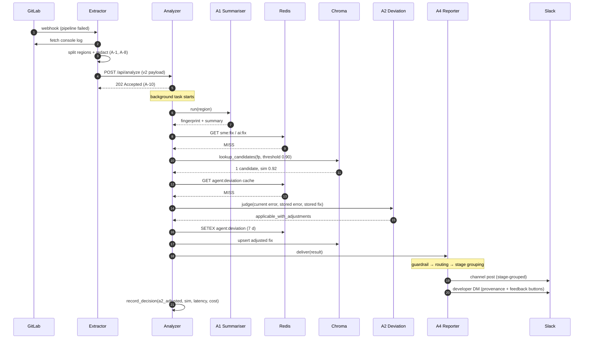
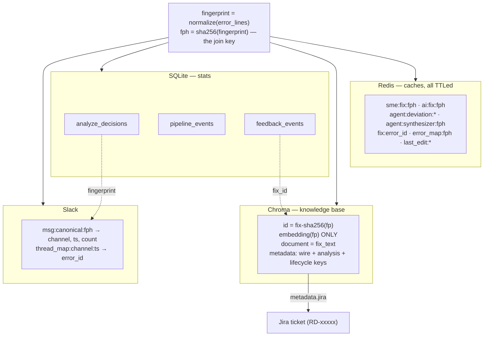
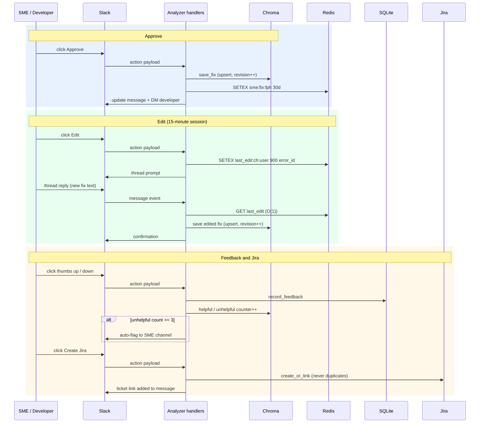
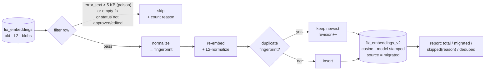
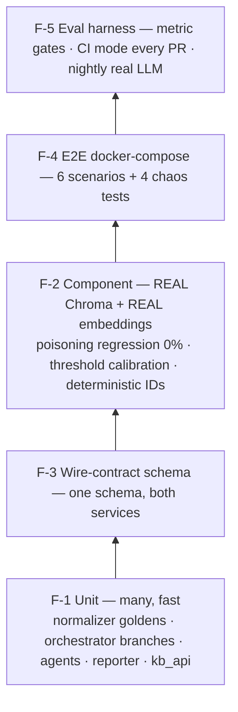
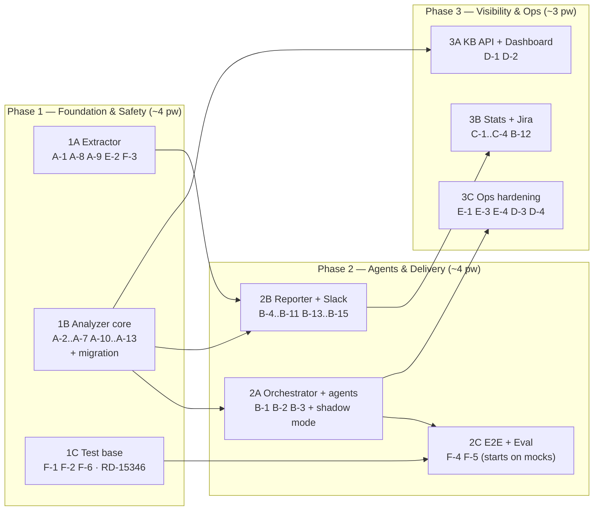

# Build Failure Analyzer MVP2 — Low-Level Design (LLD)

Companion to `HYBRID_PROPOSAL.md` (scope: §1.2 Six Pillars) and
`CURRENT_FLOW.md` (MVP1 behavior). Scope IDs (A-1 … F-6) are used
throughout. This document is implementation-ready: file paths,
signatures, schemas, and pseudocode are normative unless a better
option is found during implementation (deviations go in PR
descriptions).

Team-size note: the plan (§12) is organized as independent
**workstreams** with explicit dependencies — it works for 1 engineer
(sequential), 2, or 3 (parallel), without re-planning.

---

## 1. Component Architecture


Reading guide:

| Zone | What happens there |
|---|---|
| Extractor (top) | webhook → fetch log → split into `ErrorRegion`s → redact secrets → POST v2 payload; failures land in `dead_letter/` for replay |
| Orchestrator (middle) | one background task per request runs the A1→cache→vector→A2/A3→A4 state machine |
| Left column | data path: normalization + vector KB (the layer the poisoning bug lived in) |
| Right column | delivery path: routing, guardrail, Jira, Slack — everything A4 touches |
| Bottom row inside analyzer | management plane: KB CRUD APIs, dashboard, stats, watchdog |
| External (bottom) | Redis, Chroma, Ollama, Bedrock LLM, Slack, Jira, SMTP |

Deleted in MVP2: `slack_reviewer.py` (duplicate Flask service, B-14)
and `summarize_error_with_ai` in `slack_helper.py` (replaced by A1's
deterministic summary, B-1).

### 1.1 End-to-end request sequence

The life of one failed pipeline — happy path with an ambiguous
candidate (the most complete route). Cache hits and exact matches
exit earlier; every terminal path goes through A4.



---

## 2. Configuration

### 2.1 `src/config/error_patterns.json` (A-9) — extractor

Replaces the hardcoded `ERROR_PATTERNS` list in
`log_error_extractor.py:29`. Loaded by `config_loader.py` at startup;
schema-validated (A-12).

```json
{
  "version": 1,
  "patterns": [
    {
      "name": "npm_error",
      "regex": "npm ERR!",
      "class": "code",
      "enabled": true
    },
    {
      "name": "runner_disconnect",
      "regex": "(?i)runner.*(lost connection|system failure)",
      "class": "infra",
      "enabled": true
    },
    {
      "name": "docker_pull_ratelimit",
      "regex": "toomanyrequests: You have reached your pull rate limit",
      "class": "flaky",
      "enabled": true
    }
  ]
}
```

Rules: `name` unique; `class ∈ {code, infra, flaky}`; invalid regex →
startup failure with the pattern name in the error. The matched
pattern's `name` and `class` travel in the payload as `error_pattern`
/ `error_class`.

### 2.2 `build-failure-analyzer/config/routing.json` (B-6) — analyzer

```json
{
  "version": 1,
  "routing": [
    {
      "repo_pattern": "frontend-.*",
      "channel": "#ci-frontend",
      "product_team": "web",
      "sme_group": "@web-smes",
      "jira_project": "WEB"
    }
  ],
  "default": {
    "channel": "#ci-failures",
    "product_team": "unassigned",
    "sme_group": "@devops",
    "jira_project": "RD"
  }
}
```

`routing.py::resolve(repo, job_name) -> Route` — first regex match on
`repo_pattern` wins (list order), else `default`. Loaded once at
startup (restart to apply); schema + regex validation at load (A-12).

### 2.3 Environment variables (new / changed)

| Var | Default | Used by |
|---|---|---|
| `CHROMA_COLLECTION` | `fix_embeddings_v2` | vector_db (rollback lever) |
| `EMBEDDING_MODEL` | `granite-embedding` | vector_db, A-13 guard |
| `AGENTS_MODE` | `off` | orchestrator: `off\|shadow\|on` |
| `A2_TIMEOUT_S` / `A3_TIMEOUT_S` | `6` / `8` | agents |
| `A2_CONF_FLOOR` | `0.5` | orchestrator |
| `VECTOR_THRESHOLD` / `VECTOR_EXACT` | `0.90` / `0.95` | orchestrator |
| `CONTEXT_COSINE_ENABLED` | `false` | disambiguation sub-flag |
| `ROUTING_CONFIG` | `config/routing.json` | routing.py |
| `ERROR_PATTERNS_CONFIG` | `config/error_patterns.json` | extractor |
| `DEAD_LETTER_DIR` | `dead_letter/` | api_poster |
| `STATS_DB_PATH` | `bfa_stats.db` | stats.py |
| `KB_DB_PATH` | `bfa_kb.db` | kb_store.py (fix metadata system-of-record) |
| `JIRA_BASE_URL` / `JIRA_TOKEN` | — | jira_client |
| `DASHBOARD_ENABLED` | `true` | analyzer_service |

Legacy env vars (`SLACK_CHANNEL`, thresholds baked in code) removed
after one release of deprecation warning.

---

## 3. Data Design

How the stores relate — the fingerprint hash (`fph`) is the join key
across all of them:



### 3.1 Wire contract v2 (A-1) — `POST /api/analyze`

Shared JSON Schema lives at `schemas/analyze_payload.schema.json`
(repo root; single source for extractor and analyzer tests, F-3).

```json
{
  "repo": "payments-service",
  "branch": "feature/JIRA-123",
  "commit": "a1b2c3d",
  "commit_message": "fix: bump react",
  "job_name": "build-frontend",
  "job_url": "https://…",
  "pipeline_id": "12345",
  "pipeline_url": "https://…",
  "ci_system": "gitlab",
  "build_number": null,
  "runner_or_agent": "linux-node-12",
  "triggered_by": "dev@corp.com",
  "author_name": "Nila",
  "failed_at": "2026-07-15T09:14:02Z",
  "stage_durations": {"Build": 312, "Test": 0},
  "total_duration": 312,
  "failed_steps": [
    {
      "step_name": "Build",
      "stage": "Build",
      "errors": [
        {
          "error_lines": ["npm ERR! code ERESOLVE", "npm ERR! peer dep …"],
          "context_lines": ["Resolving dependencies…", "…"],
          "error_pattern": "npm_error",
          "error_class": "code"
        }
      ],
      "error_lines": ["<legacy blob — optional, one release overlap>"]
    }
  ]
}
```

Analyzer accepts **either** `errors` (v2) or legacy `error_lines`
(v1). v1 input is converted at the boundary:
`ErrorEntry(error_lines=[blob], context_lines=[], error_pattern="legacy", error_class="code")`.
Response is `202 {"status": "accepted", "request_id": "<uuid>"}` (A-10).

### 3.2 Redis key design (A-7)

All keys carry TTLs. `<fph> = sha256(fingerprint)[:32]`.

| Key | Value | TTL | Writer |
|---|---|---|---|
| `sme:fix:<fph>` | fix JSON (SME approved/edited) | 30 d | approval handler |
| `ai:fix:<fph>` | fix JSON (AI generated) | 24 h | orchestrator |
| `agent:deviation:<sha256(fph+candidate_id)>` | A2 verdict JSON | 7 d | A2 wrapper |
| `agent:synthesizer:<fph>` | A3 result JSON | 7 d | A3 wrapper |
| `fix:<error_id>` | Slack-flow fix record | 30 d | store_fix |
| `error_map:<fph>` | error_id | 30 d | store_fix (key was full error text in MVP1 — changed) |
| `thread_map:<channel>:<ts>` | error_id | 30 d | store_fix |
| `msg:canonical:<fph>` | `{channel, ts, count, last_seen}` | 30 d | A4 (B-5 counter) |
| `last_edit:<channel>:<user_id>` | error_id | **15 min** | edit handler (B-15; O(1) GET replaces `keys()` scan) |

### 3.3 Chroma collection `fix_embeddings_v2` (A-3/A-4) — vectors only

- Space: `{"hnsw:space": "cosine"}`; vectors L2-normalized pre-add/query.
- `id = "fix-" + sha256(fingerprint).hexdigest()` — the join key to SQLite.
- `document = fix_text` (debug copy; SQLite is the source of truth).
- `embedding = embed(fingerprint)` — the **only** embedded text.
- Collection metadata: `embedding_model` + `embedding_dim` (A-13/#5
  guard). **No per-row business metadata in Chroma** — that lives in
  SQLite (§3.4), because the KB APIs need SQL-grade filtering,
  pagination, and free-text search that Chroma metadata cannot do.
- **Multi-process rule (P5):** exactly ONE process may open the
  embedded `PersistentClient`. MVP1 violates this today
  (`slack_reviewer.py:19` + `analyzer_service.py` share the dir) —
  B-14 deletes the second process at the start of Phase 1.

### 3.4 KB store — SQLite `bfa_kb.db` (A-4, D-1)

System of record for all fix facts. Retrieval = ANN in Chroma →
join by id here. `kb_store.py` wraps it (WAL mode, like
`monitoring.py`).

```sql
CREATE TABLE fixes (
  id TEXT PRIMARY KEY,               -- fix-sha256(fingerprint), same as Chroma id
  fingerprint TEXT NOT NULL, fix_text TEXT NOT NULL,
  -- wire keys
  ci_system TEXT, repo TEXT, branch TEXT, commit_sha TEXT, commit_message TEXT,
  author_name TEXT, author_email TEXT, pipeline_id TEXT, pipeline_url TEXT,
  job_name TEXT, job_url TEXT, stage TEXT, build_number TEXT, runner_or_agent TEXT,
  -- analysis keys
  error_pattern TEXT, error_class TEXT,
  raw_error_lines TEXT,              -- JSON array
  context_sample TEXT,               -- first ~2 KB
  product_team TEXT,
  -- lifecycle
  source TEXT, status TEXT, approver TEXT, revision INTEGER DEFAULT 1,
  created_at TEXT, updated_at TEXT,
  hits INTEGER DEFAULT 0, last_served_at TEXT,
  helpful_count INTEGER DEFAULT 0, unhelpful_count INTEGER DEFAULT 0,
  jira TEXT
);
CREATE INDEX idx_fixes_team_status ON fixes(product_team, status);
CREATE INDEX idx_fixes_pattern    ON fixes(error_pattern);
CREATE INDEX idx_fixes_updated    ON fixes(updated_at);

CREATE TABLE fix_revisions (         -- full edit history (D-1)
  id INTEGER PRIMARY KEY, fix_id TEXT REFERENCES fixes(id),
  revision INTEGER, editor TEXT, edited_at TEXT,
  old_fix_text TEXT, new_fix_text TEXT,
  change_source TEXT                 -- approve | edit | api | migration
);
```

Write order: SQLite first, then Chroma upsert. A Chroma row with no
SQLite row is ignored at join time (repairable by re-embedding from
`fixes`), so partial failures degrade safely.

### 3.5 Stats store (C-1..C-4) — SQLite `bfa_stats.db`

Same approach as the extractor's `monitoring.py` (SQLite, WAL mode).

```sql
CREATE TABLE pipeline_events (        -- C-1, one row per webhook
  id INTEGER PRIMARY KEY, ts TEXT, ci_system TEXT, repo TEXT,
  branch TEXT, pipeline_id TEXT, status TEXT,          -- success|failed
  author_name TEXT, author_email TEXT, commit_sha TEXT,
  stage_durations TEXT,                                -- JSON
  total_duration REAL, failed_stage TEXT
);
CREATE TABLE analyze_decisions (      -- C-2, one row per analyzed error
  id INTEGER PRIMARY KEY, ts TEXT, request_id TEXT, fingerprint TEXT,
  repo TEXT, product_team TEXT, error_pattern TEXT, error_class TEXT,
  source TEXT,        -- sme_cache|ai_cache|vector|a2_exact|a2_adjusted|a3|unable
  similarity REAL, latency_ms INTEGER, llm_calls INTEGER,
  est_cost_usd REAL, zero_match INTEGER DEFAULT 0      -- C-4
);
CREATE TABLE feedback_events (        -- C-3
  id INTEGER PRIMARY KEY, ts TEXT, fingerprint TEXT, fix_id TEXT,
  user_id TEXT, verdict TEXT          -- helpful|unhelpful
);
```

`stats.py` exposes `record_pipeline()`, `record_decision()`,
`record_feedback()`, and read APIs for the dashboard
(`GET /api/stats/*`). Writes are fire-and-forget (never block or fail
an analysis). Kept as a **separate file** from `bfa_kb.db`: stats is
append-heavy, the KB is read-heavy — separate files avoid lock
contention. Indexes on `ts`, `fingerprint`, `repo`, `product_team`;
retention job reuses the extractor's `cleanup_old_records` pattern.

### 3.6 Dead-letter format (E-2)

`{DEAD_LETTER_DIR}/{pipeline_id}_{epoch}.json` — the exact payload
that failed, plus `{"_dead_letter": {"first_failed_at": …,
"attempts": N, "last_error": "…"}}`. `scripts/replay_failed.py`
re-POSTs each file (oldest first), moves success → `replayed/`,
keeps failures in place; `--dry-run` supported.

---

## 4. Extractor Changes (`src/`)

### 4.1 `log_error_extractor.py` — per-region output (A-1)

Today `extract_error_sections` merges everything and returns
`['\n'.join(sections)]` (line 138). Change the return type:

```python
@dataclass
class ErrorRegion:
    error_lines: List[str]      # the matched lines only, no "Line N:" prefix
    context_lines: List[str]    # window around them (existing before/after config)
    error_pattern: str          # pattern name from config
    error_class: str            # code | infra | flaky

def extract_error_sections(self, log_text: str) -> List[ErrorRegion]: ...
```

- Region building reuses the existing match→window→merge logic; the
  change is *not* re-joining regions and *not* prefixing `"Line N:"`.
- When merged regions contain multiple pattern matches, the region's
  `error_pattern`/`error_class` come from the **first** match
  (severity refinement is out of scope).
- Existing caps stay: `ERROR_ADAPTIVE_THRESHOLDS`, `MAX_LOG_LINES`,
  `max_line_length` (E-5).
- Zero regions on a failed pipeline → `api_poster` still posts with
  `errors: []` and the analyzer records `zero_match=1` and notifies
  DevOps with the log tail (C-4). Extractor attaches
  `tail_lines: last 50 lines` in that case.

### 4.2 `src/redactor.py` (new, A-8)

```python
SECRET_PATTERNS: List[Tuple[str, str]] = [
    (r"(?i)(password|passwd|pwd)\s*[=:]\s*\S+",        r"\1=<REDACTED>"),
    (r"(?i)(token|api[_-]?key|secret)\s*[=:]\s*\S+",   r"\1=<REDACTED>"),
    (r"(?i)bearer\s+[a-z0-9._\-]+",                     "Bearer <REDACTED>"),
    (r"eyJ[A-Za-z0-9_\-]{10,}\.[A-Za-z0-9._\-]+",       "<JWT_REDACTED>"),   # JWT
    (r"AKIA[0-9A-Z]{16}",                               "<AWS_KEY_REDACTED>"),
    (r"glpat-[A-Za-z0-9\-_]{20,}",                      "<GITLAB_TOKEN_REDACTED>"),
    (r"://[^/\s:]+:[^@\s]+@",                           "://<REDACTED>@"),   # user:pass@ URLs
    (r"ghp_[A-Za-z0-9]{36}",                            "<GITHUB_TOKEN_REDACTED>"),
]

def redact(lines: List[str]) -> List[str]: ...
def redact_text(text: str) -> str: ...
```

Applied in `api_poster` to **every** outgoing field that carries log
content (`error_lines`, `context_lines`, `tail_lines`,
`commit_message`). Unit-tested with a golden file of true/false
positives (F-1). Patterns extendable via optional
`config/redaction_patterns.json` (same loader style as A-9).

### 4.3 `api_poster.py` — v2 payload + dead-letter (A-1, E-2)

- Build the §3.1 payload; keep legacy `error_lines` field populated
  for one release (`API_LEGACY_COMPAT=true` env, default true → flip
  false after analyzer v2 ships).
- On `RetryExhaustedError` (`api_poster.py:1008`): write dead-letter
  file (§3.5) **instead of** only logging.
- New: `scripts/replay_failed.py` (see §3.6).

---

## 5. Analyzer Core

### 5.1 `normalizer.py` (new, A-2) — the fingerprint function

```python
_RULES: List[Tuple[Pattern, str]] = [
    (re.compile(r"^Line \d+:\s*", re.M), ""),                       # 1 line prefixes
    (re.compile(r"\d{4}-\d{2}-\d{2}[T ]\d{2}:\d{2}:\d{2}(\.\d+)?(Z|[+-]\d{2}:?\d{2})?"), "<TS>"),
    (re.compile(r"\[\d{2}:\d{2}:\d{2}\]"), "<TS>"),                 # 3 [HH:MM:SS]
    (re.compile(r"\b\d{13}\b|\b\d{10}\b"), "<EPOCH>"),              # 4 epoch s/ms
    (re.compile(r"\b[0-9a-f]{40}\b|\b[0-9a-f]{7,12}\b(?=[\s:/])"), "<SHA>"),
    (re.compile(r"\b[0-9a-f]{8}-[0-9a-f]{4}-[0-9a-f]{4}-[0-9a-f]{4}-[0-9a-f]{12}\b"), "<UUID>"),
]

def normalize_error_text(error_lines: List[str]) -> str:
    text = "\n".join(error_lines)
    for pat, repl in _RULES: text = pat.sub(repl, text)
    text = re.sub(r"\s+", " ", text).strip().lower()
    return text[:MAX_FINGERPRINT_CHARS]      # 2000 chars ≈ 512 tokens

def fingerprint_hash(fp: str) -> str:
    return hashlib.sha256(fp.encode()).hexdigest()
```

Scope decision honored: **no** path replacement in MVP2 normalization
(per team review, only Line-N/timestamps/whitespace/lowercase +
SHA/UUID/epoch which are timestamp-like). Rules are ordered and
table-driven → golden tests assert exact outputs (F-1).

### 5.2 `vector_db.py` — v2 behavior (A-3, A-4, A-13)

Changed/new methods on `VectorDBClient`:

```python
def __init__(..., collection=os.getenv("CHROMA_COLLECTION", "fix_embeddings_v2")):
    # create with {"hnsw:space": "cosine"}
    # A-13: read collection.metadata["embedding_model" / "embedding_dim"];
    # model name != EMBEDDING_MODEL env → raise StartupError (forces migration)
    # dim guard (#5): every _embed_normalized() asserts
    # len(vector) == embedding_dim — catches silent model/quantization
    # drift and Ollama response-shape surprises that the name check misses

def _generate_id(self, fingerprint: str) -> str:
    return "fix-" + hashlib.sha256(fingerprint.encode()).hexdigest()

def _embed_normalized(self, fingerprint: str) -> List[float]:
    v = self._get_embedding(fingerprint)
    n = math.sqrt(sum(x*x for x in v))
    return [x/n for x in v] if n else v          # L2-normalize

def lookup_candidates(self, fingerprint: str, top_k=10, threshold=0.90)
        -> List[Candidate]:
    # query with normalized vector; sim = 1 - cosine_distance (valid now)
    # join Chroma ids -> kb_store.fixes rows (SQLite, A-4);
    # filter: sim >= threshold AND fixes.status != "deprecated";
    # Chroma rows with no fixes row are ignored (safe partial-failure)
    # returns Candidate(id, fix_text, stored_error, metadata, similarity)

def save_fix(self, fingerprint, fix_text, metadata, status) -> str:
    # upsert semantics (A-6), SQLite FIRST then Chroma:
    # 1 kb_store.upsert_fix(...) — writes fixes row, appends
    #   fix_revisions entry (who/when/old/new), revision += 1
    # 2 Chroma add/update: id + embedding + fix_text only
    # (a Chroma failure leaves a consistent SQLite record that a
    #  repair pass can re-embed)

# metadata operations live on kb_store (SQLite), not Chroma:
kb_store.touch_served(fix_id)          # hits += 1, last_served_at = now
kb_store.set_status(fix_id, status)    # deprecate API (soft delete)
kb_store.get_by_id / list_filtered(...)# plain SQL — used by kb_api.py
```

Context disambiguation (A-5) in `disambiguate(candidates, context_lines)`:
`score = 0.7*error_sim + 0.3*cosine(embed(ctx_query), embed(candidate.context_sample))`,
return top if margin > 0.05 else `None` (→ A2). Behind
`CONTEXT_COSINE_ENABLED` (default false until shadow data exists).

### 5.3 `orchestrator.py` (new) — state machine


```python
async def analyze_request(payload: AnalyzePayload) -> None:   # runs in background task
    stats_ctx = stats.start(payload)
    regions = dedupe_by_fingerprint(all_regions(payload))      # B-7
    for region in regions:
        result = await analyze_region(region, payload)
        await reporter.deliver(result, payload)                # A4, groups by stage

async def analyze_region(region, payload) -> Result:
    fp   = summarizer.run(region)                              # A1, never fails
    if hit := cache.get_sme(fp) or cache.get_ai(fp):
        return Result(source=hit.source, fix=hit, fp=fp)
    try:
        cands = vector_db.lookup_candidates(fp.fingerprint)
    except VectorUnavailable:                                  # E-1 ladder
        cands = []
    if not cands:
        return await run_a3(fp, region, citations=None)
    if cands[0].similarity >= VECTOR_EXACT and len(cands) == 1:
        vector_db.touch_served(cands[0].id)
        return Result(source="vector", fix=cands[0], fp=fp)
    if len(cands) == 1:
        verdict = await run_a2(fp, region, cands[0])
        return route_a2_verdict(verdict, cands[0], fp, region)
    # ≥2 candidates: deterministic tie-break first, then A2 top-3 parallel
    if best := vector_db.disambiguate(cands, region.context_lines):
        return Result(source="vector", fix=best, fp=fp)
    verdicts = await asyncio.gather(*[run_a2(fp, region, c) for c in cands[:3]])
    return pick_best(verdicts, cands, fp, region)   # exact > adjusted > A3
```

- `run_a2` / `run_a3` wrap the agents with: Redis result cache (§3.2),
  timeout, one retry on schema failure, confidence floor; every
  failure path degrades exactly as HYBRID_PROPOSAL §4.1 fallbacks.
- `AGENTS_MODE=off` → skip A2 entirely (candidates in [0.90,0.95)
  behave like misses → A3 path = today's fallback). `shadow` → run A2,
  log verdict to stats, but respond as if `off`. `on` → full flow.
- Every terminal emits `stats.record_decision(...)` (C-2).

---

## 6. Agents (`agents/`)

### 6.1 `agents/base.py`

```python
class AgentResult(TypedDict): ...          # parsed JSON + _meta (latency, retries)

class LLMAgent:
    name: str; schema: dict; timeout_s: float; prompt_file: str
    async def run(self, **prompt_vars) -> AgentResult:
        # 1 render prompt (prompts/<name>.md, {placeholders})
        # 2 call LLM via llm_openwebui_client in a thread executor (non-blocking)
        # 3 json.loads → jsonschema.validate; on failure: ONE retry with
        #   "Your previous output failed validation: <err>. Output ONLY JSON."
        # 4 raise AgentFailure(reason) on timeout/2nd failure
        # 5 audit log entry (request_id, agent, latency, tokens if available)
```

A1/A4 are plain classes (no LLM, no base inheritance) — they must
never fail; internal exceptions are caught and degrade (A1 → raw
lines; A4 → minimal fallback message).

### 6.2 `agents/summarizer.py` — A1

```python
class Summarizer:
    def run(self, region: ErrorRegion) -> Fingerprint:
        fp = normalize_error_text(region.error_lines)
        return Fingerprint(
            fingerprint=fp, fp_hash=fingerprint_hash(fp),
            summary=self._summary(region),      # first 3 error lines, ≤300 chars
            error_pattern=region.error_pattern, error_class=region.error_class)
```

`_summary` replaces `summarize_error_with_ai` (B-1) — display text is
now free and deterministic.

### 6.3 `agents/deviation.py` — A2

`LLMAgent(name="deviation", timeout=A2_TIMEOUT_S)` with the verdict
schema from HYBRID_PROPOSAL §12.2 and prompt `prompts/deviation.md`
(system prompt from §12.3). Wrapper adds the Redis cache
(`agent:deviation:*`) and returns `AgentFailure → caller routes to A3`.

### 6.4 `agents/synthesizer.py` — A3

`LLMAgent(name="synthesizer", timeout=A3_TIMEOUT_S)`; schema from
HYBRID_PROPOSAL §13.2; prompt `prompts/synthesizer.md` — refactor of
the current `resolver_agent.py` prompt, plus optional
`{partial_citations}` block (stored fixes A2 judged `partial`).
On `AgentFailure`: orchestrator produces
`Result(source="unable", fix=None)` → A4 posts "unable to analyze" to
the SME channel and `error_notifier` alerts DevOps (email + Slack).
`resolver_agent.py` is reduced to a thin deprecated shim for one
release, then deleted.

### 6.5 `agents/reporter.py` — A4

Delivery decision flow:


```python
class Reporter:
    async def deliver(self, result: Result, payload: AnalyzePayload):
        route = routing.resolve(payload.repo, payload.job_name)        # B-6
        verdict = guardrail.check(result.fix_text)                     # B-10
        if verdict.blocked:
            return await self._sme_review_only(result, route, verdict) # ⚠️ hold
        if result.error_class == "infra":                              # B-11
            return await self._post_infra(result, route)               # DevOps ch.
        if result.error_class == "flaky":
            return await self._dm_retry_suggestion(result, payload)
        canonical = redis.get(f"msg:canonical:{result.fp_hash}")       # B-5
        if canonical:
            await self._bump_counter(canonical)                        # edit msg
        else:
            await self._post_stage_grouped(result, payload, route)     # B-4
        await self._dm_developer(result, payload, route)               # B-8/B-9/B-13
```

- **Stage grouping (B-4):** per request, results are grouped by
  `stage`; first result of a stage posts the parent message
  (stage, repo, branch, pipeline link, author); further errors of the
  same stage post as thread replies (`thread_ts` of parent). Parent
  `ts` kept in-memory per request only.
- **DM (B-8/B-9/B-13):** resolve `triggered_by` →
  `users_lookupByEmail`; on failure post to `route.channel`
  mentioning `author_name`. DM blocks: fix text, provenance line
  ("SME-approved · served 12× · last seen 2d ago · from repo X" —
  from metadata `hits/last_served_at/repo`), 👍/👎 buttons
  (`action_id: fb_up_<fp_hash>` / `fb_down_<fp_hash>`), "🎫 Create
  Jira" button (`jira_<error_id>`) where applicable.
- **`guardrail.py` (B-10):** `check(text) -> Verdict(blocked, matches)`
  against a denylist: `rm -rf /`, `rm -rf` on non-tmp paths,
  `chmod -R 777`, `git push --force` to protected branches,
  `kubectl delete (ns|namespace|deploy)`, `DROP TABLE|DATABASE`,
  `mkfs`, `dd if=`, `:(){ :|:& };:`, `curl … | sh`. Table-driven +
  unit golden tests; extendable via config.

### 6.6 Slack handlers (B-13, B-14, B-15)



- Delete `slack_reviewer.py`; `analyzer_service.py` keeps
  `/bfa/slack/events` + `/bfa/slack/actions` (already implemented
  there) — Slack app config points at the analyzer.
- Edit mode: on ✏️ Edit → `SETEX last_edit:<channel>:<user_id> 900
  <error_id>`; message handler does one `GET` (replaces `keys()`
  scan). Expired key → friendly "edit session expired, click Edit
  again".
- New action handlers: `fb_up_*` / `fb_down_*` →
  `stats.record_feedback` + metadata counters
  (`helpful_count/unhelpful_count`); on `unhelpful_count >= 3` → post
  alert to `route.channel` SME group (auto-flag). `jira_*` →
  `jira_client.create_or_link`.
- Approval handler: `save_fix` (upsert §5.2) + `SETEX sme:fix:<fph>`.

### 6.7 `jira_client.py` (B-12)

```python
def create_or_link(error_id: str) -> str:   # returns jira key
    # 1 fix metadata already has `jira` → return it (link, don't duplicate)
    # 2 POST {JIRA_BASE_URL}/rest/api/2/issue
    #   project = route.jira_project, type = Bug
    #   summary = "[BFA] <error_pattern>: <summary ≤120 chars>"
    #   description = error + context sample + probable fix +
    #                 pipeline metadata + Slack permalink
    # 3 vector_db metadata update: jira=<key>; Slack message updated with link
```

Auto-create trigger (configurable, default on): `source == "a3"` and
`confidence < 0.6`, or `source == "unable"`.

---

## 7. KB API & Dashboard (Pillar D)

### 7.1 `kb_api.py` — FastAPI router, JWT-protected like `/api/analyze`

All reads/filters/search run as plain SQL on `bfa_kb.db` (§3.4) —
fast, paginated, free-text-capable. Revision history comes from
`fix_revisions`. Chroma is touched only by `POST` (embed) and
`PUT` when `fix_text` changes (re-store document).

| Endpoint | Request | Response / behavior |
|---|---|---|
| `POST /api/fixes` | `{error_text OR error_lines[], fix_text, metadata?}` | normalize → fingerprint → upsert; absorbs `add_manual_fix` / `bulk_manual_fix` (kept as deprecated aliases one release) |
| `GET /api/fixes` | query: `team, error_pattern, repo, branch, stage, source, status, approver, from, to, q, limit=50, offset` | `{total, items:[FixSummary]}` — Chroma `get` + metadata filter; `q` = substring on fingerprint/fix_text |
| `GET /api/fixes/{id}` | — | `FixDetail` (all metadata + revision history from `revisions` field) |
| `PUT /api/fixes/{id}` | `{fix_text?, status?, metadata_patch?}` | `collection.update`, revision += 1, `updated_at`; `sme:fix` cache refreshed |
| `DELETE /api/fixes/{id}` | — | `status=deprecated` (soft); excluded from retrieval + caches purged |
| `GET /api/stats/summary` | `from,to,team?` | hit-rate split by source, cost, latency percentiles (reads §3.4) |
| `GET /api/stats/pipelines` | filters | success/failure counts, per-stage durations |
| `GET /api/issues` | `status=pending\|flagged` | pending SME reviews + 👎-flagged fixes (needs-attention feed) |

### 7.2 `dashboard/` (D-2)

Static single-page app (plain HTML + JS + fetch, no build toolchain)
served by FastAPI `StaticFiles` at `/dashboard`. Three tabs mapping
1:1 to the APIs: **Resolved** (`GET /api/fixes?status=approved,edited`),
**Needs attention** (`GET /api/issues`, row → edit form → `PUT`,
deprecate button → `DELETE`), **Stats** (`GET /api/stats/*`, rendered
with a small inline chart lib or plain tables in v1). Filters are
query-param passthroughs. No separate backend, no separate deploy.

---

## 8. Resilience & Ops implementation (Pillar E)

### 8.1 Degradation ladder (E-1)

Thin wrappers, used everywhere instead of raw clients:

```python
def safe_cache_get(key) -> Optional[str]:
    try: return r.get(key)
    except redis.RedisError:
        stats.incr("redis_down"); return None      # → proceed to vector

class VectorUnavailable(Exception): ...
# vector_db raises it on Chroma/Ollama errors; orchestrator catches → cands=[]
# LLM failure inside agents → AgentFailure → A3 "unable" path (§6.4)
```

Rules: dependency errors are **never** propagated to the webhook
response; each recovery increments a stats counter (visible on the
dashboard); each ladder row has a chaos test (F-4).

### 8.2 Alerts & recovery (E-2, E-3)

- `build-failure-analyzer.service`: add `Restart=on-failure`,
  `RestartSec=5`.
- Silent-failure alert: a lightweight `watchdog.py` cron (every 15
  min) reads §3.4: `pipeline_events(status=failed)` in window > 0 AND
  `analyze_decisions` in window == 0 → `error_notifier` (Slack DM +
  email). Also curls `/health`.
- Slack: `WebClient(retry_handlers=[RateLimitErrorRetryHandler(max_retry_count=3)])` (E-4).

### 8.3 Logging (A-11)

Analyzer gets `logging_setup.py` mirroring `src/logging_config.py`
(rotating file + console, structured extras: `request_id`,
`fingerprint`, `agent`). All `print()` in analyzer files replaced —
mechanical PR, enforced afterwards by lint rule (`T201` flake8-print)
as part of F-6.

### 8.4 Backup (D-4) & pruning (D-3)

- `scripts/backup_bfa.sh` — daily cron using the **SQLite `.backup`
  API** for every store: `bfa_kb.db`, `bfa_stats.db`, and Chroma's
  internal `chroma.sqlite3` (+ copy of index segment dirs). Never a
  raw `tar` of live DB files — a live tar can capture a mid-write
  state (#3). Keep 14; restore procedure in README-OPS.
- `scripts/prune_kb.py --dry-run|--apply`: select
  `status=deprecated OR (hits=0 AND created_at < now-6mo)` → export
  JSON archive → delete rows. Monthly cron with `--dry-run` output
  posted to DevOps channel; `--apply` run manually after review.

---

## 9. Migration (`scripts/migrate_vector_db.py`)



1. Open old `fix_embeddings` read-only; create `fix_embeddings_v2`
   (cosine) if absent; stamp `embedding_model`.
2. Per row: skip if `len(error_text) > 5KB` (poisoning), empty fix,
   or status not in (approved, edited). Else: `normalize_error_text`
   → fingerprint → re-embed → L2-normalize → upsert **into both
   stores** (SQLite `fixes` row with metadata mapped to the §3.4
   schema, `source="migrated"`, missing keys defaulted; then Chroma
   id+embedding+fix_text). Dup fingerprint: keep newest, bump
   revision (history row in `fix_revisions`).
3. Report: total/migrated/skipped(reason)/deduped → JSON + stdout.
4. Run on staging copy first; verify with F-2 suite; then prod run +
   flip `CHROMA_COLLECTION`. Rollback = flip env var back (old
   collection untouched).

---

## 10. Testing implementation (Pillar F)

Test pyramid — many fast tests at the bottom, few expensive ones at
the top; F-2 exists because MVP1 mocked all vector math and shipped
the poisoning bug under a green build:



```
tests-shared/schemas/analyze_payload.schema.json      (F-3, single source)
src → tests/ (existing)  + test_redactor.py, test_error_patterns_config.py,
                           test_extract_regions.py, test_payload_schema.py
build-failure-analyzer/tests/ (existing) +
  test_normalizer_golden.py        # table: input → exact fingerprint (F-1)
  test_orchestrator_paths.py       # fake agents; every §4.1 branch (F-1)
  test_agents_contract.py          # mocked LLM: schema, retry, floors (F-1)
  test_reporter.py                 # grouping, routing, guardrail, provenance (F-1)
  test_kb_api.py                   # CRUD + filters (F-1)
  component/test_vector_real.py    # REAL Chroma+Ollama: poisoning regression,
                                   # calibration pairs, deterministic ID (F-2)
                                   # @pytest.mark.component, skipped w/o Ollama
e2e/                               # F-4
  docker-compose.test.yml          # extractor, analyzer, redis, chroma-dir,
                                   # mock-gitlab, mock-llm, mock-slack
  mock_llm/app.py                  # keyed canned responses (record/replay dir)
  mock_slack/app.py                # captures chat.postMessage → /messages
  scenarios/test_scenarios.py      # 6 happy paths + 4 chaos (ladder rows)
eval/
  regression_set.jsonl             # {id, error_lines, context_lines,
                                   #  expected_route, must_contain[], must_not_contain[]}
  run_eval.py                      # replays via orchestrator, computes §18.2
                                   # metrics of HYBRID_PROPOSAL, writes
                                   # report.{json,md}; --mode=ci|nightly
```

CI wiring (per HYBRID_PROPOSAL §18.3): PR → unit + schema + eval(ci);
main → e2e + component; nightly → eval(nightly) with report to DevOps
channel. Root `pyproject.toml` gains
`testpaths = ["tests", "build-failure-analyzer/tests"]`; lint gate
enabled after F-6 cleanup.

---

## 11. Rollout & Feature Flags

| Lever | Values | Reverts |
|---|---|---|
| `CHROMA_COLLECTION` | v2 ↔ old | foundation swap, <60 s |
| `API_LEGACY_COMPAT` (extractor) | true → false | wire format |
| `AGENTS_MODE` | off → shadow → on | A2 (A3 path always exists) |
| `CONTEXT_COSINE_ENABLED` | false → true | disambiguation |
| `DASHBOARD_ENABLED` | true/false | dashboard exposure |
| Jira auto-create | config | manual-button-only mode |

Order: migrate DB → foundation live (agents off) → A2 shadow → on at
10% → 100% (gates in HYBRID_PROPOSAL §10 / §14.3).

---

## 12. Implementation Plan — 3 Phases, Team-Size-Agnostic

Workstreams (WS) are independently mergeable; the dependency graph is
what matters. 1 engineer executes them top-to-bottom; 2–3 engineers
take one column each. Estimates are effort (person-weeks), not
calendar.

### Workstream dependency graph



### Phase 1 — Foundation & Safety (blockers first)   [~4 pw]

| WS | Content (scope IDs) | Files | Depends on |
|---|---|---|---|
| **1A Extractor** | region split A-1, redaction A-8, patterns config A-9, dead-letter E-2, schema F-3 | `log_error_extractor.py`, `redactor.py`, `api_poster.py`, `config/error_patterns.json` | — |
| **1B Analyzer core** | normalizer A-2, vector_db v2 A-3/A-13 (+dim guard), **kb_store SQLite A-4**, Redis TTLs A-7, async A-10, logging A-11, config validation A-12, migration §9, **delete `slack_reviewer.py` first (P5 corruption hazard, B-14)** | `normalizer.py`, `vector_db.py`, `kb_store.py`, `analyzer_service.py`, `scripts/migrate_vector_db.py` | — |
| **1C Test base** | normalizer goldens, redactor tests, F-2 component suite, F-3 schema tests, F-6 linter cleanup, test instance setup (RD-15346) | `tests/…`, `component/…` | 1B for F-2 |

**Phase gate:** migration verified on staging copy; poisoning
regression test green; regression suite in CI; foundation live with
`AGENTS_MODE=off`.

### Phase 2 — Agents & Delivery   [~4 pw]

| WS | Content | Files | Depends on |
|---|---|---|---|
| **2A Orchestrator+agents** | base/A1/A2/A3 B-1..B-3, orchestrator flow, shadow mode | `agents/*`, `orchestrator.py`, `prompts/*` | 1B |
| **2B Reporter+Slack** | A4 B-4..B-11, B-13..B-15, guardrail, routing.json, feedback handlers, consolidation | `agents/reporter.py`, `routing.py`, `guardrail.py`, slack handlers | 1B (fingerprints) |
| **2C E2E+eval** | F-4 compose stack, mock LLM/Slack, F-5 eval harness + regression set | `e2e/*`, `eval/*` | 2A/2B interfaces (can start on mocks immediately) |

**Phase gate:** A2 shadow ≥80% agreement over 2 weeks; e2e scenarios
green; eval report in CI.

### Phase 3 — Visibility & Ops   [~3 pw]

| WS | Content | Files | Depends on |
|---|---|---|---|
| **3A KB API+dashboard** | D-1 CRUD, D-2 SPA, needs-attention feed | `kb_api.py`, `dashboard/` | 1B |
| **3B Stats+Jira** | C-1..C-4 stats.py + wiring, B-12 jira_client, stats APIs | `stats.py`, `jira_client.py` | 2B for wiring points |
| **3C Ops hardening** | E-1 ladder + chaos tests, E-3 watchdog+systemd, E-4, D-3 prune, D-4 backup | `watchdog.py`, `scripts/*`, service unit | 2A (ladder touches orchestrator) |

**Phase gate:** 10% → 100% rollout per HYBRID_PROPOSAL §10 gates;
dashboard usable by SMEs; nightly eval green 1 week.

### Staffing patterns

| Team | Mapping | Duration (rough) |
|---|---|---|
| 1 engineer | 1A→1B→1C → 2A→2B→2C → 3A→3B→3C | ~11 weeks |
| 2 engineers | E1: 1B→2A→2C→3B/3C · E2: 1A→1C→2B→3A | ~6–7 weeks |
| 3 engineers | E1: 1B→2A→3B · E2: 1A→1C→2C→3C · E3: 2B(start on routing/guardrail/Slack after 1B fingerprint lands)→3A | ~5 weeks |

### Known blockers & resolutions

| # | Blocker | Blocks | Resolution / owner action |
|---|---|---|---|
| K1 | Prod Chroma export access | migration §9, eval seed data | request read access before Phase 1 starts |
| K2 | Test instance w/ Ollama (RD-15346) | F-2, F-4 | provision during Phase 1 (WS 1C first task) |
| K3 | Slack app scopes (`users:read.email`, `chat:write`, actions) | B-8, B-13 DMs/buttons | verify/extend app config before Phase 2 |
| K4 | Jira API token + project keys | B-12 | request during Phase 2; auto-create ships config-off if late |
| K5 | Bedrock/OpenWebUI quota for nightly eval | F-5 nightly | confirm budget (~$30/mo); nightly can start weekly if constrained |
| K6 | SME hour to bless synthetic eval variants | F-5 quality | book during Phase 1 (per HYBRID_PROPOSAL §14.5) |
| K7 | routing.json contents (repo→team→channel map) | B-6 | team provides mapping; default route works meanwhile |
| K8 | Wire-contract freeze | 1A/1B parallelism | §3.1 schema in this doc is the freeze; changes require both-WS sign-off |

Cross-cutting rules: every WS lands behind its flag (§11); a WS is
"done" only with its tests (F-1 additions ship inside the same PR);
`main` stays releasable throughout.
