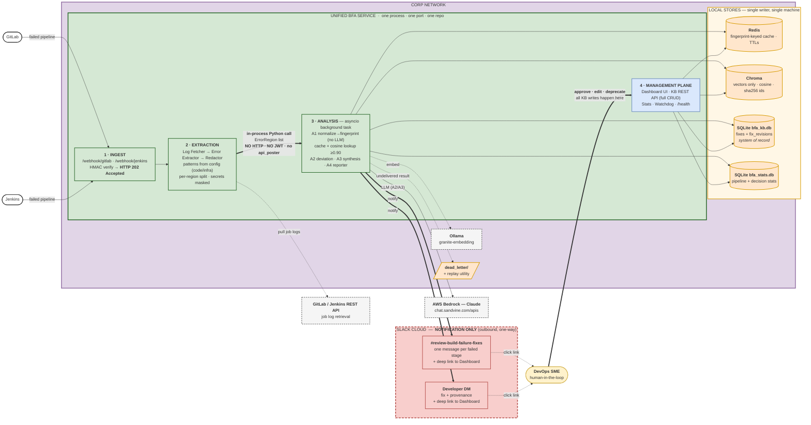
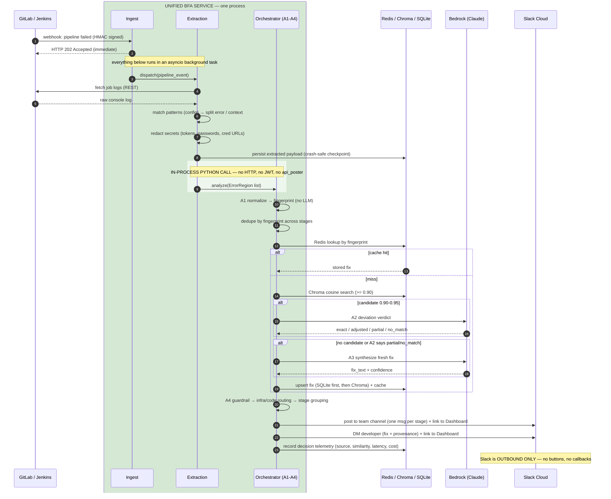

# MVP-2 — Single-Service Architecture

Decision record + diagrams for merging `extract-build-logs` and
`build-failure-analyzer` into **one service**, with Slack reduced to
**notification-only**.

Companion to `HYBRID_PROPOSAL.md` (scope) and `LLD.md` (design detail).
Where this document and the LLD disagree on service topology, **this
document wins** — the LLD predates the merge decision and is updated
in the next revision.

---

## 1. The decision

| | MVP-1 (today) | MVP-2 |
|---|---|---|
| Processes | 3 (extractor, analyzer, Flask Slack reviewer) | **1** unified service |
| Extractor → Analyzer | HTTP `POST /api/analyze` + JWT | **In-process Python call** |
| Ports | 8000, 8000, 5001 | one configurable port |
| Chroma writers | 2 processes, same directory (corruption hazard) | **1 writer** |
| Slack | interactive (Approve/Edit/Discard buttons, inbound routes, DB writes) | **notification only** — outbound, one-way |
| SME approval | Slack buttons → Flask → direct DB write | **Dashboard UI → KB REST API** → single-writer transaction |

Everything the HTTP hop provided — auth, retry, dead-letter, payload
schema — either disappears (auth) or moves inside the process
(checkpointing, typed interface).

---

## 2. Single-service architecture

---

## 3. Request lifecycle (end to end)

---

## 4. SME review lifecycle — moved from Slack to the UI

```mermaid
flowchart LR
    classDef notify fill:#f8cecc,stroke:#b85450,stroke-width:2px
    classDef ui fill:#dae8fc,stroke:#6c8ebf,stroke-width:2px
    classDef svc fill:#d5e8d4,stroke:#2d6a2d,stroke-width:2px
    classDef store fill:#ffe6cc,stroke:#d79b00,stroke-width:2px
    classDef human fill:#fff2cc,stroke:#d6b656,stroke-width:2px
    classDef gone fill:#f5f5f5,stroke:#999,stroke-width:2px,stroke-dasharray:6 4,color:#999

    subgraph OLD["MVP-1 — approval inside Slack&nbsp;&nbsp;(REMOVED in MVP-2)"]
        direction LR
        O1["Slack message<br/>Approve / Edit / Discard buttons"]:::gone
        O2["/slack/actions&nbsp;·&nbsp;/slack/events<br/>Flask reviewer process"]:::gone
        O3[("2nd process writes<br/>Chroma + Redis")]:::gone
        O1 --> O2 --> O3
    end

    subgraph NEW["MVP-2 — notification in Slack, approval in the UI"]
        direction LR
        N0(["<b>DevOps SME</b>"]):::human
        N1["<b>Slack notification</b><br/>'fix pending review'<br/>+ deep link"]:::notify
        N2["<b>Dashboard UI</b><br/>Needs-Attention queue"]:::ui
        N3["<b>KB REST API</b><br/>PUT edit · DELETE deprecate<br/>POST approve"]:::svc
        N4[("<b>bfa_kb.db</b> fixes + fix_revisions<br/><b>Chroma</b> vector<br/><b>Redis</b> cache")]:::store
        N1 -.->|"click"| N0
        N0 ==>|"review"| N2
        N2 ==>|"approve / edit / deprecate"| N3
        N3 ==>|"single writer, one process<br/>atomic across all stores"| N4
    end

    OLD ~~~ NEW
    style OLD fill:#fafafa,stroke:#bbb,stroke-width:2px,stroke-dasharray:8 4
    style NEW fill:#eef7ee,stroke:#2d6a2d,stroke-width:3px
```

Slack notifies with a deep link; the SME reviews and acts in the
Dashboard's Needs-Attention queue. Because the write path is inside
the unified service, one process owns every store and the write is
atomic across SQLite, Chroma, and Redis.

---

## 5. Requirement impact (working list for the next revision)

**Delete** — obsoleted by the merge + notification-only Slack:

| ID | Why |
|---|---|
| BFA-ARCH-1140 (Chroma remote access) | Slack never touches the KB |
| BFA-ARCH-1150 (standalone Slack service) | no such service exists |
| BFA-AGENT-1140 (Slack edit TTL / O(1) lookup) | no Slack edit flow; editing is UI-based at any age |

**Reword:**

| ID | Change |
|---|---|
| BFA-ARCH-1010 | split at the internal module boundary; drop the legacy-shape compatibility clause |
| BFA-ARCH-1080 | redact before analysis, before storage, before Slack — there is no POST |
| BFA-ARCH-1100 | 202 is returned to the CI source, not to an internal caller |
| BFA-ARCH-1110 | unified config surface; drop `BFA_HOST`, `BFA_SECRET_KEY`, `JWT_PUBLIC_KEY_PATH`, `JWT_AUDIENCE` |
| BFA-AGENT-1130 | remove *all* inbound Slack routes and the Flask process |
| BFA-AGENT-1110 | Jira creation becomes a UI action + auto-create rule |
| BFA-RES-1010 | two dead-letter cases: extracted-but-unanalyzed, analyzed-but-undelivered |
| BFA-TEST-1020 | typed internal interface instead of a shared JSON schema |
| BFA-TEST-1030 | one application container; mock Slack captures outbound only |

**Add:**

| New requirement |
|---|
| All webhook, API, dashboard, and operational routes served by one FastAPI app on one configurable port |
| The system MUST NOT expose Slack event/action endpoints; Slack integration is outbound-only |
| All fix state transitions (approve/edit/deprecate) go through the KB REST API / Dashboard, recording actor + timestamp in `fix_revisions` |
| Every Slack notification MUST carry a deep link to the corresponding Dashboard record |
| The extracted, redacted payload MUST be persisted before analysis is dispatched (crash-safe checkpoint — CI will not re-deliver) |
| The Dashboard/KB API is the sole KB write path and MUST authenticate and authorize SME actions |

**Open decisions:**

1. **Feedback buttons (BFA-AGENT-1120)** — thumbs up/down needs an
   inbound Slack callback. Move to the UI, keep one narrow Slack
   callback for feedback only, or drop from MVP-2?
2. **`/api/analyze` external exposure** — if external CI agents still
   call it directly, the JWT requirement survives; if it becomes
   internal-only, JWT and `jwt_dmz_issuer.py` are fully retired.
