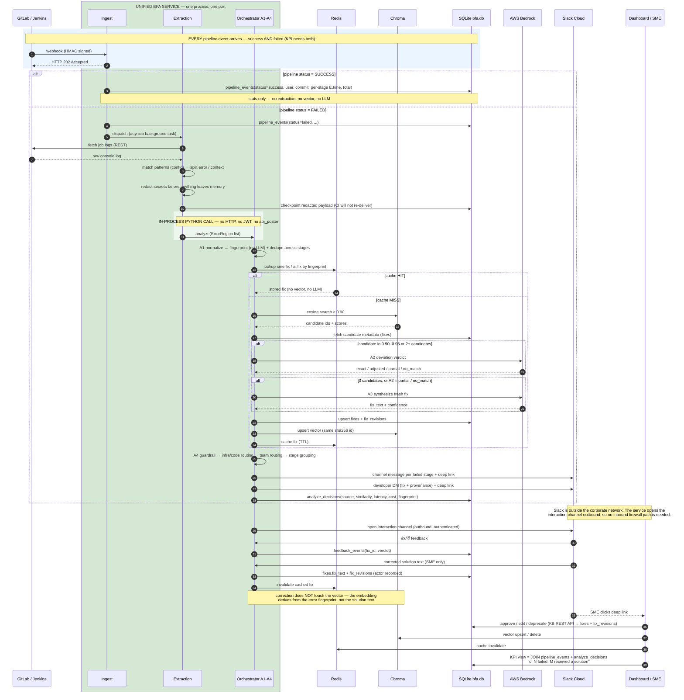

# MVP-2 — Single-Service Architecture

Decision record + diagrams for merging `extract-build-logs` and
`build-failure-analyzer` into **one service**, with Slack reduced to
**notifications plus a single feedback callback**, and all SME state
changes moved to the Dashboard UI.

Companion to `HYBRID_PROPOSAL.md` (scope) and `LLD.md` (design detail).
Where this document and the LLD disagree on service topology, **this
document wins** — the LLD predates the merge decision and is updated in
the next revision.

Rendered SVGs live in `diagrams/` (`mvp2_detailed.svg`,
`mvp2_lifecycle.svg`, `mvp2_sme.svg`); the `.mmd` sources beside them
are the editable originals.

---

## 1. The decision

| | MVP-1 (today) | MVP-2 |
|---|---|---|
| Processes | 3 (extractor, analyzer, Flask Slack reviewer) | **1** unified service |
| Extractor → Analyzer | HTTP `POST /api/analyze` + JWT | **In-process Python call** |
| Ports | 8000, 8000, 5001 | one configurable port |
| Chroma writers | 2 processes, same directory (corruption hazard) | **1 writer** |
| Pipeline events consumed | failed only | **success AND failed** (KPI needs both) |
| Stores | Redis + Chroma (+ scattered metadata) | **3**: Redis · Chroma · SQLite (metadata + statistics, linked) |
| Slack | interactive (Approve/Edit/Discard, inbound routes, DB writes) | outbound notifications + **one signature-verified feedback callback**; no state changes |
| SME approval | Slack buttons → Flask → direct DB write | **Dashboard UI → KB REST API** → single-writer transaction |

---

## 2. Detailed single-service architecture

Ingest accepts **every** pipeline event and routes on status: success
events record statistics only (no extraction, no vector search, no
LLM); failed events run the full extraction → analysis → notification
pipeline. Both write `pipeline_events`, which is what makes the KPI
"of N failed pipelines, M received a solution" computable.

```mermaid
flowchart TB
    classDef src fill:#ffffff,stroke:#333,stroke-width:2px
    classDef ing fill:#d5e8d4,stroke:#2d6a2d,stroke-width:2px
    classDef agent fill:#b8dcb4,stroke:#1e5c1e,stroke-width:2px
    classDef ui fill:#dae8fc,stroke:#6c8ebf,stroke-width:2px
    classDef store fill:#ffe6cc,stroke:#d79b00,stroke-width:2px
    classDef tbl fill:#fff4e0,stroke:#d79b00,stroke-width:1px
    classDef outside fill:#f5f5f5,stroke:#666,stroke-width:2px,stroke-dasharray:5 3
    classDef human fill:#fff2cc,stroke:#d6b656,stroke-width:2px
    classDef notify fill:#f8cecc,stroke:#b85450,stroke-width:2px
    classDef dec fill:#fff2cc,stroke:#d6b656,stroke-width:2px

    subgraph CI["CI SOURCES"]
      direction LR
      GL(["<b>GitLab</b>"]):::src
      JK(["<b>Jenkins</b>"]):::src
    end

    subgraph CORP["CORP NETWORK"]
      direction TB

      subgraph SVC["UNIFIED BFA SERVICE&nbsp;&nbsp;—&nbsp;&nbsp;one process · one port · one repo"]
        direction TB

        subgraph L1["1 · INGEST&nbsp;&nbsp;(all pipeline events: success AND failed)"]
          direction LR
          WH["<b>Webhook endpoints</b><br/>/webhook/gitlab · /webhook/jenkins<br/>HMAC verify (X-Gitlab-Token)<br/><b>→ HTTP 202 Accepted</b>"]:::ing
          ROUTE{"<b>pipeline<br/>status?</b>"}:::dec
          SUC["<b>2a · SUCCESS PATH</b><br/>stats only — no extraction, no LLM<br/>user · commit · branch · product<br/>per-stage E.time + status · total time"]:::ing
          WH --> ROUTE
          ROUTE -->|"<b>SUCCESS</b>"| SUC
        end

        subgraph L2["2b · FAILED PATH — EXTRACTION (in-process)"]
          direction LR
          F1["<b>Log Fetcher</b><br/>pulls job logs back from<br/>GitLab REST / Jenkins Blue Ocean"]:::ing
          F2["<b>Error Extractor</b><br/>patterns from config (code/infra)<br/>per-region split:<br/>error_lines + context_lines"]:::ing
          F3["<b>Redactor</b><br/>tokens · passwords · JWT<br/>AWS keys · cred URLs<br/><i>before any store or send</i>"]:::ing
          F4["<b>Checkpoint</b><br/>persist redacted payload<br/><i>CI will not re-deliver</i>"]:::ing
          F1 --> F2 --> F3 --> F4
        end

        HAND{{"<b>IN-PROCESS PYTHON CALL</b> — analyze(ErrorRegion list) — <b>NO HTTP · NO JWT · no api_poster</b>"}}:::dec

        subgraph L3["3 · ANALYSIS — asyncio background task"]
          direction LR
          A1["<b>A1 SUMMARISER</b><br/>(no LLM)<br/>normalize → fingerprint<br/>strip Line-N, timestamps,<br/>SHA/UUID → sha256(fp)"]:::agent
          DED["<b>Dedup</b><br/>by fingerprint<br/>N stages → 1 analysis"]:::agent
          C1{"<b>Redis</b><br/>hit?"}:::dec
          V1["<b>Vector lookup</b><br/>Chroma cosine ≥0.90<br/>top-k 10 + SQLite meta"]:::agent
          C2{"<b>candidates?</b>"}:::dec
          A2["<b>A2 DEVIATION</b> (LLM)<br/>exact_match /<br/>applicable_with_adjustments /<br/>partial / no_match<br/>+ confidence · 7d cache"]:::agent
          A3["<b>A3 SYNTHESIZER</b> (LLM)<br/>fresh fix, strict JSON<br/>fail → 'unable to analyze'<br/>+ DevOps alert"]:::agent
          A4["<b>A4 REPORTER</b> (no LLM)<br/>1 dangerous-fix guardrail<br/>2 infra vs code routing<br/>3 team routing (routing.json)<br/>4 one msg per stage + thread<br/>5 recurrence counter + provenance"]:::agent
          A1 --> DED --> C1
          C1 -->|MISS| V1 --> C2
          C2 -->|"1 cand 0.90-0.95<br/>or 2+ cands"| A2
          C2 -->|"0 cands"| A3
          A2 -->|"partial / no_match / fail"| A3
          A2 -->|"exact / adjusted"| A4
          A3 --> A4
          C1 -->|"<b>HIT</b> — no LLM"| A4
          C2 -->|"1 cand ≥0.95"| A4
        end

        subgraph L4["4 · MANAGEMENT PLANE"]
          direction LR
          UIK["<b>KPI DASHBOARD</b><br/>success vs failed pipelines<br/><b>% of failed that got a solution</b><br/>source split: cache/vector/A2/A3/unable<br/>per-product · per-stage · cost · latency"]:::ui
          UIB["<b>KB DASHBOARD</b><br/>Resolved · Needs-Attention · Stats<br/><b>approve · edit · deprecate</b>"]:::ui
          KBAPI["<b>KB REST API</b> (CRUD, SQL)<br/>POST add · GET search/detail<br/>PUT edit (rev++) · DELETE deprecate"]:::ing
          STAPI["<b>Stats API</b><br/>/api/stats/pipelines<br/>/api/stats/summary"]:::ing
          WD["<b>Watchdog</b> · /health<br/>webhooks&gt;0 &amp; analyses=0<br/>→ alert"]:::ing
          UIB --> KBAPI
          UIK --> STAPI
        end

        CONN["<b>Slack connector</b><br/>opens the connection <b>outbound</b> to Slack —<br/>no inbound firewall path required<br/>authenticates channel · auto-reconnect<br/>writes only via the KB API, in-process"]:::ing

        ROUTE -->|"<b>FAILED</b>"| F1
        F4 --> HAND --> A1
      end

      subgraph ST3["STORES — 3 stores · single writer · one machine"]
        direction LR
        RED[("<b>1 · REDIS</b> — cache, all TTLed<br/>sme:fix:&lt;fp&gt; 30d · ai:fix:&lt;fp&gt; 24h<br/>agent:deviation 7d · agent:synth 7d<br/>msg:canonical · error_map:&lt;fp&gt;")]:::store
        CHR[("<b>2 · CHROMA</b> — vectors only<br/>id = fix-sha256(fingerprint)<br/>embedding(fingerprint) · cosine space<br/>meta: embedding_model + embedding_dim")]:::store
        MTA["<b>3 · SQLITE bfa.db — METADATA</b><br/>(system of record)<br/><b>fixes</b>: id · fingerprint · fix_text · repo · branch<br/>product_team · error_pattern · error_class<br/>source · status · approver · hits · jira<br/><b>fix_revisions</b>: who · when · old/new text"]:::tbl
        STA["<b>3 · SQLITE bfa.db — STATISTICS</b><br/><b>pipeline_events</b>: status (success/failed) · user<br/>commit · branch · product · per-stage E.time · total<br/><b>analyze_decisions</b>: fingerprint · source · similarity<br/>latency · cost · zero_match<br/><b>feedback_events</b>: fix_id · verdict"]:::tbl
        MTA <==>|"<b>LINKED (same DB file)</b><br/>fixes.id = analyze_decisions.fix_id<br/>fixes.fingerprint = analyze_decisions.fingerprint<br/>pipeline_events.pipeline_id = analyze_decisions.pipeline_id<br/><i>→ 'of N failed pipelines, M received a solution'</i>"| STA
      end

      OLL["<b>Ollama</b><br/>granite-embedding (local)"]:::outside
      DLQ[/"<b>dead_letter/</b> + replay_failed.py"/]:::store
      MAIL(["<b>Email to developer</b>"]):::src
    end

    BED["<b>AWS Bedrock — Claude</b><br/>chat.sandvine.com/apis"]:::outside

    subgraph SLK["SLACK CLOUD&nbsp;&nbsp;—&nbsp;&nbsp;<b>outside the corporate network</b><br/>notifications outbound&nbsp;·&nbsp;interaction events arrive on the service-opened channel<br/><b>permitted from Slack: feedback + solution correction only</b>&nbsp;·&nbsp;no approve / deprecate / delete&nbsp;·&nbsp;no direct DB access"]
      direction LR
      CH["<b>#review-build-failure-fixes</b><br/>one message per failed stage (threaded)<br/>+ <b>deep link to Dashboard</b>"]:::notify
      DM["<b>Developer DM</b><br/>fix + provenance (SME-approved / AI · served N×)<br/>+ <b>deep link to Dashboard</b><br/>+ 👍/👎 feedback buttons"]:::notify
      FBK["<b>Interaction events</b><br/>👍 / 👎 feedback&nbsp;·&nbsp;✏ correct solution<br/><i>Slack accepts NO approve / deprecate / delete</i>"]:::notify
      DEV["<b>DevOps channel</b><br/>infra-class errors · 'unable to analyze'<br/>silent-failure alerts"]:::notify
    end

    SME(["<b>DevOps SME</b> — human-in-the-loop"]):::human

    GL ==>|"ALL events: success + failed"| WH
    JK ==>|"ALL events: success + failed"| WH

    SUC ==>|"record"| STA
    A1 -.->|"embed"| OLL
    C1 -->|"lookup"| RED
    V1 -->|"search"| CHR
    V1 -->|"metadata"| MTA
    A2 -->|"judge"| BED
    A3 -->|"generate"| BED
    A4 -->|"upsert fix + revision"| MTA
    A4 -->|"upsert vector"| CHR
    A4 -->|"cache"| RED
    A4 ==>|"record decision"| STA
    A4 -.->|"undelivered"| DLQ
    A4 --> MAIL
    A4 ==>|"notify (outbound HTTPS)"| CH
    A4 ==>|"notify"| DM
    A4 ==>|"notify"| DEV

    KBAPI -->|"read / write"| MTA
    KBAPI -->|"vector upsert / delete"| CHR
    KBAPI -->|"invalidate"| RED
    STAPI -->|"<b>JOIN metadata + statistics</b>"| STA
    STAPI --> MTA

    DM ==>|"click"| FBK
    FBK ==>|"events travel down the<br/>service-opened connection"| CONN
    CONN ==>|"feedback"| STA
    CONN ==>|"correction → fixes + fix_revisions"| MTA
    CONN -.->|"invalidate cached fix"| RED
    CH -.->|"deep link"| SME
    DM -.->|"deep link"| SME
    SME ==>|"<b>approve · edit · deprecate</b> — ALL KB writes"| UIB
    SME -->|"monitor"| UIK

    style CI fill:#ffffff,stroke:#333,stroke-width:2px
    style CORP fill:#e1d5e7,stroke:#9673a6,stroke-width:3px
    style SVC fill:#d5e8d4,stroke:#2d6a2d,stroke-width:3px
    style L1 fill:#eef7ee,stroke:#82b366,stroke-width:2px
    style L2 fill:#eef7ee,stroke:#82b366,stroke-width:2px
    style L3 fill:#eef7ee,stroke:#82b366,stroke-width:2px
    style L4 fill:#eaf1fb,stroke:#6c8ebf,stroke-width:2px
    style ST3 fill:#fff7e6,stroke:#d79b00,stroke-width:3px
    style SLK fill:#f8cecc,stroke:#b85450,stroke-width:3px,stroke-dasharray:8 4
```




---

## 3. Request lifecycle (end to end)




---

## 4. SME review lifecycle — moved from Slack to the UI

```mermaid
flowchart LR
    classDef notify fill:#f8cecc,stroke:#b85450,stroke-width:2px
    classDef ui fill:#dae8fc,stroke:#6c8ebf,stroke-width:2px
    classDef svc fill:#d5e8d4,stroke:#2d6a2d,stroke-width:2px
    classDef store fill:#ffe6cc,stroke:#d79b00,stroke-width:2px
    classDef human fill:#fff2cc,stroke:#d6b656,stroke-width:2px
    classDef gone fill:#f5f5f5,stroke:#999,stroke-width:2px,stroke-dasharray:6 4,color:#999

    subgraph OLD["MVP-1 — approval inside Slack&nbsp;&nbsp;(REMOVED in MVP-2)"]
        direction LR
        O1["Slack message<br/>Approve / Edit / Discard buttons"]:::gone
        O2["/slack/actions&nbsp;·&nbsp;/slack/events<br/>Flask reviewer process"]:::gone
        O3[("2nd process writes<br/>Chroma + Redis")]:::gone
        O1 --> O2 --> O3
    end

    subgraph NEW["MVP-2 — Slack may report and correct; only the service writes"]
        direction LR
        N0(["<b>DevOps SME</b>"]):::human
        N1["<b>Slack notification</b> (outside corp)<br/>+ deep link · 👍/👎 · ✏ correct"]:::notify
        NF["<b>Slack connector</b><br/>service-opened outbound channel<br/>feedback + correction only"]:::svc
        N2["<b>Dashboard UI</b><br/>Needs-Attention queue"]:::ui
        N3["<b>KB REST API</b><br/>PUT edit · DELETE deprecate<br/>POST approve"]:::svc
        N4[("<b>bfa_kb.db</b> fixes + fix_revisions<br/><b>Chroma</b> vector<br/><b>Redis</b> cache")]:::store
        N1 -.->|"click deep link"| N0
        N1 ==>|"feedback / correction"| NF
        NF ==>|"same KB API, same audit"| N3
        N0 ==>|"review"| N2
        N2 ==>|"approve / edit / deprecate"| N3
        N3 ==>|"single writer, one process<br/>atomic across all stores"| N4
    end

    OLD ~~~ NEW
    style OLD fill:#fafafa,stroke:#bbb,stroke-width:2px,stroke-dasharray:8 4
    style NEW fill:#eef7ee,stroke:#2d6a2d,stroke-width:3px
```




Slack notifies with a deep link; the SME reviews and acts in the
Dashboard's Needs-Attention queue. Because the write path is inside
the unified service, one process owns every store and the write is
atomic across SQLite, Chroma, and Redis.

---

## 5. The three stores

| # | Store | Holds | Notes |
|---|---|---|---|
| 1 | **Redis** | `sme:fix:<fp>` 30 d · `ai:fix:<fp>` 24 h · `agent:deviation` 7 d · `agent:synthesizer` 7 d · `msg:canonical:<fp>` · `error_map:<fp>` | cache only; every key carries an explicit TTL; all keys fingerprint-derived |
| 2 | **Chroma** | `id = fix-sha256(fingerprint)` · `embedding(fingerprint)` · cosine space · collection metadata `embedding_model` + `embedding_dim` | **vectors only** — no business metadata |
| 3 | **SQLite `bfa.db`** | **metadata**: `fixes`, `fix_revisions` · **statistics**: `pipeline_events`, `analyze_decisions`, `feedback_events` | one file, both halves, **joined** |

The metadata and statistics halves are linked inside the same database
file:

```
fixes.id                    = analyze_decisions.fix_id
fixes.fingerprint           = analyze_decisions.fingerprint
pipeline_events.pipeline_id = analyze_decisions.pipeline_id
```

That join is what the KPI dashboard reads: total success vs failed,
**percentage of failed pipelines that received a solution**, and the
breakdown by source (cache / vector / A2-adjusted / A3-synthesized /
unable), per product and per stage.

---

## 6. Two guarantees the merge removes, and how they are restored

| Lost | Why | Restored by |
|---|---|---|
| Retry + dead-letter between the two services | the HTTP boundary is gone | **Checkpoint**: the redacted payload is persisted after extraction, before analysis is dispatched — a crash cannot lose an event, because CI will not re-deliver the webhook |
| Failed-pipeline visibility if analysis dies | analysis and ingest are now the same process | `pipeline_events` is written on the failed path **before** extraction starts, so the KPI denominator is always complete |

---

## 7. Requirement impact (working list for the next revision)

**Delete** — obsoleted by the merge + notification-only Slack:

| ID | Why |
|---|---|
| BFA-ARCH-1140 (Chroma remote access) | Slack never touches the KB |
| BFA-ARCH-1150 (standalone Slack service) | no such service exists |
| BFA-AGENT-1140 (Slack edit TTL / O(1) lookup) | no Slack edit flow; editing is UI-based at any age |

**Reword:**

| ID | Change |
|---|---|
| BFA-ARCH-1010 | split at the internal module boundary; drop the legacy-shape compatibility clause |
| BFA-ARCH-1080 | redact before analysis, before storage, before Slack — there is no POST |
| BFA-ARCH-1100 | 202 is returned to the CI source, not to an internal caller |
| BFA-ARCH-1110 | unified config surface; drop `BFA_HOST`, `BFA_SECRET_KEY`, `JWT_PUBLIC_KEY_PATH`, `JWT_AUDIENCE` |
| BFA-AGENT-1130 | remove *all* inbound Slack routes and the Flask process |
| BFA-AGENT-1110 | Jira creation becomes a UI action + auto-create rule |
| BFA-RES-1010 | two dead-letter cases: extracted-but-unanalyzed, analyzed-but-undelivered |
| BFA-TEST-1020 | typed internal interface instead of a shared JSON schema |
| BFA-TEST-1030 | one application container; mock Slack captures outbound only |

**Add:**

| New requirement |
|---|
| All webhook, API, dashboard, and operational routes served by one FastAPI app on one configurable port |
| The system MUST ingest **success and failed** pipeline events; success events record statistics only |
| The KPI dashboard MUST report success vs failed counts and the percentage of failed pipelines that received a solution, by source, product, and stage |
| SQLite MUST hold metadata and statistics in one database, joined on `fix_id` / `fingerprint` / `pipeline_id` |
| The system MUST NOT expose Slack event/action endpoints; Slack integration is outbound-only |
| All fix state transitions (approve/edit/deprecate) go through the KB REST API / Dashboard, recording actor + timestamp in `fix_revisions` |
| Every Slack notification MUST carry a deep link to the corresponding Dashboard record |
| The extracted, redacted payload MUST be persisted before analysis is dispatched (crash-safe checkpoint) |
| The Dashboard/KB API is the sole KB write path and MUST authenticate and authorize SME actions |

**Decisions taken:**

1. **Slack is outside the corporate network**, so the service **opens
   the interaction channel outbound** — no inbound firewall path is
   required. (A signature-verified request URL remains permissible
   where corporate policy demands it.) Slack may **record feedback and
   submit a solution correction**; it may not approve, deprecate, or
   delete. Slack never writes to a store — it submits an action and
   the single service process performs the write, so the single-writer
   rule that fixed P6 is untouched.

   Correcting a solution does **not** touch the vector store: the
   embedding derives from the error fingerprint, not the solution
   text. A correction is a SQLite write (`fixes` + `fix_revisions`)
   plus a cache invalidation. Corrections raised from Slack and from
   the dashboard converge on the same API, authorization check, and
   revision history.
2. **External access / JWT** — no external application may submit work,
   and **no interface uses JWT**. Inbound access is limited to CI
   webhooks (shared-secret HMAC), the Slack feedback callback (Slack
   signature), and internally reachable dashboard/API routes. The token
   endpoint, token manager, and all JWT configuration are removed.
3. **Domain-context collection** — governed by the same identifier,
   distance-metric, and embedding-model rules as the fix collection.

**Still open:** the dashboard authentication mechanism. With JWT
excluded, an authenticated actor identity is still required for the
revision history — corporate SSO, an application session store, or
reverse-proxy-supplied identity.
